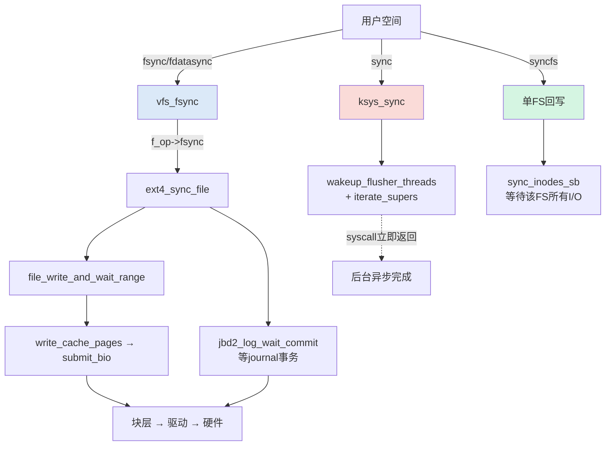
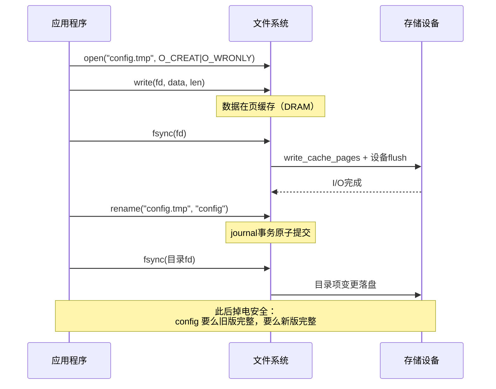

# 12.2.3 fsync与掉电保护

> 所属章节：第12章 文件系统 > 12.2 页缓存与回写
>
> 难度：[E→M] | 预计阅读时间：25分钟

## <span class="blue"> 本节导读

回写由内核按自己的节奏进行，关键数据等不起——应用层必须主动出手。但 `fsync`、`sync`、`syncfs` 的语义边界在哪？`sync()` 为什么不能救命？<br>
本节覆盖：
- `fsync()` 完整调用链（v6.6 真实代码：vfs_fsync → f_op->fsync → ext4_sync_file）
- fsync / sync / syncfs 三者的语义边界，sync() 的异步陷阱
- 掉电保护实战范式：双写 + fsync + rename，含目录 fsync 这步最易漏的操作

---

## <span class="blue"> fsync 调用链与三种 sync 辨析 [E→M]

### fsync() 调用链全景

```
fsync(fd)                          // 用户空间系统调用
  └→ vfs_fsync()                   // VFS 层入口（fs/sync.c:200）
       └→ file->f_op->fsync()      // 分派到具体文件系统，ext4 为 ext4_sync_file()
            ├→ file_write_and_wait_range()   // 回写并等待文件数据页落盘
            │    └→ write_cache_pages() → submit_bio()
            ├→ sync_inode_metadata()         // datasync 时跳过：刷 inode 元数据
            └→ jbd2_log_wait_commit()        // 有 journal 时等待事务提交
                 └→ 块层 → 驱动 → 硬件控制器 → NAND/磁盘
```

VFS 入口的真实代码（v6.6 `fs/sync.c`:180）：

```c
int vfs_fsync_range(struct file *file, loff_t start, loff_t end, int datasync)
{
    struct inode *inode = file->f_mapping->host;

    if (!file->f_op->fsync)
        return -EINVAL;
    if (!datasync && (inode->i_state & I_DIRTY_TIME))
        mark_inode_dirty_sync(inode);       /* lazytime 的时间戳也要落 */
    return file->f_op->fsync(file, start, end, datasync);
}

int vfs_fsync(struct file *file, int datasync)
{
    return vfs_fsync_range(file, 0, LLONG_MAX, datasync);
}
```

> ⚠️ 一个流传很广的错误说法：fsync 经 `s_op->fsync` 分派。**fsync 是 file_operations 的方法，不是 super_operations 的**——分派依据是 `file->f_op->fsync`，且 v6.6 的回调带 start/end 范围参数。`ext4_file_operations` 里对应的是 `ext4_sync_file`（`fs/ext4/fsync.c`:129）。

ext4 的实现主干（`fs/ext4/fsync.c`，有删节）：

```c
int ext4_sync_file(struct file *file, loff_t start, loff_t end, int datasync)
{
    struct inode *inode = file->f_mapping->host;

    if (!EXT4_SB(inode->i_sb)->s_journal)
        return ext4_fsync_nojournal(file, start, end, datasync, &needs_barrier);

    ret = file_write_and_wait_range(file, start, end);   /* 1. 刷数据页并等待 */
    if (ret)
        goto out;

    /* 2. 元数据在 journal 里：等待所属事务提交。
       datasync 时，仅当 inode 有需要事务保护的变更才等 */
    /* ... jbd2_log_wait_commit ... */
}
```

要点：ext4 的元数据不靠单独再写一遍，而是**等 journal 事务提交**——日志里已含元数据变更，事务落盘即元数据落盘。无 journal 时走 `ext4_fsync_nojournal`，必要时补发设备 flush（barrier）。

### 为什么 fsync 只回写指定文件

`fsync()` 的语义是**文件级精准打击**：`file->f_mapping` 精确定位该文件的 address_space，只刷这个文件范围内的脏页。全局回写会制造大量无关 I/O，单文件回写毫秒级可完成，全系统回写要数秒。

### 三种 sync 的语义边界

| 特性 | fsync(fd) | fdatasync(fd) | sync() | syncfs(fd) |
|:---:|:---:|:---:|:---:|:---:|
| 作用范围 | 单个文件（数据+元数据） | 单个文件（仅数据+必要元数据） | 全局所有文件系统 | 单个文件系统 |
| 等待完成 | 是 | 是 | **否，仅发起** | 是 |
| 性能开销 | 低 | 更低 | 极高（触发全系统回写） | 中 |
| 典型用途 | 关键配置保存 | 高频日志追加 | 关机前辅助 | 容器/多 FS 环境 |

### sync() 为什么不能救命

`sync()` 的真实实现（v6.6 `fs/sync.c`:97、:111）：

```c
void ksys_sync(void)
{
    int nowait = 0, wait = 1;

    wakeup_flusher_threads(WB_REASON_SYNC);   /* 唤醒回写 */
    iterate_supers(sync_inodes_one_sb, NULL); /* 回写所有脏 inode */
    iterate_supers(sync_fs_one_sb, &nowait);  /* 发起各 FS 的 sync_fs */
    iterate_supers(sync_fs_one_sb, &wait);
    sync_bdevs(false);
    /* ... */
}

SYSCALL_DEFINE0(sync)
{
    ksys_sync();
    return 0;
}
```

注意 syscall 本体：调完 `ksys_sync()` **立即返回**。虽然 `ksys_sync` 内部第二遍 `sync_fs_one_sb` 带了 wait 语义，但 `sync()` 的 POSIX 语义从设计上就是"尽力发起回写"——它不保证你**刚刚**写入的那个文件已经落盘，原因有三：

1. **覆盖范围不对**：sync 刷的是调用时刻系统中的存量脏页，与你刚写的文件没有因果关系
2. **元数据滞后**：inode 长度、mtime 等可能仍在 journal 中未提交
3. **硬件缓存**：磁盘控制器/SSD 的 DRAM 缓存可能还没刷入非易失介质——只有 fsync 路径才会显式发设备 flush

> 🔴 嵌入式掉电丢数据的头号陷阱就是"我 close 前调了 sync()"。正确姿势：关键文件 `fsync(fd)`，rename 之后还要 `fsync` 父目录（下一节）。

### 调用关系图



---

## <span class="blue"> 掉电保护实战：双写+fsync+rename [E]

### 为什么 write+fsync 还不够

```c
write(fd, buf, len);
fsync(fd);
```

这段代码能防"数据没落盘"，但防不了**半写文件**：如果在 write 过程中掉电，文件可能是新旧混合的截断状态。fsync 保证的是"调用时刻之前的写入落盘"，不保证"整个文件要么全新要么全旧"。

### 标准范式：临时文件 → fsync → rename → 目录 fsync

```c
int safe_write_file(const char *path, const void *buf, size_t len)
{
    char tmp_path[256];
    int fd, dir_fd;

    snprintf(tmp_path, sizeof(tmp_path), "%s.tmp.%d", path, getpid());

    /* 1. 写临时文件 */
    fd = open(tmp_path, O_WRONLY | O_CREAT | O_TRUNC, 0644);
    if (fd < 0)
        return -1;
    if (write(fd, buf, len) != len) {
        close(fd); unlink(tmp_path); return -1;
    }

    /* 2. 数据落盘 */
    if (fsync(fd) < 0) {
        close(fd); unlink(tmp_path); return -1;
    }
    close(fd);

    /* 3. 原子替换目标文件 */
    if (rename(tmp_path, path) < 0) {
        unlink(tmp_path); return -1;
    }

    /* 4. 目录 fsync：确保 rename 这个目录项变更落盘 */
    dir_fd = open(dirname(path), O_RDONLY | O_DIRECTORY);
    if (dir_fd >= 0) {
        fsync(dir_fd);
        close(dir_fd);
    }
    return 0;
}
```

> 🔴 第 4 步是最常被漏掉的一步。rename 修改的是**目录的内容**（目录项），文件的 fsync 管不到它。漏了目录 fsync，掉电后可能出现临时文件还在、rename 却没生效的情况——新数据完好但永远没被启用。

### 为什么 rename 是原子的

`rename()` 在 VFS 层保证元数据原子性。ext4 把它封装为一个完整 journal 事务：旧目录项删除 + 新目录项创建 + inode 链接数更新，要么全部生效要么全部回滚。任何时刻 `path` 要么指向旧内容、要么指向完整的新内容，**不存在中间态**。即使 rename 瞬间掉电，journal 重放后文件系统仍然一致。

### 更高等级：双副本+校验和

极高可靠性场景（医疗校准值、飞参记录）在范式之上再加一层：两个副本交替写入，各带 CRC32 校验；上电自检加载校验通过的副本。

### 实际案例：PLC 设备配置归零排查

某工业 PLC 现场频繁重启后配置归零：

1. 配置流程 `open → write → close`，**无 fsync**
2. 掉电时间点分析（RTC 与日志时间戳交叉比对）：掉电发生在 write 后 30~200ms 内
3. `/proc/meminfo` 的 `Dirty` 字段显示脏页平均滞留约 5 秒——掉电时数据还在页缓存
4. 修复：引入 `safe_write_file()` 范式，上电自检加载 CRC 通过的副本

修复后现场运行 18 个月，零配置丢失。

### 安全写流程时序图



### 写策略安全性对比

| 策略 | 掉电时风险 | 数据完整性 | 实现复杂度 | 适用场景 |
|:---|:---|:---:|:---:|:---|
| 直接 write+close | 大概率丢失最后写入 | 无保障 | 极低 | 临时缓存、非关键日志 |
| write+fsync | 可能截断（半写文件） | 中 | 低 | 单文件追加写 |
| **双写+fsync+rename+目录fsync** | **旧版或新版完整** | **高** | **中** | **配置文件、关键数据** |
| 双副本+CRC校验 | 可自动恢复损坏副本 | 极高 | 高 | 航空、医疗、金融 |
| 裸分区直接 I/O | 绕过页缓存自行管理 | 可控 | 极高 | 数据库、实时系统 |

---

## <span class="blue"> 本节总结

| 维度 | 要点 |
|------|------|
| **fsync 调用链** | vfs_fsync → f_op->fsync（非 s_op）→ file_write_and_wait_range + journal 事务等待 + 设备 flush |
| **三者边界** | fsync 精准同步、fdatasync 省元数据、sync 仅发起不保证、syncfs 单 FS 同步 |
| **sync 陷阱** | syscall 立即返回；覆盖范围与"我刚写的文件"无因果关系 |
| **掉电范式** | 临时文件→fsync→rename→**目录 fsync**；rename 的原子性由 journal 事务保证 |
| **核心口诀** | 关键数据走双写，临时文件先 fsync，rename 原子做替换，目录再刷一道保险 |

---

## <span class="blue"> 下一步

数据离开页缓存后落到文件系统层。下一节看 ext4 怎么组织磁盘上的数据：块组、extent、journal 三种模式各自保护什么、不保护什么。

> **12.3.1 ext4文件系统**

---

## <span class="blue"> 配套资源

| 资源类型 | 内容 |
|----------|------|
| **内核源码** | `fs/sync.c`（vfs_fsync、ksys_sync）、`fs/ext4/fsync.c`（ext4_sync_file） |
| **代码清单** | safe_write_file 完整实现（见正文），可直接移植到业务代码 |
| **排错工具** | `/proc/meminfo` 的 `Dirty` 字段观察脏页滞留；`strace -e fsync,fdatasync` 审计应用的同步行为 |
