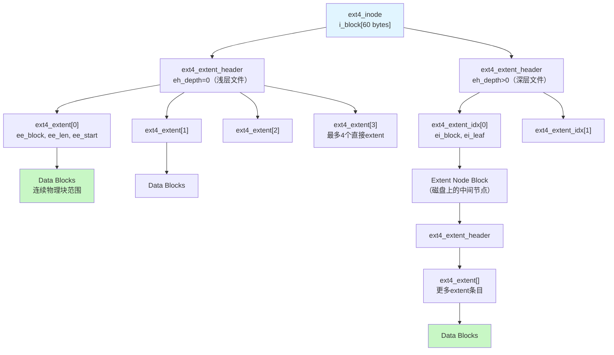
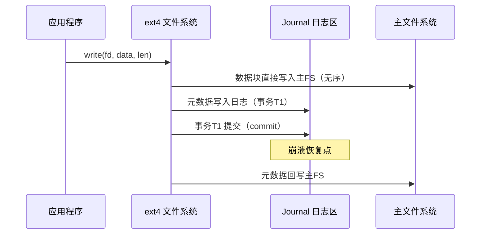
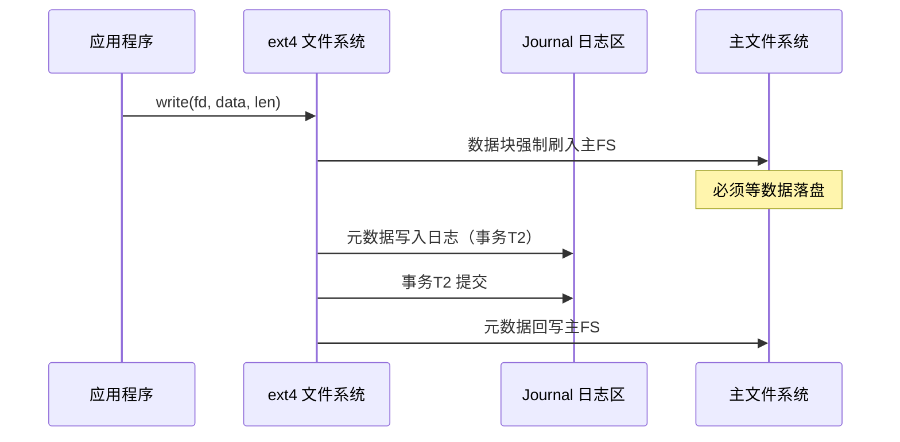
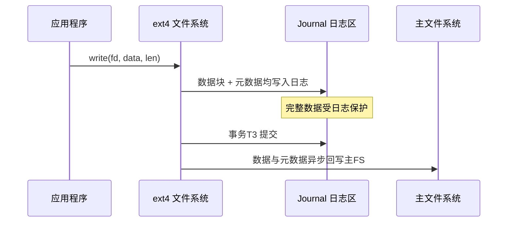

### 12.3.1 ext4：inode+extent+journal

ext4 是 Linux 最主流的文件系统——但它为什么能处理 TB 级存储而不崩溃？秘密在于 extent 结构：传统文件系统用块列表记录每个数据块的位置，ext4 用 extent 记录一段连续块的起始位置和长度，元数据开销大幅降低。这一设计使 ext4 在面对大文件时既能保持高效的元数据管理，又能通过日志（journal）机制确保数据一致性，成为现代 Linux 系统的事实标准。

---

#### 知识点 178 ext4 核心数据结构：inode 与 extent [E][M]

**inode：文件的元数据中心**

在 ext4 中，inode（index node）是每个文件或目录的核心元数据结构。每个 inode 占用 256 字节（ext4 默认值，兼容模式下为 128 字节），存储文件的权限、大小、时间戳以及最关键的数据块位置信息。`struct ext4_inode` 定义了完整的元数据布局，其关键字段如下：

```c
struct ext4_inode {
    __le16  i_mode;         /* 文件类型与权限 */
    __le16  i_uid;          /* 所有者用户ID */
    __le32  i_size_lo;      /* 文件大小（低32位） */
    __le32  i_atime;        /* 最后访问时间 */
    __le32  i_ctime;        /* inode变更时间 */
    __le32  i_mtime;        /* 最后修改时间 */
    __le32  i_dtime;        /* 删除时间 */
    __le16  i_gid;          /* 所有者组ID */
    __le16  i_links_count;  /* 硬链接计数 */
    __le32  i_blocks_lo;    /* 占用块数（512字节为单位，低32位） */
    __le32  i_flags;        /* 文件标志位 */
    union {
        struct {
            __le32  l_i_version;  /* 版本号 */
        } linux1;
    } osd1;
    __le32  i_block[EXT4_N_BLOCKS];  /* 数据块指针数组（核心） */
    __le32  i_generation;   /* 文件版本（NFS用） */
    __le32  i_file_acl_lo;  /* 文件ACL（低32位） */
    __le32  i_size_high;    /* 文件大小（高32位） */
    __le32  i_obso_faddr;   /* 片段地址（已废弃） */
    union {
        struct {
            __le16  l_i_blocks_high; /* 块数高16位 */
            __le16  l_i_file_acl_high;
            __le16  l_i_uid_high;
            __le16  l_i_gid_high;
            __le16  l_i_checksum_lo;
            __le16  l_i_reserved;
        } linux2;
    } osd2;
    __le16  i_extra_isize;  /* inode结构体额外大小 */
    __le16  i_checksum_hi;  /* inode校验和（高16位） */
    __le32  i_ctime_extra;  /* 纳秒级ctime */
    __le32  i_mtime_extra;  /* 纳秒级mtime */
    __le32  i_atime_extra;  /* 纳秒级atime */
    __le32  i_crtime;       /* 创建时间 */
    __le32  i_crtime_extra; /* 纳秒级创建时间 */
    __le32  i_version_hi;   /* 版本号高32位 */
    __le32  i_projid;       /* 项目ID */
};
```

`i_block[EXT4_N_BLOCKS]` 数组是 inode 与数据块之间的桥梁。`EXT4_N_BLOCKS` 定义为 15，其中前 12 个为直接块指针（direct block），第 13 个为一级间接块指针，第 14 个为二级间接块指针，第 15 个为三级间接块指针。在启用 extent 功能的 ext4 中，这 60 字节的 `i_block` 空间被重新解释为 extent 树的头节点，彻底改变了块寻址方式。

**extent：连续的块映射革命**

traditional Unix 文件系统（如 ext2/ext3）采用直接/间接块指针机制管理数据块。当文件需要第 N 个数据块时，系统需遍历多级间接指针链表，时间复杂度为 O(N)，且每个块指针仅指向一个 4KB 块。对于 1GB 的文件，传统方案需要 262,144 个独立的块指针，inode 元数据膨胀至数 MB。

ext4 引入的 extent 结构从根本上解决了这一问题。一个 extent 记录一段**物理上连续**的块范围，仅需三个字段：起始块号、逻辑块偏移和长度（最大支持 2^15 个连续块，即 128MB 连续空间）。`struct ext4_extent` 定义如下：

```c
/*
 * ext4 文件系统 extent 结构
 * 用于记录连续的数据块范围
 */
struct ext4_extent {
    __le32  ee_block;       /* 逻辑块号（在该文件内的起始块偏移） */
    __le16  ee_len;         /* 连续块的数量（1 ~ 32768） */
    __le16  ee_start_hi;    /* 物理起始块号（高16位） */
    __le32  ee_start_lo;    /* 物理起始块号（低32位） */
};
```

`ee_block` 表示该 extent 在文件逻辑空间中的起始块号，`ee_start_hi` 与 `ee_start_lo` 组合成 48 位的物理块号（最大支持 2^48 × 4KB = 1EB 存储空间），`ee_len` 记录连续块数量。若文件的数据在磁盘上连续存储，一个 extent 即可描述整个文件的全部块映射，将元数据开销压缩至极致。

当文件的数据块分布不连续（产生碎片）时，单个 inode 的 60 字节 `i_block` 空间可容纳 4 个 `ext4_extent` 结构（每个 12 字节）。若 4 个 extent 仍不足，ext4 会在 `i_block` 中构建 extent 树（extent tree），将部分条目转换为索引节点 `struct ext4_extent_idx`，指向磁盘上的额外 extent 节点块，形成 B+ 树结构，保证大块文件映射的对数级查找效率。

```c
/* extent 索引节点，用于构建 extent 树 */
struct ext4_extent_idx {
    __le32  ei_block;       /* 该索引覆盖的逻辑块起始 */
    __le32  ei_leaf_lo;     /* 叶子节点块号（低32位） */
    __le16  ei_leaf_hi;     /* 叶子节点块号（高16位） */
    __le16  ei_unused;      /* 保留未用 */
};

/* extent 头节点，位于 i_block[0] 起始位置 */
struct ext4_extent_header {
    __le16  eh_magic;       /* 魔数：0xF30A */
    __le16  eh_entries;     /* 有效条目数 */
    __le16  eh_max;         /* 最大条目容量 */
    __le16  eh_depth;       /* 树深度（0表示叶子节点直接存extent） */
    __le32  eh_generation;  /* 树版本号 */
};
```

下图展示了 ext4 中 inode 通过 extent（及 extent 树）指向数据块的完整层次结构：



**extent 与传统块映射的对比**

| 对比维度 | 传统间接块映射（ext2/ext3） | extent 映射（ext4） |
|---------|--------------------------|-------------------|
| 元数据结构 | 直接/一/二/三级间接指针数组 | extent 头 + extent 数组 + B+ 树索引 |
| 单个映射单元描述范围 | 1 个数据块（4KB） | 最多 32768 个连续块（128MB） |
| 1GB 连续文件元数据开销 | 262,144 个指针 ≈ 1MB 间接块空间 | 1 个 extent = 12 字节 |
| 块查找时间复杂度 | O(N) 需遍历间接链 | O(log M) 树查找（M 为 extent 数） |
| 碎片处理能力 | 差，每块独立记录 | 优，连续块批量描述 |
| 最大支持文件大小 | 16GB ~ 2TB（受指针级数限制） | 16TB ~ 1EB（受 48 位块号限制） |
| 预分配友好性 | 低，需逐个建立映射 | 高，extent 天然支持批量预分配（fallocate） |
| 实现复杂度 | 简单直观 | 较高，需维护 B+ 树一致性 |

extent 的引入不仅降低了元数据的空间占用，更使得文件系统在进行大块 IO 时能够一次性读取连续的物理块，大幅减少磁头寻道时间。现代 SSD 虽无机械寻道，但减少元数据量仍显著降低了 NAND 闪存的写入放大和映射表压力。

---

#### 知识点 179 ext4 的日志（journal）机制 [E]

ext4 作为日志文件系统（journaling filesystem），通过预写日志（write-ahead journal）保证元数据的一致性。当系统意外崩溃时，日志机制能在重启后快速恢复文件系统至一致状态，无需执行完整的 fsck 扫描。ext4 提供了三种日志模式，在数据安全性与写入性能之间提供不同的权衡策略。

**三种日志模式的数据流**

ext4 的日志区域（journal）通常是文件系统内的一个隐藏文件（inode #8），也可放置在外部块设备上。所有模式均遵循"先写日志、再写主文件系统"的基本原则，差异在于**普通文件数据**是否也被纳入日志保护范围。

**模式一：data=writeback（回写模式）**

此模式仅保护元数据，文件数据块直接写入主文件系统，不进入日志。元数据提交日志前，不强制要求对应的数据块已落盘。这是最接近传统非日志文件系统行为的模式，性能最高但数据一致性最弱。



**模式二：data=ordered（有序模式，ext4 默认）**

此模式同样仅将元数据写入日志，但增加关键约束：**在元数据提交到日志之前，必须确保该元数据所引用的所有数据块已先写入主文件系统**。这一顺序性保证避免了元数据指向"旧数据"或"垃圾数据"的问题。若崩溃发生在元数据提交前，数据块可能已更新但元数据仍指向旧位置；重启后文件内容可能包含新旧混合数据，但文件系统结构本身保持完整。



**模式三：data=journal（日志模式）**

此模式将**文件数据与元数据均写入日志**，提供最高级别的数据保护。所有写操作先进入日志区，待事务提交后再异步回写到主文件系统的最终位置。崩溃后重启，系统通过重放（replay）日志即可精确恢复数据和元数据至崩溃前的一致状态，不会丢失任何已提交的写操作。



**三种模式的安全性性能对比**

| 对比维度 | data=writeback | data=ordered（默认） | data=journal |
|---------|---------------|---------------------|-------------|
| 受日志保护的范围 | 仅元数据 | 仅元数据 + 写顺序保证 | 数据 + 元数据 |
| 数据一致性级别 | 弱 | 中（文件系统结构完整） | 强（完整数据零丢失） |
| 崩溃后数据状态 | 可能新旧数据混杂 | 数据可能过时，结构安全 | 精确恢复至提交点 |
| 写入放大（额外 IO） | 最低（~5-10%） | 中等（~15-25%） | 最高（~50-100%，数据写两遍） |
| 顺序写性能 | 最优 | 良好 | 较差（日志区带宽瓶颈） |
| 随机写性能 | 最优 | 良好 | 中等 |
| 适用场景 | 临时数据、缓存、性能敏感 | 通用桌面/服务器（默认推荐） | 金融交易、关键数据库 |
| 恢复速度 | 快 | 快 | 最快（日志重放即可） |

默认的 `data=ordered` 模式是 ext4 设计者为大多数工作负载推荐的平衡点：它避免了 journal 模式的双写惩罚，又比 writeback 模式提供了更合理的顺序性保证。对于需要原子性数据更新的数据库应用，仍建议在应用层实现 WAL（Write-Ahead Logging），而非依赖文件系统的 `data=journal` 模式。

**日志事务的生命周期**

ext4 的日志以事务（transaction）为单位组织。一个事务经历以下阶段：

1. **运行（Running）**：新开始的日志事务接受来自各文件操作的句柄（handle），记录元数据变更。
2. **锁定（Locked）**：事务不再接受新句柄，等待现有句柄完成。
3. **刷新（Flush）**：将所有脏元数据缓冲区写入日志磁盘区域。
4. **提交（Commit）**：写入事务提交块（commit block），标记该事务已完整落盘。
5. **检查点（Checkpoint）**：将日志中已提交的事务对应的元数据回写到主文件系统的最终位置，释放日志空间。

当事务已检查点后，其占用的日志区域可被后续事务循环复用。这种环形缓冲区（circular buffer）设计使日志区域的空间需求与文件系统总容量无关，通常 128MB 的日志即可满足绝大多数工作负载。

---

**实践案例**：某工业嵌入式设备采用 2TB SSD 存储海量传感器日志，需频繁创建约 10 万个 4KB ~ 128KB 的小文件。在对比测试中发现，传统采用间接块映射的 ext2 文件系统随着文件数量增加，inode 表与间接块消耗大量 SSD 空间，元数据总量超过 3GB，且频繁的间接块分配导致 SSD 写入放大系数升至 2.8，文件创建速率从初始的 12,000 文件/秒骤降至 6,000 文件/秒。迁移至 ext4 后，其 extent 结构使小文件的元数据平均占用降至每个 inode 仅需 56 字节（extent header + 1 个 extent 条目），总元数据量压缩至约 5.5MB；SSD 写入放大系数降至 1.3，文件创建速率稳定维持在 11,500 文件/秒。同时启用 `data=ordered` 日志模式后，系统在 200 次模拟断电测试中均实现 100% 文件系统一致性恢复，验证了 extent 与 journal 协同设计在大规模存储场景下的可靠性优势。
