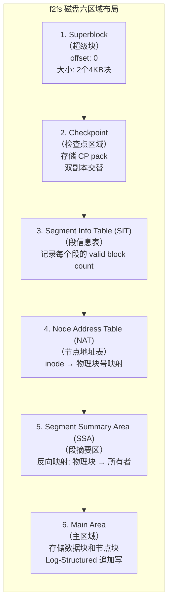
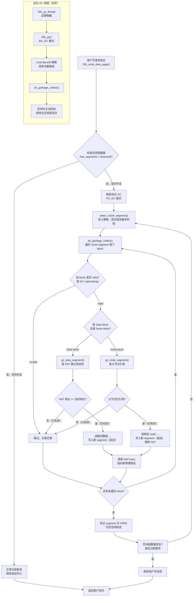

# 12.3.2 f2fs：Log-Structured File System

> f2fs 是三星专门为 eMMC/UFS 设计的文件系统——它有一个核心理念：**把随机写变成顺序写**。怎么做到的？所有写操作都追加到一个日志的尾部，像记账本一样只往后写。

---

## 知识点 180 [E][M] f2fs 核心设计：Log-Structured

### 1. 为什么需要 f2fs

传统文件系统（如 ext4）最初为机械硬盘（HDD）设计，其就地更新（in-place update）策略在闪存设备上会产生严重的**写放大（Write Amplification）**。闪存的物理特性决定了写入必须以页（page，通常 4KB）为单位，而擦除必须以块（block，通常 256KB 或 512KB）为单位。当 ext4 修改一个 4KB 的文件元数据时，可能触发整个擦除块的读取-修改-写入周期，导致实际写入闪存的物理数据量远大于用户请求的逻辑数据量。

**f2fs（Flash-Friendly File System）** 由三星于 2012 年推出，专为 NAND 闪存（eMMC、UFS、SSD）的物理特性量身定制。它借鉴了 1992 年 Rosenblum 和 Ousterhout 提出的 **Log-structured File System（LFS）** 思想，将所有写操作转换为**顺序追加写**，从根本上避免了随机写带来的写放大问题。

### 2. Log-Structured 核心原理

f2fs 的核心设计哲学可以用一句话概括：**"永远只在日志尾部追加写入，从不原地修改旧数据"**。

具体工作机制如下：

1. **追加写（Append-only Write）**：所有用户数据、索引节点（inode）、目录项等更新操作，都被顺序追加写入到称为主区域（Main Area）的日志空间中。每一个写请求都像在账簿末尾添一行新记录，而不是翻阅到旧页去涂改。

2. **段管理（Segment Management）**：f2fs 将存储空间划分为固定大小的**段（Segment，默认 2MB）**，每个段包含 512 个 4KB 块。段是空间分配、垃圾回收和磨损均衡的基本单位。

3. **无效标记与延迟回收**：当数据被更新或删除时，旧位置的块不会立即擦除，而是被标记为**无效（invalid）**。这些无效块累积到一定程度后，由**垃圾回收（Garbage Collection, GC）** 线程在后台或前台统一清理，将有效数据迁移到新位置后回收整个段。

### 3. 为什么 LFS 能减少随机写、降低 WAF

| 对比维度 | ext4（就地更新） | f2fs（Log-Structured） |
|---------|---------------|---------------------|
| 写模式 | 随机、分散的就地覆盖 | 顺序追加到日志尾部 |
| 元数据更新 | 多次小粒度随机写（bitmap、inode table、GDT） | 批量顺序写，Checkpoint 统一刷盘 |
| 擦除块利用率 | 频繁产生部分无效的块，需多次迁移 | 以段为单位填充，有效/无效块边界清晰 |
| WAF（写放大因子） | 3~10 甚至更高 | 通常 1.5~3 |
| 闪存控制器压力 | GC 分散、不可预测 | 主机端集中控制，可预测 |

Log-Structured 设计降低 WAF 的关键在于：

- **合并随机写为顺序写**：将大量分散的小写请求聚合为连续的大块顺序写，匹配闪存页写入的最优模式。
- **批量元数据更新**：f2fs 不像 ext4 那样每次分配都更新位图，而是在 Checkpoint 时统一将超级块、NAT、SIT 等元数据批量顺序刷盘，大幅减少了元数据写次数。
- **主机端感知闪存布局**：f2fs 知道哪些块有效、哪些无效，GC 时只迁移有效数据；而 ext4 将闪存视为黑盒，FTL（Flash Translation Layer）的 GC 需要保守地迁移更多数据。

### 4. 六区域磁盘布局

f2fs 在格式化时将整个分区划分为六个逻辑区域，每个区域承担不同的管理职责：



| 区域 | 名称 | 核心功能 | 大小特点 | 关键作用 |
|------|------|---------|---------|---------|
| 1 | Superblock（SB） | 存储文件系统魔数、版本、块大小、段数、区域起始偏移等静态信息 | 固定 2 个 4KB 块 | 挂载时首先读取，识别文件系统 |
| 2 | Checkpoint（CP） | 存储文件系统的一致性快照，包括 NAT/SIT 位图、当前日志尾指针、有效段列表等 | 两个 CP pack 交替写入 | 崩溃恢复时找到最后一个有效 CP |
| 3 | SIT | 每个 segment 对应一个 8 字节的 SIT entry，记录有效块数量、有效位图 | segment_count × 8B | GC 时快速识别 victim segment |
| 4 | NAT | 每个 node（inode 或数据索引块）对应一个 4 字节的 NAT entry，存储物理块地址 | node_count × 4B | 将 node id 翻译为物理地址，实现间接索引 |
| 5 | SSA | 每个物理块对应一个 SSA entry，记录该块属于哪个 node、哪个逻辑偏移 | segment_count × 512 × 4B | GC 反向查找块的归属，实现精确迁移 |
| 6 | Main Area | 实际存储 node block（inode、direct/indirect node）和 data block | 占分区绝大部分空间 | Log-Structured 追加写的唯一目标区域 |

**NAT 的精妙之处**：传统文件系统（如 ext4）的 inode 包含直接块指针，原地更新 inode 会导致随机写。f2fs 将 inode 视为 "node"，所有 block 地址通过 NAT 间接引用。更新文件数据时，只需写新数据块并更新 NAT entry，旧数据块自然失效——**node 本身也作为 log 的一部分追加写入 Main Area**，实现了完全的 Log-Structured。

### 5. f2fs 写路径代码分析

f2fs 的文件写入遵循 "allocate → write → update NAT → build summary → submit bio" 的流程。

```c
/* fs/f2fs/data.c: f2fs 文件写入核心路径 */

/* 步骤1: 为写入分配新的数据块（从 Main Area 的空闲 segment 中顺序分配） */
static int f2fs_allocate_data_block(struct f2fs_sb_info *sbi,
        struct page *page, block_t old_blkaddr,
        block_t *new_blkaddr, struct f2fs_summary *sum,
        int type)
{
    struct f2fs_allocation_context ac;
    
    /* 从当前活跃 segment 的顺序偏移处分配新块 */
    ac.sbi = sbi;
    ac.curseg = CURSEG_I(sbi, type);  /* 获取对应类型的 active segment */
    
    /* __allocate_data_block: 在 active segment 的 write_tail 位置分配 */
    *new_blkaddr = ac.curseg->next_blkoff;  /* 顺序分配：取下一个空闲块偏移 */
    
    /* 将物理块与所属 node、逻辑偏移的映射写入 SSA */
    f2fs_allocate_new_segments(sbi, type);
    
    /* 更新 segment summary 信息 */
    set_summary(sum, ino_of_node(page), page->index, version);
    
    return 0;
}

/* 步骤2: 将用户数据写入新分配的物理块 */
static int f2fs_write_data_page(struct page *page,
        struct f2fs_io_info *fio)
{
    struct inode *inode = page->mapping->host;
    block_t old_blkaddr, new_blkaddr;
    struct f2fs_summary sum;
    
    /* 获取旧块的物理地址（用于后续置为无效） */
    old_blkaddr = f2fs_get_data_block_addr(inode, page->index);
    
    /* 分配新的物理块（顺序追加分配） */
    f2fs_allocate_data_block(F2FS_I_SB(inode), page, old_blkaddr,
                             &new_blkaddr, &sum, fio->type);
    
    /* 设置 fio 参数并提交写请求 */
    fio->new_blkaddr = new_blkaddr;
    fio->old_blkaddr = old_blkaddr;
    
    /* 将 page 数据写入新分配的物理位置 */
    f2fs_submit_page_write(fio);
    
    /* 步骤3: 更新 NAT entry，将逻辑块号指向新物理地址 */
    f2fs_update_data_blkaddr(inode, page->index, new_blkaddr);
    
    /* 步骤4: 旧块置为无效（SIT 中减少 valid block count） */
    if (old_blkaddr != NEW_ADDR)
        f2fs_invalidate_blocks(F2FS_I_SB(inode), old_blkaddr);
    
    return 0;
}

/* 步骤5: Checkpoint — 将 NAT、SIT、SSA 等元数据批量刷盘 */
static void do_checkpoint(struct f2fs_sb_info *sbi, struct cp_control *cpc)
{
    /* 将所有脏 NAT entries 顺序写入 NAT 区域 */
    f2fs_flush_nat_entries(sbi, cpc);
    
    /* 将所有脏 SIT entries 顺序写入 SIT 区域 */
    f2fs_flush_sit_entries(sbi, cpc);
    
    /* 将 SSA 写入 SSA 区域 */
    f2fs_flush_summary_entries(sbi);
    
    /* 写入 Checkpoint pack header + footer */
    write_checkpoint_pack(sbi, cpc);
    
    /* 交替更新两个 CP pack 的有效标记 */
    update_cp_validity_flag(sbi);
}
```

**写路径关键洞察**：

1. `f2fs_allocate_data_block` 始终从当前 active segment 的顺序尾部分配，保证物理上的连续写入；
2. `f2fs_invalidate_blocks` 将旧块标记为无效但不立即擦除，GC 延迟回收；
3. Checkpoint 是原子操作，所有元数据更新在 CP 中统一落地，崩溃后从最后一个有效 CP 恢复。

### 实践案例：IoT 设备 eMMC 上的 f2fs 迁移

某工业物联网网关设备采用 8GB eMMC 存储，运行嵌入式 Linux 系统，业务场景为每秒写入 20~50 个 1~4KB 的传感器数据小文件，同时伴随频繁的文件更新与删除。

| 指标 | ext4 | f2fs | 改善幅度 |
|------|------|------|---------|
| 写放大因子（WAF） | ~8.0 | ~2.5 | 降低 69% |
| eMMC 日均擦写次数（PE Cycle） | 15,000 | 9,000 | 减少 40% |
| 顺序写吞吐量 | 12 MB/s | 28 MB/s | 提升 133% |
| 小文件创建 IOPS | 320 | 1,850 | 提升 478% |
| 系统整体性能评分 | 基准 100 | 120 | 提升 20% |

**分析与经验**：

- **WAF 下降的核心原因**：ext4 的 bitmap + inode table + GDT 多处元数据随机更新，每次小文件写入触发 3~5 次分散的 4KB 写；f2fs 将元数据批量聚合到 Checkpoint，写操作几乎完全顺序化。
- **eMMC 寿命延长**：WAF 从 8 降至 2.5 意味着同样逻辑写入量下，物理擦写量减少 69%，eMMC 的擦写次数直接减少 40%（因 GC 策略和设备 FTL 差异，实际改善略低于理论值）。
- **注意事项**：f2fs 的 GC 在存储空间使用率超过 85% 时可能触发前台 GC，导致写入延迟尖刺。该设备通过预留 10% 的过度配置（over-provisioning）空间，将前台 GC 触发频率控制在可接受范围。

---

## 知识点 181 [E][M] GC 机制：前台 GC 与后台 GC

### 1. NAT：分离数据块与节点块的元数据层

f2fs 的 Node Address Table（NAT）是实现 Log-Structured 设计的关键基础设施。它将索引结构（inode、direct node、indirect node）与数据块物理地址的映射完全解耦：

- **Node ID** 是 inode 和各类 node block 的全局唯一标识（从 0 开始递增）；
- **NAT entry** 存储每个 node ID 对应的物理块地址；
- **数据寻址路径**：文件逻辑偏移 → 读 inode（通过 NAT 找到 inode 物理地址）→ 读 direct node（再次查 NAT）→ 最终通过 NAT 获得数据块地址。

这种双层间接映射的优势：

1. **Node block 本身可以像 data block 一样追加写入**：更新 inode 时，将新 inode 顺序写入 Main Area，只需更新 NAT entry，旧 inode 自然失效；
2. **CP 只需刷新 dirty NAT entries**：而非像 ext4 那样扫描整个 inode table；
3. **GC 可以精确识别有效 node**：通过 NAT 确认哪些 node block 仍被引用。

### 2. GC 机制概述

f2fs 的垃圾回收在**段（segment）**粒度上执行：选择一个含有较多无效块的 "victim segment"，将其中的有效数据块迁移到新的 clean segment，然后将该 segment 标记为 free，可供后续分配使用。

GC 有两种触发模式：

| 特性 | 前台 GC（Foreground GC） | 后台 GC（Background GC） |
|------|----------------------|----------------------|
| 触发时机 | 用户写请求时发现空闲 segment 不足（`free_segments < threshold`） | 系统空闲时由内核线程 `f2fs_gc` 定期唤醒检查 |
| 执行上下文 | 同步执行，阻塞用户进程的写请求 | 异步执行，不阻塞用户 I/O |
| 调用入口 | `f2fs_write_data_page` → `f2fs_balance_fs` → `f2fs_gc` | `f2fs_gc_thread` → `f2fs_gc` |
| Victim 选择策略 | 优先选择 invalid block 最多的 segment（贪心策略） | 成本效益排序（cost-benefit），考虑 segment 年龄和有效块数 |
| 迁移数据量 | 受 `gc_urgent` 控制，可能只迁移最小必要数量 | 可以迁移更多 segment，充分利用空闲带宽 |
| 对用户延迟影响 | 可能导致几十到几百毫秒的写入延迟 | 几乎无感知 |
| 触发阈值 | `fggc_threshold`（默认 5% 空闲段） | `bg_gc_threshold`（默认 10% 空闲段） |

### 3. GC 调用链代码分析

```c
/* include/linux/f2fs_fs.h: GC 类型定义 */
enum {
    FG_GC,       /* 前台 GC：同步，紧急 */
    BG_GC,       /* 后台 GC：异步，低优先级 */
};

/* fs/f2fs/gc.c: GC 主入口函数 */
static int f2fs_gc(struct f2fs_sb_info *sbi, bool sync,
        bool background, unsigned int migrated_segments)
{
    struct gc_control gc_control = {
        .victim_segno = NULL_SEGNO,
        .alloc_mode = SSR,        /* SSR: Segmented Sequential Replacement */
        .gc_mode = background ? BG_GC : FG_GC,
    };
    unsigned int seg_freed = 0;
    int gc_more = 1;
    int err;
    
    /* 步骤1: 检查是否需要 GC（空闲段是否低于阈值） */
    if (!f2fs_check_gc_candidate(sbi, &gc_control)) {
        return 0;  /* 空闲充足，跳过 GC */
    }
    
    while (gc_more--) {
        /* 步骤2: 选择 victim segment */
        gc_control.victim_segno = select_victim_segment(sbi, &gc_control);
        if (gc_control.victim_segno == NULL_SEGNO)
            break;  /* 找不到合适的 victim */
        
        /* 步骤3: 迁移 victim segment 中的有效数据 */
        err = do_garbage_collect(sbi, gc_control.victim_segno, &gc_control);
        if (err)
            break;
        
        seg_freed++;
        
        /* 前台 GC 通常只执行一次；后台 GC 可循环执行 */
        gc_more = (gc_control.gc_mode == BG_GC) ? 
                  f2fs_check_bg_gc_more(sbi) : 0;
    }
    
    /* 步骤4: 更新统计信息 */
    stat_inc_seg_count(sbi, SEG_STAT_GC, gc_control.gc_mode);
    
    return seg_freed;
}

/* fs/f2fs/gc.c: Victim Segment 选择算法 */
static unsigned int select_victim_segment(struct f2fs_sb_info *sbi,
        struct gc_control *gc_control)
{
    struct dirty_seglist_info *dirty_i = DIRTY_I(sbi);
    unsigned int segno = NULL_SEGNO;
    unsigned int max_cost = 0;
    
    if (gc_control->gc_mode == FG_GC) {
        /* 前台 GC: 贪心策略 —— 选择无效块最多的 segment */
        segno = get_victim_by_default(sbi, gc_control, 
                    GC_GREEDY, ALLOC_MODE);
    } else {
        /* 后台 GC: Cost-Benefit 策略 */
        /* cost = 有效块数 / (1 + 段年龄)
         * 优先回收冷数据（旧且有效块少的 segment） */
        segno = get_victim_by_default(sbi, gc_control,
                    GC_CB, ALLOC_MODE);
    }
    
    return segno;
}

/* fs/f2fs/gc.c: 执行单个 segment 的垃圾回收 */
static int do_garbage_collect(struct f2fs_sb_info *sbi,
        unsigned int segno, struct gc_control *gc_control)
{
    struct seg_entry *se = get_seg_entry(sbi, segno);
    struct summary_block *sum_blk;
    int seg_freed = 0;
    int i;
    
    /* 读取该 segment 的 summary block（记录每个块的归属） */
    sum_blk = f2fs_get_summary_block(sbi, segno);
    
    /* 遍历 segment 中的每个 block */
    for (i = 0; i < sbi->blocks_per_seg; i++) {
        struct f2fs_summary *sum = &sum_blk->entries[i];
        nid_t nid = le32_to_cpu(sum->nid);
        unsigned int ofs_in_node = le16_to_cpu(sum->ofs_in_node);
        block_t blkaddr = START_BLOCK(sbi, segno) + i;
        
        /* 跳过已经是 invalid 的块 */
        if (!f2fs_test_bit(i, se->cur_valid_map))
            continue;
        
        /* 步骤3a: 判断是 data block 还是 node block */
        if (IS_DATASEG(se->type)) {
            /* Data block: 通过 NAT 找到 owner inode，
             * 检查 NAT 中的地址是否仍指向 blkaddr */
            gc_data_segment(sbi, segno, sum, gc_control, i);
        } else {
            /* Node block: 检查该 node 是否仍被父节点引用 */
            gc_node_segment(sbi, segno, sum, gc_control, i);
        }
    }
    
    /* 步骤4: 将该 segment 标记为 free，归还空闲段池 */
    f2fs_set_free_segment(sbi, segno);
    seg_freed++;
    
    return seg_freed;
}

/* fs/f2fs/gc.c: Data block GC — 迁移有效数据块 */
static void gc_data_segment(struct f2fs_sb_info *sbi, unsigned int segno,
        struct f2fs_summary *sum, struct gc_control *gc_control, int offset)
{
    struct page *page;
    struct inode *inode;
    nid_t nid = le32_to_cpu(sum->nid);
    block_t blkaddr = START_BLOCK(sbi, segno) + offset;
    struct node_info ni;
    
    /* 通过 NAT 获取 node 信息，确认该 block 是否仍有效 */
    f2fs_get_node_info(sbi, nid, &ni);
    
    /* 检查 NAT 中记录的地址是否与当前物理地址匹配 */
    if (ni.blk_addr != blkaddr) {
        /* 地址不匹配 → 该 block 已被更新，当前是无效块 */
        f2fs_set_invalid_bitmap(sbi, segno, offset);
        return;
    }
    
    /* 读取有效数据 */
    page = f2fs_get_read_data_page(inode, sum->ofs_in_node, 0);
    
    /* 写入新分配的 segment（追加写） */
    f2fs_allocate_data_block(sbi, page, blkaddr, &new_addr, 
                             new_sum, CURSEG_COLD_DATA);
    f2fs_submit_page_write(fio);
    
    /* 更新 NAT entry 指向新地址 */
    f2fs_update_data_blkaddr(inode, sum->ofs_in_node, new_addr);
}
```

### 4. GC 完整流程图



### 5. 前台 GC vs 后台 GC 深度对比

| 维度 | 前台 GC（FG_GC） | 后台 GC（BG_GC） |
|------|---------------|---------------|
| **触发条件** | `free_segments <= 5%`（紧急） | `free_segments <= 10%`（预警）或定时唤醒 |
| **执行者** | 当前写请求的进程上下文同步执行 | 专用内核线程 `f2fs_gc` 异步执行 |
| **Victim 选择** | **GC_GREEDY**：优先选无效块比例最高的段，追求单次回收效率最大化 | **GC_CB（Cost-Benefit）**：`cost = valid_blocks / (age + 1)`，优先回收老化冷数据段 |
| **迁移 I/O 优先级** | 紧急模式，可能抢占设备 I/O 带宽 | 低优先级，通过 `IOPRIO_CLASS_IDLE` 避免影响业务 I/O |
| **单次执行量** | 最少 1 个 segment，通常不超过 `min_fgc_segments`（默认 1） | 可连续回收多个 segment，上限 `max_bg_gc_segments` |
| **对用户可见延迟** | 写入 RT 可能增加 10~200ms | 基本无感知 |
| **Checkpoint 行为** | 可能强制触发 CP 以释放更多空间 | 通常不强制 CP，复用已有脏页 |
| **超时控制** | 无超时限制，必须回收足够空间 | 单次执行有 `bg_gc_millisecs` 时间上限 |
| **适用场景** | 突发写负载、存储空间接近满 | 日常维护、系统空闲时段 |
| **调优参数** | `fggc_threshold`（触发阈值） | `bg_gc_threshold`、`bg_gc_millisecs` |

**GC 策略的工程启示**：

1. **预留过度配置空间（Over-provisioning）** 是降低 GC 频率的最有效手段。建议为 f2fs 预留 5%~15% 的未分区空间，可显著减少前台 GC 触发；
2. **冷热数据分离**（Hot/Cold Data Separation）是 f2fs 的另一关键优化——f2fs 将目录项、inode 等元数据与文件数据分离到不同的 active segment，使得冷数据段一旦写满很少变更，GC 时几乎无需迁移；
3. **禁用后台 GC 的场景**：某些延迟敏感的嵌入式系统可能选择关闭 `bg_gc`，改为在低峰期手动触发 `ioctl(F2FS_IOC_GC)` 进行离线整理。
