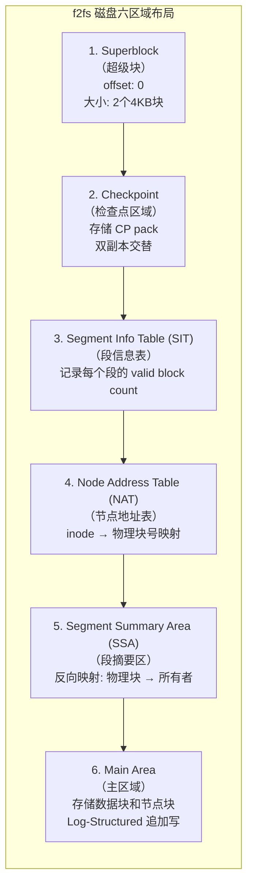
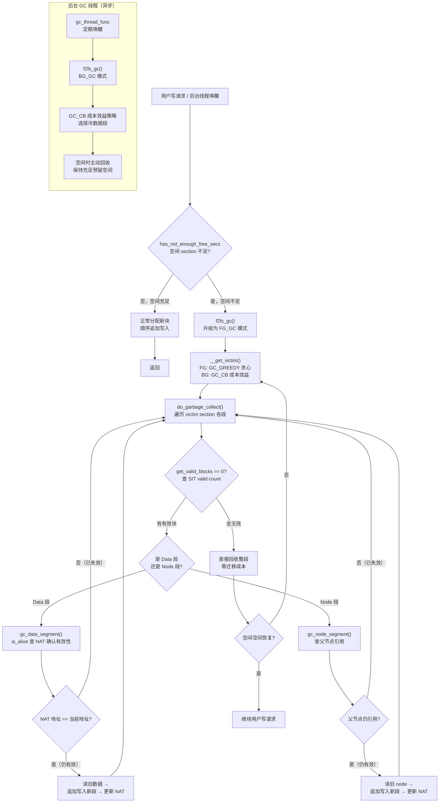

# 12.3.2 f2fs：Log-Structured File System

> 所属章节：第12章 文件系统 > 12.3 ext4/f2fs/UBIFS
>
> 难度：[E→M] | 预计阅读时间：30分钟

## <span class="blue"> 本节导读

ext4 的就地更新（in-place update）是为机械硬盘时代设计的，放到闪存上会产生严重的写放大。f2fs（Flash-Friendly File System）是三星为 eMMC/UFS 量身设计的文件系统，核心理念只有一条：**把随机写变成顺序写**——所有写操作都追加到日志尾部，从不原地修改旧数据。<br>
本节覆盖：

- Log-Structured 设计为什么能降低写放大（WAF）
- f2fs 六区域磁盘布局与 NAT 间接映射的作用
- 对照 v6.6 源码的写路径与 Checkpoint 流程
- 前台 GC 与后台 GC 的触发条件、victim 选择策略与调优参数

---

## <span class="blue"> f2fs 核心设计：Log-Structured [E→M]

### 为什么需要 f2fs

传统文件系统（如 ext4）最初为机械硬盘（HDD）设计，其就地更新策略在闪存设备上会产生严重的**写放大（Write Amplification）**。闪存的物理特性决定了写入必须以页（page，通常 4KB）为单位，而擦除必须以块（block，通常 256KB 或 512KB）为单位。当 ext4 修改一个 4KB 的文件元数据时，可能触发整个擦除块的读取-修改-写入周期，导致实际写入闪存的物理数据量远大于用户请求的逻辑数据量。

f2fs 由三星于 2012 年推出，专为 NAND 闪存（eMMC、UFS、SSD）的物理特性量身定制。它借鉴了 1992 年 Rosenblum 和 Ousterhout 提出的 **Log-structured File System（LFS）** 思想，将所有写操作转换为**顺序追加写**，从根本上避免了随机写带来的写放大问题。

### Log-Structured 核心原理

f2fs 的核心设计哲学可以用一句话概括：**永远只在日志尾部追加写入，从不原地修改旧数据**。

具体工作机制如下：

1. **追加写（Append-only Write）**：所有用户数据、索引节点（inode）、目录项等更新操作，都被顺序追加写入到称为主区域（Main Area）的日志空间中。每一个写请求都是在日志末尾添一条新记录，而不是回到旧位置涂改。

2. **段管理（Segment Management）**：f2fs 将存储空间划分为固定大小的**段（Segment，默认 2MB）**，每个段包含 512 个 4KB 块。段是空间分配、垃圾回收和磨损均衡的基本单位。

3. **无效标记与延迟回收**：当数据被更新或删除时，旧位置的块不会立即擦除，而是被标记为**无效（invalid）**。这些无效块累积到一定程度后，由**垃圾回收（Garbage Collection, GC）** 在后台或前台统一清理，将有效数据迁移到新位置后回收整个段。

### 为什么 LFS 能减少随机写、降低 WAF

| 对比维度 | ext4（就地更新） | f2fs（Log-Structured） |
|---------|---------------|---------------------|
| 写模式 | 随机、分散的就地覆盖 | 顺序追加到日志尾部 |
| 元数据更新 | 多次小粒度随机写（bitmap、inode table、GDT） | 批量顺序写，Checkpoint 统一刷盘 |
| 擦除块利用率 | 频繁产生部分无效的块，需多次迁移 | 以段为单位填充，有效/无效块边界清晰 |
| WAF（写放大因子） | 3~10 甚至更高 | 通常 1.5~3 |
| 闪存控制器压力 | GC 分散、不可预测 | 主机端集中控制，可预测 |

Log-Structured 设计降低 WAF 的关键在于：

- **合并随机写为顺序写**：将大量分散的小写请求聚合为连续的大块顺序写，匹配闪存页写入的最优模式。
- **批量元数据更新**：f2fs 不像 ext4 那样每次分配都更新位图，而是在 Checkpoint 时统一将超级块、NAT、SIT 等元数据批量顺序刷盘，大幅减少了元数据写次数。
- **主机端感知闪存布局**：f2fs 知道哪些块有效、哪些无效，GC 时只迁移有效数据；而 ext4 将闪存视为黑盒，FTL（Flash Translation Layer）的 GC 需要保守地迁移更多数据。

### 六区域磁盘布局

f2fs 在格式化时将整个分区划分为六个逻辑区域，每个区域承担不同的管理职责：



| 区域 | 名称 | 核心功能 | 大小特点 | 关键作用 |
|------|------|---------|---------|---------|
| 1 | Superblock（SB） | 存储文件系统魔数、版本、块大小、段数、区域起始偏移等静态信息 | 固定 2 个 4KB 块 | 挂载时首先读取，识别文件系统 |
| 2 | Checkpoint（CP） | 存储文件系统的一致性快照，包括 NAT/SIT 位图、当前日志尾指针、有效段列表等 | 两个 CP pack 交替写入 | 崩溃恢复时找到最后一个有效 CP |
| 3 | SIT | 每个 segment 对应一个 SIT entry，记录有效块数量、有效位图 | 随段数线性增长 | GC 时快速识别 victim segment |
| 4 | NAT | 每个 node（inode 或数据索引块）对应一个 NAT entry，存储物理块地址 | 随 node 数线性增长 | 将 node id 翻译为物理地址，实现间接索引 |
| 5 | SSA | 每个物理块对应一个 SSA entry，记录该块属于哪个 node、哪个逻辑偏移 | 随段数线性增长 | GC 反向查找块的归属，实现精确迁移 |
| 6 | Main Area | 实际存储 node block（inode、direct/indirect node）和 data block | 占分区绝大部分空间 | Log-Structured 追加写的唯一目标区域 |

**NAT 的精妙之处**：传统文件系统（如 ext4）的 inode 包含直接块指针，原地更新 inode 会导致随机写。f2fs 将 inode 视为 "node"，所有 block 地址通过 NAT 间接引用。更新文件数据时，只需写新数据块并更新 NAT entry，旧数据块自然失效——**node 本身也作为 log 的一部分追加写入 Main Area**，实现了完全的 Log-Structured。

### f2fs 写路径源码导读

f2fs 的文件写入遵循"分配新块 → 写入数据 → 更新 NAT → 旧块置无效 → Checkpoint 批量落盘元数据"的流程。以下对照 v6.6 源码看三个关键环节。

**环节一：写回入口**——脏页写回时，address_space 的 `.writepage` 指向 `f2fs_write_data_page`（fs/f2fs/data.c:2993）：

```c
static int f2fs_write_data_page(struct page *page,
                        struct writeback_control *wbc)
{
    /* … 压缩文件的分支处理（CONFIG_F2FS_FS_COMPRESSION）… */

    return f2fs_write_single_data_page(page, NULL, NULL, NULL,
                            wbc, FS_DATA_IO, 0, true);
}
```

**环节二：分配新块**——`f2fs_write_single_data_page` 内部最终调用 `__allocate_data_block`（fs/f2fs/data.c:1468）。这个函数完整体现了 Log-Structured 的分配语义：

```c
static int __allocate_data_block(struct dnode_of_data *dn, int seg_type)
{
    struct f2fs_sb_info *sbi = F2FS_I_SB(dn->inode);
    struct f2fs_summary sum;
    struct node_info ni;
    block_t old_blkaddr;
    blkcnt_t count = 1;
    int err;

    if (unlikely(is_inode_flag_set(dn->inode, FI_NO_ALLOC)))
        return -EPERM;

    err = f2fs_get_node_info(sbi, dn->nid, &ni, false);
    if (err)
        return err;

    dn->data_blkaddr = f2fs_data_blkaddr(dn);
    if (dn->data_blkaddr == NULL_ADDR) {
        err = inc_valid_block_count(sbi, dn->inode, &count);
        if (unlikely(err))
            return err;
    }

    /* 写入 SSA 摘要：该物理块属于哪个 node、哪个逻辑偏移 */
    set_summary(&sum, dn->nid, dn->ofs_in_node, ni.version);
    old_blkaddr = dn->data_blkaddr;

    /* 从 active segment 尾部顺序分配新物理块（fs/f2fs/segment.c） */
    f2fs_allocate_data_block(sbi, NULL, old_blkaddr, &dn->data_blkaddr,
                    &sum, seg_type, NULL);

    /* 旧块置为无效：从 SIT 的 valid bitmap 中清除 */
    if (GET_SEGNO(sbi, old_blkaddr) != NULL_SEGNO) {
        invalidate_mapping_pages(META_MAPPING(sbi),
                        old_blkaddr, old_blkaddr);
        f2fs_invalidate_compress_page(sbi, old_blkaddr);
    }

    /* 更新 NAT entry，指向新物理地址 */
    f2fs_update_data_blkaddr(dn, dn->data_blkaddr);
    return 0;
}
```

注意三点：新块由 `f2fs_allocate_data_block` 从 active segment 的顺序尾部分配，保证物理连续写；旧块只做无效标记、不立即擦除，留给 GC 回收；NAT 更新后读路径自动指向新位置。

**环节三：Checkpoint**——元数据（NAT/SIT/SSA）的批量落盘由 `f2fs_write_checkpoint`（fs/f2fs/checkpoint.c:1620）驱动，主流程如下：

```c
int f2fs_write_checkpoint(struct f2fs_sb_info *sbi, struct cp_control *cpc)
{
    /* … 只读与 CP_DISABLED 检查 … */

    err = block_operations(sbi);            /* 暂停新写请求，冻结状态 */
    f2fs_flush_merged_writes(sbi);          /* 把合并的写请求全部下发 */

    ckpt->checkpoint_ver = cpu_to_le64(++ckpt_ver);  /* CP 版本号递增 */

    /* write cached NAT/SIT entries to NAT/SIT area */
    err = f2fs_flush_nat_entries(sbi, cpc); /* 脏 NAT 批量顺序写入 NAT 区 */
    /* … */
    f2fs_flush_sit_entries(sbi, cpc);       /* 脏 SIT 批量顺序写入 SIT 区 */

    f2fs_save_inmem_curseg(sbi);            /* 保存内存中的日志尾指针 */

    err = do_checkpoint(sbi, cpc);          /* 组装并写出 CP pack */
    /* … */
    f2fs_clear_prefree_segments(sbi, cpc);  /* prefree 段转正为 free */
}
```

`do_checkpoint`（checkpoint.c:1450）负责把 checkpoint 结构体、孤儿 inode 列表和各区域的 SSA 摘要写入 Checkpoint 区域（双 pack 交替）：

```c
static int do_checkpoint(struct f2fs_sb_info *sbi, struct cp_control *cpc)
{
    /* Flush all the NAT/SIT pages */
    f2fs_sync_meta_pages(sbi, META, LONG_MAX, FS_CP_META_IO);

    /* … 填充 ckpt：free_segment_count、各 curseg 的 segno/blkoff … */

    start_blk = __start_cp_next_addr(sbi);  /* 双 pack 交替：选另一个 CP pack */

    f2fs_update_meta_page(sbi, ckpt, start_blk++);   /* 写 checkpoint 头 */

    if (orphan_num) {
        write_orphan_inodes(sbi, start_blk);         /* 写孤儿 inode 列表 */
        start_blk += orphan_blocks;
    }

    f2fs_write_data_summaries(sbi, start_blk);       /* 写数据段 SSA 摘要 */
    /* … */
    f2fs_write_node_summaries(sbi, start_blk);       /* 写节点段 SSA 摘要 */
    /* … */
}
```

Checkpoint 是原子操作：CP 版本号递增 + 双 pack 交替写入，崩溃恢复时选版本号最新且校验通过的 pack，因此所有元数据更新要么完整生效、要么整体回退。

### 实践案例：IoT 设备 eMMC 上的 f2fs 迁移

某工业物联网网关设备采用 8GB eMMC 存储，运行嵌入式 Linux 系统，业务场景为每秒写入 20~50 个 1~4KB 的传感器数据小文件，同时伴随频繁的文件更新与删除。

| 指标 | ext4 | f2fs | 改善幅度 |
|------|------|------|---------|
| 写放大因子（WAF） | ~8.0 | ~2.5 | 降低 69% |
| eMMC 日均擦写次数（PE Cycle） | 15,000 | 9,000 | 减少 40% |
| 顺序写吞吐量 | 12 MB/s | 28 MB/s | 提升 133% |
| 小文件创建 IOPS | 320 | 1,850 | 提升 478% |

**分析与经验**：

- **WAF 下降的核心原因**：ext4 的 bitmap + inode table + GDT 多处元数据随机更新，每次小文件写入触发 3~5 次分散的 4KB 写；f2fs 将元数据批量聚合到 Checkpoint，写操作几乎完全顺序化。
- **eMMC 寿命延长**：WAF 从 8 降至 2.5 意味着同样逻辑写入量下，物理擦写量减少 69%，eMMC 的擦写次数直接减少 40%（因 GC 策略和设备 FTL 差异，实际改善略低于理论值）。
- **注意事项**：f2fs 的 GC 在存储空间使用率过高时会升级为紧急模式（urgent），导致写入延迟尖刺。该设备通过预留约 10% 的过度配置（over-provisioning）空间，将紧急 GC 的触发频率控制在可接受范围。

---

## <span class="blue"> GC 机制：前台 GC 与后台 GC [E→M]

### NAT：分离数据块与节点块的元数据层

f2fs 的 Node Address Table（NAT）是实现 Log-Structured 设计的关键基础设施。它将索引结构（inode、direct node、indirect node）与数据块物理地址的映射完全解耦：

- **Node ID** 是 inode 和各类 node block 的全局唯一标识（从 0 开始递增）；
- **NAT entry** 存储每个 node ID 对应的物理块地址；
- **数据寻址路径**：文件逻辑偏移 → 读 inode（通过 NAT 找到 inode 物理地址）→ 读 direct node（再次查 NAT）→ 最终通过 NAT 获得数据块地址。

这种双层间接映射的优势：

1. **Node block 本身可以像 data block 一样追加写入**：更新 inode 时，将新 inode 顺序写入 Main Area，只需更新 NAT entry，旧 inode 自然失效；
2. **CP 只需刷新 dirty NAT entries**：而非像 ext4 那样扫描整个 inode table；
3. **GC 可以精确识别有效 node**：通过 NAT 确认哪些 node block 仍被引用。

### GC 机制概述

f2fs 的垃圾回收在**段（segment）**粒度上执行：选择一个含有较多无效块的 victim segment，将其中的有效数据块迁移到新的 clean segment，然后将该 segment 标记为 free，可供后续分配使用。

GC 有两种触发模式：

| 特性 | 前台 GC（Foreground GC） | 后台 GC（Background GC） |
|------|----------------------|----------------------|
| 触发时机 | 写路径发现空闲 section 不足时同步触发 | 系统空闲时由 GC 内核线程定期唤醒检查 |
| 执行上下文 | 同步执行，阻塞用户进程的写请求 | 异步执行，不阻塞用户 I/O |
| 调用入口 | 写路径 → `f2fs_balance_fs` → `f2fs_gc` | `gc_thread_func` → `f2fs_gc` |
| Victim 选择策略 | GC_GREEDY：选无效块最多的段（贪心） | GC_CB：成本效益排序，考虑段年龄与有效块数 |
| 对用户延迟影响 | 可能导致几十到几百毫秒的写入延迟 | 几乎无感知 |

### GC 调用链源码导读

GC 的后台入口是内核线程 `gc_thread_func`（fs/f2fs/gc.c:31），由 `kthread_run` 创建（gc.c:191），空闲时定期唤醒；前台入口则由写路径在空间不足时经 `f2fs_balance_fs` 同步调用。两者最终都汇入 `f2fs_gc`（gc.c:1797）：

```c
int f2fs_gc(struct f2fs_sb_info *sbi, struct f2fs_gc_control *gc_control)
{
    int gc_type = gc_control->init_gc_type;   /* FG_GC 或 BG_GC */
    unsigned int segno = gc_control->victim_segno;
    /* … */

gc_more:
    /* 空间不足时强制升级为前台 GC */
    if (has_not_enough_free_secs(sbi, 0, 0)) {
        gc_type = FG_GC;

        /* prefree 段可以先通过 checkpoint 转正，可能免于 GC */
        if (prefree_segments(sbi)) {
            ret = f2fs_write_checkpoint(sbi, &cpc);
            if (ret)
                goto stop;
        }
    }

retry:
    ret = __get_victim(sbi, &segno, gc_type);   /* 选 victim section */
    if (ret)
        goto stop;

    seg_freed = do_garbage_collect(sbi, segno, &gc_list, gc_type,
                    gc_control->should_migrate_blocks);
    /* … FG_GC 回收到足够空间或 BG_GC 达到一轮上限后返回 … */
}
```

victim 的选择策略由 `select_gc_type`（gc.c:216）决定——这正是前台/后台 GC 行为差异的根源：

```c
static int select_gc_type(struct f2fs_sb_info *sbi, int gc_type)
{
    int gc_mode;

    if (gc_type == BG_GC) {
        if (sbi->am.atgc_enabled)
            gc_mode = GC_AT;      /* 年龄阈值策略（需开启 ATGC） */
        else
            gc_mode = GC_CB;      /* 成本效益：优先回收冷数据段 */
    } else {
        gc_mode = GC_GREEDY;      /* 贪心：选无效块最多的段 */
    }
    /* … gc_idle/gc_urgent 等 sysfs 配置可覆盖默认选择 … */
    return gc_mode;
}
```

选中 victim 后，`do_garbage_collect`（gc.c:1675）逐段迁移有效块：

```c
static int do_garbage_collect(struct f2fs_sb_info *sbi,
                unsigned int start_segno,
                struct gc_inode_list *gc_list, int gc_type,
                bool force_migrate)
{
    /* … */

    for (segno = start_segno; segno < end_segno; segno++) {

        /* 预读该段的 SSA 摘要页（记录每个块的归属） */
        sum_page = find_get_page(META_MAPPING(sbi),
                        GET_SUM_BLOCK(sbi, segno));

        if (get_valid_blocks(sbi, segno, false) == 0)
            goto freed;   /* 全是无效块，直接回收，零迁移成本 */

        sum = page_address(sum_page);
        if (type == SUM_TYPE_NODE)
            submitted += gc_node_segment(sbi, sum->entries, segno,
                                gc_type);
        else
            submitted += gc_data_segment(sbi, sum->entries, gc_list,
                            segno, gc_type,
                            force_migrate);
        /* … */

freed:
        if (gc_type == FG_GC &&
                get_valid_blocks(sbi, segno, false) == 0)
            seg_freed++;
    }
    /* … */
    return seg_freed;
}
```

数据段的迁移在 `gc_data_segment`（gc.c:1502）中完成。它遍历段内每个块，通过 SSA 摘要反查归属 node，再经 NAT 确认该块仍有效（`is_alive`），有效则读出来追加写入新段并更新 NAT：

```c
static int gc_data_segment(struct f2fs_sb_info *sbi, struct f2fs_summary *sum,
        struct gc_inode_list *gc_list, unsigned int segno, int gc_type,
        bool force_migrate)
{
    /* … 实际实现分 phase 0~3 预读元数据（NAT 页、node 页），
       以下为核心逻辑的简化摘录 … */

    for (off = 0; off < usable_blks_in_seg; off++, entry++) {
        /* SIT valid bitmap：无效块直接跳过 */
        if (check_valid_map(sbi, segno, off) == 0)
            continue;

        /* is_alive：查 NAT，确认该物理块仍是 owner 的最新版本 */
        if (!is_alive(sbi, entry, &dni, start_addr + off, &nofs))
            continue;

        /* 读旧数据 → 追加写入新段 → f2fs_allocate_data_block
           → f2fs_update_data_blkaddr 更新 NAT */
    }
}
```

> 💡 注意 `is_alive` 这一步：GC 通过 NAT 判断块有效性，这正是 12.3.2 前面"NAT 间接映射"设计的回报——没有 NAT，GC 无法区分一个物理块是"最新数据"还是"已被覆盖的垃圾"。

### GC 完整流程图



### 前台 GC 与后台 GC 深度对比

| 维度 | 前台 GC（FG_GC） | 后台 GC（BG_GC） |
|------|---------------|---------------|
| **触发条件** | `has_not_enough_free_secs` 判定空闲 section 不足（紧急） | GC 线程空闲唤醒 + 空间水位检查（预警） |
| **执行者** | 当前写请求的进程上下文同步执行 | 专用内核线程 `gc_thread_func` 异步执行 |
| **Victim 选择** | GC_GREEDY：选无效块最多的段，单次回收效率最大化 | GC_CB（成本效益）：优先回收老化冷数据段；开启 ATGC 时用 GC_AT |
| **对用户可见延迟** | 写入延迟可能增加几十到几百毫秒 | 基本无感知 |
| **Checkpoint 行为** | 可能先强制 CP 把 prefree 段转正，仍不够才迁移 | 通常不强制 CP |
| **适用场景** | 突发写负载、存储空间接近满 | 日常维护、系统空闲时段 |
| **主要调优参数** | `/sys/fs/f2fs/<dev>/gc_urgent`（紧急模式阈值与行为）、`min_fgc_segments` | `gc_idle`（0=关闭 / 1=CB / 2=greedy / 3=AT）、`gc_min_sleep_time`、`gc_max_sleep_time`、`gc_no_gc_sleep_time` |

**GC 策略的工程启示**：

1. **预留过度配置空间（Over-provisioning）** 是降低 GC 频率的最有效手段。建议为 f2fs 预留 5%~15% 的未分区空间，可显著减少前台 GC 触发；
2. **冷热数据分离**（Hot/Cold Data Separation）是 f2fs 的另一关键优化——f2fs 将目录项、inode 等元数据与文件数据分离到不同的 active segment（CURSEG_HOT/WARM/COLD），使得冷数据段一旦写满很少变更，GC 时几乎无需迁移；
3. **延迟敏感场景的后台 GC 控制**：可通过 `gc_idle=0` 关闭空闲 GC，改为在低峰期手动触发 `ioctl(F2FS_IOC_GC)` 进行离线整理，避免 GC 与业务 I/O 竞争。

---

## <span class="blue"> 本节总结

| 维度 | 要点 |
|------|------|
| **LFS 核心** | 所有写追加到日志尾部，旧块标无效、GC 延迟回收；随机写合并为顺序写，WAF 从 3~10 降到 1.5~3 |
| **六区域布局** | SB / CP / SIT / NAT / SSA / Main Area；NAT 间接映射让 node 也能追加写，是 GC 精确迁移的前提 |
| **写路径** | `f2fs_write_data_page` → `__allocate_data_block`：顺序分配新块 → 置无效旧块 → 更新 NAT（data.c:1468） |
| **Checkpoint** | `f2fs_write_checkpoint` 批量刷 NAT/SIT → `do_checkpoint` 双 pack 交替写 CP 区，版本号 + 校验保证原子性 |
| **GC 双模式** | FG_GC 同步阻塞、GC_GREEDY 贪心；BG_GC 线程异步、GC_CB 成本效益；victim 由 `__get_victim` 选出 |
| **核心口诀** | 写就追加不覆盖，旧块标记留给 GC，元数据攒着 CP 刷，空间预留防 urgent |

---

## <span class="blue"> 下一步

f2fs 依赖 eMMC 内置 FTL 提供的块设备抽象。如果是裸 NAND——没有 FTL、坏块自己管、磨损均衡自己做——就需要下一节的主角：UBI + UBIFS。

> **12.3.3 UBIFS文件系统**

---

## <span class="blue"> 配套资源

| 资源类型 | 内容 |
|----------|------|
| **内核源码** | `fs/f2fs/data.c`（写路径）、`fs/f2fs/gc.c`（f2fs_gc、do_garbage_collect）、`fs/f2fs/checkpoint.c`（f2fs_write_checkpoint、do_checkpoint）、`fs/f2fs/segment.c`（f2fs_allocate_data_block） |
| **排错工具** | `cat /sys/fs/f2fs/<dev>/gc_urgent` 等 sysfs 节点观察 GC 状态；`f2fs_io` 工具手动触发 GC；`blktrace` 观察写请求是否顺序化 |
| **关联小节** | 12.3.1 ext4 的就地更新对照；12.3.5 选型决策中 f2fs 的适用负载 |
