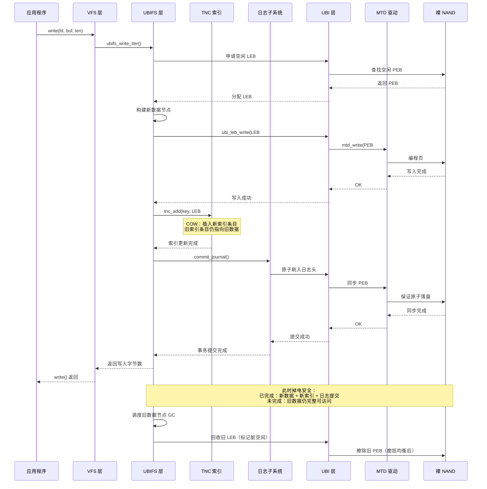

# 12.3.3 UBIFS：裸 Flash 文件系统

> **导读**：裸 NAND 不能直接用 ext4——ext4 不知道什么是坏块、不知道磨损均衡。UBIFS + UBI 就是裸 NAND 的解决方案：UBI 负责磨损均衡和坏块管理，UBIFS 负责文件系统逻辑，两者配合像 eMMC + ext4 一样工作。

---

## 知识点 182 UBIFS 核心：基于 UBI 的日志结构文件系统 [E][M]

### 182.1 为什么裸 NAND 需要 UBIFS

裸 NAND Flash 与 eMMC/SSD 的本质区别在于：**裸 NAND 将介质管理的全部责任暴露给了上层软件**。eMMC 控制器内部集成 FTL（Flash Translation Layer），主机端看到的只是一个标准块设备，ext4 可以毫无障碍地运行其上。而裸 NAND 没有 FTL，主机必须自行处理以下挑战：

| 挑战 | 说明 | 不处理的后果 |
|:---|:---|:---|
| 坏块管理 | 出厂及使用中都会产生坏块 | 数据写入坏块导致丢失 |
| 磨损均衡 | 每个物理擦除块（PEB）寿命约 10⁴~10⁵ 次擦写 | 热点块提前磨损，整片 Flash 报废 |
| 读写不对称 | 写入前必须擦除，擦除以块为单位（通常 128KB~256KB） | 原地更新需要先擦除整块，效率极低 |
| 位翻转 | 读取可能引入随机位错误 | 静默数据损坏 |
| 非确定性时序 | 坏块替换导致 I/O 延迟不可预测 | 实时系统无法容忍 |

UBIFS 与 UBI（Unsorted Block Images）的分层架构正是为解决上述问题而生。**UBI 充当\"软件 FTL\"**，位于 MTD（Memory Technology Device）层之上；UBIFS 则作为真正的文件系统，运行在 UBI 之上。这种分层设计使得 UBIFS 本身无需关心坏块和磨损均衡——这些由 UBI 透明处理。

### 182.2 UBI 的核心抽象：从 PEB 到 LEB

UBI 的关键创新是将**物理擦除块（Physical Erase Block, PEB）**映射为**逻辑擦除块（Logical Erase Block, LEB）**。这种映射类似于 FTL 中的逻辑页到物理页映射，但工作在更大的擦除块粒度上。

```
┌─────────────────────────────────────────────────────┐
│                    UBIFS 文件系统层                    │
│         （索引、目录树、inode、数据节点）                │
├─────────────────────────────────────────────────────┤
│                     UBI 层                           │
│  LEB 管理 │ 磨损均衡 │ 坏块隔离 │ 静态/动态卷         │
├─────────────────────────────────────────────────────┤
│                     MTD 层                           │
│      NAND 驱动 │ 坏块扫描 │ ECC 纠错 │ OOB 管理        │
├─────────────────────────────────────────────────────┤
│                  裸 NAND Flash                       │
│  ┌─────┬─────┬─────┬─────┬─────┬─────┐              │
│  │ PEB │ PEB │ PEB │坏块 │ PEB │ PEB │ ...           │
│  │  0  │  1  │  2  │  3  │  4  │  5  │              │
│  └─────┴─────┴─────┴─────┴─────┴─────┘              │
└─────────────────────────────────────────────────────┘
```

**PEB 到 LEB 的映射特点：**

- **一一映射但可重映射**：每个 LEB 对应一个物理 PEB，但当 PEB 磨损或成为坏块时，UBI 自动将其重映射到新的 PEB，上层无感知。
- **原子映射更新**：映射表的更新通过 UBI 的原子擦除/写入语义保证一致性。
- **预留块池**：UBI 预留一定比例的 PEB 作为坏块替换池和磨损均衡迁移池。

### 182.3 UBIFS 的核心数据结构

UBIFS 采用**日志结构（Log-Structured）**设计，将文件系统状态组织为三类主要节点：

| 节点类型 | 功能 | 持久化位置 |
|:---|:---|:---|
| 数据节点（Data Node） | 存储普通文件的有效载荷数据 | LEB 的数据区 |
| 索引节点（Index Node） | B+ 树的索引结构，加速查找 | LEB 的索引区 |
| 描述节点（Inode Node） | 存储文件元数据（权限、大小、时间戳等） | 与数据混合同步写入 |

UBIFS 的索引是一棵**驻留于 Flash 的 B+ 树**，称为**TNC（Tree Node Cache）**。查找文件时从根节点遍历到叶节点，叶节点指向实际的数据节点。与传统文件系统不同，UBIFS 的索引更新不覆盖旧节点，而是采用**写时复制（Copy-on-Write）**策略，每次修改都写入新节点，旧节点自然失效。

### 182.4 关键代码解析

#### `ubifs_write_inode()` — inode 持久化

```c
int ubifs_write_inode(struct inode *inode, struct writeback_control *wbc)
{
    struct ubifs_inode *ui = ubifs_inode(inode);
    struct ubifs_info *c = inode->i_sb->s_fs_info;
    struct ubifs_ino_node *ino;
    int err, lnum, offs, len;

    /* 分配 inode 节点缓冲区 */
    len = UBIFS_INO_NODE_SZ + ui->data_len;
    ino = kmalloc(len, GFP_NOFS);
    if (!ino)
        return -ENOMEM;

    /* 将 VFS inode 转换为 UBIFS 持久化格式 */
    pack_inode(c, inode, ino, 0);

    /* 写入一个新的 LEB 位置（COW 语义） */
    err = ubifs_jnl_write_inode(c, inode, ino, len);
    if (err)
        goto out_free;

    /* 更新内存中的索引，指向新写入的 inode 位置 */
    mutex_lock(&c->tnc_mutex);
    err = ubifs_tnc_add(c, &ino->key, lnum, offs, len);
    mutex_unlock(&c->tnc_mutex);

out_free:
    kfree(ino);
    return err;
}
```

**关键逻辑**：`ubifs_write_inode()` 不修改 Flash 上的原 inode 位置，而是将更新后的 inode 写入**全新的 LEB 偏移**，再通过 TNC 更新索引指向新位置。旧 inode 数据在垃圾回收时被自然清除。

#### `ubifs_leb_change()` — LEB 原子更新

```c
int ubifs_leb_change(struct ubifs_info *c, int lnum, const void *buf,
                     int len, int dtype)
{
    int err;

    /* 通过 UBI 接口实现原子 LEB 更新 */
    err = ubi_leb_change(c->ubi, lnum, buf, len, dtype);
    /*
     * ubi_leb_change 内部语义：
     * 1. 分配一个新的空闲 PEB
     * 2. 将 buf 数据写入新 PEB
     * 3. 原子更新 LEB→PEB 映射表
     * 4. 旧 PEB 标记为可回收
     *
     * 对 UBIFS 而言，这个操作是原子的：
     * 要么全部完成，要么映射表不更新。
     */
    return err;
}
```

`ubi_leb_change()` 是 UBIFS 依赖 UBI 提供原子性的典型例子。UBI 保证映射表更新是原子的，因此即使写入过程中掉电，LEB 要么指向旧数据，要么指向新数据，不会出现半写状态。

### 182.5 动态卷大小与透明压缩

**动态卷大小**是 UBI 的独特能力。传统分区将 Flash 划分为固定大小的区域，而 UBI 卷可以**动态调整大小**，甚至支持：

- **自动扩容**：当卷接近写满时，如果同一 UBI 设备上其他卷有空闲空间，UBI 可自动重新分配。
- **卷重命名与动态创建/删除**：无需重新分区整个 Flash。

**透明压缩**是 UBIFS 的内建特性。数据写入 Flash 前自动压缩，读取时自动解压，对应用层完全透明。

| 特性 | 实现方式 | 收益 |
|:---|:---|:---|
| 动态卷大小 | UBI 卷管理，运行时调整 | 无需重新分区，空间利用率 >95% |
| 透明压缩 | 内核压缩 API，按页压缩 | 存储容量等效提升 1.5x~3x |
| 多算法支持 | LZO（默认）、ZSTD、LZMA | 速度与压缩比可配置 |
| 不可压缩检测 | 压缩前采样，若膨胀则存原数据 | 避免已压缩数据二次膨胀 |

### 182.6 UBIFS vs. 需要 FTL 的文件系统

| 维度 | eMMC + ext4 | 裸 NAND + UBIFS/UBI |
|:---|:---|:---|
| 磨损均衡 | FTL 内部黑盒 | UBI 开源可控，策略可调 |
| 坏块处理 | FTL 内部黑盒 | UBI 透明处理，可监控 |
| 掉电安全 | 依赖 FTL + ext4 journal | UBIFS 全 COW 设计，天然安全 |
| 压缩支持 | 无（上层需自行实现） | UBIFS 内建透明压缩 |
| 块对齐 | 4KB 块对齐 | 无需对齐，UBI 处理子页写入 |
| 可预测性 | FTL 内部 GC 不可控 | UBI GC 可配置，适合实时系统 |

---

## 知识点 183 COW 原子更新机制 [E]

### 183.1 COW 保证文件系统一致性

UBIFS 的**写时复制（Copy-on-Write, COW）**是其掉电安全的核心机制。传统文件系统（如 ext4）的日志模式（journal 或 ordered）依赖覆盖原地数据，掉电时若恰好处于"元数据已写、数据未写"或反之的中间状态，就需要复杂的恢复逻辑。UBIFS 的 COW 从根本上消除了这种状态：

> **COW 原则：永不覆盖已写入的数据。任何修改都写入新位置，原子切换指针。**

这意味着 Flash 上永远不存在\"正在修改中\"的数据块——旧数据保持完整直到新数据完全落盘且索引更新成功。

### 183.2 COW 更新流程

以下以修改文件的部分数据为例，展示完整的 COW 更新流程：

```
┌──────────┐    ┌──────────┐    ┌──────────┐    ┌──────────┐    ┌──────────┐
│  步骤 1   │ -> │  步骤 2   │ -> │  步骤 3   │ -> │  步骤 4   │ -> │  步骤 5   │
│  读取旧   │    │  写入新   │    │  更新索引  │    │  原子提交  │    │  回收旧   │
│  数据节点 │    │  数据节点 │    │  （COW）   │    │  同步点   │    │  数据节点 │
└──────────┘    └──────────┘    └──────────┘    └──────────┘    └──────────┘
```

**伪代码实现**：

```c
/* COW 文件数据更新流程 */
int ubifs_cow_write_data(struct ubifs_info *c, struct inode *inode,
                         const void *buf, size_t len, loff_t pos)
{
    struct ubifs_data_node *dn;
    int new_lnum, new_offs, err;
    union ubifs_key key;

    /* 步骤1：分配新的 LEB 空间（绝不覆盖旧位置） */
    err = ubifs_find_free_space(c, &new_lnum, &new_offs, len);
    if (err)
        return err;

    /* 步骤2：构建并写入新的数据节点 */
    dn = kmalloc(UBIFS_DATA_NODE_SZ + len, GFP_NOFS);
    pack_data_node(dn, inode, buf, len, pos);

    err = ubifs_wbuf_write_nolock(c, dn, UBIFS_DATA_NODE_SZ + len,
                                  new_lnum, new_offs);
    if (err)
        goto out_free;

    /* 步骤3：COW 更新索引——在 TNC 中插入新节点指针 */
    data_key_init(c, &key, inode->i_ino,
                  pos >> UBIFS_BLOCK_SHIFT);

    mutex_lock(&c->tnc_mutex);
    /* TNC 插入操作本身也是 COW：索引节点不覆盖，写新索引节点 */
    err = ubifs_tnc_add(c, &key, new_lnum, new_offs,
                        UBIFS_DATA_NODE_SZ + len);
    mutex_unlock(&c->tnc_mutex);
    if (err)
        goto out_invalidate;

    /* 步骤4：原子提交——日志刷盘，保证索引与数据一致性 */
    err = ubifs_commit_journal(c);
    if (err)
        goto out_invalidate;  /* 提交失败，旧数据仍有效 */

    /* 步骤5：异步回收旧数据节点（由垃圾回收线程处理） */
    schedule_old_node_gc(c, &key);  /* 旧节点标记为失效 */

out_free:
    kfree(dn);
    return err;

out_invalidate:
    /* 写入失败，新数据未生效，旧数据完全不受影响 */
    ubifs_invalidate_space(c, new_lnum, new_offs);
    goto out_free;
}
```

### 183.3 COW 序列图



### 183.4 压缩算法对比

UBIFS 支持多种压缩算法，可在挂载时通过 `compress=` 参数选择：

| 算法 | 压缩速度 | 解压速度 | 压缩比 | CPU 占用 | 适用场景 |
|:---|:---|:---|:---|:---|:---|
| **LZO** | 极快（~400 MB/s） | 极快（~600 MB/s） | 中等（~1.5x） | 低 | **默认推荐**，嵌入式首选 |
| **ZSTD** | 快（~200 MB/s，level 1） | 极快（~500 MB/s） | 高（~2.0x） | 中 | 需要更高压缩比的场景 |
| **LZMA** | 慢（~20 MB/s） | 中等（~100 MB/s） | 极高（~2.5x） | 高 | 大文件、只读场景 |
| **NONE** | — | — | 1x | 无 | 已压缩数据（图片/视频） |

**算法选择建议**：

- **嵌入式/实时系统**：首选 LZO，解压速度极快，CPU 开销最小，不影响系统响应。
- **存储容量受限**：ZSTD level 1 提供接近 LZO 的速度和明显更好的压缩比，是现代推荐方案。
- **大容量冷数据**：若写入极少，可选 LZMA 最大化压缩比。
- **混合场景**：UBIFS 支持按 inode 选择压缩算法，可对不同文件类型配置不同策略。

---

## 实践案例：工业设备 3 年 0 坏块故障

某工业网关设备采用 256MB 裸 SLC NAND，运行 Linux + UBIFS/UBI 存储系统日志、配置文件和固件镜像。设备部署于户外环境，7×24 小时运行，日均写入量约 50MB（主要来自日志轮转和配置更新）。

**运行 3 年后的监控数据**：

| 指标 | 数值 | 说明 |
|:---|:---|:---|
| 总 PEB 数 | 2048 | 每块 128KB |
| 坏块数 | 3 | UBI 自动隔离，业务无感知 |
| 最大擦写次数 | 2,847 | 远低于 SLC 10 万次寿命 |
| 最小擦写次数 | 1,956 | 磨损均衡效果显著 |
| 擦写标准差 | 187 | 分布极为均匀 |
| 可用空间剩余 | 62% | 透明压缩贡献显著 |
| 文件系统一致性事件 | 0 | COW 设计杜绝掉电损坏 |

**关键经验**：

1. **UBI 预留空间**：预留 5% 的 PEB 用于坏块替换和磨损均衡，3 年产生的 3 个坏块被无缝替换。
2. **日志分离**：将高频变更的日志目录挂载为独立的 UBIFS 卷，避免影响根文件系统的稳定性。
3. **压缩收益**：日志文本数据通过 LZO 压缩，实际占用空间减少约 55%，等效延长了 Flash 寿命。
4. **掉电测试**：设备经历 1000 次随机掉电测试，文件系统始终处于一致状态，无数据损坏。

该案例验证了 UBIFS + UBI 方案在工业场景中的可靠性：**UBI 的磨损均衡自动分散写入热点，坏块处理完全透明，UBIFS 的 COW 设计从根本上消除了掉电导致的不一致风险**。
