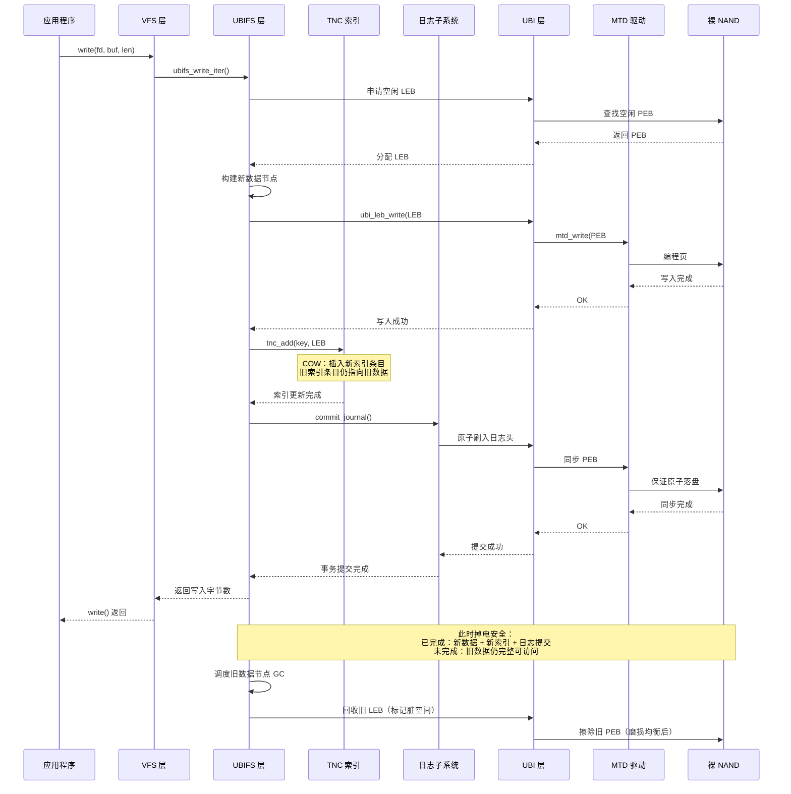

# 12.3.3 UBIFS：裸 Flash 文件系统

> 所属章节：第12章 文件系统 > 12.3 ext4/f2fs/UBIFS
>
> 难度：[E→M] | 预计阅读时间：25分钟

## <span class="blue"> 本节导读

裸 NAND 不能直接用 ext4——ext4 不知道什么是坏块、不知道磨损均衡。UBIFS + UBI 就是裸 NAND 的解决方案：UBI 负责磨损均衡和坏块管理，UBIFS 负责文件系统逻辑，两者配合达到 eMMC + ext4 的效果。<br>
本节覆盖：

- 裸 NAND 的五个挑战与 UBI/UBIFS 分层架构
- PEB 到 LEB 的映射：UBI 的"软件 FTL"抽象
- 对照 v6.6 源码的 inode 持久化与 LEB 原子更新
- COW（写时复制）如何保证掉电安全
- 透明压缩的算法选型

---

## <span class="blue"> UBIFS 核心：基于 UBI 的日志结构文件系统 [E→M]

### 为什么裸 NAND 需要 UBIFS

裸 NAND Flash 与 eMMC/SSD 的本质区别在于：**裸 NAND 将介质管理的全部责任暴露给了上层软件**。eMMC 控制器内部集成 FTL（Flash Translation Layer），主机端看到的只是一个标准块设备，ext4 可以毫无障碍地运行其上。而裸 NAND 没有 FTL，主机必须自行处理以下挑战：

| 挑战 | 说明 | 不处理的后果 |
|:---|:---|:---|
| 坏块管理 | 出厂及使用中都会产生坏块 | 数据写入坏块导致丢失 |
| 磨损均衡 | 每个物理擦除块（PEB）寿命约 10⁴~10⁵ 次擦写 | 热点块提前磨损，整片 Flash 报废 |
| 读写不对称 | 写入前必须擦除，擦除以块为单位（通常 128KB~256KB） | 原地更新需要先擦除整块，效率极低 |
| 位翻转 | 读取可能引入随机位错误 | 静默数据损坏 |
| 非确定性时序 | 坏块替换导致 I/O 延迟不可预测 | 实时系统无法容忍 |

UBIFS 与 UBI（Unsorted Block Images）的分层架构正是为解决上述问题而生。**UBI 充当"软件 FTL"**，位于 MTD（Memory Technology Device）层之上；UBIFS 则作为真正的文件系统，运行在 UBI 之上。这种分层设计使得 UBIFS 本身无需关心坏块和磨损均衡——这些由 UBI 透明处理。

### UBI 的核心抽象：从 PEB 到 LEB

UBI 的关键创新是将**物理擦除块（Physical Erase Block, PEB）**映射为**逻辑擦除块（Logical Erase Block, LEB）**。这种映射类似于 FTL 中的逻辑页到物理页映射，但工作在更大的擦除块粒度上。

```
┌─────────────────────────────────────────────────────┐
│                    UBIFS 文件系统层                    │
│         （索引、目录树、inode、数据节点）                │
├─────────────────────────────────────────────────────┤
│                     UBI 层                           │
│  LEB 管理 │ 磨损均衡 │ 坏块隔离 │ 静态/动态卷         │
├─────────────────────────────────────────────────────┤
│                     MTD 层                           │
│      NAND 驱动 │ 坏块扫描 │ ECC 纠错 │ OOB 管理        │
├─────────────────────────────────────────────────────┤
│                  裸 NAND Flash                       │
│  ┌─────┬─────┬─────┬─────┬─────┬─────┐              │
│  │ PEB │ PEB │ PEB │坏块 │ PEB │ PEB │ ...           │
│  │  0  │  1  │  2  │  3  │  4  │  5  │              │
│  └─────┴─────┴─────┴─────┴─────┴─────┘              │
└─────────────────────────────────────────────────────┘
```

**PEB 到 LEB 的映射特点：**

- **一一映射但可重映射**：每个 LEB 对应一个物理 PEB，但当 PEB 磨损或成为坏块时，UBI 自动将其重映射到新的 PEB，上层无感知。
- **原子映射更新**：映射表的更新通过 UBI 的原子擦除/写入语义保证一致性。
- **预留块池**：UBI 预留一定比例的 PEB 作为坏块替换池和磨损均衡迁移池。

### UBIFS 的核心数据结构

UBIFS 采用**日志结构（Log-Structured）**设计，将文件系统状态组织为三类主要节点：

| 节点类型 | 功能 | 持久化位置 |
|:---|:---|:---|
| 数据节点（Data Node） | 存储普通文件的有效载荷数据 | LEB 的数据区 |
| 索引节点（Index Node） | 索引树的中间节点，加速查找 | LEB 的索引区 |
| 描述节点（Inode Node） | 存储文件元数据（权限、大小、时间戳等） | 与数据混合同步写入 |

UBIFS 的索引是一棵**驻留于 Flash 的 B 树**，称为 **wandering tree（游荡树）**——树节点更新时不覆盖旧节点，而是写到新位置，父节点随之"游荡"到新位置，这正是 COW 设计在索引层的体现。内存中以 **TNC（Tree Node Cache）** 缓存索引节点加速查找。查找文件时从根节点遍历到叶节点，叶节点指向实际的数据节点。

### 关键代码解析

#### `ubifs_write_inode()` — inode 持久化（fs/ubifs/super.c:296）

```c
/*
 * Note, Linux write-back code calls this without 'i_mutex'.
 */
static int ubifs_write_inode(struct inode *inode, struct writeback_control *wbc)
{
    int err = 0;
    struct ubifs_info *c = inode->i_sb->s_fs_info;
    struct ubifs_inode *ui = ubifs_inode(inode);

    ubifs_assert(c, !ui->xattr);
    if (is_bad_inode(inode))
        return 0;

    mutex_lock(&ui->ui_mutex);
    /*
     * 回写与后台同步之间可能产生竞争，inode 也许已经被同步过，
     * 若不再 dirty 则直接返回。
     */
    if (!ui->dirty) {
        mutex_unlock(&ui->ui_mutex);
        return 0;
    }

    /*
     * 优化：孤儿 inode（nlink 为 0）无需写入介质。
     */
    if (inode->i_nlink) {
        err = ubifs_jnl_write_inode(c, inode);
        if (err)
            ubifs_err(c, "can't write inode %lu, error %d",
                      inode->i_ino, err);
        else
            err = dbg_check_inode_size(c, inode, ui->ui_size);
    }

    ui->dirty = 0;
    mutex_unlock(&ui->ui_mutex);
    ubifs_release_dirty_inode_budget(c, ui);
    return err;
}
```

**关键逻辑**：实际的介质写入由 `ubifs_jnl_write_inode`（fs/ubifs/journal.c）完成——inode 不覆盖 Flash 上的旧位置，而是作为日志的一部分追加写入新位置，再由 TNC 更新索引指向新位置。旧 inode 数据在垃圾回收时被自然清除。

#### `ubifs_leb_change()` — LEB 原子更新（fs/ubifs/io.c:126）

```c
int ubifs_leb_change(struct ubifs_info *c, int lnum, const void *buf, int len)
{
    int err;

    ubifs_assert(c, !c->ro_media && !c->ro_mount);
    if (c->ro_error)
        return -EROFS;
    if (!dbg_is_tst_rcvry(c))
        err = ubi_leb_change(c->ubi, lnum, buf, len);
    else
        err = dbg_leb_change(c, lnum, buf, len);
    if (err) {
        ubifs_err(c, "changing %d bytes in LEB %d failed, error %d",
              len, lnum, err);
        ubifs_ro_mode(c, err);
        dump_stack();
    }
    return err;
}
```

`ubi_leb_change()`（drivers/mtd/ubi/kapi.c:559）是 UBIFS 依赖 UBI 提供原子性的典型例子。其内核文档注释明确承诺：**原子地改变 LEB 内容；即使发生不洁重启（unclean reboot），旧内容也会保留**。真正实现这一语义的是 `ubi_eba_atomic_leb_change`（drivers/mtd/ubi/eba.c:1197）：

- UBI 专门预留一个 PEB 用于原子 LEB 更新操作，同时只有一个 LEB 更新在进行（由 `alc_mutex` 保证）；
- 新数据先写入预留 PEB，带 `copy_flag` 与 `data_crc` 校验，然后原子切换 LEB→PEB 映射；
- 掉电时若映射未切换，LEB 仍指向旧数据；若已切换，新数据完整可用——不存在半写状态。

### 动态卷大小与透明压缩

**动态卷大小**是 UBI 的独特能力。传统分区将 Flash 划分为固定大小的区域，而 UBI 卷可以**动态调整大小**，甚至支持：

- **自动扩容**：当卷接近写满时，如果同一 UBI 设备上其他卷有空闲空间，UBI 可自动重新分配。
- **卷重命名与动态创建/删除**：无需重新分区整个 Flash。

**透明压缩**是 UBIFS 的内建特性。数据写入 Flash 前自动压缩，读取时自动解压，对应用层完全透明。

| 特性 | 实现方式 | 收益 |
|:---|:---|:---|
| 动态卷大小 | UBI 卷管理，运行时调整 | 无需重新分区，空间利用率 >95% |
| 透明压缩 | 内核压缩 API，按页压缩 | 存储容量等效提升 1.5x~3x |
| 多算法支持 | LZO（默认）、ZSTD、LZMA | 速度与压缩比可配置 |
| 不可压缩检测 | 压缩前采样，若膨胀则存原数据 | 避免已压缩数据二次膨胀 |

### UBIFS 与需要 FTL 的文件系统对比

| 维度 | eMMC + ext4 | 裸 NAND + UBIFS/UBI |
|:---|:---|:---|
| 磨损均衡 | FTL 内部黑盒 | UBI 开源可控，策略可调 |
| 坏块处理 | FTL 内部黑盒 | UBI 透明处理，可监控 |
| 掉电安全 | 依赖 FTL + ext4 journal | UBIFS 全 COW 设计，天然安全 |
| 压缩支持 | 无（上层需自行实现） | UBIFS 内建透明压缩 |
| 块对齐 | 4KB 块对齐 | 无需对齐，UBI 处理子页写入 |
| 可预测性 | FTL 内部 GC 不可控 | UBI GC 可配置，适合实时系统 |

---

## <span class="blue"> COW 原子更新机制 [E]

### COW 保证文件系统一致性

UBIFS 的**写时复制（Copy-on-Write, COW）**是其掉电安全的核心机制。传统文件系统（如 ext4）的日志模式（journal 或 ordered）依赖覆盖原地数据，掉电时若恰好处于"元数据已写、数据未写"或反之的中间状态，就需要复杂的恢复逻辑。UBIFS 的 COW 从根本上消除了这种状态：

> **COW 原则：永不覆盖已写入的数据。任何修改都写入新位置，原子切换指针。**

这意味着 Flash 上永远不存在"正在修改中"的数据块——旧数据保持完整直到新数据完全落盘且索引更新成功。

### COW 更新流程

以下以修改文件的部分数据为例，展示完整的 COW 更新流程：

```
┌──────────┐    ┌──────────┐    ┌──────────┐    ┌──────────┐    ┌──────────┐
│  步骤 1   │ -> │  步骤 2   │ -> │  步骤 3   │ -> │  步骤 4   │ -> │  步骤 5   │
│  读取旧   │    │  写入新   │    │  更新索引  │    │  原子提交  │    │  回收旧   │
│  数据节点 │    │  数据节点 │    │  （COW）   │    │  同步点   │    │  数据节点 │
└──────────┘    └──────────┘    └──────────┘    └──────────┘    └──────────┘
```

**逻辑示意伪代码**（为突出 COW 语义而简化，函数名为示意，非内核真实符号；真实入口见文末配套资源）：

```c
/* COW 文件数据更新流程（逻辑示意） */
int cow_write_data(inode, buf, len, pos)
{
    /* 步骤1：申请新的 LEB 空间（绝不覆盖旧位置）
     *   真实实现：UBIFS 空间预算 ubifs_budget_space()，
     *   由垃圾回收子系统保证有可用的干净 LEB */
    new_space = find_free_space(len);

    /* 步骤2：构建并写入新的数据节点
     *   真实实现：ubifs_jnl_write_data() 将数据节点
     *   追加写入日志头（journal head）对应的 LEB */
    write_data_node(new_space, buf, len, pos);

    /* 步骤3：COW 更新索引——在 TNC 中插入新节点指针
     *   真实实现：ubifs_tnc_add()（fs/ubifs/tnc.c），
     *   索引节点本身也不覆盖，游荡树整体写新位置 */
    tnc_insert(key(pos), new_space);

    /* 步骤4：原子提交——日志落盘，保证索引与数据一致性
     *   提交失败时旧数据仍有效，新数据自动作废 */
    commit_journal();

    /* 步骤5：异步回收旧数据节点（由垃圾回收处理） */
    mark_old_node_dirty(key(pos));
}
```

### COW 序列图



### 压缩算法对比

UBIFS 支持多种压缩算法，可在挂载时通过 `compress=` 参数选择：

| 算法 | 压缩速度 | 解压速度 | 压缩比 | CPU 占用 | 适用场景 |
|:---|:---|:---|:---|:---|:---|
| **LZO** | 极快（~400 MB/s） | 极快（~600 MB/s） | 中等（~1.5x） | 低 | **默认推荐**，嵌入式首选 |
| **ZSTD** | 快（~200 MB/s，level 1） | 极快（~500 MB/s） | 高（~2.0x） | 中 | 需要更高压缩比的场景 |
| **LZMA** | 慢（~20 MB/s） | 中等（~100 MB/s） | 极高（~2.5x） | 高 | 大文件、只读场景 |
| **NONE** | — | — | 1x | 无 | 已压缩数据（图片/视频） |

**算法选择建议**：

- **嵌入式/实时系统**：首选 LZO，解压速度极快，CPU 开销最小，不影响系统响应。
- **存储容量受限**：ZSTD level 1 提供接近 LZO 的速度和明显更好的压缩比，是现代推荐方案。
- **大容量冷数据**：若写入极少，可选 LZMA 最大化压缩比。

---

## <span class="blue"> 实践案例：工业设备 3 年 0 坏块故障

某工业网关设备采用 256MB 裸 SLC NAND，运行 Linux + UBIFS/UBI 存储系统日志、配置文件和固件镜像。设备部署于户外环境，7×24 小时运行，日均写入量约 50MB（主要来自日志轮转和配置更新）。

**运行 3 年后的监控数据**：

| 指标 | 数值 | 说明 |
|:---|:---|:---|
| 总 PEB 数 | 2048 | 每块 128KB |
| 坏块数 | 3 | UBI 自动隔离，业务无感知 |
| 最大擦写次数 | 2,847 | 远低于 SLC 10 万次寿命 |
| 最小擦写次数 | 1,956 | 磨损均衡效果显著 |
| 擦写标准差 | 187 | 分布极为均匀 |
| 可用空间剩余 | 62% | 透明压缩贡献显著 |
| 文件系统一致性事件 | 0 | COW 设计杜绝掉电损坏 |

**关键经验**：

1. **UBI 预留空间**：预留 5% 的 PEB 用于坏块替换和磨损均衡，3 年产生的 3 个坏块被无缝替换。
2. **日志分离**：将高频变更的日志目录挂载为独立的 UBIFS 卷，避免影响根文件系统的稳定性。
3. **压缩收益**：日志文本数据通过 LZO 压缩，实际占用空间减少约 55%，等效延长了 Flash 寿命。
4. **掉电测试**：设备经历 1000 次随机掉电测试，文件系统始终处于一致状态，无数据损坏。

该案例验证了 UBIFS + UBI 方案在工业场景中的可靠性：**UBI 的磨损均衡自动分散写入热点，坏块处理完全透明，UBIFS 的 COW 设计从根本上消除了掉电导致的不一致风险**。

---

## <span class="blue"> 本节总结

| 维度 | 要点 |
|------|------|
| **分层架构** | UBIFS（文件系统逻辑）→ UBI（软件 FTL：LEB 管理/磨损均衡/坏块隔离）→ MTD（NAND 驱动/ECC）→ 裸 Flash |
| **PEB→LEB** | 一一映射可重映射，坏块自动替换，上层无感知 |
| **索引结构** | 驻留 Flash 的游荡树（wandering tree），内存中 TNC 缓存；索引更新同样 COW |
| **原子更新** | `ubi_leb_change` 承诺掉电保留旧内容；`ubi_eba_atomic_leb_change` 用预留 PEB + copy_flag + CRC 实现 |
| **COW 原则** | 永不覆盖已写入数据；新数据 + 新索引 + 日志提交完成后旧数据才失效 |
| **核心口诀** | 裸 NAND 上 UBI，UBI 之上 UBIFS；写新不覆盖，掉电回旧版 |

---

## <span class="blue"> 下一步

ext4、f2fs、UBIFS 三个主力讲完，还有一些专用文件系统会经常遇到：只读的 SquashFS、内存中的 tmpfs、联合挂载的 overlayfs，以及该淘汰的 JFFS2。下一节快速过一遍，并给出选型决策图。

> **12.3.4 其他文件系统简介**

---

## <span class="blue"> 配套资源

| 资源类型 | 内容 |
|----------|------|
| **内核源码** | `fs/ubifs/super.c`（ubifs_write_inode）、`fs/ubifs/io.c`（ubifs_leb_change）、`fs/ubifs/journal.c`（日志提交）、`fs/ubifs/tnc.c`（TNC 索引）、`drivers/mtd/ubi/eba.c`（ubi_eba_atomic_leb_change） |
| **排错工具** | `ubinfo -a` 查看 UBI 设备与卷布局；`ubiblock` 将 UBI 卷转为只读块设备；`/sys/class/ubi/` 观察擦写计数与坏块数 |
| **关联小节** | 12.4.2 UBI 层机制的完整展开；12.5 掉电安全中 COW 与其他保护手段的组合 |
