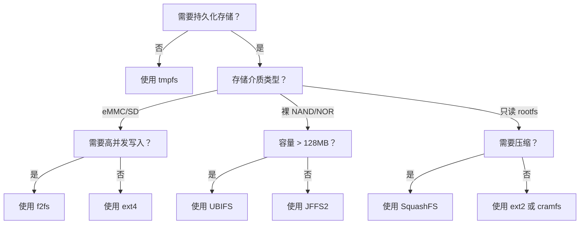

## 12.3.4 其他文件系统简介

除了 ext4/f2fs/UBIFS 这三个主流选择，嵌入式开发还会遇到其他文件系统：SquashFS 用于只读的 rootfs（压缩后省空间）、tmpfs 用于 RAM 中的临时文件（极快但掉电即失）、JFFS2 是老设备的遗留（别在新项目上用了）。

### SquashFS：只读压缩文件系统

SquashFS 是一种**只读**的压缩文件系统，几乎成为嵌入式 Linux rootfs 的事实标准。其核心设计目标是在保持较小体积的同时提供高效的只读访问。SquashFS 支持多种压缩算法，包括 zlib（默认，兼容性最好）、lzo（解压速度快）和 xz（压缩率最高），开发者可根据空间与启动速度的权衡灵活选择。

创建 SquashFS 镜像需要使用 `mksquashfs` 工具，命令格式简洁：`mksquashfs source_dir rootfs.squashfs -comp xz`。内核配置中需开启 `CONFIG_SQUASHFS` 及相关压缩算法支持。由于只读特性，SquashFS 不存在运行时写放大问题，非常适合存放系统二进制文件、库和只读配置。OTA 升级时通常直接替换整个 SquashFS 镜像，配合 A/B 分区策略可实现安全回滚。

### tmpfs：RAM 中的临时文件系统

tmpfs 基于 Linux 的 page cache 机制实现，将文件内容直接存储在内存（或 swap）中。挂载语法为 `mount -t tmpfs tmpfs /tmp -o size=64M`。由于完全绕开了块设备层，tmpfs 的读写速度接近内存带宽，延迟极低。

tmpfs 的典型应用场景包括 `/tmp` 目录、进程间临时数据交换、以及需要频繁读写的缓存文件。但其**掉电即失**的特性决定了不能存放任何需要持久化的数据。此外，size 参数限制了最大占用空间，需合理规划避免内存耗尽导致 OOM。

### JFFS2：遗留的裸 Flash 文件系统

JFFS2（Journalling Flash File System 2）是早期的裸 Flash 文件系统，曾在小容量 NOR/NAND Flash 时代广泛使用。它采用日志结构设计，内置磨损均衡和坏块管理。然而，JFFS2 存在致命缺陷：**挂载时间与 Flash 容量成线性关系**，因为需要扫描全部分区建立内存索引。当 Flash 容量超过几十 MB 时，挂载时间可达数秒甚至数十秒，无法接受。

对于新项目，JFFS2 已被 UBIFS 完全替代。仅在维护 legacy 设备或极特殊的小容量 NOR Flash 场景中才可能遇到。

### 适用场景决策

面对多种文件系统选择，可参考以下决策流程：

### 六种文件系统对比

| 特性 | ext4 | f2fs | UBIFS | SquashFS | JFFS2 | tmpfs |
|:---|:---|:---|:---|:---|:---|:---|
| 存储介质 | eMMC/SD | eMMC/SSD | 裸 Flash | 任意块设备 | 裸 Flash | RAM |
| 读写特性 | 全读写 | 全读写 | 全读写 | **只读** | 全读写 | 全读写 |
| 压缩支持 | 否 | 否（需上层）| 是（可选）| **是（内置）**| 是 | 否 |
| 掉电保护 | 日志（jbd2）| 日志 + TRIM | 写回 + 日志 | 不适用 | 日志结构 | **无（掉电即失）**|
| 磨损均衡 | 无（依赖 FTL）| FTL 层面 | **内置** | 不适用 | **内置** | 不适用 |
| 压缩比 | — | — | 中等 | **高** | 低 | — |
| 随机写性能 | 中等 | **优** | 良 | — | 差 | **极优** |
| 挂载时间 | 快 | 快 | 快 | **快** | **线性增长** | **瞬时** |
| 适用场景 | 通用持久化 | 高写负载 | 现代裸 Flash | 只读 rootfs | 遗留小容量设备 | 临时数据 |
| 推荐状态 | ✅ 首选通用 | ✅ 高写入场景 | ✅ 裸 Flash 首选 | ✅ rootfs 标准 | ❌ 废弃，用 UBIFS 替代 | ✅ 临时目录 |

SquashFS 与 tmpfs 的组合堪称嵌入式系统的"黄金搭档"：SquashFS 提供压缩后的只读系统镜像，节省 Flash 空间；tmpfs 承载运行时临时数据，释放 Flash 写压力。JFFS2 则属于历史遗产，新项目选型时应直接排除。
