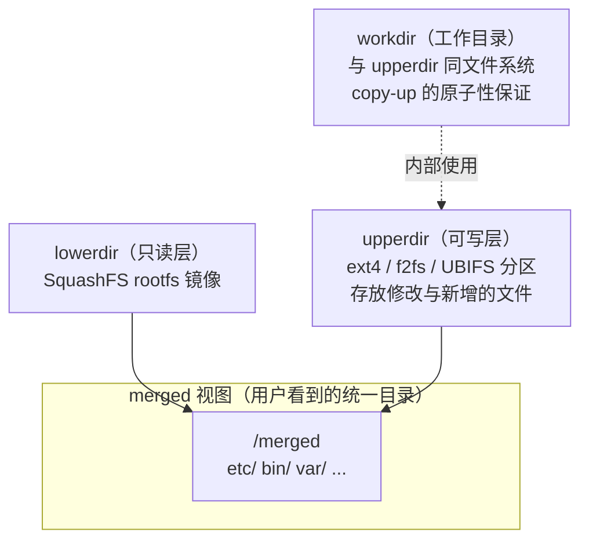
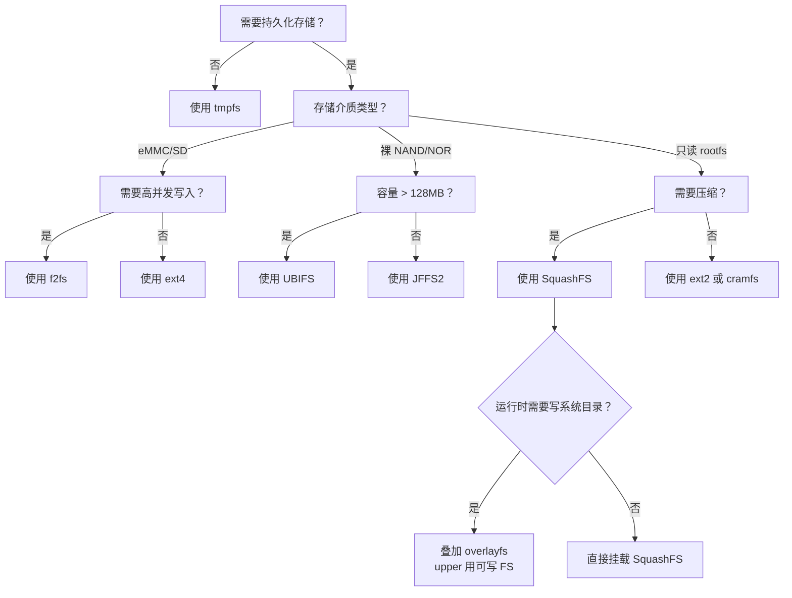

# 12.3.4 其他文件系统：SquashFS / tmpfs / overlayfs / JFFS2

> 所属章节：第12章 文件系统 > 12.3 ext4/f2fs/UBIFS
>
> 难度：[I] | 预计阅读时间：15分钟

## <span class="blue"> 本节导读

ext4/f2fs/UBIFS 是主力，但嵌入式项目里还有四个高频出现的文件系统：SquashFS 用于只读的 rootfs（压缩后省空间）、tmpfs 用于 RAM 中的临时文件（极快但掉电即失）、overlayfs 把只读层和可写层叠成一个视图（OTA 与恢复出厂的关键拼图）、JFFS2 是老设备的遗留（别在新项目上用了）。<br>
本节覆盖：

- SquashFS 的镜像制作与只读 rootfs 定位
- tmpfs 的适用场景与内存风险
- overlayfs 的 lower/upper/work 三层模型与 copy-up 机制
- JFFS2 被淘汰的原因
- 七种文件系统的横向对比与选型决策图

---

## <span class="blue"> SquashFS：只读压缩文件系统 [I]

SquashFS 是一种**只读**的压缩文件系统，几乎成为嵌入式 Linux rootfs 的事实标准。其核心设计目标是在保持较小体积的同时提供高效的只读访问。SquashFS 支持多种压缩算法，包括 zlib（默认，兼容性最好）、lzo（解压速度快）和 xz（压缩率最高），开发者可根据空间与启动速度的权衡灵活选择。

创建 SquashFS 镜像需要使用 `mksquashfs` 工具，命令格式简洁：`mksquashfs source_dir rootfs.squashfs -comp xz`。内核配置中需开启 `CONFIG_SQUASHFS` 及相关压缩算法支持。由于只读特性，SquashFS 不存在运行时写放大问题，非常适合存放系统二进制文件、库和只读配置。OTA 升级时通常直接替换整个 SquashFS 镜像，配合 A/B 分区策略可实现安全回滚。

---

## <span class="blue"> tmpfs：RAM 中的临时文件系统 [I]

tmpfs 基于 Linux 的 page cache 机制实现，将文件内容直接存储在内存（或 swap）中。挂载语法为 `mount -t tmpfs tmpfs /tmp -o size=64M`。由于完全绕开了块设备层，tmpfs 的读写速度接近内存带宽，延迟极低。

tmpfs 的典型应用场景包括 `/tmp` 目录、进程间临时数据交换、以及需要频繁读写的缓存文件。但其**掉电即失**的特性决定了不能存放任何需要持久化的数据。此外，size 参数限制了最大占用空间，需合理规划避免内存耗尽导致 OOM。

---

## <span class="blue"> overlayfs：联合挂载的写时复制层 [I]

SquashFS 只读、UBIFS 可写——如果系统镜像要只读防篡改，配置和日志又要可写，怎么办？overlayfs 的答案是把**两个目录层叠成一个视图**：下层的只读文件系统提供基础内容，上层的可写文件系统接住所有修改。

### 三层模型



挂载命令：

```bash
mount -t overlay overlay \
    -o lowerdir=/ro,upperdir=/rw/upper,workdir=/rw/work \
    /merged
```

### 核心机制

- **读文件**：优先读 upperdir，不存在则穿透到 lowerdir。
- **首次修改 lower 层文件**：触发 **copy-up**——整个文件先复制到 upperdir，之后在 upperdir 上修改。lowerdir 始终保持不变。
- **删除 lower 层文件**：在 upperdir 创建一个 **whiteout** 占位文件（字符设备 0/0），遮挡 lower 层的同名文件。
- **workdir 的作用**：copy-up 不是原子的（复制需要时间），workdir 用于中转，保证崩溃后视图一致。内核要求 workdir 与 upperdir 位于**同一个文件系统**。

### 嵌入式典型用途

| 场景 | 组合方式 | 收益 |
|:---|:---|:---|
| 只读 rootfs + 可写配置 | lower=SquashFS，upper=UBIFS/f2fs 小分区 | 系统区防篡改；**清空 upper 即恢复出厂**，无需重烧镜像 |
| OTA A/B 升级 | 升级只替换 lower 层镜像，upper 层保留 | 用户配置跨升级保留；回滚只切 lower |
| 容器镜像分层 | 镜像为 lower，容器私有层为 upper | Docker/containerd 的默认存储驱动 |

> 💡 upperdir 必须落在支持 xattr 的可写文件系统上（ext4/f2fs/UBIFS/tmpfs 均可），NFS 不适合做 upper；内核需开启 `CONFIG_OVERLAY_FS`。

---

## <span class="blue"> JFFS2：遗留的裸 Flash 文件系统 [I]

JFFS2（Journalling Flash File System 2）是早期的裸 Flash 文件系统，曾在小容量 NOR/NAND Flash 时代广泛使用。它采用日志结构设计，内置磨损均衡和坏块管理。然而，JFFS2 存在致命缺陷：**挂载时间与 Flash 容量成线性关系**，因为需要扫描全部分区建立内存索引。当 Flash 容量超过几十 MB 时，挂载时间可达数秒甚至数十秒，无法接受。

对于新项目，JFFS2 已被 UBIFS 完全替代。仅在维护 legacy 设备或极特殊的小容量 NOR Flash 场景中才可能遇到。

---

## <span class="blue"> 适用场景决策 [I]

面对多种文件系统选择，可参考以下决策流程：



### 七种文件系统对比

| 特性 | ext4 | f2fs | UBIFS | SquashFS | overlayfs | JFFS2 | tmpfs |
|:---|:---|:---|:---|:---|:---|:---|:---|
| 存储介质 | eMMC/SD | eMMC/SSD | 裸 Flash | 任意块设备 | 依赖上下层 FS | 裸 Flash | RAM |
| 读写特性 | 全读写 | 全读写 | 全读写 | **只读** | 视图可写（实际写 upper） | 全读写 | 全读写 |
| 压缩支持 | 否 | 否（需上层）| 是（可选）| **是（内置）**| 继承各层 | 是 | 否 |
| 掉电保护 | 日志（jbd2）| Checkpoint + 日志 | **COW + 日志提交** | 不适用 | 继承 upper 层 FS | 日志结构 | **无（掉电即失）**|
| 磨损均衡 | 无（依赖 FTL）| FTL 层面 | **内置** | 不适用 | 继承各层 | **内置** | 不适用 |
| 随机写性能 | 中等 | **优** | 良 | — | 接近 upper 层 FS | 差 | **极优** |
| 挂载时间 | 快 | 快 | 快 | **快** | 快 | **线性增长** | **瞬时** |
| 适用场景 | 通用持久化 | 高写负载 | 现代裸 Flash | 只读 rootfs | 只读镜像+可写层 | 遗留小容量设备 | 临时数据 |
| 推荐状态 | ✅ 首选通用 | ✅ 高写入场景 | ✅ 裸 Flash 首选 | ✅ rootfs 标准 | ✅ 只读系统盘扩容标配 | ❌ 废弃，用 UBIFS 替代 | ✅ 临时目录 |

SquashFS、overlayfs 与 tmpfs 的组合堪称嵌入式系统的"黄金搭档"：SquashFS 提供压缩后的只读系统镜像，overlayfs 在其上叠出可写的配置与日志目录，tmpfs 承载运行时临时数据。JFFS2 则属于历史遗产，新项目选型时应直接排除。

---

## <span class="blue"> 本节总结

| 文件系统 | 一句话定位 | 典型挂载点 |
|------|------|------|
| **SquashFS** | 只读压缩 rootfs 事实标准，无写放大 | `/`（只读系统区） |
| **tmpfs** | 内存级速度，掉电即失，注意 OOM | `/tmp`、`/run` |
| **overlayfs** | lower 只读 + upper 可写的联合视图，copy-up 写时复制 | 可写化的系统目录、容器层 |
| **JFFS2** | 挂载时间随容量线性增长，已被 UBIFS 淘汰 | 仅 legacy 维护 |
| **核心口诀** | 只读 SquashFS，可写叠 overlay，临时丢 tmpfs，JFFS2 别再用 | — |

---

## <span class="blue"> 下一步

七种文件系统摆在面前，给定介质和负载怎么选？下一节给出两维度决策框架（介质 × 读写模式）、fio 基准方法和三个真实产品的选型案例。

> **12.3.5 文件系统选型**

---

## <span class="blue"> 配套资源

| 资源类型 | 内容 |
|----------|------|
| **工具命令** | `mksquashfs source_dir rootfs.squashfs -comp xz`（制作只读镜像）；`mount -t overlay overlay -o lowerdir=...,upperdir=...,workdir=... /merged`（联合挂载） |
| **内核源码** | `fs/overlayfs/copy_up.c`（copy-up 实现）、`fs/squashfs/`（解压读路径） |
| **关联小节** | 12.3.5 选型决策框架；12.4.3 UBIFS 卷与 SquashFS/overlayfs 组合的分区实战 |
