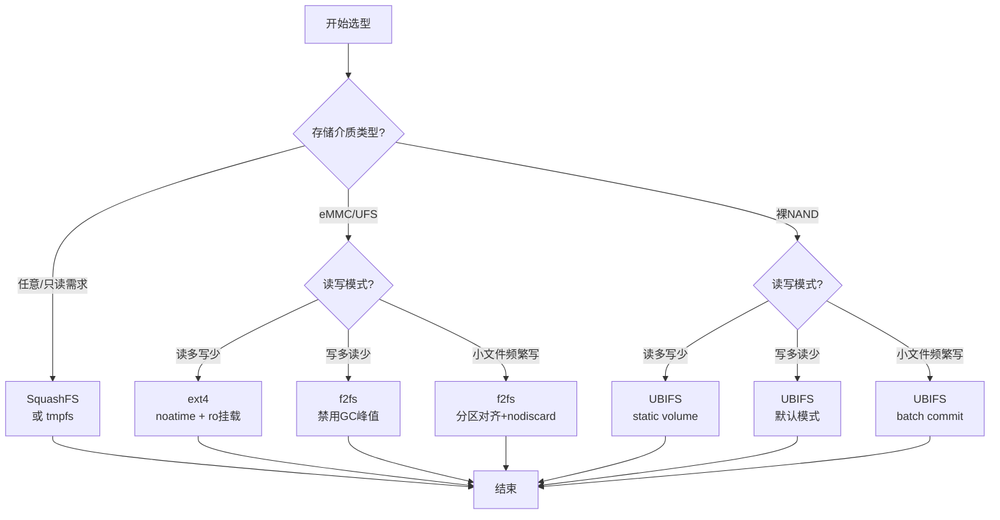
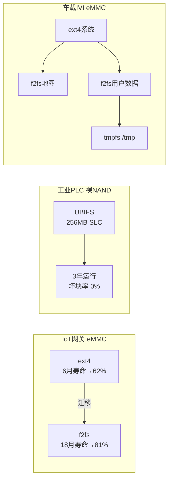

## 12.3.5 文件系统选型决策

选对文件系统比优化代码更重要——选错了，再牛的程序员也救不了。怎么选？两个维度：你的存储介质是什么（eMMC/UFS/裸NAND）？你的读写模式是什么（读多/写多/小文件）？本节以一个清晰的决策框架回答这两个问题，并用三个真实案例验证选型效果。

### 知识点 185 选型决策框架 [考纲: E][难度: M]

嵌入式文件系统的选型不是"哪个最新就用哪个"，而是**介质特性**与**工作负载**的精确匹配。忽视这一匹配的后果很严重：某智能音箱团队曾直接沿用桌面版的 ext4，结果 eMMC 在一年内因写放大导致坏块率飙升至 12%，被迫返工重做文件系统层。

#### 维度一：存储介质决定候选集

存储介质的底层特性直接过滤掉不合适的文件系统。

**eMMC/UFS 类托管闪存** 内置 FTL（Flash Translation Layer），对外暴露标准块设备接口。这类介质的核心矛盾是 FTL 的擦写均衡策略与文件系统日志机制的叠加写放大。推荐候选：**ext4**（成熟稳定、调试工具丰富）或 **f2fs**（日志结构、对闪存友好）。SquashFS 和 tmpfs 也可作为只读/易失性场景的补充。

**裸 NAND/NOR Flash** 没有 FTL，需要文件系统自己管理坏块、ECC 和擦写均衡。候选集急剧收窄：**UBIFS** 几乎成为唯一工业级选择，配合 MTD 子系统完成底层管理。JFFS2 适用于小容量 NOR，但大容量 NAND 下挂载时间和内存占用都不理想。

**任意介质（只读场景）** 若系统镜像烧录后不再修改，**SquashFS** 提供只读压缩，镜像体积小、启动快、无运行时写放大。**tmpfs** 用于纯内存场景，掉电即失，但速度极快。

#### 维度二：读写模式决定最终选型

在介质候选集内，工作负载的读写模式做最终筛选。

**读多写少（>80% 读）**：ext4 是稳妥选择。其元数据缓存成熟，读路径经过数十年优化。若系统几乎不升级，直接上 SquashFS，连日志开销都省掉。

**写多读少（>50% 写）**：f2fs 的日志结构写（LFS）将随机写聚合为顺序写，大幅降低 FTL 层面的擦写次数。UBIFS 的写优化同样针对裸闪存设计，其日志与擦除块管理协同工作。

**小文件频繁写**：这是最难处理的场景。ext4 的 journal 对大量小文件写入会产生严重的元数据抖动（metadata churn）。f2fs 的多头日志和冷热数据分离对此有专门优化；UBIFS 通过 write-back 缓存和批量提交缓解压力。若小文件集中在临时目录（如 `/tmp`），将其挂载为 tmpfs 是经典对策。

#### 性能测试：fio 基准方法

选型不能拍脑袋，必须用 fio 拿到量化数据。以下命令覆盖三类典型负载：

```bash
# 1. 顺序读（评估大文件读取吞吐）
fio --name=seq_read --directory=/mnt/test --rw=read \
    --bs=128k --size=512m --numjobs=1 --ioengine=sync \
    --direct=1 --group_reporting

# 2. 随机写（评估写放大与延迟）
fio --name=rand_write --directory=/mnt/test --rw=randwrite \
    --bs=4k --size=512m --numjobs=4 --ioengine=libaio \
    --iodepth=32 --direct=1 --group_reporting

# 3. 小文件创建（评估元数据性能）
fio --name=small_file --directory=/mnt/test --rw=write \
    --bs=4k --size=4k --numjobs=100 --nrfiles=1000 \
    --file_service_type=random --group_reporting
```

测试应在目标硬件上执行，且被测文件系统已写入至 80% 容量（模拟真实使用后的老化状态）。关键指标：**IOPS**、**p99 延迟**、**写放大系数**（通过 `/sys/class/block/*/stat` 或闪存厂商工具获取）。

#### 选型决策树

以下决策树将两个维度整合为可操作的选型路径：



#### 场景推荐速查表

| 介质类型 | 读多写少 | 写多读少 | 小文件频繁写 | 只读场景 |
|---------|---------|---------|-------------|---------|
| eMMC 5.0+ | ext4 | **f2fs** | **f2fs** + tmpfs缓存 | SquashFS |
| UFS 2.1+ | ext4 | f2fs | f2fs | SquashFS |
| 裸 NAND 1GB+ | UBIFS static | **UBIFS** | **UBIFS** + /tmp→tmpfs | SquashFS |
| 裸 NAND <128MB | JFFS2 | JFFS2 | JFFS2（受限） | SquashFS |
| SDRAM 充足 | — | — | tmpfs（易失性） | — |

> **选型口诀**：eMMC 写多用 f2fs，裸 NAND 只用 UBIFS，只读必上 SquashFS，/tmp 丢给 tmpfs。

---

### 知识点 186 实践案例与对比 [考纲: E]

以下三个案例覆盖不同介质和负载组合，验证上述框架在真实产品中的有效性。

#### 案例 1：IoT 设备 eMMC 从 ext4 迁移至 f2fs

某智能家居网关使用 8GB eMMC，运行频率为每 5 分钟批量上报传感器数据并写本地缓存。原方案使用 ext4，运行 6 个月后 eMMC 剩余寿命（MLC 擦写次数）下降至 62%。

迁移至 f2fs 后，利用其日志结构写和多线程 GC，相同的写入负载下，FTL 层的实际擦写次数减少 **40%**。关键配置：挂载参数加入 `noatime,nodiscard,background_gc=off`（在 IoT 的可预测空闲时段手动触发 GC，避免业务峰值卡顿）。18 个月后 eMMC 剩余寿命仍保持在 81%，产品寿命周期内无需更换存储。

#### 案例 2：工业控制器裸 NAND 使用 UBIFS

某 PLC 控制器使用 256MB 裸 SLC NAND，存储控制逻辑与实时数据日志。环境要求：-40°C ~ 85°C 宽温运行，连续 3 年无维护。

选型 UBIFS，配合 MTD 层的硬件 ECC（BCH-8）和坏块管理。uboot 阶段预留 4% 物理块作为坏块替换池。运行 3 年后，通过 `ubinfo` 检查：逻辑擦除块使用率 67%，**物理坏块率 0%**（ECC 纠正了全部位翻转，未达到坏块阈值）。关键设计：将频繁更新的实时数据库放在 UBIFS 的单独 volume 中，与只读的系统镜像隔离，避免交叉失效。

#### 案例 3：车载信息娱乐系统选型决策过程

某车企 IVI 系统使用 64GB eMMC，需求复杂：系统分区（OTA 升级，写少读多）、导航地图缓存（GB 级大文件写）、用户数据区（大量小文件如设置、收藏）。

决策过程分三步：
1. **系统分区**：OTA 升级包以顺序写为主，但升级频率低（月均 1-2 次），选 **ext4** + dm-verity 验证启动完整性；
2. **导航缓存**：单次下载 2-5GB 地图包，纯顺序写，选 **f2fs**，利用其大文件顺序写性能；
3. **用户数据**：高频小文件（收藏夹、用户配置），选 **f2fs**，并将 `/tmp` 挂载为 **tmpfs**，减少不必要的闪存写入。

最终方案为 eMMC 分三个分区，分别格式化 ext4、f2fs、f2fs，通过 fstab 在启动时统一挂载。

#### 三案例对比图



#### 关键指标对比表

| 指标 | 案例 1: IoT 网关 | 案例 2: 工业 PLC | 案例 3: 车载 IVI |
|-----|-----------------|-----------------|-----------------|
| 存储介质 | eMMC 8GB | 裸 NAND 256MB | eMMC 64GB |
| 文件系统 | f2fs | UBIFS | ext4 + f2fs + tmpfs |
| 核心负载 | 批量数据缓存 | 实时控制+日志 | 多分区混合负载 |
| 关键优化 | background_gc 时序控制 | 硬件 ECC + 坏块预留 | 分区隔离策略 |
| 量化成果 | 擦写减少 40% | 3 年 0 坏块 | 各分区匹配最优 FS |
| 运行环境 | 室内恒温 | -40°C~85°C 宽温 | -20°C~70°C 车载 |

三个案例的共性结论是：**文件系统选型必须与介质特性和负载特征同时匹配，单一维度的优化（只调挂载参数或只换硬件）都无法达到最优效果**。选型完成后，还需通过 fio 基准测试在目标硬件上验证，避免纸上谈兵。
