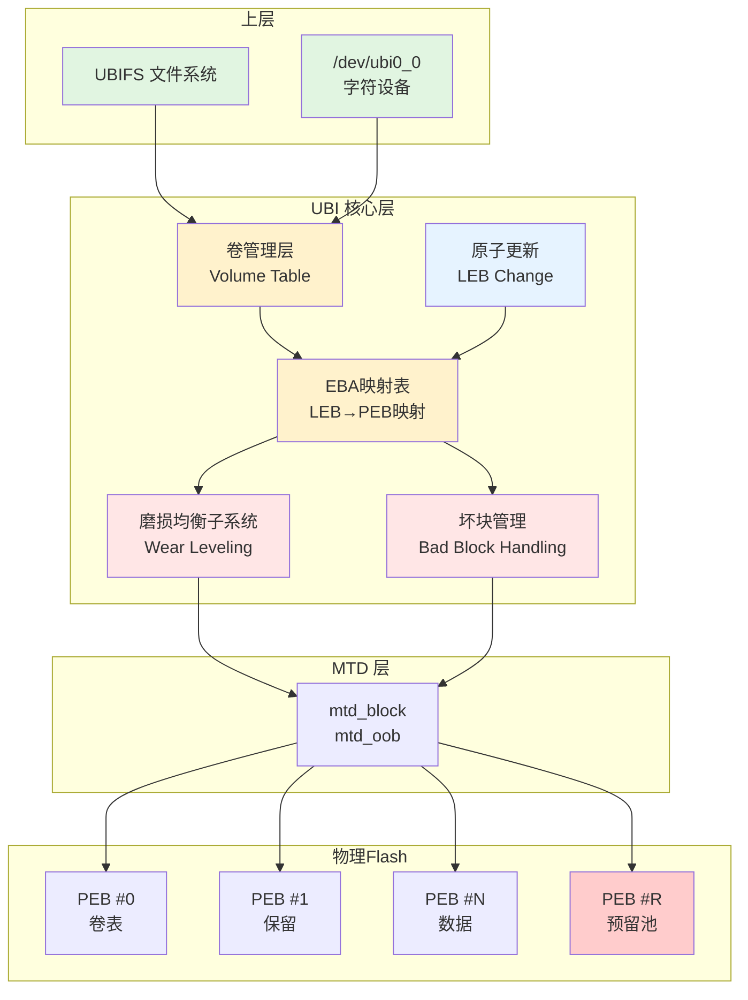
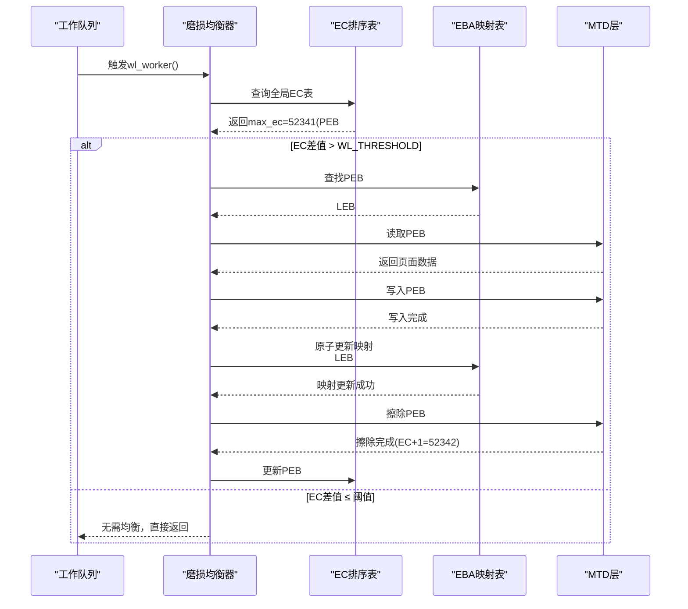

## 12.4.2 UBI层机制

MTD只是裸Flash的"驱动层"——它提供了读写擦除的API，但不管理坏块、不做磨损均衡。UBI层在MTD之上，就像LVM在块设备之上一样，提供了卷管理、磨损均衡、坏块管理这三大关键功能。

### 知识点189 UBI四项核心功能

#### 1. 为什么需要UBI

裸Flash设备（NAND/NOR）的物理特性决定了它无法像机械硬盘那样被直接格式化使用。首先，Flash在写入前必须先擦除，而擦除粒度（块级）远大于写入粒度（页级）；其次，每个物理擦除块（PEB）的擦除次数有限（通常1万~10万次），超出后会产生坏块；第三，部分PEB出厂时就存在坏块，且使用过程中会动态新增。

MTD子系统提供了`read()`、`write()`、`erase()`等原始接口，但将这些物理特性完全暴露给上层。如果文件系统（如JFFS2、UBIFS）直接使用MTD，就必须自行处理坏块扫描、磨损均衡等复杂逻辑，导致代码重复且策略不一致。

UBI（Unsorted Block Images）层应运而生。它在MTD之上构建了一个抽象层，将物理擦除块（PEB）映射为逻辑擦除块（LEB），向上层提供统一的块设备语义。UBI的核心价值可以概括为：**将Flash的物理复杂性封装在底层，让上层文件系统专注于文件管理本身**。

#### 2. UBI内部结构

UBI的核心数据结构是`struct ubi_volume`，它描述了一个逻辑卷的属性：

```c
struct ubi_volume {
    struct ubi_device *ubi;      /* 所属UBI设备 */
    int vol_id;                  /* 卷ID，0保留给布局卷 */
    int reserved_pebs;           /* 为该卷保留的PEB数量 */
    int leb_size;                /* 每个LEB的可用字节数 */
    int used_ebs;                /* 实际使用的LEB数量 */
    int vol_type;                /* UBI_STATIC_VOLUME / UBI_DYNAMIC_VOLUME */
    
    /* 映射表：LEB编号 → PEB编号 */
    int *eba_tbl;                /* Erase Block Association table */
    
    /* 卷名与字符设备 */
    char name[UBI_VOL_NAME_MAX + 1];
    struct device dev;
    struct cdev cdev;
    
    /* 对齐、更新相关 */
    int alignment;
    int upd_marker;
    long long data_pad;
    
    /* 引用计数与并发控制 */
    int readers;
    int writers;
    struct rw_semaphore ck vol_sem;
};
```

`eba_tbl`是UBI实现地址映射的关键。每个卷维护一张映射表，将逻辑地址（LEB编号）转换为物理地址（PEB编号）。当上层请求写入LEB #5时，UBI查阅映射表找到对应的PEB（例如PEB #203），执行写入操作。这种间接映射为磨损均衡和坏块替换提供了操作空间——UBI可以在后台更换PEB，而无需通知上层。

LEB原子更新通过`ubi_leb_change()`实现，其内核代码核心逻辑如下：

```c
int ubi_leb_change(struct ubi_device *ubi, int vol_id, int lnum,
                   const void *buf, int len, int dtype)
{
    struct ubi_volume *vol;
    struct ubi_vid_hdr *vid_hdr;
    int pnum, err;

    vol = ubi_find_volume(ubi, vol_id);
    if (!vol)
        return -ENODEV;

    /* 检查写权限与长度 */
    if (vol->vol_type == UBI_STATIC_VOLUME)
        return -EROFS;
    if (len < 0 || len > vol->leb_size)
        return -EINVAL;

    /* 分配一个新的PEB（磨损均衡选择） */
    pnum = ubi_wl_get_peb(ubi, dtype);
    if (pnum < 0)
        return pnum;

    /* 构造VID头并写入新PEB */
    vid_hdr = ubi_zalloc_vid_hdr(ubi, GFP_KERNEL);
    vid_hdr->vol_id = cpu_to_be32(vol_id);
    vid_hdr->lnum = cpu_to_be32(lnum);
    vid_hdr->data_size = cpu_to_be32(len);
    vid_hdr->compat = ubi_get_compat(ubi, vol_id);

    err = ubi_io_write_vid_hdr(ubi, pnum, vid_hdr);
    if (err)
        goto out_put;

    err = ubi_io_write_data(ubi, buf, pnum, 0, len);
    if (err)
        goto out_put;

    /* 原子替换：更新映射表，释放旧PEB */
    mutex_lock(&ubi->lp_mutex);
    err = ubi_eba_atomic_leb_change(ubi, vol, lnum, pnum);
    mutex_unlock(&ubi->lp_mutex);

out_put:
    ubi_free_vid_hdr(ubi, vid_hdr);
    if (err)
        ubi_wl_put_peb(ubi, vol_id, lnum, pnum, 1);
    return err;
}
```

`ubi_leb_change()`的核心思想是**写时复制（Copy-on-Write）**：不原地修改当前PEB，而是分配一个全新的PEB完成数据写入，最后原子性地更新映射表。这种方式确保了即使在写入过程中发生断电，旧数据仍然完整可用，实现了真正的原子更新语义。

#### 3. UBI内部架构图

下图展示了UBI的核心映射关系与组件交互：



图中黄色区域为UBI核心组件，红色区域为关键管理子系统，蓝色为原子更新机制，绿色为上层接口。预留池（PEB #R）是UBI为坏块替换和磨损均衡保留的备用块集合。

#### 4. UBI四项功能详述

| 功能 | 工作原理 | 关键数据结构/函数 | 解决的问题 |
|:---|:---|:---|:---|
| **卷管理** | 将Flash划分为多个逻辑卷，支持动态创建、删除和调整大小 | `struct ubi_volume`、`ubi_create_volume()`、`ubi_remove_volume()` | 单个Flash设备需承载多个独立分区（根文件系统、用户数据、配置等） |
| **磨损均衡** | 监控所有PEB的擦除计数（EC），将写入引导至EC最低的块；定期进行静态数据迁移 | `struct ubi_wl_entry`、`wear_leveling_worker()` | 防止部分PEB因频繁写入而过早磨损，延长Flash整体寿命 |
| **坏块管理** | 扫描发现坏块→标记为不可用→从预留池分配新PEB替换；对上层完全透明 | `ubi_wl_put_peb()`、`ubi_is_bad()`、`peb_remap()` | NAND Flash固有坏块及使用中新增的坏块会影响数据可靠性 |
| **原子LEB更新** | 写时复制：分配新PEB→写入数据→原子更新映射表→释放旧PEB | `ubi_leb_change()`、`ubi_eba_atomic_leb_change()` | 防止写入过程中断电导致数据半写、元数据不一致 |

卷管理功能的灵活性体现在：UBI卷可以在运行时动态创建（通过`ubiupdatevol`工具），无需重新分区整个Flash。每个卷可以是动态卷（UBIFS使用，支持压缩）或静态卷（只读数据，CRC保护）。卷表（Volume Table）存储在两个冗余PEB中，具备掉电安全保护。

---

### 知识点190 磨损均衡与坏块管理

#### 1. 磨损均衡原理

Flash存储器的每个PEB擦除次数存在上限（SLC NAND约10万次，MLC约5千~1万次，TLC更低）。若数据写入始终集中在固定区域（如文件系统的日志区、索引节点区），这些PEB将迅速耗尽寿命，导致整片Flash提前报废。

UBI在**所有PEB之间均匀分布写入操作**，通过全局擦除计数器（Erase Counter，简称EC）追踪每个PEB的历史擦除次数。EC头存储在每个PEB的OOB（Out-of-Band）区域，格式如下：

```c
struct ubi_ec_hdr {
    __be32  magic;          /* UBI# (0x55424923) */
    __be32  version;        /* UBI版本号 */
    __u8    padding1[4];
    __be64  ec;             /* 擦除计数器（核心字段） */
    __be32  vid_hdr_offset; /* VID头偏移 */
    __be32  data_offset;    /* 数据区偏移 */
    __be32  image_seq;      /* 镜像序列号 */
    __u8    padding2[32];
    __be32  hdr_crc;        /* EC头CRC校验 */
} __packed;
```

`ec`字段是64位无符号整数，记录该PEB自出厂以来的累计擦除次数。每次执行`erase`操作前，UBI读取旧EC值，加1后写回。由于EC头自带CRC保护，即使部分位翻转也可被检测。

#### 2. 磨损均衡算法

UBI采用**动态与静态相结合**的磨损均衡策略，核心算法的简化伪代码如下：

```python
# UBI磨损均衡算法（简化版）
def wear_leveling_worker(ubi):
    """后台工作线程，周期性执行"""
    
    while True:
        sleep(INTERVAL)          # 默认每隔几秒检查一次
        
        if ubi.free_pebs < threshold:
            continue             # 空闲块不足时跳过
        
        # 步骤1：在所有PEB中找出EC最大和最小的两个块
        max_ec_peb = find_max_ec(ubi.used_pebs)
        min_ec_peb = find_min_ec(ubi.free_pebs)
        
        # 步骤2：计算EC差异
        ec_diff = max_ec_peb.ec - min_ec_peb.ec
        
        # 步骤3：若差异超过阈值，执行数据迁移
        if ec_diff > WL_THRESHOLD:      # 通常阈值设为几百到几千
            # 将高EC块上的数据复制到低EC块
            new_peb = allocate_peb()    # 获取低EC空闲块
            old_peb = max_ec_peb
            
            copy_data(old_peb, new_peb) # 读取→写入
            update_eba_mapping(old_peb, new_peb)  # 更新LEB→PEB映射
            
            erase_and_recycle(old_peb)  # 擦除旧块，放入空闲池
            # 旧块的EC+1，但由于原本EC就高，+1后仍然相对较高
            # 新块接管数据后成为在用块，其EC保持低位
```

算法的核心逻辑是：**当最高EC与最低EC的差值超过阈值时，将高EC块上的有效数据迁移到低EC块**，从而让"年轻"的PEB承担更多写入负载，"年老"的PEB得以休息。

#### 3. 磨损均衡过程图示



#### 4. 坏块管理流程

NAND Flash的坏块分为**出厂坏块**（Factory Bad Block，标记在Spare Area首字节）和**使用中产生的坏块**。UBI的坏块管理流程如下：

**（1）扫描阶段**：UBI挂载时扫描全部PEB，检查：
- Spare Area的出厂坏块标记（非0xFF即表示坏块）
- EC头的CRC校验是否失败
- 擦除或写入时是否返回`-EIO`错误

**（2）标记与隔离**：发现的坏块被标记为`UBI_BADBLOCK`，从可用池中移除，不再参与任何数据读写。标记信息持久化记录在内部数据结构中。

**（3）动态替换**：当写入操作遇到新产生的坏块（返回错误），UBI执行：
1. 将当前PEB标记为坏块
2. 从预留池（Reserved Pool）中取出一个健康PEB
3. 将数据重写至新PEB
4. 更新EBA映射表
5. 上层完全无感知

预留池的大小通常为Flash总容量的1%~2%，在UBI初始化时自动划出。若预留池耗尽，UBI将返回`-ENOSPC`，文件系统需要处理此错误。

#### 5. 静态与动态磨损均衡对比

| 对比维度 | 动态磨损均衡 | 静态磨损均衡 |
|:---|:---|:---|
| **触发时机** | 写入请求到达时实时选择目标PEB | 后台定期扫描，主动迁移长期不变的数据 |
| **迁移对象** | 仅处理新写入数据，将其引导至低EC块 | 将长期只读的数据从低EC块搬到高EC块 |
| **均衡范围** | 主要均衡"频繁写入区域"的负载 | 均衡范围覆盖全部PEB，包括只读数据 |
| **开销特点** | 写入延迟增加（需查表选块），但无需额外读写 | 需要额外的后台读写带宽，可能短暂影响性能 |
| **适用数据** | 动态变化的热数据（日志、缓存） | 长期不变的冷数据（根文件系统镜像、Bootloader） |
| **算法复杂度** | 低：每次选择min_ec空闲块即可 | 高：需追踪数据访问模式，判断迁移收益 |
| **UBI实现** | `ubi_wl_get_peb()`选择写入目标 | `wear_leveling_worker()`周期性数据搬迁 |

**动态磨损均衡**解决的是"写哪里"的问题：每次上层请求写入时，UBI从当前空闲池中选取EC最低的PEB作为目标。这确保了写入负载的实时均匀分布，但无法处理一个极端场景——如果大部分数据长期不变（如根文件系统），这些PEB的EC将永远保持低位，而其他频繁写入区域的PEB EC持续攀升，最终导致整体寿命受限于高EC区域。

**静态磨损均衡**正是为解决这个问题而生。UBI后台线程会定期扫描：如果发现某个低EC块存储的是长期不访问的冷数据，而同时存在高EC块正在承受频繁写入，UBI会主动将冷数据从低EC块复制到高EC块，然后让低EC块接管新的写入任务。通过这种方式，即使是"从不变化"的数据也间接参与了磨损均衡——因为它们的位置被"对调"了。

实际系统中，两种机制协同工作：动态均衡保证实时写入的均匀性，静态均衡在后台修补长期累积的不平衡。UBI的默认策略优先保证写入性能（动态为主），在系统空闲时通过`kworker`线程执行静态均衡任务，实现寿命与性能的平衡。
