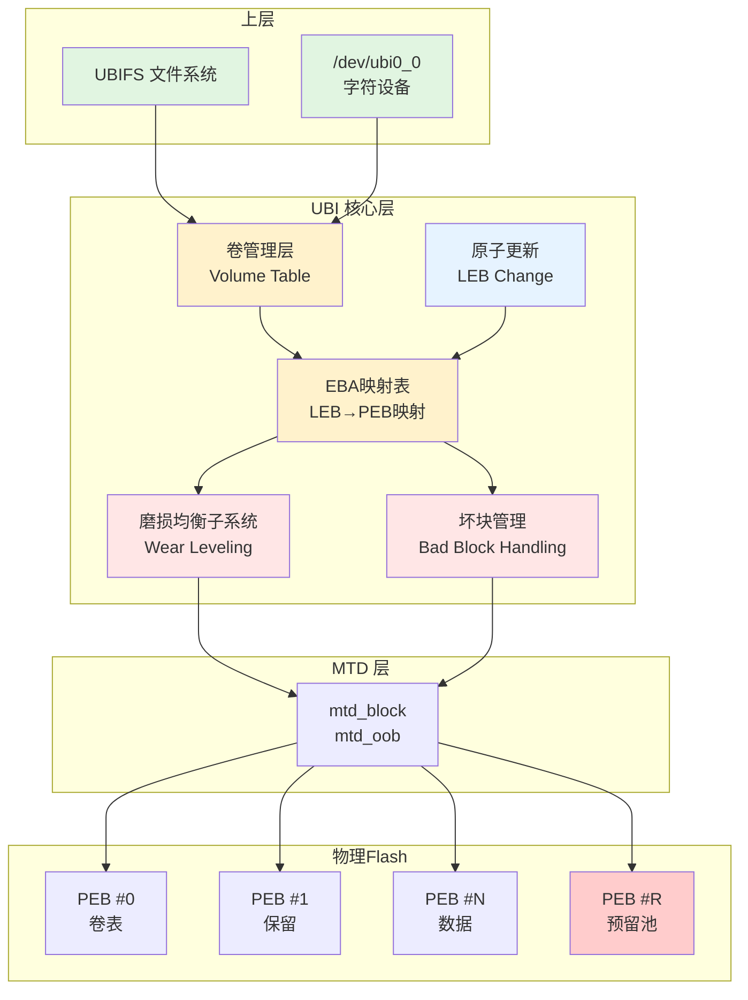
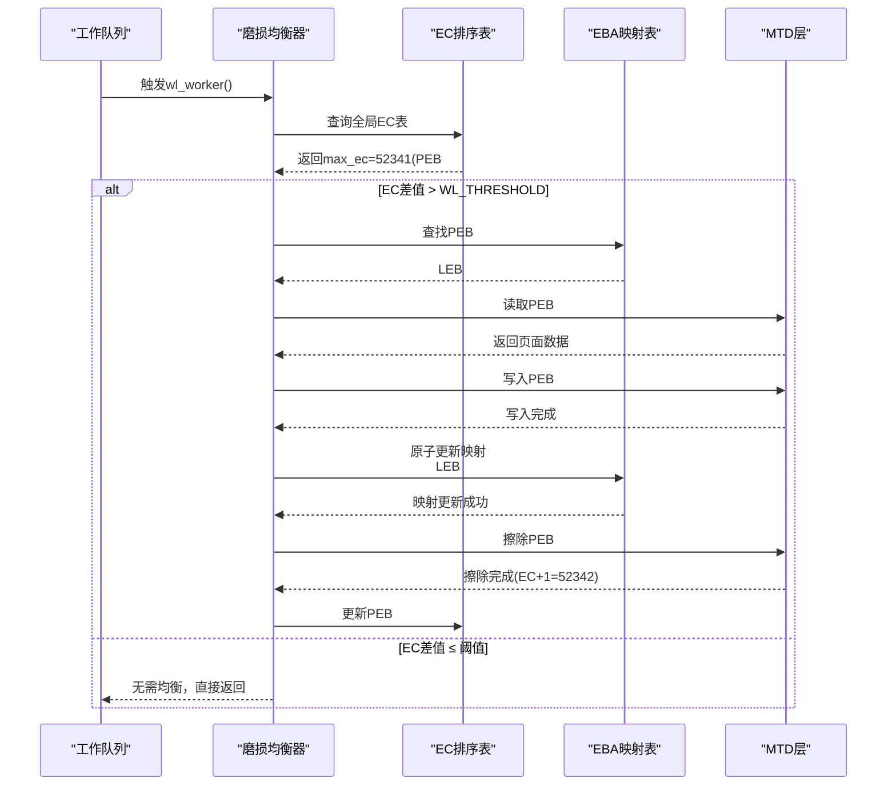

# 12.4.2 UBI层机制

> 所属章节：第12章 文件系统 > 12.4 MTD/UBI
>
> 难度：[E→M] | 预计阅读时间：25分钟

## <span class="blue"> 本节导读

MTD 只是裸 Flash 的"驱动层"——它提供了读写擦除的 API，但不管理坏块、不做磨损均衡。UBI 层在 MTD 之上，就像 LVM 在块设备之上一样，提供了卷管理、磨损均衡、坏块管理、原子更新这四大功能。<br>
本节覆盖：

- 为什么需要 UBI 以及 PEB→LEB 映射的核心地位
- struct ubi_volume 的真实字段（对照 v6.6 源码）
- ubi_leb_change 原子更新的完整源码链路
- 磨损均衡算法（动态+静态）与坏块管理流程

---

## <span class="blue"> UBI四项核心功能 [E→M]

### 为什么需要 UBI

裸 Flash 设备（NAND/NOR）的物理特性决定了它无法像机械硬盘那样被直接格式化使用。首先，Flash 在写入前必须先擦除，而擦除粒度（块级）远大于写入粒度（页级）；其次，每个物理擦除块（PEB）的擦除次数有限（通常 1 万~10 万次），超出后会产生坏块；第三，部分 PEB 出厂时就存在坏块，且使用过程中会动态新增。

MTD 子系统提供了 `mtd_read()`、`mtd_write()`、`mtd_erase()` 等原始接口，但将这些物理特性完全暴露给上层。如果文件系统（如 JFFS2、UBIFS）直接使用 MTD，就必须自行处理坏块扫描、磨损均衡等复杂逻辑，导致代码重复且策略不一致。

UBI（Unsorted Block Images）层应运而生。它在 MTD 之上构建了一个抽象层，将物理擦除块（PEB）映射为逻辑擦除块（LEB），向上层提供统一的块设备语义。UBI 的核心价值可以概括为：**将 Flash 的物理复杂性封装在底层，让上层文件系统专注于文件管理本身**。

### UBI 内部结构

UBI 的核心数据结构是 `struct ubi_volume`（drivers/mtd/ubi/ubi.h:338），描述一个逻辑卷的属性：

```c
struct ubi_volume {
    struct device dev;
    struct cdev cdev;
    struct ubi_device *ubi;      /* 所属UBI设备 */
    int vol_id;                  /* 卷ID */
    int ref_count;
    int readers;
    int writers;                 /* 读写者计数，互斥控制 */
    int exclusive;
    int metaonly;

    int reserved_pebs;           /* 为该卷保留的PEB数量 */
    int vol_type;                /* UBI_STATIC_VOLUME / UBI_DYNAMIC_VOLUME */
    int usable_leb_size;         /* 每个LEB的可用字节数 */
    int used_ebs;                /* 实际使用的LEB数量 */
    int last_eb_bytes;
    long long used_bytes;
    int alignment;
    long long data_pad;
    int name_len;
    char name[UBI_VOL_NAME_MAX + 1];

    /* 卷更新（ubiupdatevol）相关状态 */
    int upd_ebs;
    long long upd_bytes;
    long long upd_received;
    void *upd_buf;

    struct ubi_eba_table *eba_tbl;  /* LEB→PEB 映射表 */

    unsigned int corrupted:1;
    unsigned int upd_marker:1;      /* 更新中/不洁重启标记 */
    unsigned int updating:1;
    unsigned int changing_leb:1;
    unsigned int direct_writes:1;
};
```

`eba_tbl` 是 UBI 实现地址映射的关键。每个卷维护一张映射表，将逻辑地址（LEB 编号）转换为物理地址（PEB 编号）。当上层请求写入 LEB #5 时，UBI 查阅 `eba_tbl->entries[5].pnum` 找到对应的 PEB（例如 PEB #203），执行写入操作。这种间接映射为磨损均衡和坏块替换提供了操作空间——UBI 可以在后台更换 PEB，而无需通知上层。

### LEB 原子更新源码导读

LEB 原子更新对外接口是 `ubi_leb_change()`（drivers/mtd/ubi/kapi.c:559）。其内核文档注释明确承诺：**原子地改变 LEB 内容；即使发生不洁重启，旧内容也会保留**。真实实现分两层。

**第一层：参数校验与权限检查**（kapi.c:559）：

```c
int ubi_leb_change(struct ubi_volume_desc *desc, int lnum, const void *buf,
           int len)
{
    struct ubi_volume *vol = desc->vol;
    struct ubi_device *ubi = vol->ubi;
    int vol_id = vol->vol_id;

    dbg_gen("atomically write %d bytes to LEB %d:%d", len, vol_id, lnum);

    if (vol_id < 0 || vol_id >= ubi->vtbl_slots)
        return -EINVAL;

    if (desc->mode == UBI_READONLY || vol->vol_type == UBI_STATIC_VOLUME)
        return -EROFS;

    if (!ubi_leb_valid(vol, lnum) || len < 0 ||
        len > vol->usable_leb_size || len & (ubi->min_io_size - 1))
        return -EINVAL;

    if (vol->upd_marker)
        return -EBADF;

    if (len == 0)
        return 0;

    return ubi_eba_atomic_leb_change(ubi, vol, lnum, buf, len);
}
```

**第二层：原子切换的实现**（`ubi_eba_atomic_leb_change`，eba.c:1197）：

```c
int ubi_eba_atomic_leb_change(struct ubi_device *ubi, struct ubi_volume *vol,
                  int lnum, const void *buf, int len)
{
    /* … */

    mutex_lock(&ubi->alc_mutex);      /* UBI 只预留一个 PEB 做原子更新，
                                         同一时刻只允许一个原子更新 */
    err = leb_write_lock(ubi, vol_id, lnum);

    /* VID头：全局序列号 + copy_flag + 数据CRC */
    vid_hdr->sqnum = cpu_to_be64(ubi_next_sqnum(ubi));
    vid_hdr->copy_flag = 1;
    vid_hdr->data_crc = cpu_to_be32(crc32(UBI_CRC32_INIT, buf, len));

    for (tries = 0; tries <= UBI_IO_RETRIES; tries++) {
        err = try_write_vid_and_data(vol, lnum, vidb, buf, 0, len);
        if (err != -EIO || !ubi->bad_allowed)
            break;
        /* 写失败且允许坏块：换另一个 PEB 重试 */
        ubi_msg(ubi, "try another PEB");
    }

    leb_write_unlock(ubi, vol_id, lnum);
    mutex_unlock(&ubi->alc_mutex);
    return err;
}
```

真正的"分配新 PEB→写入→原子切换映射→回收旧 PEB"发生在 `try_write_vid_and_data`（eba.c:944）：

```c
static int try_write_vid_and_data(struct ubi_volume *vol, int lnum,
                struct ubi_vid_io_buf *vidb, const void *buf,
                int offset, int len)
{
    /* 磨损均衡子系统选一个新的空闲 PEB */
    pnum = ubi_wl_get_peb(ubi);

    opnum = vol->eba_tbl->entries[lnum].pnum;  /* 记住旧 PEB */

    err = ubi_io_write_vid_hdr(ubi, pnum, vidb);  /* 写 VID 头到新 PEB */
    err = ubi_io_write_data(ubi, buf, pnum, offset, len);  /* 写数据 */

    /* 原子切换：映射表指向新 PEB */
    vol->eba_tbl->entries[lnum].pnum = pnum;

    /* 成功后旧 PEB 交还磨损均衡子系统（擦除回收） */
    if (!err && opnum >= 0)
        ubi_wl_put_peb(ubi, vol_id, lnum, opnum, 0);
}
```

**掉电原子性如何保证**：新 PEB 的 VID 头带有全局递增的 `sqnum` 和 `copy_flag`。若掉电发生在映射切换前，LEB 仍指向旧 PEB，旧数据完整；若掉电发生在新 PEB 写入中途，attach 扫描时发现该 PEB 的 `data_crc` 校验失败，直接丢弃，同样回退到旧数据。因此 LEB 内容要么旧要么新，不存在半写状态——这正是 `ubi_leb_change` 注释承诺"unclean reboot 时旧内容保留"的实现基础。

### UBI 内部架构图



图中黄色区域为 UBI 核心组件，红色区域为关键管理子系统，蓝色为原子更新机制，绿色为上层接口。预留池（PEB #R）是 UBI 为坏块替换和磨损均衡保留的备用块集合。

### UBI 四项功能详述

| 功能 | 工作原理 | 关键数据结构/函数 | 解决的问题 |
|:---|:---|:---|:---|
| **卷管理** | 将 Flash 划分为多个逻辑卷，支持动态创建、删除和调整大小 | `struct ubi_volume`、`ubi_create_volume()`、`ubi_remove_volume()` | 单个 Flash 设备需承载多个独立分区（根文件系统、用户数据、配置等） |
| **磨损均衡** | 监控所有 PEB 的擦除计数（EC），将写入引导至 EC 最低的块；定期进行静态数据迁移 | `ubi_wl_get_peb()`、`wear_leveling_worker()` | 防止部分 PEB 因频繁写入而过早磨损，延长 Flash 整体寿命 |
| **坏块管理** | 扫描发现坏块→标记为不可用→从预留池分配新 PEB 替换；对上层完全透明 | `ubi_wl_put_peb()`、`ubi_io_is_bad()` | NAND Flash 固有坏块及使用中新增的坏块会影响数据可靠性 |
| **原子 LEB 更新** | 写时复制：分配新 PEB→写入数据→原子更新映射表→回收旧 PEB | `ubi_leb_change()`、`ubi_eba_atomic_leb_change()` | 防止写入过程中断电导致数据半写、元数据不一致 |

卷管理功能的灵活性体现在：UBI 卷可以在运行时动态创建（通过 `ubimkvol` 工具），无需重新分区整个 Flash。每个卷可以是动态卷（UBIFS 使用）或静态卷（只读数据，CRC 保护）。卷表（Volume Table）存储在两个冗余 PEB 中，具备掉电安全保护。

---

## <span class="blue"> 磨损均衡与坏块管理 [E→M]

### 磨损均衡原理

Flash 存储器的每个 PEB 擦除次数存在上限（SLC NAND 约 10 万次，MLC 约 5 千~1 万次，TLC 更低）。若数据写入始终集中在固定区域（如文件系统的日志区、索引节点区），这些 PEB 将迅速耗尽寿命，导致整片 Flash 提前报废。

UBI 在**所有 PEB 之间均匀分布写入操作**，通过全局擦除计数器（Erase Counter，简称 EC）追踪每个 PEB 的历史擦除次数。EC 头存储在**每个 PEB 数据区的起始位置**（64 字节，in-band 而非 OOB），结构定义如下（drivers/mtd/ubi/ubi-media.h:147）：

```c
struct ubi_ec_hdr {
    __be32  magic;          /* UBI# (0x55424923) */
    __u8    version;        /* UBI 版本号 */
    __u8    padding1[3];
    __be64  ec;             /* 擦除计数器（注意：当前实现上限为 31 位） */
    __be32  vid_hdr_offset; /* VID 头偏移（相对 PEB 起始） */
    __be32  data_offset;    /* 数据区偏移 */
    __be32  image_seq;      /* 镜像序列号 */
    __u8    padding2[32];
    __be32  hdr_crc;        /* EC 头 CRC 校验 */
} __packed;
```

`ec` 字段记录该 PEB 自出厂以来的累计擦除次数。每次执行擦除操作前，UBI 读取旧 EC 值，加 1 后写回。EC 头自带 CRC 保护，即使部分位翻转也可被检测。`vid_hdr_offset` 与 `data_offset` 指明同一 PEB 内 VID 头和用户数据的存放位置，三者共同构成 PEB 的内部布局。

### 磨损均衡算法

UBI 采用**动态与静态相结合**的磨损均衡策略，核心算法的简化伪代码如下（函数名为逻辑示意，真实实现在 drivers/mtd/ubi/wl.c）：

```python
# UBI磨损均衡算法（简化示意）
def wear_leveling_worker(ubi):
    """后台工作线程，周期性执行"""

    while True:
        sleep(INTERVAL)          # 空闲时定期检查

        # 步骤1：找出EC最大和最小的两个块
        max_ec_peb = find_max_ec(ubi.used_pebs)
        min_ec_peb = find_min_ec(ubi.free_pebs)

        # 步骤2：计算EC差异
        ec_diff = max_ec_peb.ec - min_ec_peb.ec

        # 步骤3：差异超过阈值则执行数据迁移
        # 真实阈值：CONFIG_MTD_UBI_WL_THRESHOLD，默认 128
        if ec_diff > WL_THRESHOLD:
            new_peb = allocate_peb()    # 获取低EC空闲块
            old_peb = max_ec_peb

            copy_data(old_peb, new_peb) # 读取→写入
            update_eba_mapping(old_peb, new_peb)  # 更新LEB→PEB映射

            erase_and_recycle(old_peb)  # 擦除旧块，放入空闲池
```

算法的核心逻辑是：**当最高 EC 与最低 EC 的差值超过阈值时，将高 EC 块上的有效数据迁移到低 EC 块**，从而让"年轻"的 PEB 承担更多写入负载，"年老"的 PEB 得以休息。

### 磨损均衡过程图示



### 坏块管理流程

NAND Flash 的坏块分为**出厂坏块**（Factory Bad Block，标记在 OOB 区域）和**使用中产生的坏块**。UBI 的坏块管理流程如下：

**（1）扫描阶段**：UBI attach 时扫描全部 PEB，检查：

- OOB 区域的出厂坏块标记（非 `0xFF` 即表示坏块）
- EC 头的 CRC 校验是否失败
- 擦除或写入时是否返回 `-EIO` 错误

**（2）标记与隔离**：发现的坏块被标记为不可用，从空闲池中移除，不再参与任何数据读写。

**（3）动态替换**：当写入操作遇到新产生的坏块（返回错误），UBI 执行：

1. 将当前 PEB 标记为坏块
2. 从预留池（Reserved Pool）中取出一个健康 PEB
3. 将数据重写至新 PEB
4. 更新 EBA 映射表
5. 上层完全无感知

预留池大小由 `CONFIG_MTD_UBI_BEB_LIMIT` 控制，默认每 1024 个 PEB 预留 20 个（约 2%）。若预留池耗尽，UBI 将返回 `-ENOSPC`，文件系统需要处理此错误。

### 静态与动态磨损均衡对比

| 对比维度 | 动态磨损均衡 | 静态磨损均衡 |
|:---|:---|:---|
| **触发时机** | 写入请求到达时实时选择目标 PEB | 后台定期扫描，主动迁移长期不变的数据 |
| **迁移对象** | 仅处理新写入数据，将其引导至低 EC 块 | 将长期只读的数据从低 EC 块搬到高 EC 块 |
| **均衡范围** | 主要均衡"频繁写入区域"的负载 | 均衡范围覆盖全部 PEB，包括只读数据 |
| **开销特点** | 写入延迟增加（需查表选块），但无需额外读写 | 需要额外的后台读写带宽，可能短暂影响性能 |
| **适用数据** | 动态变化的热数据（日志、缓存） | 长期不变的冷数据（根文件系统镜像、Bootloader） |
| **UBI 实现** | `ubi_wl_get_peb()` 选择写入目标 | `wear_leveling_worker()` 周期性数据搬迁 |

**动态磨损均衡**解决的是"写哪里"的问题：每次上层请求写入时，UBI 从当前空闲池中选取 EC 最低的 PEB 作为目标。这确保了写入负载的实时均匀分布，但无法处理一个极端场景——如果大部分数据长期不变（如根文件系统），这些 PEB 的 EC 将永远保持低位，而其他频繁写入区域的 PEB EC 持续攀升，最终导致整体寿命受限于高 EC 区域。

**静态磨损均衡**正是为解决这个问题而生。UBI 后台线程会定期扫描：如果发现某个低 EC 块存储的是长期不访问的冷数据，而同时存在高 EC 块正在承受频繁写入，UBI 会主动将冷数据从低 EC 块复制到高 EC 块，然后让低 EC 块接管新的写入任务。通过这种方式，即使是"从不变化"的数据也间接参与了磨损均衡——因为它们的位置被"对调"了。

实际系统中，两种机制协同工作：动态均衡保证实时写入的均匀性，静态均衡在后台修补长期累积的不平衡，实现寿命与性能的平衡。

---

## <span class="blue"> 本节总结

| 维度 | 要点 |
|------|------|
| **核心抽象** | PEB→LEB 间接映射（`eba_tbl`），为磨损均衡和坏块替换提供操作空间 |
| **原子更新** | `ubi_leb_change`（kapi.c:559）→ `ubi_eba_atomic_leb_change`（eba.c:1197）：新 PEB 写入 + sqnum/copy_flag/CRC 兜底，掉电要么旧要么新 |
| **EC 头** | 位于每个 PEB 数据区起始 64 字节（in-band，不是 OOB），记录擦除计数，CRC 保护 |
| **磨损均衡** | 动态（写入时选低 EC 块，ubi_wl_get_peb）+ 静态（后台搬迁冷数据，wear_leveling_worker）；阈值 CONFIG_MTD_UBI_WL_THRESHOLD 默认 128 |
| **坏块管理** | 出厂坏块扫 OOB 标记，使用中坏块动态替换；预留池 CONFIG_MTD_UBI_BEB_LIMIT 默认约 2% |
| **核心口诀** | 逻辑物理两张皮，映射一改全搬迁；写新 PEB 换映射，掉电还看旧数据 |

---

## <span class="blue"> 下一步

机制清楚了，怎么落地？下一节给出 UBI 工具链的完整实战：ubiformat 格式化、ubiattach 附加、ubimkvol 建卷、ubiupdatevol 烧镜像，以及 JFFS2 为什么被 UBIFS 淘汰。

> **12.4.3 UBI工具链与实战**

---

## <span class="blue"> 配套资源

| 资源类型 | 内容 |
|----------|------|
| **内核源码** | `drivers/mtd/ubi/kapi.c`（ubi_leb_change 接口层）、`drivers/mtd/ubi/eba.c`（ubi_eba_atomic_leb_change、try_write_vid_and_data）、`drivers/mtd/ubi/wl.c`（磨损均衡）、`drivers/mtd/ubi/ubi-media.h`（EC/VID 头布局）、`drivers/mtd/ubi/ubi.h`（struct ubi_volume） |
| **排错工具** | `/sys/class/ubi/ubi0/` 观察擦写计数分布与坏块数；debugfs `emulate_power_cut` 模拟掉电测试原子更新 |
| **关联小节** | 12.3.3 UBIFS 如何消费 UBI 的原子更新语义；12.4.3 工具链实战 |
