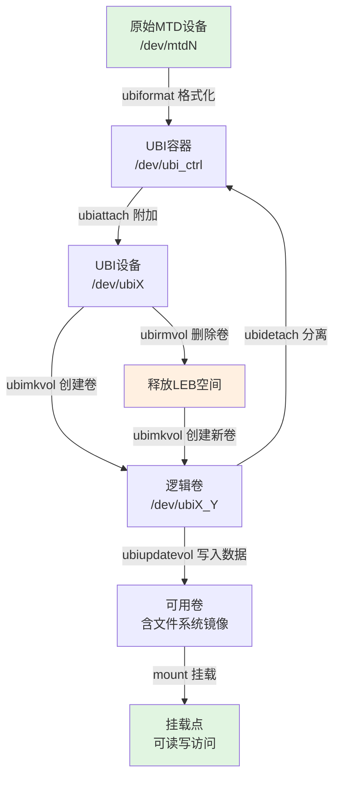
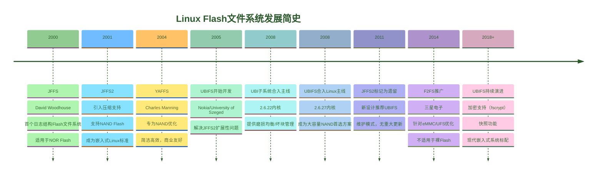

## 12.4.3 UBI工具链与实战

> ubiformat就像mkfs.ext4——它是准备裸Flash的第一步。之后你ubimkvol创建卷，ubinfo查看状态，ubiupdatevol更新内容。这套工具链是裸Flash管理的必备技能。

---

### 知识点191 UBI工具链 [E][M]

UBI（Unsorted Block Images）子系统提供了一整套用户空间工具，用于管理裸Flash设备上的卷。这些工具构成了从物理MTD设备到逻辑UBI卷再到文件系统的完整桥梁。掌握这套工具链是嵌入式Linux开发者管理NAND/NOR Flash的基础能力。

**ubiformat** 是UBI工具链的起点，负责将原始MTD设备格式化为UBI容器。与直接写入UBI镜像不同，ubiformat会保留每个擦除块中的已有信息，仅在需要时进行擦除操作，因此更加安全。它还会自动跳过坏块，并在每个PEB（物理擦除块）头部写入EC（擦除计数）头。格式化前务必确认目标MTD设备号，避免误格式化系统分区。

**ubimkvol** 用于在已格式化的UBI设备上创建逻辑卷。每个卷具有独立的名称、大小和特性，类似于LVM中的逻辑卷。创建卷时需要指定`-N`卷名和`-S`大小（以逻辑擦除块或字节为单位），也可使用`--maxavsize`创建动态卷。卷创建后会自动分配卷ID，并通过`/dev/ubiX_Y`设备节点暴露。

**ubirmvol** 执行卷的删除操作。删除卷会释放其占用的所有LEB（逻辑擦除块），这些空间可被新卷复用。该操作不可逆，卷上的所有数据将立即丢失。

**ubinfo** 是状态查看工具，可列出指定UBI设备上的所有卷信息，包括卷ID、大小、名称、坏块数量、可用擦除块数等。它是调试UBI问题和确认操作结果的首选工具。

**ubiupdatevol** 用于向静态卷写入完整镜像内容。静态卷具有CRC32校验保护，适合存放内核、设备树等只读固件。该工具会自动处理数据的分块、写入和校验过程。动态卷则用于可读写文件系统（如UBIFS），无需通过ubiupdatevol写入，直接挂载格式化即可使用。理解静态卷与动态卷的区别是正确使用UBI工具链的关键。

#### ubiformat完整使用步骤

以下命令序列演示从原始MTD设备到可用UBI卷的完整流程：

```bash
# 步骤1：确认目标MTD设备信息
# cat /proc/mtd
dev:    size   erasesize  name
mtd5: 08000000 00020000 "nand-ubi"      # 128MB, 128KB擦除块

# 步骤2：格式化MTD设备为UBI（-e指定擦除块大小，/dev/mtd5为目标）
ubiformat /dev/mtd5 -e 131072 -y

# 步骤3：将UBI设备附加到系统（生成/dev/ubi0）
ubiattach /dev/ubi_ctrl -m 5 -d 0

# 步骤4：查看UBI设备状态
ubinfo -d 0

# 步骤5：创建动态大小卷（-m表示使用最大可用空间）
ubimkvol /dev/ubi0 -N rootfs -m

# 步骤6：查看刚创建的卷信息
ubinfo -d 0 -N rootfs

# 步骤7：更新卷内容（例如写入squashfs/ubifs根文件系统镜像）
ubiupdatevol /dev/ubi0_0 /path/to/rootfs.ubifs

# 步骤8：挂载使用（假设为UBIFS格式）
mount -t ubifs ubi0:rootfs /mnt/rootfs

# 补充：删除卷（清理操作）
ubirmvol /dev/ubi0 -N rootfs

# 补充：分离UBI设备
ubidetach -d 0
```

#### 生产环境注意事项

使用UBI工具链时需特别注意：第一，`ubiformat`会直接擦除目标MTD设备上的所有数据，操作前必须通过`/proc/mtd`和`mtdinfo`双重确认设备号，生产环境中建议禁用`-y`参数以强制人工确认。第二，卷大小分配应预留UBI元数据开销，通常需要额外预留4%~5%的物理空间用于坏块替换和EC头存储。第三，在启动脚本中处理UBI设备时，建议增加`ubiattach`返回码检查，避免因Flash故障导致系统启动进入不可预期状态。

#### UBI工具使用流程



#### UBI工具速查表

| 工具 | 核心功能 | 典型命令示例 | 关键参数 |
|:---|:---|:---|:---|
| `ubiformat` | 格式化MTD为UBI容器 | `ubiformat /dev/mtd5 -y` | `-e` 擦除块大小，`-y` 自动确认，`-q` 安静模式 |
| `ubiattach` | 附加MTD到UBI子系统 | `ubiattach /dev/ubi_ctrl -m 5` | `-m` MTD设备号，`-d` UBI设备号，`-p` 页大小 |
| `ubidetach` | 分离UBI设备 | `ubidetach -d 0` / `ubidetach /dev/ubi_ctrl -m 5` | `-d` UBI设备号，`-m` MTD设备号 |
| `ubimkvol` | 创建UBI逻辑卷 | `ubimkvol /dev/ubi0 -N data -m` | `-N` 卷名，`-S` 卷大小，`-m` 最大可用空间，`-t` 卷类型 |
| `ubirmvol` | 删除UBI逻辑卷 | `ubirmvol /dev/ubi0 -N data` | `-N` 卷名，`-n` 卷ID |
| `ubinfo` | 查看UBI设备/卷信息 | `ubinfo -d 0 -N data` | `-d` 设备号，`-a` 所有设备，`-N` 按名查看 |
| `ubiupdatevol` | 向静态卷写入完整镜像 | `ubiupdatevol /dev/ubi0_0 image.bin` | `-s` 指定大小，`-t` 截断模式 |
| `ubirename` | 重命名UBI卷 | `ubirename /dev/ubi0 old new` | 支持原子交换两个卷名 |
| `ubiblock` | 创建只读块设备 | `ubiblock -c /dev/ubi0_0` | `-c` 创建，`-r` 移除，用于squashfs |

---

### 知识点192 UBI与JFFS2对比 [E]

在UBIFS出现之前，JFFS2（Journalling Flash File System v2）是Linux嵌入式系统中使用最广泛的Flash文件系统。然而，随着NAND Flash容量从几十MB增长到数GB甚至更大，JFFS2的架构缺陷日益凸显，UBIFS+UBI的组合逐渐成为行业标准方案。

**可扩展性**是替代的首要原因。JFFS2在挂载时需要扫描整个分区，读取每个擦除块的节点头部以重建文件系统结构，挂载时间与分区容量成线性关系——在1GB NAND上可能需要数十秒。UBIFS将索引信息存储在Flash上，挂载时仅需读取少量元数据，实现近常数时间的快速挂载。此外，JFFS2的内存消耗随文件系统大小增长，大分区可能耗尽嵌入式设备的有限内存；UBIFS采用树状索引结构（B+树），内存使用更加高效。

**写入性能**方面，JFFS2使用全局垃圾回收机制，在写入时可能触发全分区范围的擦除和整理操作，导致不可预测的延迟抖动。UBIFS则采用局部化的垃圾回收策略，性能更加稳定，支持写缓冲和日志结构，随机写入性能显著优于JFFS2。

**压缩支持**上，虽然JFFS2支持zlib压缩，但实现较为基础。UBIFS支持lzo和zlib两种压缩算法，且压缩单位更小（以数据块为单位），压缩效率和灵活性更好。更重要的是，UBIFS可以通过挂载选项灵活启用/禁用压缩。

**UBI层的独特价值**在于提供了坏块管理、磨损均衡和卷管理功能。JFFS2直接操作MTD设备，自行处理坏块和磨损均衡，逻辑复杂且功能有限。UBI将这些职责从文件系统中分离出来，使得UBIFS可以专注于文件系统本身的功能，同时支持动态卷调整、原子更新、多卷管理等高级特性。

#### JFFS2 vs UBIFS 全面对比

| 对比维度 | JFFS2 | UBIFS（配合UBI） |
|:---|:---|:---|
| **挂载时间** | 与容量线性相关，大分区极慢 | 近常数时间，快速挂载 |
| **内存占用** | 随文件系统大小增长，无上限 | 可控，与索引节点数相关 |
| **写入性能** | 全局GC，延迟不可预测 | 局部GC，性能稳定 |
| **可扩展性** | 适合 < 128MB 分区 | 适合 128MB ~ 数十GB |
| **压缩支持** | zlib，基础实现 | lzo/zlib，灵活可配置 |
| **坏块管理** | 自行处理，功能有限 | UBI统一处理，更完善 |
| **磨损均衡** | 分区级均衡 | 设备级全局均衡 |
| **动态卷调整** | 不支持 | 支持在线调整卷大小 |
| **掉电安全** | 日志机制保护 | 双区域日志+写原子性 |
| **NOR Flash** | 原生支持良好 | 通过UBI支持 |
| **NAND Flash** | 支持但不完善 | 专为NAND优化 |
| **内核支持** | 2.4+，已成熟 | 2.6.27+，当前主流 |

#### Flash文件系统演化时间线



从演化历程来看，Flash文件系统的发展呈现出清晰的代际更替规律：JFFS系列开创了日志结构文件系统的先河，JFFS2凭借其通用性统治了嵌入式领域近十年，但随着存储容量的爆发式增长，其架构瓶颈迫使社区重新设计——UBI层承担了Flash设备管理的底层职责，UBIFS则专注于提供高性能、可扩展的文件系统功能。对于现代嵌入式Linux开发，选择**UBIFS + UBI**已成为处理大容量NAND Flash的标准实践，而JFFS2仅在对启动时间无严格要求的小容量NOR/NAND场景中保留使用价值。
