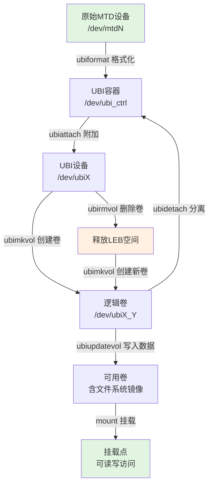
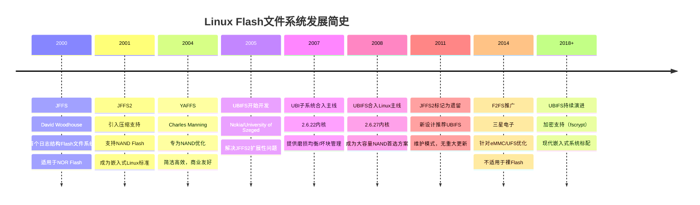

# 12.4.3 UBI工具链与实战

> 所属章节：第12章 文件系统 > 12.4 MTD/UBI
>
> 难度：[E→M] | 预计阅读时间：15分钟

## <span class="blue"> 本节导读

ubiformat 在 UBI 世界里的地位相当于 mkfs.ext4——它是准备裸 Flash 的第一步。之后用 ubimkvol 创建卷、ubinfo 查看状态、ubiupdatevol 更新内容。这套工具链是裸 Flash 管理的必备技能。<br>
本节覆盖：

- UBI 工具链九个工具的分工与典型命令
- 从原始 MTD 设备到可用 UBIFS 卷的完整操作序列
- 生产环境的注意事项（防误格式化、空间预留、启动健壮性）
- UBIFS 与 JFFS2 的全面对比及 Flash 文件系统演化脉络

---

## <span class="blue"> UBI工具链 [E→M]

UBI（Unsorted Block Images）子系统提供了一整套用户空间工具，用于管理裸 Flash 设备上的卷。这些工具构成了从物理 MTD 设备到逻辑 UBI 卷再到文件系统的完整桥梁。掌握这套工具链是嵌入式 Linux 开发者管理 NAND/NOR Flash 的基础能力。

**ubiformat** 是 UBI 工具链的起点，负责将原始 MTD 设备格式化为 UBI 容器。与直接写入 UBI 镜像不同，ubiformat 会保留每个擦除块中的已有信息，仅在需要时进行擦除操作，因此更加安全。它还会自动跳过坏块，并在每个 PEB（物理擦除块）头部写入 EC（擦除计数）头。格式化前务必确认目标 MTD 设备号，避免误格式化系统分区。

**ubimkvol** 用于在已格式化的 UBI 设备上创建逻辑卷。每个卷具有独立的名称、大小和特性，类似于 LVM 中的逻辑卷。创建卷时需要指定 `-N` 卷名和 `-S` 大小，也可使用 `-m` 使用最大可用空间。卷创建后会自动分配卷 ID，并通过 `/dev/ubiX_Y` 设备节点暴露。

**ubirmvol** 执行卷的删除操作。删除卷会释放其占用的所有 LEB（逻辑擦除块），这些空间可被新卷复用。该操作不可逆，卷上的所有数据将立即丢失。

**ubinfo** 是状态查看工具，可列出指定 UBI 设备上的所有卷信息，包括卷 ID、大小、名称、坏块数量、可用擦除块数等。它是调试 UBI 问题和确认操作结果的首选工具。

**ubiupdatevol** 用于向卷写入完整镜像内容（如内核、设备树、SquashFS 镜像）。静态卷具有 CRC32 校验保护，适合存放只读固件。动态卷则用于可读写文件系统（如 UBIFS），无需通过 ubiupdatevol 写入，直接挂载格式化即可使用。理解静态卷与动态卷的区别是正确使用 UBI 工具链的关键。

### ubiformat 完整使用步骤

以下命令序列演示从原始 MTD 设备到可用 UBI 卷的完整流程：

```bash
# 步骤1：确认目标MTD设备信息
cat /proc/mtd
dev:    size   erasesize  name
mtd5: 08000000 00020000 "nand-ubi"      # 128MB, 128KB擦除块

# 步骤2：格式化MTD设备为UBI（-e指定擦除块大小，/dev/mtd5为目标）
ubiformat /dev/mtd5 -e 131072 -y

# 步骤3：将UBI设备附加到系统（生成/dev/ubi0）
ubiattach /dev/ubi_ctrl -m 5 -d 0

# 步骤4：查看UBI设备状态
ubinfo -d 0

# 步骤5：创建动态大小卷（-m表示使用最大可用空间）
ubimkvol /dev/ubi0 -N rootfs -m

# 步骤6：查看刚创建的卷信息
ubinfo -d 0 -N rootfs

# 步骤7：更新卷内容（例如写入ubifs根文件系统镜像）
ubiupdatevol /dev/ubi0_0 /path/to/rootfs.ubifs

# 步骤8：挂载使用（假设为UBIFS格式）
mount -t ubifs ubi0:rootfs /mnt/rootfs

# 补充：删除卷（清理操作）
ubirmvol /dev/ubi0 -N rootfs

# 补充：分离UBI设备
ubidetach -d 0
```

### 生产环境注意事项

使用 UBI 工具链时需特别注意：第一，`ubiformat` 会直接擦除目标 MTD 设备上的所有数据，操作前必须通过 `/proc/mtd` 和 `mtdinfo` 双重确认设备号，生产环境中建议禁用 `-y` 参数以强制人工确认。第二，卷大小分配应预留 UBI 元数据开销，通常需要额外预留 4%~5% 的物理空间用于坏块替换（默认每 1024 个 PEB 预留 20 个，见 12.4.2）和 EC/VID 头存储。第三，在启动脚本中处理 UBI 设备时，建议增加 `ubiattach` 返回码检查，避免因 Flash 故障导致系统启动进入不可预期状态。

### UBI 工具使用流程



### UBI 工具速查表

| 工具 | 核心功能 | 典型命令示例 | 关键参数 |
|:---|:---|:---|:---|
| `ubiformat` | 格式化 MTD 为 UBI 容器 | `ubiformat /dev/mtd5 -y` | `-e` 擦除块大小，`-y` 自动确认，`-q` 安静模式 |
| `ubiattach` | 附加 MTD 到 UBI 子系统 | `ubiattach /dev/ubi_ctrl -m 5` | `-m` MTD 设备号，`-d` UBI 设备号，`-p` 页大小 |
| `ubidetach` | 分离 UBI 设备 | `ubidetach -d 0` / `ubidetach /dev/ubi_ctrl -m 5` | `-d` UBI 设备号，`-m` MTD 设备号 |
| `ubimkvol` | 创建 UBI 逻辑卷 | `ubimkvol /dev/ubi0 -N data -m` | `-N` 卷名，`-S` 卷大小，`-m` 最大可用空间，`-t` 卷类型 |
| `ubirmvol` | 删除 UBI 逻辑卷 | `ubirmvol /dev/ubi0 -N data` | `-N` 卷名，`-n` 卷 ID |
| `ubinfo` | 查看 UBI 设备/卷信息 | `ubinfo -d 0 -N data` | `-d` 设备号，`-a` 所有设备，`-N` 按名查看 |
| `ubiupdatevol` | 向卷写入完整镜像 | `ubiupdatevol /dev/ubi0_0 image.bin` | `-s` 指定大小，`-t` 截断模式 |
| `ubirename` | 重命名 UBI 卷 | `ubirename /dev/ubi0 old new` | 支持原子交换两个卷名 |
| `ubiblock` | 创建只读块设备 | `ubiblock -c /dev/ubi0_0` | `-c` 创建，`-r` 移除，用于 squashfs |

---

## <span class="blue"> UBIFS 与 JFFS2 对比 [E]

在 UBIFS 出现之前，JFFS2（Journalling Flash File System v2）是 Linux 嵌入式系统中使用最广泛的 Flash 文件系统。然而，随着 NAND Flash 容量从几十 MB 增长到数 GB 甚至更大，JFFS2 的架构缺陷日益凸显，UBIFS+UBI 的组合逐渐成为行业标准方案。

**可扩展性**是替代的首要原因。JFFS2 在挂载时需要扫描整个分区，读取每个擦除块的节点头部以重建文件系统结构，挂载时间与分区容量成线性关系——在 1GB NAND 上可能需要数十秒。UBIFS 将索引信息存储在 Flash 上，挂载时仅需读取少量元数据，实现近常数时间的快速挂载。此外，JFFS2 的内存消耗随文件系统大小增长，大分区可能耗尽嵌入式设备的有限内存；UBIFS 采用驻留 Flash 的 B 树索引（游荡树，见 12.3.3），内存中仅以 TNC 缓存热点索引节点，内存使用更加高效。

**写入性能**方面，JFFS2 使用全局垃圾回收机制，在写入时可能触发全分区范围的擦除和整理操作，导致不可预测的延迟抖动。UBIFS 则采用局部化的垃圾回收策略，性能更加稳定，支持写缓冲和日志结构，随机写入性能显著优于 JFFS2。

**压缩支持**上，JFFS2 仅支持 zlib 压缩，实现较为基础。UBIFS 支持 LZO（默认）、ZSTD 等多种算法，压缩单位更小，压缩效率和灵活性更好，且可通过挂载选项灵活启用/禁用压缩。

**UBI 层的独特价值**在于提供了坏块管理、磨损均衡和卷管理功能。JFFS2 直接操作 MTD 设备，自行处理坏块和磨损均衡，逻辑复杂且功能有限。UBI 将这些职责从文件系统中分离出来，使得 UBIFS 可以专注于文件系统本身的功能，同时支持动态卷调整、原子更新、多卷管理等高级特性。

### JFFS2 vs UBIFS 全面对比

| 对比维度 | JFFS2 | UBIFS（配合 UBI） |
|:---|:---|:---|
| **挂载时间** | 与容量线性相关，大分区极慢 | 近常数时间，快速挂载 |
| **内存占用** | 随文件系统大小增长，无上限 | 可控，与缓存的索引节点数相关 |
| **写入性能** | 全局 GC，延迟不可预测 | 局部 GC，性能稳定 |
| **可扩展性** | 适合 < 128MB 分区 | 适合 128MB ~ 数十 GB |
| **压缩支持** | zlib，基础实现 | LZO（默认）/ZSTD 等，灵活可配置 |
| **坏块管理** | 自行处理，功能有限 | UBI 统一处理，更完善 |
| **磨损均衡** | 分区级均衡 | 设备级全局均衡 |
| **动态卷调整** | 不支持 | 支持在线调整卷大小 |
| **掉电安全** | 日志机制保护 | COW + 日志提交 + LEB 原子更新 |
| **NOR Flash** | 原生支持良好 | 通过 UBI 支持 |
| **NAND Flash** | 支持但不完善 | 专为 NAND 优化 |
| **内核支持** | 2.4+，已成熟 | 2.6.27+，当前主流 |

### Flash 文件系统演化时间线



从演化历程来看，Flash 文件系统的发展呈现出清晰的代际更替规律：JFFS 系列开创了日志结构文件系统的先河，JFFS2 凭借其通用性统治了嵌入式领域近十年，但随着存储容量的爆发式增长，其架构瓶颈迫使社区重新设计——UBI 层承担了 Flash 设备管理的底层职责，UBIFS 则专注于提供高性能、可扩展的文件系统功能。对于现代嵌入式 Linux 开发，选择 **UBIFS + UBI** 已成为处理大容量 NAND Flash 的标准实践，而 JFFS2 仅在对启动时间无严格要求的小容量 NOR/NAND 场景中保留使用价值。

---

## <span class="blue"> 本节总结

| 维度 | 要点 |
|------|------|
| **工具链主线** | ubiformat（格式化）→ ubiattach（附加）→ ubimkvol（建卷）→ ubiupdatevol（烧镜像）→ mount |
| **静态卷 vs 动态卷** | 静态卷有 CRC32 保护、放只读固件、用 ubiupdatevol 写入；动态卷给 UBIFS 用、直接挂载格式化 |
| **生产注意** | 格式化前双重确认设备号、预留 4%~5% 元数据开销、ubiattach 检查返回码 |
| **JFFS2 淘汰原因** | 挂载时间随容量线性增长、内存占用无上限、全局 GC 延迟不可预测 |
| **核心口诀** | 格式化附加再建卷，静态固件动态 FS；JFFS2 留给老设备，新项目上 UBIFS |

---

## <span class="blue"> 下一步

12.4 解决了"数据怎么写进裸 Flash"。12.5 回到全章的暗线——掉电安全：断电发生在数据旅程的哪一环，应用层、文件系统层、块层、硬件层各自能出什么招。

> **12.5.1 掉电保护四层设计**

---

## <span class="blue"> 配套资源

| 资源类型 | 内容 |
|----------|------|
| **工具命令** | ubiformat / ubiattach / ubidetach / ubimkvol / ubirmvol / ubinfo / ubiupdatevol / ubirename / ubiblock（速查表见正文） |
| **内核配置** | `CONFIG_MTD_UBI`、`CONFIG_MTD_UBI_WL_THRESHOLD`（磨损均衡阈值）、`CONFIG_MTD_UBI_BEB_LIMIT`（坏块预留池）、`CONFIG_UBIFS_FS` |
| **关联小节** | 12.4.2 UBI 机制原理；12.3.3 UBIFS 的压缩与 COW；12.3.4 overlayfs 与只读卷组合 |
