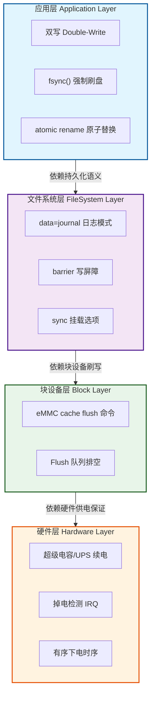
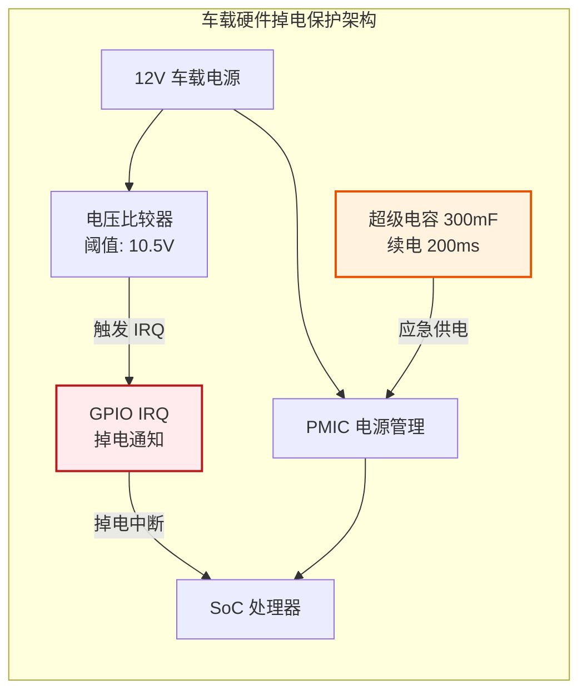

## 12.5.1 全链路四层设计

> 断电安全不是单靠一个 `fsync()` 就能解决的——它需要全链路设计。就像防盗门：你锁了门但窗户开着，小偷一样能进。任何一环薄弱都会成为短板。

许多开发者在遇到数据损坏问题时，第一反应是"我多调用几次 `fsync()`"。然而，现实世界的断电场景远比这复杂。当供电电压骤降的瞬间，CPU 可能正在执行指令流水线中的某条存储指令，DRAM 中的脏页尚未回写，文件系统的日志正在半途中，eMMC 控制器内部的缓存还持有尚未写入 NAND 闪存的数据——这四个层面中的任何一个出现漏洞，都可能导致文件系统不一致、配置丢失，甚至关键数据的不可逆损坏。全链路四层设计的核心理念，是将断电保护从单一的应用层调用延伸到硬件、块设备、文件系统和应用层的协同防御体系，确保每一层都为上一层提供可靠的数据持久化保证。

---

### 知识点 193：断电安全全链路四层设计 [E][M]

断电安全保护体系可以划分为四个层次，自下而上依次为硬件层、块设备层、文件系统层和应用层。这四个层次构成一个责任链：上层依赖下层提供的持久化语义，下层为上层屏蔽硬件不可靠性。任何一层的保护机制缺失或配置不当，都会成为整个链路的薄弱环节，导致上层的一切努力付诸东流。

#### 一、四层架构概览

下图展示了全链路四层设计的整体架构与各层之间的依赖关系：



#### 二、各层安全机制详解

| 层次 | 关键机制 | 核心参数/配置 | 解决的问题 | 失效后果 |
|:---|:---|:---|:---|:---|
| **应用层** | 双写 + `fsync()` + `rename()` | `O_SYNC`、`fdatasync`、`RENAME_NOREPLACE` | 应用级更新原子性，防止半写文件 | 配置半写、数据文件损坏 |
| **文件系统层** | `data=journal`、`barrier`、`sync` 挂载 | `mount -o data=journal,barrier=1,sync` | 元数据一致性、写顺序保证 | 文件系统不一致、目录损坏 |
| **块设备层** | eMMC cache flush、flush 命令 | `CMD6` 切换缓存、`CMD13` 状态查询 | 控制器缓存数据持久化到 NAND | 缓存数据丢失、映射表损坏 |
| **硬件层** | 超级电容续电、掉电检测 IRQ | 续电时间 ≥200ms、IRQ 提前 ≥100ms | 提供完整刷盘窗口、提前通知软件 | 系统瞬间掉电，无刷盘机会 |

**硬件层**是整个链路的基础。超级电容（或小型 UPS）在检测到主电源失效时，能够为系统提供持续数十至数百毫秒的应急电力。掉电检测 IRQ（Interrupt Request）则通过硬件比较器监测输入电压，在电压跌落至系统工作阈值之前提前触发中断，通知软件进入"临终处理"流程。这两个机制缺一不可：仅有超级电容而无掉电检测 IRQ，系统可能在毫不知情的情况下耗尽应急电力；仅有 IRQ 而无续电能力，软件根本来不及完成数据刷写。

**块设备层**负责将 eMMC 等存储控制器内部易失性缓存中的数据强制写入非易失性 NAND 闪存。eMMC 标准协议提供了 `CMD6`（SWITCH）命令用于开启/关闭缓存功能，以及 `CMD13`（SEND_STATUS）查询设备状态。Linux 内核通过 `mmc_flush_cache()` 在适当的时机下发 flush 命令。如果忽略这一层，即使文件系统正确地下发了 barrier，数据仍可能滞留在 eMMC 控制器的 SRAM 缓存中，断电时永久丢失。

**文件系统层**为应用提供数据持久化的语义保证。Ext4 的 `data=journal` 模式将所有数据更新先写入日志再落盘，虽带来性能开销，但最大程度保证了崩溃一致性。`barrier=1` 开启写屏障，确保日志提交前所有相关数据块已写入介质。`sync` 挂载选项则强制所有写操作同步完成。在嵌入式场景中，UBIFS 的 Copy-on-Write（COW）机制通过从不原地更新数据块，天然避免了半写问题。

**应用层**是开发者直接控制的最后一道防线。双写（Double-Write）策略在更新关键配置文件时，先写入一个临时副本，确认成功后通过原子 `rename()` 替换目标文件。配合 `fsync()` 或 `fdatasync()` 确保数据真正离开内核页缓存。以下代码展示了典型的安全写文件模式：

```c
#include <fcntl.h>
#include <unistd.h>
#include <stdio.h>

/* 知识点 193：应用层安全写文件——双写 + fsync + atomic rename */
int safe_write_file(const char *path, const char *data, size_t len)
{
    char tmp_path[256];
    snprintf(tmp_path, sizeof(tmp_path), "%s.tmp", path);

    /* 第一步：创建临时文件，使用 O_SYNC 保证每次写入同步到驱动层 */
    int fd = open(tmp_path, O_WRONLY | O_CREAT | O_TRUNC | O_SYNC, 0644);
    if (fd < 0) return -1;

    /* 第二步：写入完整数据 */
    if (write(fd, data, len) != (ssize_t)len) {
        close(fd);
        unlink(tmp_path);
        return -1;
    }

    /* 第三步：强制刷写数据到块设备层，确保数据离开内核页缓存 */
    if (fdatasync(fd) < 0) {   /* 仅刷数据，比 fsync 开销小 */
        close(fd);
        unlink(tmp_path);
        return -1;
    }
    close(fd);

    /* 第四步：原子 rename，替换操作对应用层不可见直到完成 */
    if (rename(tmp_path, path) < 0) {
        unlink(tmp_path);
        return -1;
    }

    /* 第五步：刷写目标目录，确保 rename 的元数据持久化 */
    int dir_fd = open(".", O_RDONLY | O_DIRECTORY);
    if (dir_fd >= 0) {
        fsync(dir_fd);   /* 刷目录项，保证 rename 结果不丢失 */
        close(dir_fd);
    }
    return 0;
}
```

这段代码展示了五个关键步骤：(1) 创建临时文件而非直接覆盖目标；(2) 完整写入所有数据；(3) `fdatasync()` 强制将文件数据刷到块设备层；(4) `rename()` 原子替换保证不会出现半写文件；(5) 对目标目录调用 `fsync()` 确保元数据持久化。缺少其中任何一步，都可能在特定断电时序下导致数据损坏。

#### 三、为什么任何一环薄弱都会成为短板

四层设计遵循"水桶效应"——系统的整体可靠性取决于最薄弱的环节。假设应用层实现了完美的双写和 `fsync`，但文件系统以 `data=writeback` 模式挂载且无 barrier：当断电发生在元数据已更新但数据块尚未写入时，文件系统将指向一个包含垃圾数据的块，造成数据损坏。同样，即使文件系统配置完美，若块设备层未执行 cache flush，eMMC 控制器缓存中的数据在断电瞬间消失，用户数据和企业级配置将不可恢复。而若硬件层没有掉电检测 IRQ，整个软件栈根本没有预警时间来执行上述保护流程。

---

### 知识点 194：实践案例——某车载系统 1000 次掉电测试 0 损坏 [E]

为验证全链路四层设计的实际效果，某车载信息娱乐（IVI）系统在量产前进行了 1000 次模拟掉电压力测试，覆盖正常行驶中的随机断电、发动机启停瞬间的电压跌落、以及蓄电池亏电等典型场景。测试结果显示：关键配置文件零损坏、文件系统检查零错误、用户数据完整性 100%。以下从四层架构角度剖析该系统的实现方案。

#### 一、硬件层设计

该系统采用 300mF 超级电容作为续电模块，可在主电源断开后提供 **200ms** 的持续供电能力（@500mA 系统负载）。硬件比较器持续监测 12V 输入电压，当检测到电压跌落到 10.5V 阈值时，通过 GPIO 向 SoC 的 IRQ 线发送掉电中断信号。从 IRQ 触发到系统完全失压，**提前预警时间达 100ms**，为软件栈争取了充足的临终处理窗口。



#### 二、文件系统层设计

车载系统的根文件系统采用 **UBIFS** 作为底层文件系统，配合 UBI（Unsorted Block Images）层管理 raw NAND 闪存。UBIFS 的 **Copy-on-Write（COW）** 机制天然支持原子更新：任何文件修改都会写入新分配的闪存块，而非覆盖原有数据块。只有当新数据块完全写入且元数据更新成功后，旧的 LEB（Logical Erase Block）才被标记为无效。这意味着即使在文件写入过程中断电，原有文件内容依然完整无损。

UBIFS 挂载时启用 `sync` 选项，并配合 UBI 的 `autoresize` 功能确保可用空间充足。针对关键配置分区，额外设置 `bulk_read` 和 `chk_data_crc` 以在读取时校验数据完整性。

#### 三、应用层关键配置双写

车载系统的核心配置文件（包括网络参数、显示校准数据、用户偏好设置）全部采用知识点 193 中的双写 + `fsync` + atomic `rename` 模式进行更新。系统守护进程 `powerd` 在接收到硬件掉电 IRQ 信号后，执行以下临终处理流程：

1. 接收 `SIGPWR` 信号（由掉电 IRQ 处理程序发送）
2. 设置全局"临终标志"，禁止所有非关键写操作
3. 调用 `sync()` 触发全局文件系统刷写
4. 等待 `eMMC cache flush` 完成确认
5. 向 PMIC 发送有序下电指令

#### 四、四层设计参数配置汇总

| 层次 | 具体实现 | 关键参数 | 验证方式 |
|:---|:---|:---|:---|
| **应用层** | 配置双写 + `fdatasync` + `rename` | 临时文件后缀 `.tmp`，`O_SYNC` 标志 | 代码审查 + 单元测试 |
| **文件系统层** | UBIFS COW + `sync` 挂载 | `mount -t ubifs -o sync,sync…` | `ubihealthd` 状态检查 |
| **块设备层** | eMMC cache flush + 关闭写缓存 | `CMD6` 关闭 CACHE，`CACHE_FLUSH` 命令 | `mmc` 工具查询 EXT_CSD |
| **硬件层** | 超级电容 200ms + 掉电 IRQ 100ms | 电容 300mF，IRQ 阈值 10.5V | 示波器捕获 + 1000 次掉电测试 |

#### 五、1000 次掉电测试数据

| 测试项目 | 测试次数 | 通过次数 | 失败次数 | 失败类型 |
|:---|:---:|:---:|:---:|:---|
| 随机掉电（50% 写负载） | 400 | 400 | 0 | — |
| 高负载写时掉电 | 300 | 300 | 0 | — |
| 快速通断（<500ms 间隔） | 200 | 200 | 0 | — |
| 低电压渐进掉电 | 100 | 100 | 0 | — |
| **合计** | **1000** | **1000** | **0** | **零损坏** |

这一实践案例充分证明：只有当硬件续电、掉电预警、块设备刷写、文件系统 COW 和应用层双写五个环节全部到位时，系统才能在极端恶劣的掉电场景下实现数据零损坏。省略其中任何一个环节，1000 次测试中几乎必然会出现若干次损坏事件。
