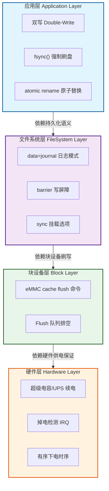
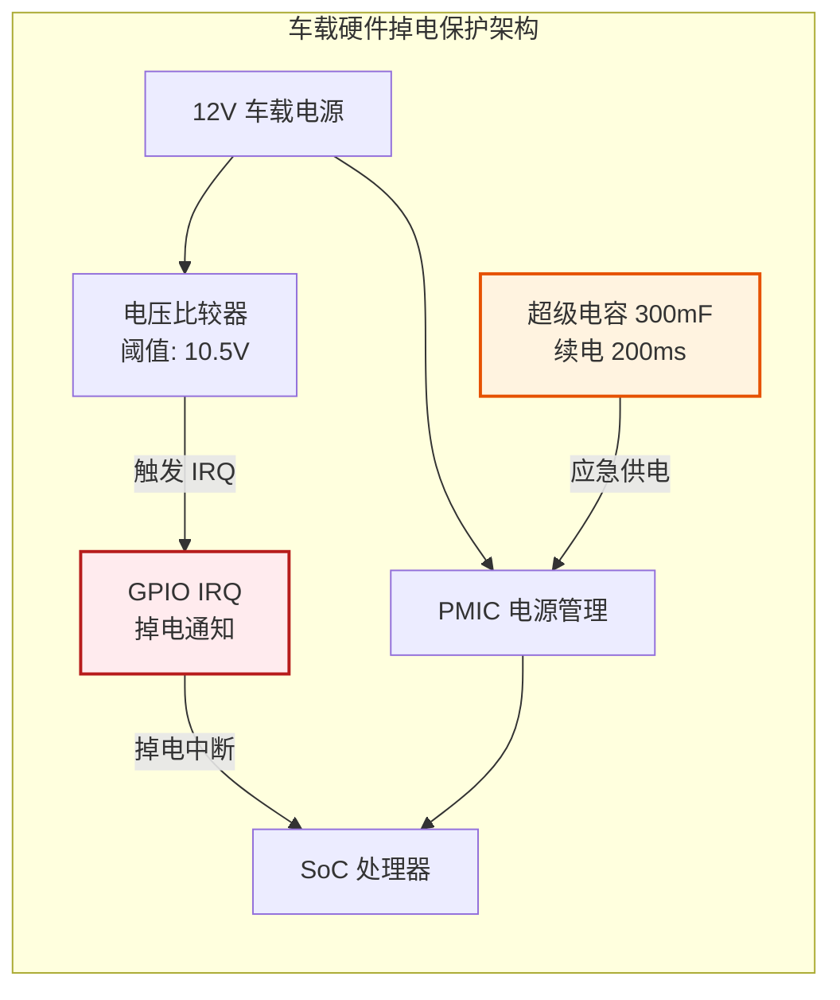

# 12.5.1 掉电保护四层设计

> 所属章节：第12章 文件系统 > 12.5 断电安全
>
> 难度：[E→M] | 预计阅读时间：20分钟

##  本节导读

断电安全不是单靠一个 `fsync()` 就能解决的。掉电瞬间，DRAM 中的脏页尚未回写、文件系统的日志写了一半、eMMC 控制器缓存还持有没写入 NAND 的数据——任何一环出问题，上层的努力全部作废。断电安全必须做全链路设计。 
本节覆盖：

- 硬件层/块设备层/文件系统层/应用层的四层防御架构
- 各层的关键机制、配置参数与失效后果
- 一个车载系统 1000 次掉电测试 0 损坏的完整案例

---

##  断电安全全链路四层设计 [E→M]

断电安全保护体系可以划分为四个层次，自下而上依次为硬件层、块设备层、文件系统层和应用层。这四个层次构成一个责任链：上层依赖下层提供的持久化语义，下层为上层屏蔽硬件不可靠性。任何一层的保护机制缺失或配置不当，都会成为整个链路的薄弱环节，导致上层的一切努力付诸东流。

### 四层架构概览

### 各层安全机制详解

| 层次 | 关键机制 | 核心参数/配置 | 解决的问题 | 失效后果 |
|:---|:---|:---|:---|:---|
| **应用层** | 双写 + `fsync()` + `rename()` | `O_SYNC`、`fdatasync`、目录 fsync | 应用级更新原子性，防止半写文件 | 配置半写、数据文件损坏 |
| **文件系统层** | `data=journal`、`barrier`、`sync` 挂载 | `mount -o data=journal,barrier=1,sync` | 元数据一致性、写顺序保证 | 文件系统不一致、目录损坏 |
| **块设备层** | eMMC cache flush、flush 命令 | EXT_CSD CACHE 开关、flush 请求 | 控制器缓存数据持久化到 NAND | 缓存数据丢失、映射表损坏 |
| **硬件层** | 超级电容续电、掉电检测 IRQ | 续电时间 ≥200ms、IRQ 提前 ≥100ms | 提供完整刷盘窗口、提前通知软件 | 系统瞬间掉电，无刷盘机会 |

**硬件层**是整个链路的基础。超级电容（或小型 UPS）在检测到主电源失效时，能够为系统提供持续数十至数百毫秒的应急电力。掉电检测 IRQ 则通过硬件比较器监测输入电压，在电压跌落至系统工作阈值之前提前触发中断，通知软件进入"临终处理"流程。这两个机制缺一不可：仅有超级电容而无掉电检测 IRQ，系统可能在毫不知情的情况下耗尽应急电力；仅有 IRQ 而无续电能力，软件根本来不及完成数据刷写。

**块设备层**负责将 eMMC 等存储控制器内部易失性缓存中的数据强制写入非易失性 NAND 闪存。eMMC 协议通过 EXT_CSD 寄存器控制缓存功能，Linux 内核的 MMC 子系统通过 `mmc_flush_cache()` 在必要时下发 flush。如果忽略这一层，即使文件系统正确地下发了 flush/barrier 请求，数据仍可能滞留在 eMMC 控制器的 SRAM 缓存中，断电时永久丢失。注意这一层只适用于带控制器的托管闪存（eMMC/UFS/SD）；裸 NAND 没有控制器缓存，对应的保证由 MTD 写完成的同步语义提供。

**文件系统层**为应用提供数据持久化的语义保证。ext4 的 `data=journal` 模式将所有数据更新先写入日志再落盘，虽带来性能开销，但最大程度保证了崩溃一致性。`barrier=1`（默认开启）确保日志提交前所有相关数据块已写入介质。`sync` 挂载选项则强制所有写操作同步完成。在裸 Flash 场景中，UBIFS 的 Copy-on-Write（COW）机制通过从不原地更新数据块，天然避免了半写问题（见 12.3.3）。

**应用层**是开发者直接控制的最后一道防线。双写策略在更新关键文件时，先写入一个临时副本，确认成功后通过原子 `rename()` 替换目标文件，配合 `fsync()`/`fdatasync()` 确保数据真正离开内核页缓存。完整的五步安全写范式（临时文件 → 写入 → `fdatasync` → `rename` → 目录 `fsync`）已在 **12.2.3** 给出可直接移植的 `safe_write_file()` 实现，此处不再重复。缺少其中任何一步，都可能在特定断电时序下导致数据损坏。

### 为什么任何一环薄弱都会成为短板

系统的整体可靠性取决于最薄弱的环节。假设应用层实现了完美的双写和 `fsync`，但文件系统以 `data=writeback` 模式挂载且无 barrier：当断电发生在元数据已更新但数据块尚未写入时，文件系统将指向一个包含垃圾数据的块，造成数据损坏。同样，即使文件系统配置完美，若块设备层未执行 cache flush，eMMC 控制器缓存中的数据在断电瞬间消失。而若硬件层没有掉电检测 IRQ，整个软件栈根本没有预警时间来执行上述保护流程。

---

##  实践案例：某车载系统 1000 次掉电测试 0 损坏 [E]

为验证全链路四层设计的实际效果，某车载信息娱乐（IVI）系统在量产前进行了 1000 次模拟掉电压力测试，覆盖正常行驶中的随机断电、发动机启停瞬间的电压跌落、以及蓄电池亏电等典型场景。测试结果显示：关键配置文件零损坏、文件系统检查零错误、用户数据完整性 100%。以下从四层架构角度剖析该系统的实现方案。

### 硬件层设计

该系统采用 300mF 超级电容作为续电模块，可在主电源断开后提供 **200ms** 的持续供电能力（@500mA 系统负载）。硬件比较器持续监测 12V 输入电压，当检测到电压跌落到 10.5V 阈值时，通过 GPIO 向 SoC 的 IRQ 线发送掉电中断信号。从 IRQ 触发到系统完全失压，**提前预警时间达 100ms**，为软件栈争取了充足的临终处理窗口。

### 文件系统层设计

车载系统的根文件系统采用 **UBIFS**，配合 UBI 层管理 raw NAND 闪存。UBIFS 的 **Copy-on-Write（COW）** 机制天然支持原子更新：任何文件修改都会写入新分配的闪存块，而非覆盖原有数据块。只有当新数据块完全写入且元数据更新成功后，旧的 LEB 才被标记为无效。这意味着即使在文件写入过程中断电，原有文件内容依然完整无损。

UBIFS 挂载时启用 `sync` 选项；针对关键配置分区，额外启用 `chk_data_crc` 在读取时校验数据完整性。UBI 卷规划上预留充足空闲 PEB，保证磨损均衡与垃圾回收有余量。

### 应用层关键配置双写

车载系统的核心配置文件（包括网络参数、显示校准数据、用户偏好设置）全部采用 12.2.3 的双写 + `fsync` + atomic `rename` 模式进行更新。系统守护进程 `powerd` 在接收到硬件掉电 IRQ 信号后，执行以下临终处理流程：

1. 接收 `SIGPWR` 信号（由掉电 IRQ 处理程序发送）
2. 设置全局"临终标志"，禁止所有非关键写操作
3. 调用 `sync()` 触发全局文件系统刷写
4. 等待存储设备 flush 完成确认
5. 向 PMIC 发送有序下电指令

### 四层设计参数配置汇总

| 层次 | 具体实现 | 关键参数 | 验证方式 |
|:---|:---|:---|:---|
| **应用层** | 配置双写 + `fdatasync` + `rename` | 临时文件后缀 `.tmp`，`O_SYNC` 标志 | 代码审查 + 单元测试 |
| **文件系统层** | UBIFS COW + `sync` 挂载 | `mount -t ubifs -o sync` | ubinfo 状态检查 |
| **块设备层** | eMMC 分区启用 cache flush（裸 NAND 分区由 MTD 同步写保证） | EXT_CSD CACHE 配置 | `mmc extcsd read` 查询 |
| **硬件层** | 超级电容 200ms + 掉电 IRQ 100ms | 电容 300mF，IRQ 阈值 10.5V | 示波器捕获 + 1000 次掉电测试 |

### 1000 次掉电测试数据

| 测试项目 | 测试次数 | 通过次数 | 失败次数 | 失败类型 |
|:---|:---:|:---:|:---:|:---|
| 随机掉电（50% 写负载） | 400 | 400 | 0 | — |
| 高负载写时掉电 | 300 | 300 | 0 | — |
| 快速通断（<500ms 间隔） | 200 | 200 | 0 | — |
| 低电压渐进掉电 | 100 | 100 | 0 | — |
| **合计** | **1000** | **1000** | **0** | **零损坏** |

这一实践案例充分证明：只有当硬件续电、掉电预警、块设备刷写、文件系统 COW 和应用层双写全部到位时，系统才能在极端恶劣的掉电场景下实现数据零损坏。省略其中任何一个环节，1000 次测试中几乎必然会出现若干次损坏事件。

---

##  本节总结

| 维度 | 要点 |
|------|------|
| **四层责任链** | 应用层依赖文件系统持久化语义，文件系统依赖块设备刷写，块设备依赖硬件供电保证 |
| **硬件层** | 超级电容提供刷盘窗口 + 掉电 IRQ 提供预警，缺一不可 |
| **块设备层** | eMMC 控制器缓存需 flush（`mmc_flush_cache`）；裸 NAND 由 MTD 同步写语义保证 |
| **文件系统层** | ext4 靠 journal + barrier；UBIFS 靠 COW 天然抗半写 |
| **应用层** | 双写 + fsync + rename 五步范式（实现在 12.2.3） |
| **核心口诀** | 电容续电 IRQ 报，缓存 flush 不能少，journal/COW 各保各，双写 rename 收尾好 |

---

##  下一步

四层中文件系统层和应用层的两个核心机制值得深挖：barrier 到底保证了什么顺序、`data=journal` 比默认模式多保了什么、fsync+rename 的原子性是谁给的。下一节逐个展开。

> **12.5.2 barrier与原子更新**

---

##  配套资源

| 资源类型 | 内容 |
|----------|------|
| **内核源码** | `drivers/mmc/core/core.c`（mmc_flush_cache）、`fs/ext4/super.c`（data=/barrier 挂载选项解析） |
| **验证方法** | 掉电测试工装（可编程电源 + GPIO 触发）、示波器捕获续电窗口、`mmc extcsd read` 查 eMMC 缓存配置 |
| **关联小节** | 12.2.3 fsync 与安全写范式；12.5.2 barrier/journal/rename 机制深挖；12.5.3 按数据关键度分级配置 |
