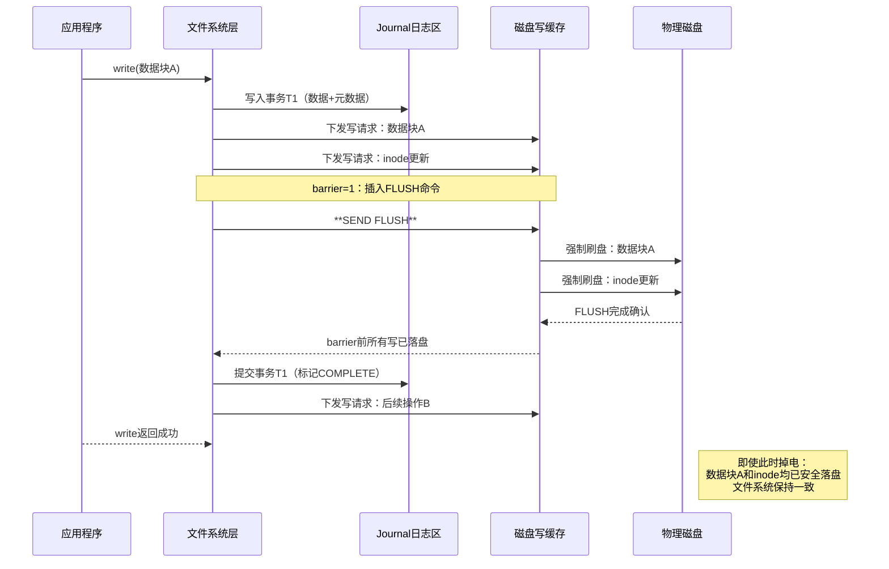
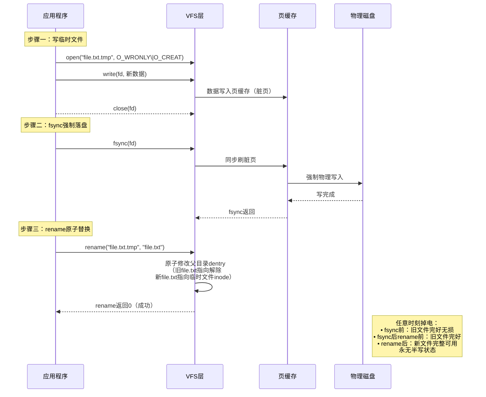

# 12.5.2 barrier与原子更新

> barrier是掉电安全的底线——禁用barrier在追求性能时极其危险。data=journal是文件系统层的保险，fsync+rename是应用层的保险。三层保险叠加，才能在掉电时保住数据。

---

## 知识点195 [E][M] barrier选项工作原理

### 1. barrier机制的核心作用

现代文件系统采用**写缓存（Write-back Cache）**策略提升I/O性能：写操作先将数据写入内存中的页缓存（Page Cache），再由内核线程异步刷回物理存储。这种异步机制带来了严重的掉电风险——如果系统在脏页未落盘时突然断电，文件系统元数据可能处于不一致状态。

**barrier（写屏障）**是文件系统层的关键保护机制。其工作原理是：当启用barrier时，文件系统在向存储设备下发写请求序列中插入特殊的`FLUSH/FUA`命令，**强制确保barrier之前的所有写操作全部物理落盘后，才允许执行barrier之后的写操作**。这相当于在写流水线上设置了一道"安检门"，杜绝了乱序执行导致的元数据不一致问题。

### 2. 为什么禁用barrier极其危险

当使用`mount -o barrier=0`禁用barrier后，存储设备层面的写重排序（Write Reordering）将不受约束。以下场景展示其危险性：

**危险场景——元数据先于数据落盘**：
1. 应用程序写入文件数据块（Data Block），该操作进入写缓存队列尾部
2. 文件系统更新inode记录数据块位置（Metadata），因重排序被设备优先执行
3. 此时突然断电：inode已指向新数据块位置，但数据块本身尚未落盘
4. 重启后fsck检查：发现inode指向的块包含旧数据或垃圾数据，文件损坏

禁用barrier后，ext4文件系统在意外断电后出现**零长度文件、数据块归属错误、目录项指向无效inode**等问题的概率显著增加。对于数据库（MySQL、PostgreSQL）和事务型应用，这可能导致无法恢复的数据库页损坏。

### 3. data=journal vs data=ordered安全等级

ext4提供三种日志模式，`data=journal`与默认的`data=ordered`在安全性上存在关键差异：

| 对比维度 | data=ordered（默认） | data=journal |
|---------|-------------------|-------------|
| 日志范围 | 仅元数据（metadata）入journal | **数据+元数据**均入journal |
| 写入顺序 | 先刷数据，再写元数据 | 全部先写journal，再异步落盘 |
| 掉电安全 | 数据可能已更新但元数据丢失，或反之 | **始终可从事务日志恢复一致状态** |
| 性能开销 | 低（约5-10%） | 高（约20-30%，双倍写入） |
| 适用场景 | 通用桌面、开发环境 | 金融交易、关键数据库、不可丢数据场景 |

`data=journal`比`data=ordered`更安全的核心原因：**数据内容和元数据变更作为完整事务被原子性地记录到journal中**。即使掉电发生在任何时刻，重启后journal回放都能将文件系统恢复到完全一致的状态——要么变更完整生效，要么完全回滚，不存在半完成状态。而`data=ordered`仅保证数据先于元数据落盘，但两者之间仍存在时间窗口，且不具备事务的原子回滚能力。

### 4. 挂载命令与配置

```bash
# 最高安全级别：启用barrier + 全数据日志模式
mount -t ext4 -o barrier=1,data=journal /dev/sda1 /data

# 查看当前挂载参数（确认barrier状态）
mount | grep sda1
# 输出示例：/dev/sda1 on /data type ext4 (rw,barrier=1,data=journal)

# /etc/fstab 持久化配置示例
/dev/sda1  /data  ext4  defaults,barrier=1,data=journal,noatime  0  2
```

> **注意**：`barrier=1`是内核默认值（Linux 2.6.33+），除非使用`barrier=0`显式禁用，否则无需手动指定。

### 5. barrier工作原理序列图



### 6. barrier=1 vs barrier=0 综合对比

| 对比项 | barrier=1（启用） | barrier=0（禁用） |
|-------|----------------|-----------------|
| 写顺序保证 | **严格保序**，前序写必落盘 | 允许重排序，无保序承诺 |
| 掉电数据安全 | **高**：journal与主文件系统一致 | **极低**：元数据/数据不一致风险 |
| 性能表现 | 每次barrier引入FLUSH延迟（~1-5ms） | 批量合并写操作，吞吐量提升20-40% |
| fsck修复需求 | 几乎无需修复或秒级完成 | 大概率需要长时fsck，可能丢数据 |
| 适用硬件 | 所有存储设备（HDD/SSD/NVMe均支持FLUSH） | 仅限带电池备份缓存（BBU）的RAID控制器 |
| 生产环境建议 | **必须启用**，数据安全第一 | **严禁使用**，除非有独立掉电保护 |

---

## 知识点196 [E] fsync+rename原子更新原理

### 1. rename()的原子性保证

POSIX标准规定：在同一文件系统内，`rename(oldpath, newpath)`是**原子操作**——即系统调用要么完全成功（新路径生效、旧路径失效），要么完全不执行，不存在中间状态。这一语义由内核VFS层通过修改目录项（dentry）指针实现，单次操作即可完成"指针切换"，无需分步修改。

### 2. 安全写文件的经典三步法

利用rename原子性，应用程序可实现**不掉电安全的文件更新**：

**步骤一：写临时文件** → 在新文件路径（如`file.txt.tmp`）写入完整内容
**步骤二：fsync强制落盘** → 调用`fsync()`确保临时文件数据已物理写入存储介质
**步骤三：rename原子替换** → 将临时文件rename为目标文件名，完成无缝切换



### 3. 为什么比直接覆盖原文件安全

**直接覆盖写（`open(path, O_WRONLY)`直接write）的危险性**：
- 覆盖写会**原地修改**已有inode的数据块
- 若掉电发生在写入过程中，原文件部分区块是新数据、部分区块是旧数据，形成**不可恢复的中间状态**
- 更高风险：若文件需要扩容，分配新数据块的元数据已更新而内容未落盘，导致inode指向未初始化块

**fsync+rename的安全保证**：任意时刻点掉电，文件系统只可能处于两种**确定且一致**的状态：
1. rename尚未执行 → 旧文件完整保留，新数据在临时文件中（可重新尝试）
2. rename已完成 → 新文件完整可用，旧文件已被unlink

不存在"文件内容一半新一半旧"的中间态，这是事务性替换的核心优势。

### 4. 完整安全写文件函数代码

```c
#include <stdio.h>
#include <stdlib.h>
#include <string.h>
#include <fcntl.h>
#include <unistd.h>
#include <errno.h>

/**
 * safe_write_file - 原子更新文件内容（掉电安全）
 * @path:    目标文件路径
 * @data:    待写入数据
 * @len:     数据长度
 * @return:  0成功，-1失败（errno设置）
 *
 * 实现策略：临时文件 → fsync落盘 → rename原子替换
 */
int safe_write_file(const char *path, const void *data, size_t len)
{
    int fd = -1, ret = -1;
    char tmp_path[1024];
    ssize_t written;

    /* 构造临时文件路径：原路径 + ".tmp.XXXXXX" */
    snprintf(tmp_path, sizeof(tmp_path), "%s.tmp.XXXXXX", path);

    /* 步骤一：创建并写入临时文件 */
    fd = mkstemp(tmp_path);
    if (fd < 0) {
        perror("mkstemp");
        return -1;
    }

    written = write(fd, data, len);
    if (written < 0 || (size_t)written != len) {
        perror("write");
        goto cleanup;
    }

    /* 步骤二：fsync确保数据物理落盘（关键！） */
    ret = fsync(fd);
    if (ret < 0) {
        perror("fsync");
        goto cleanup;
    }

    /* 先关闭文件描述符 */
    close(fd);
    fd = -1;

    /* 步骤三：rename原子替换 */
    ret = rename(tmp_path, path);
    if (ret < 0) {
        perror("rename");
        goto cleanup;
    }

    /* 可选：fsync父目录，确保目录项变更落盘 */
    int dir_fd = open(".", O_RDONLY | O_DIRECTORY);
    if (dir_fd >= 0) {
        fsync(dir_fd);
        close(dir_fd);
    }

    return 0;

cleanup:
    if (fd >= 0) close(fd);
    unlink(tmp_path);  /* 清理临时文件 */
    return -1;
}

/* 使用示例 */
int main(void)
{
    const char *content = "重要配置数据，不可丢失！\n";
    int ret = safe_write_file("/data/config.ini",
                               content, strlen(content));
    printf("原子写入%s\n", ret == 0 ? "成功" : "失败");
    return ret;
}
```

> **关键要点**：`fsync(fd)`必须在`rename()`之前完成，否则临时文件数据未落盘时rename，掉电后新文件可能包含不完整数据。对父目录的额外`fsync`用于确保目录项变更也安全落盘，这在极端掉电场景下提供最终保障。

### 5. 直接覆盖 vs 临时文件+rename 安全性对比

| 对比维度 | 直接覆盖原文件 | 临时文件+fsync+rename |
|---------|-------------|-------------------|
| 操作原子性 | **非原子**，写入过程可被中断 | **原子替换**，rename不可中断 |
| 掉电后文件状态 | 可能一半新一半旧，不可恢复 | 要么是旧文件完整版，要么是新文件完整版 |
| 磁盘空间需求 | 原地修改，无需额外空间 | 需同时保存旧文件+临时文件（瞬时的） |
| 写操作性能 | 一次写入，无额外开销 | 两次fsync（文件+父目录），延迟增加 |
| 并发读取安全 | 写入中途读取到不完整数据 | rename瞬间切换，读取要么见旧版要么见新版 |
| 回滚能力 | 无，覆盖后旧数据永久丢失 | 有，rename前旧文件始终完好 |
| 适用场景 | 临时缓存、可重建数据 | 配置文件、数据库事务日志、关键元数据 |

---

> **总结**：barrier是内核文件系统层的第一道防线，data=journal提供全数据日志的事务保障，fsync+rename在应用层实现文件级原子更新。三者从内核到应用、从元数据到文件内容形成立体防护体系。对于不可丢失的关键数据，**务必启用barrier、慎重评估data=journal的必要性、所有文件更新均采用fsync+rename模式**。
