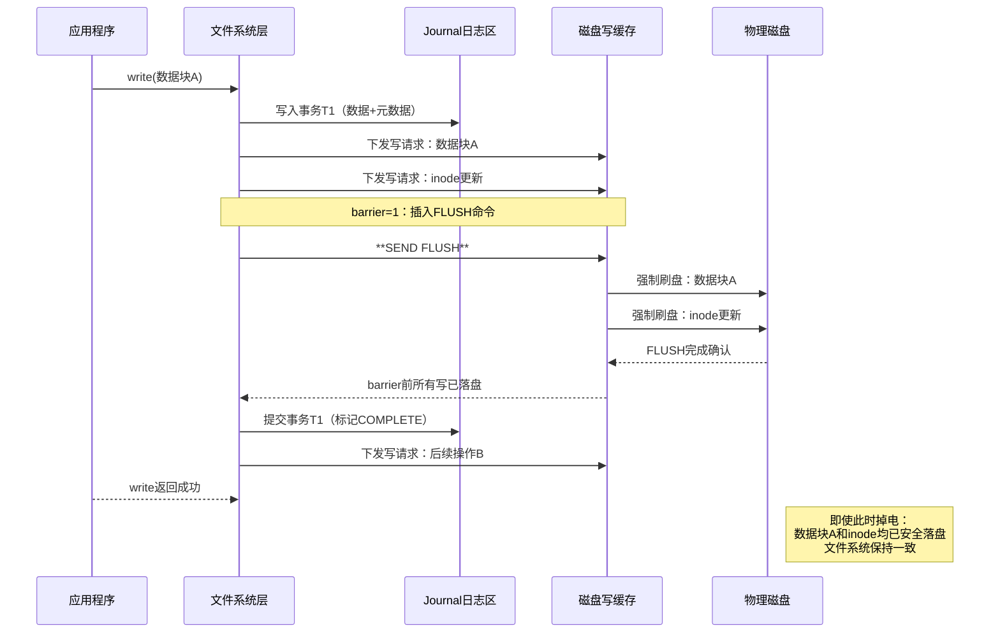
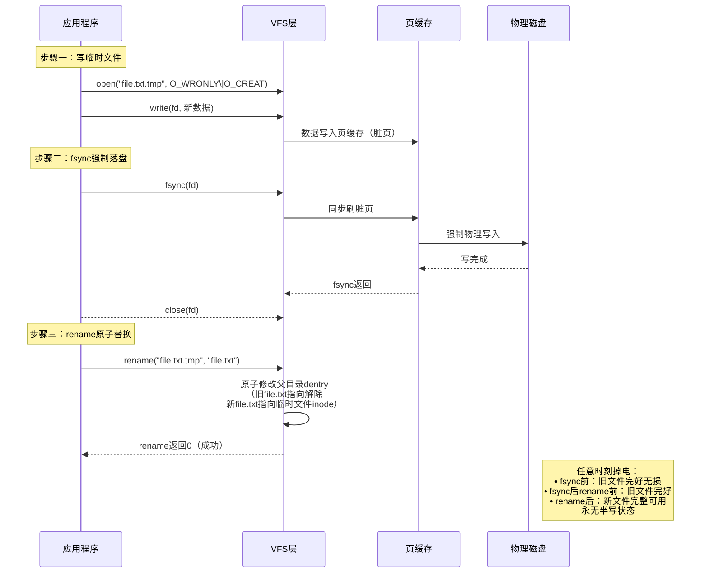

# 12.5.2 barrier与原子更新

> 所属章节：第12章 文件系统 > 12.5 断电安全
>
> 难度：[E→M] | 预计阅读时间：20分钟

## <span class="blue"> 本节导读

barrier 是掉电安全的底线——为了追求性能而禁用 barrier 极其危险。data=journal 是文件系统层的保险，fsync+rename 是应用层的保险。三层保险叠加，才能在掉电时保住数据。<br>
本节覆盖：

- barrier 的工作原理（FLUSH/FUA 强制保序）与禁用后的具体危害
- data=journal 与 data=ordered 的安全等级差异
- rename() 原子性的来源与 fsync+rename 三步法
- 直接覆盖写 vs 临时文件原子替换的安全性对比

---

## <span class="blue"> barrier选项工作原理 [E→M]

### barrier 机制的核心作用

现代文件系统采用**写缓存（Write-back Cache）**策略提升 I/O 性能：写操作先将数据写入内存中的页缓存（Page Cache），再由内核线程异步刷回物理存储。这种异步机制带来了严重的掉电风险——如果系统在脏页未落盘时突然断电，文件系统元数据可能处于不一致状态。

**barrier（写屏障）**是文件系统层的关键保护机制。其工作原理是：当启用 barrier 时，文件系统在向存储设备下发写请求序列中插入特殊的 `FLUSH/FUA` 命令，**强制确保 barrier 之前的所有写操作全部物理落盘后，才允许执行 barrier 之后的写操作**。这相当于在写流水线上设置了一道关卡，杜绝了乱序执行导致的元数据不一致问题。

### 为什么禁用 barrier 极其危险

当使用 `mount -o barrier=0` 禁用 barrier 后，存储设备层面的写重排序（Write Reordering）将不受约束。以下场景展示其危险性：

**危险场景——元数据先于数据落盘**：

1. 应用程序写入文件数据块（Data Block），该操作进入写缓存队列尾部
2. 文件系统更新 inode 记录数据块位置（Metadata），因重排序被设备优先执行
3. 此时突然断电：inode 已指向新数据块位置，但数据块本身尚未落盘
4. 重启后 fsck 检查：发现 inode 指向的块包含旧数据或垃圾数据，文件损坏

禁用 barrier 后，ext4 文件系统在意外断电后出现**零长度文件、数据块归属错误、目录项指向无效 inode** 等问题的概率显著增加。对于数据库（MySQL、PostgreSQL）和事务型应用，这可能导致无法恢复的数据库页损坏。

### data=journal 与 data=ordered 安全等级对比

ext4 提供三种日志模式（见 12.3.1），`data=journal` 与默认的 `data=ordered` 在安全性上存在关键差异：

| 对比维度 | data=ordered（默认） | data=journal |
|---------|-------------------|-------------|
| 日志范围 | 仅元数据（metadata）入 journal | **数据+元数据**均入 journal |
| 写入顺序 | 先刷数据，再写元数据 | 全部先写 journal，再异步落盘 |
| 掉电安全 | 数据可能已更新但元数据丢失，或反之 | **始终可从事务日志恢复一致状态** |
| 性能开销 | 低 | 高（双倍写入） |
| 适用场景 | 通用场景 | 关键数据库、不可丢数据场景 |

`data=journal` 比 `data=ordered` 更安全的核心原因：**数据内容和元数据变更作为完整事务被原子性地记录到 journal 中**。即使掉电发生在任何时刻，重启后 journal 回放都能将文件系统恢复到完全一致的状态——要么变更完整生效，要么完全回滚，不存在半完成状态。而 `data=ordered` 仅保证数据先于元数据落盘，但两者之间仍存在时间窗口，且不具备事务的原子回滚能力。

### 挂载命令与配置

```bash
# 最高安全级别：启用barrier + 全数据日志模式
mount -t ext4 -o barrier=1,data=journal /dev/sda1 /data

# 查看当前挂载参数（确认barrier状态）
mount | grep sda1
# 输出示例：/dev/sda1 on /data type ext4 (rw,barrier=1,data=journal)

# /etc/fstab 持久化配置示例
/dev/sda1  /data  ext4  defaults,barrier=1,data=journal,noatime  0  2
```

> 💡 `barrier=1` 是 ext4 的默认行为，除非使用 `barrier=0`（或 `nobarrier`）显式禁用，否则无需手动指定。真正需要检查的是有没有人把它关掉。

### barrier 工作原理序列图



### barrier=1 与 barrier=0 综合对比

| 对比项 | barrier=1（启用） | barrier=0（禁用） |
|-------|----------------|-----------------|
| 写顺序保证 | **严格保序**，前序写必落盘 | 允许重排序，无保序承诺 |
| 掉电数据安全 | **高**：journal 与主文件系统一致 | **极低**：元数据/数据不一致风险 |
| 性能表现 | 每次 barrier 引入 FLUSH 延迟 | 批量合并写操作，吞吐量提升 |
| fsck 修复需求 | 几乎无需修复或秒级完成 | 大概率需要长时 fsck，可能丢数据 |
| 适用硬件 | 所有存储设备（HDD/SSD/eMMC 均支持 FLUSH） | 仅限带电池备份缓存（BBU）的 RAID 控制器，或数据完全可重建的临时分区（见 12.5.3） |
| 生产环境建议 | 保持默认开启，数据安全第一 | 持久数据分区**严禁使用** |

---

## <span class="blue"> fsync+rename原子更新原理 [E]

### rename() 的原子性保证

POSIX 标准规定：在同一文件系统内，`rename(oldpath, newpath)` 是**原子操作**——即系统调用要么完全成功（新路径生效、旧路径失效），要么完全不执行，不存在中间状态。这一语义由内核 VFS 层通过修改目录项（dentry）指针实现，单次操作即可完成"指针切换"，无需分步修改。

### 安全写文件的经典三步法

利用 rename 原子性，应用程序可实现**掉电安全的文件更新**：

**步骤一：写临时文件** → 在新文件路径（如 `file.txt.tmp`）写入完整内容
**步骤二：fsync 强制落盘** → 调用 `fsync()` 确保临时文件数据已物理写入存储介质
**步骤三：rename 原子替换** → 将临时文件 rename 为目标文件名，完成无缝切换



### 为什么比直接覆盖原文件安全

**直接覆盖写（`open(path, O_WRONLY)` 直接 write）的危险性**：

- 覆盖写会**原地修改**已有 inode 的数据块
- 若掉电发生在写入过程中，原文件部分区块是新数据、部分区块是旧数据，形成**不可恢复的中间状态**
- 更高风险：若文件需要扩容，分配新数据块的元数据已更新而内容未落盘，导致 inode 指向未初始化块

**fsync+rename 的安全保证**：任意时刻点掉电，文件系统只可能处于两种**确定且一致**的状态：

1. rename 尚未执行 → 旧文件完整保留，新数据在临时文件中（可重新尝试）
2. rename 已完成 → 新文件完整可用，旧文件已被 unlink

不存在"文件内容一半新一半旧"的中间态，这是事务性替换的核心优势。

### 完整安全写文件函数代码

12.2.3 已给出基于 `O_SYNC` + `fdatasync` 的 `safe_write_file()` 范式，以下提供一个使用 `mkstemp` 的变体（随机临时文件名，避免多进程冲突）：

```c
#include <stdio.h>
#include <stdlib.h>
#include <string.h>
#include <fcntl.h>
#include <unistd.h>
#include <errno.h>

/**
 * safe_write_file - 原子更新文件内容（掉电安全）
 * @path:    目标文件路径
 * @data:    待写入数据
 * @len:     数据长度
 * @return:  0成功，-1失败（errno设置）
 *
 * 实现策略：临时文件 → fsync落盘 → rename原子替换
 */
int safe_write_file(const char *path, const void *data, size_t len)
{
    int fd = -1, ret = -1;
    char tmp_path[1024];
    ssize_t written;

    /* 构造临时文件路径：原路径 + ".tmp.XXXXXX" */
    snprintf(tmp_path, sizeof(tmp_path), "%s.tmp.XXXXXX", path);

    /* 步骤一：创建并写入临时文件 */
    fd = mkstemp(tmp_path);
    if (fd < 0) {
        perror("mkstemp");
        return -1;
    }

    written = write(fd, data, len);
    if (written < 0 || (size_t)written != len) {
        perror("write");
        goto cleanup;
    }

    /* 步骤二：fsync确保数据物理落盘（关键！） */
    ret = fsync(fd);
    if (ret < 0) {
        perror("fsync");
        goto cleanup;
    }

    /* 先关闭文件描述符 */
    close(fd);
    fd = -1;

    /* 步骤三：rename原子替换 */
    ret = rename(tmp_path, path);
    if (ret < 0) {
        perror("rename");
        goto cleanup;
    }

    /* 可选：fsync父目录，确保目录项变更落盘 */
    int dir_fd = open(".", O_RDONLY | O_DIRECTORY);
    if (dir_fd >= 0) {
        fsync(dir_fd);
        close(dir_fd);
    }

    return 0;

cleanup:
    if (fd >= 0) close(fd);
    unlink(tmp_path);  /* 清理临时文件 */
    return -1;
}
```

> ⚠️ `fsync(fd)` 必须在 `rename()` 之前完成，否则临时文件数据未落盘就 rename，掉电后新文件可能包含不完整数据。对父目录的额外 `fsync` 用于确保目录项变更也安全落盘，这在极端掉电场景下提供最终保障。

### 直接覆盖与临时文件+rename 安全性对比

| 对比维度 | 直接覆盖原文件 | 临时文件+fsync+rename |
|---------|-------------|-------------------|
| 操作原子性 | **非原子**，写入过程可被中断 | **原子替换**，rename 不可中断 |
| 掉电后文件状态 | 可能一半新一半旧，不可恢复 | 要么是旧文件完整版，要么是新文件完整版 |
| 磁盘空间需求 | 原地修改，无需额外空间 | 需同时保存旧文件+临时文件（瞬时的） |
| 写操作性能 | 一次写入，无额外开销 | 两次 fsync（文件+父目录），延迟增加 |
| 并发读取安全 | 写入中途读取到不完整数据 | rename 瞬间切换，读取要么见旧版要么见新版 |
| 回滚能力 | 无，覆盖后旧数据永久丢失 | 有，rename 前旧文件始终完好 |
| 适用场景 | 临时缓存、可重建数据 | 配置文件、数据库事务日志、关键元数据 |

---

## <span class="blue"> 本节总结

| 维度 | 要点 |
|------|------|
| **barrier** | 写请求序列中插入 FLUSH/FUA，强制前序写落盘后才执行后续写；ext4 默认开启，检查是否被 `barrier=0` 显式关闭 |
| **禁用后果** | 元数据先于数据落盘 → inode 指向垃圾块 → 零长度文件/目录损坏 |
| **data=journal** | 数据+元数据作为完整事务入 journal，掉电后要么完整生效要么完全回滚；代价是双倍写入 |
| **fsync+rename** | rename 原子性由 VFS dentry 指针切换保证；临时文件 fsync → rename → 目录 fsync 三步缺一不可 |
| **核心口诀** | barrier 保顺序，journal 保事务，rename 保原子，三层叠满才叫保险 |

---

## <span class="blue"> 下一步

机制都齐了，但全部拉满意味着写性能明显下降。工程上不可能所有数据都用最高安全级——下一节给出按数据关键度分级的选型方法，以及六个最高频的掉电陷阱排查路径。

> **12.5.3 掉电安全选型**

---

## <span class="blue"> 配套资源

| 资源类型 | 内容 |
|----------|------|
| **内核源码** | `fs/ext4/fsync.c`（ext4_sync_file）、`fs/jbd2/commit.c`（事务提交与 flush 下发）、`block/blk-flush.c`（FLUSH/FUA 实现） |
| **排错工具** | `findmnt -no OPTIONS /data` 检查 barrier/data 模式；`blktrace` 观察 FLUSH 请求的下发时机 |
| **关联小节** | 12.2.3 fsync 调用链与 O_SYNC/fdatasync 差异；12.3.1 ext4 三种日志模式数据流；12.5.3 三级安全配置 |
