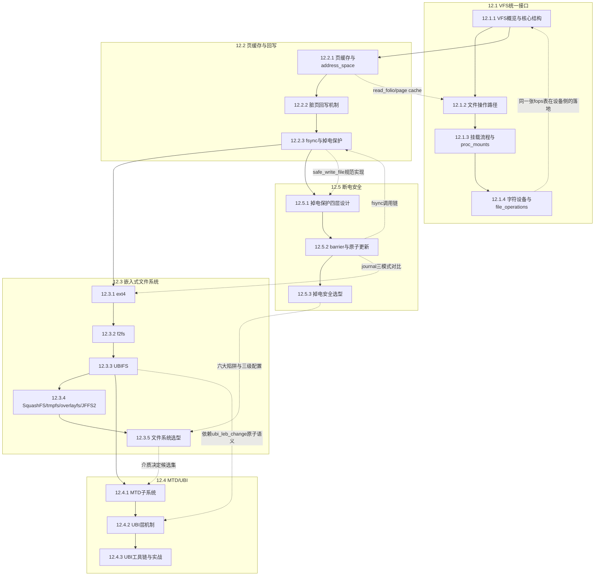

# 12.99 知识图谱与查漏补缺

> 所属章节：第12章 文件系统 > 12.99 知识图谱
>
> 难度：[I] | 预计阅读时间：25分钟

## <span class="blue"> 本节导读

这是第12章的最后一站。<br>
本节覆盖：

- 一张全章知识点关联图，标清各小节之间的依赖与交叉引用关系
- 一张按小节组织的速查表，一句话概括每个主题
- 10 道自测题（选择+简答），用于检验掌握程度并定位需要重读的小节

---

## <span class="blue"> 本章知识点关联图 [I]

下面的 mermaid 图展示第12章各小节之间的依赖与关联关系。实线箭头表示学习顺序上的递进关系（沿 write() 的数据旅程），虚线箭头表示跨小节的关联引用。



> 💡 这张图可以作为日后查阅第12章内容的目录地图。遇到实际问题时，先定位到对应小节，再回看详细内容。

---

## <span class="blue"> 核心概念速查表 [I]

按小节组织，一句话一个主题。这张表是整章内容的压缩包。

| 小节 | 主题 | 一句话总结 |
|:---:|--------|-----------|
| **12.1 VFS统一接口** |||
| 12.1.1 | 四大核心对象 | super_block 管挂载实例、inode 管元数据、dentry 管路径缓存、file 管打开实例 |
| 12.1.1 | 统一接口的实现 | 三张操作表（super/inode/file_operations）让 open/read/write 与具体文件系统解耦 |
| 12.1.2 | open/read 调用链 | do_sys_openat2 → path_openat → vfs_open；vfs_read → new_sync_read → f_op->read_iter |
| 12.1.3 | 挂载流程 | fs_context 框架：do_new_mount → vfs_get_tree → get_tree_bdev → sget → fill_super |
| 12.1.4 | 字符设备路由 | chrdev_open 按设备号查 cdev，把 file->f_op 替换成驱动的操作表；misc 是 major 10 的特化 |
| **12.2 页缓存与回写** |||
| 12.2.1 | 页缓存组织 | file → f_mapping(address_space) → i_pages(xarray) → folio；读未命中走 a_ops->read_folio |
| 12.2.2 | 脏页回写 | dirty_background_ratio 触发后台回写，dirty_ratio 阻塞新写入；flusher 线程 per-BDI |
| 12.2.3 | fsync 语义 | vfs_fsync → f_op->fsync：数据刷盘 + journal 事务等待 + 设备 flush；sync() 只发起不保证 |
| 12.2.3 | 安全写范式 | 临时文件 → fsync → rename → 目录 fsync，四步缺一不可 |
| **12.3 嵌入式文件系统** |||
| 12.3.1 | ext4 extent | 三字段描述一段连续块，1GB 文件元数据从 1MB 压到 12 字节 |
| 12.3.1 | journal 三模式 | writeback 只保元数据、ordered（默认）保顺序、journal 连数据一起进日志 |
| 12.3.2 | f2fs LFS | 所有写追加日志尾部，旧块标无效留给 GC；WAF 从 3~10 降到 1.5~3 |
| 12.3.2 | NAT 与 GC | NAT 间接映射让 node 也能追加写；GC 由 __get_victim 选段，is_alive 查 NAT 判有效性 |
| 12.3.3 | UBIFS COW | 永不覆盖已写数据；游荡树索引 + TNC 缓存；ubi_leb_change 掉电保留旧内容 |
| 12.3.4 | overlayfs | lower 只读 + upper 可写的联合视图，copy-up 写时复制，OTA 保留配置的关键拼图 |
| 12.3.5 | 选型框架 | 介质定候选集，负载定最终选型；fio 测上限，iostat 画像，blktrace 看连续性 |
| **12.4 MTD/UBI** |||
| 12.4.1 | MTD 三大怪癖 | 擦除块为单位、先擦后写（1→0 单向）、无内置坏块管理 |
| 12.4.1 | mtd_read 返回值 | 0 成功；-EUCLEAN 位翻转已纠但达阈值；-EBADMSG 纠不动 |
| 12.4.2 | PEB→LEB 映射 | eba_tbl 间接映射是磨损均衡与坏块替换的操作空间 |
| 12.4.2 | 原子 LEB 更新 | 新 PEB 写入 + sqnum/copy_flag/data_crc，掉电要么旧要么新 |
| 12.4.2 | 磨损均衡 | 动态（写入选低 EC 块）+ 静态（后台搬冷数据）；阈值默认 128 |
| 12.4.3 | UBI 工具链 | ubiformat → ubiattach → ubimkvol → ubiupdatevol → mount |
| 12.4.3 | JFFS2 淘汰原因 | 挂载时间随容量线性增长、内存占用无上限、全局 GC 延迟不可预测 |
| **12.5 断电安全** |||
| 12.5.1 | 四层防御 | 硬件（电容+IRQ）→ 块层（cache flush）→ FS（journal/COW）→ 应用（双写+rename） |
| 12.5.2 | barrier | FLUSH/FUA 强制保序：前序写全部落盘后才执行后续写；ext4 默认开启 |
| 12.5.2 | rename 原子性 | VFS dentry 指针一次切换，要么旧要么新，永无半写状态 |
| 12.5.3 | 三级安全 | journal+barrier+fsync（-15~20%）/ ordered+barrier（-5~8%）/ writeback（基准） |

---

## <span class="blue"> 自测题 [I]

### 选择题（每题 5 分，共 25 分）

**1. 用户态 `read()` 一个 ext4 文件，v6.6 内核中 `vfs_read` 之后的实际调用链是？**

A. vfs_read → __vfs_read → a_ops->readpage → 提交 BIO<br>
B. vfs_read → new_sync_read → file->f_op->read_iter → generic_file_read_iter<br>
C. vfs_read → ext4_read → submit_bio<br>
D. vfs_read → pagecache_get_page → 直接返回

??? "答案与解析"

    **答案：B**

    v6.6 中 `vfs_read` 对普通文件走 `new_sync_read`（fs/read_write.c:450），进入 f_op->read_iter（ext4 为 generic_file_read_iter 包装）。`readpage` 已在 folio 化中改名为 `read_folio`（12.2.1），`__vfs_read` 与 `pagecache_get_page` 均已移除。详见 12.1.1 和 12.2.1。

**2. 打开 `/dev/xxx` 字符设备时，是谁把 `file->f_op` 从 `def_chr_fops` 替换成驱动的操作表？**

A. glibc 的 open() 包装函数<br>
B. `chrdev_open`：按设备号在 kobj_map 中查到 cdev 后替换<br>
C. 驱动的 module_init 函数<br>
D. udev/mdev 守护进程

??? "答案与解析"

    **答案：B**

    所有字符设备最初共享 `def_chr_fops`，其 `.open` 就是 `chrdev_open`（fs/char_dev.c）。它按 inode 的设备号查找注册的 cdev，取出 `cdev->ops` 替换 `file->f_op`，再调用驱动的 open。此后该 fd 的 read/write/ioctl 直达驱动。详见 12.1.4。

**3. f2fs 的 GC 在迁移 victim 段时，如何判断一个物理块是否仍为有效数据？**

A. 只看 SIT 的 valid bitmap<br>
B. SIT valid bitmap 初筛 + `is_alive` 查 NAT 确认地址仍匹配<br>
C. 重新读取对应文件比对内容<br>
D. 查超级块中的分配位图

??? "答案与解析"

    **答案：B**

    `gc_data_segment` 先用 `check_valid_map`（SIT）跳过无效块，再用 `is_alive` 查 NAT：若 NAT 中记录的地址与当前物理地址不符，说明该块已被覆盖、是垃圾。NAT 间接映射正是 GC 能精确迁移的前提。详见 12.3.2。

**4. UBI 的 `ubi_leb_change` 如何保证掉电时 LEB 内容不出现半写状态？**

A. 双 PEB 交替写入，靠 journal 重放<br>
B. 新 PEB 完整写入（带 sqnum/copy_flag/data_crc）后才切换映射，掉电回退旧数据<br>
C. 依赖板载电池保住缓存<br>
D. 每次写后调用 fsync

??? "答案与解析"

    **答案：B**

    `ubi_eba_atomic_leb_change`（eba.c:1197）把新数据写入磨损均衡选出的新 PEB，VID 头带全局递增 sqnum 和 data_crc。掉电时：映射未切换→LEB 仍指旧数据；新 PEB 未写完→attach 时 CRC 校验失败被丢弃。要么旧要么新。详见 12.4.2。

**5. ext4 以默认的 `data=ordered` 模式挂载时发生掉电，下列哪种说法正确？**

A. 用户数据不会丢失<br>
B. 元数据提交前其引用的数据块已强制落盘，但用户数据本身不入日志<br>
C. 用户数据和元数据都写入日志<br>
D. 该模式下 barrier 默认关闭

??? "答案与解析"

    **答案：B**

    ordered 模式只把元数据入 journal，但保证"数据先于元数据落盘"。掉电后文件系统结构完整，但最近写入的数据可能丢失或表现为旧数据。数据也入日志的是 `data=journal`；barrier 默认开启。详见 12.3.1 和 12.5.2。

---

### 简答题（每题 15 分，共 75 分）

**6. `write()` 返回后，数据在到达 NAND 之前可能滞留在哪几个位置？每个位置分别用什么手段强制推进一层？**

??? "答案与解析"

    三个滞留位置，三种推进手段：

    1. **页缓存（DRAM）**：write() 只把数据拷进 folio 并标脏。推进手段：`fsync()`/`fdatasync()`（精准）、`sync()`（全局但只发起不保证完成）、或等待 dirty_ratio/dirty_expire 触发 flusher 线程回写
    2. **文件系统日志区/设备队列**：回写发起后，元数据可能还在 journal 事务中、I/O 请求还在块层队列。推进手段：fsync 内部会等待 journal 事务提交，barrier（FLUSH/FUA）保证顺序落盘
    3. **eMMC 控制器缓存（SRAM）**：数据到了控制器但还没编程进 NAND。推进手段：块层 FLUSH 请求最终转为 eMMC 的 cache flush，内核由 `mmc_flush_cache()` 下发

    所以"write 后 fsync 了还是丢数据"的排查方向通常在第三层。详见 12.2.2、12.2.3 和 12.5.1。

**7. 为什么 f2fs 的写放大比 ext4 低？请从元数据更新方式的角度解释。**

??? "答案与解析"

    ext4 的就地更新策略下，一次小文件写入要同步更新多处元数据：块组描述符、块位图（bitmap）、inode 表——这些是分布在磁盘不同位置的随机小写，每次修改都可能触发闪存"读-改-擦-写"整块周期，写放大严重。

    f2fs 把所有更新（数据块、node 块）都顺序追加到 Main Area 日志尾部，元数据（NAT/SIT 脏页）攒到 Checkpoint 时批量顺序刷入各自区域。随机写被合并为顺序写，匹配闪存页写入的最优模式；且 f2fs 主机端知道哪些块有效，GC 只迁移有效数据，不像 FTL 那样保守迁移。

    结果：ext4 的 WAF 通常 3~10，f2fs 通常 1.5~3。详见 12.3.2。

**8. UBI 的 EC（擦除计数）头存储在什么位置？它为什么需要 CRC 校验？**

??? "答案与解析"

    EC 头存储在**每个 PEB 数据区的起始位置**（64 字节，in-band），不是 OOB。同一 PEB 内，VID 头在 `vid_hdr_offset`，用户数据在 `data_offset`，三者构成 PEB 内部布局（ubi-media.h:147）。

    需要 CRC 的原因：EC 头本身也是写在 NAND 上的数据，同样会发生位翻转。attach 时 UBI 扫描全部 PEB 的 EC 头，`hdr_crc` 校验失败的头会被识别为损坏并特殊处理（视为可疑块、读 VID 头进一步判断）。没有 CRC，位翻转产生的随机 EC 值会污染磨损均衡的全局统计，甚至被误认为坏块或有效数据。详见 12.4.2。

**9. 裸 NAND 上为什么不能直接运行 ext4？如果要让 ext4 跑起来，有哪两条出路？**

??? "答案与解析"

    不能运行的原因是裸 NAND 的三大怪癖与 ext4 的假设冲突（12.4.1）：

    1. **擦除块粒度**：ext4 假设 4KB 扇区可独立覆写，NAND 必须先擦后写且擦除单位是 128KB+ 的块
    2. **单向写入**：NAND 位只能 1→0，原地改一个 bit 都不行
    3. **无坏块管理**：ext4 没有坏块表、磨损均衡和 ECC 概念，遇到坏块直接 I/O 错误

    两条出路：

    - **软件路线**：ext4 不动，改用为裸 Flash 设计的文件系统——UBIFS + UBI（大容量首选）或 JFFS2（小容量遗留）
    - **硬件路线**：在 NAND 前加一层带 FTL 的控制器（eMMC/SD/SSD 主控），把裸 NAND 包装成标准块设备，ext4 无感知运行。代价是 FTL 的磨损均衡和 GC 变成黑盒，不可控不可调

    详见 12.4.1 和 12.5.3。

**10. 你的设备在现场掉电后，配置文件变成 0 字节。已知写入代码是 `open(path, O_WRONLY|O_TRUNC) → write → close`。请分析可能的根因，并给出修复方案。**

??? "答案与解析"

    根因分析（两个叠加的问题）：

    1. **直接覆盖写**：`O_TRUNC` 打开瞬间文件就被截断为 0。掉电发生在 write 的数据还滞留页缓存时，磁盘上的文件已是"0 字节的元数据 + 没落盘的数据"，重启后就是 0 字节文件
    2. **没有 fsync**：write → close 不保证任何数据落盘，数据可能一直在页缓存里

    修复方案（12.2.3 的 safe_write_file 范式）：

    ```c
    open("config.tmp", O_WRONLY|O_CREAT) → write → fsync(fd) → close
        → rename("config.tmp", "config") → fsync(目录fd)
    ```

    这样任意时刻掉电，config 要么是旧的完整版、要么是新的完整版，永无 0 字节中间态。同时检查挂载选项：`data=writeback` + `barrier=0` 会进一步放大风险（12.5.2、12.5.3）。

---

## <span class="blue"> 与前后章的关联 [I]

文件系统位于内核多个子系统的交汇点。理解本章与其他章节的关系，能建立起更立体的知识网络。

| 方向 | 章节 | 关联说明 |
|:---:|------|---------|
| ← 前置 | 第7章 启动链 | 根文件系统的挂载（prepare_namespace）、initramfs 的 tmpfs 本质，是本章 12.1.3 挂载流程的第一次实战 |
| ← 前置 | 第9章 内存管理 | 页缓存使用 struct page 与 folio，脏页回写与内存回收（shrink_page_list）互为牵制 |
| ← 前置 | 第11章 设备模型 | 块设备与字符设备经设备模型注册，12.1.4 的 fops 路由正是 device-driver 匹配后的下一步 |
| → 后续 | 第13章 并发与同步 | dentry cache 的 RCU 保护、inode/dentry 的细粒度锁、页缓存的锁竞争，都是并发章的活教材 |
| → 后续 | 第15章 电源管理 | suspend 前必须同步脏页，Runtime PM 要协调文件系统的回写状态 |

```
第7章(启动) ──→ 根文件系统挂载 ──→ 第12章(mount 全流程)
第9章(内存) ──→ 页缓存与回收  ──→ 第12章(脏页生命周期)
第11章(设备) ──→ 设备注册 probe ──→ 第12章(fops 路由到驱动)
                          ↓
              第13章(并发) ←── d_lock/i_lock/RCU-walk
              第15章(电源) ←── suspend 前的脏页同步
```

---

## <span class="blue"> 本节总结

| 维度 | 内容 |
|------|------|
| 全章结构 | 沿 write() 数据旅程：VFS 统一接口 → 页缓存与回写 → 三种文件系统 → MTD/UBI 裸 Flash → 断电安全全链路 |
| 核心认知 | 文件系统选型 = 介质 × 负载 × 可靠性的匹配问题；断电安全 = 四层防御，只配一环等于没配 |
| 源码功底 | vfs_read→new_sync_read、read_folio、wb_workfn、f2fs_gc、ubi_eba_atomic_leb_change 等 v6.6 真实链路 |
| 与前后章关系 | 前面的启动/内存/设备模型是"输入"，后面的并发/电源管理是"消费者" |

---

## <span class="blue"> 下一步

第12章到此结束。文件系统里藏着大量并发问题——dentry cache 的 RCU 遍历、inode 锁、页缓存竞争——下一章正式解决它们。<br>
下一章进入 **第13章：并发与同步**——从竞态条件识别到 spinlock/mutex/RCU 的选型决策，这一章学到的页缓存与 dentry 机制将是最好的练习素材。

---

## <span class="blue"> 配套资源

| 资源类型 | 内容 | 用途 |
|---------|------|------|
| 速查表 | 按小节组织的一句话总结表 | 快速回顾和日常参考 |
| 自测题 | 10 道题（选择+简答）附详解 | 检验学习效果，建议闭卷完成 |
| 关联图 | mermaid 知识点依赖图 | 理解各小节之间的前置关系 |
| 前后章索引 | 与第7/9/11/13/15章的关联说明 | 建立跨章节知识网络 |
| 推荐重读 | 答错 3 题以上建议重读对应小节 | 查漏补缺的具体指引 |
