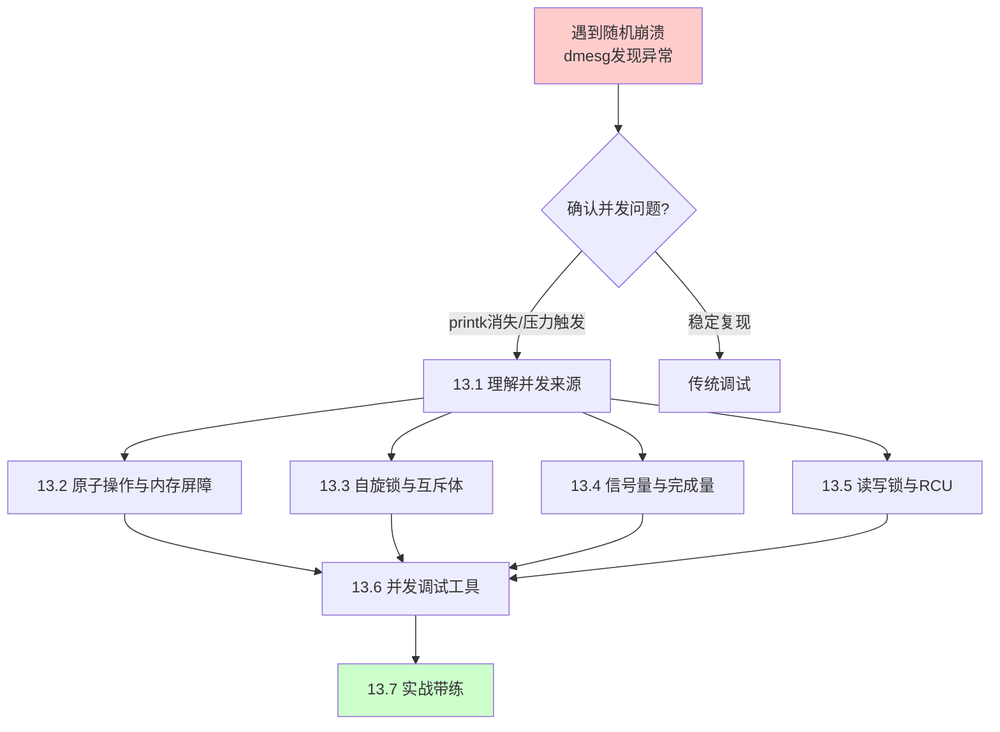

# 13.1.1 从随机崩溃案例引入

> 所属章节：第13章 并发与同步 > 13.1 理解并发来源
>
> 难度：[I] 中级 | 预计阅读时间：12分钟

## <span class="blue"> 本节导读

你见过这种情况吗？系统跑得好好的，压力测试一开始，偶尔就崩溃一下。dmesg里蹦出一行 `scheduling while atomic`，或者更吓人的 `Unable to handle kernel paging request`。你加了一堆 `printk`，结果bug不出现了——你刚松口气，去掉日志上线，问题又冒出来了。<br>

本节从一个真实的偶发崩溃案例出发，带你认识并发bug的"诡异"本质。学完后，你会明白为什么这类bug号称"程序员噩梦"，以及本章将如何帮你系统性地搞定它们。

---

## <span class="blue"> 那些让你睡不着的崩溃

[I]

先来看一个再典型不过的场景。

你的团队开发了一个工业网关设备，跑在ARM Cortex-A53上，内核版本5.15。跑功能测试一切正常，但一到72小时压力测试，平均每10个小时左右就会有一次随机崩溃。重启设备，日志继续跑，仿佛什么都没发生过。

你 `cat /var/log/kern.log`，发现崩溃时最常出现的两种信息：

```
[  123.456] BUG: scheduling while atomic: kworker/0:3/1234/0x00000002
[  456.789] Unable to handle kernel paging request at virtual address 00000000
```

第一条 `scheduling while atomic`，意思是内核代码在一个**不允许睡眠的上下文**里（比如中断处理、持有自旋锁期间）调用了可能导致睡眠的函数。第二条则更直白——空指针解引用，但奇怪的是，这个指针在99.9%的时间里都不是NULL。

你拿这个日志去请教资深工程师，对方扫了一眼，淡淡地说了四个字："竞态条件。"

啥？竞态条件？那是什么？为什么它能让代码在绝大多数时候都正常工作，偏偏就偶尔炸一下？

---

## <span class="blue"> 并发bug为什么如此难缠

[I]

说白了，并发bug跟普通bug最大的区别，在于它**依赖时序**。

单线程程序里，代码的执行顺序是确定的。同样的输入，永远走同样的路径，出问题就能稳定复现。但多核CPU上，多个线程/中断同时操作共享资源时，谁先谁后完全取决于硬件调度。十次里有一次时序不对，bug就触发了——而且你根本控制不了这个"第十次"什么时候来。

这带来了并发bug的三大特征：

| 特征 | 说明 | 给调试带来的影响 |
|:---:|:---|:---|
| **不可复现** | 十次测试可能只出现一次，没有固定规律 | 无法使用传统"复现→定位→修复"流程 |
| **时序依赖** | 结果取决于多核调度、中断到来时机、缓存状态等 | 本地调试不出问题，上线才暴露 |
| **观测即改变** | 加 `printk` 会改变执行速度，可能让bug消失 | 调试手段本身可能掩盖问题 |


> ⚠️ **陷阱**：并发bug最难debug的地方——你加 `printk` 想看清现场，结果时序被拖慢，bug反而不出现了。这种"一观察就消失"的bug，在量子物理里有个大名鼎鼎的名字叫**海森堡bug（Heisenbug）**。你在内核社区混久了就会知道，这根本不是 joke，而是每个内核开发者都哭过的血泪史。去掉 `printk` 上线，问题卷土重来，这种循环能把人逼疯。


> 💡 **提示**：遇到随机崩溃，先确认是否是并发问题。翻一翻 `dmesg` 看是否有这些关键词：`atomic`、`oops`、`BUG:`、`spinlock`。如果有，大概率是并发相关的bug。同时记录下崩溃的大致频率和系统负载情况——压力测试下更容易触发，本身就是并发bug的重要信号。

---

## <span class="blue"> 常见并发bug一览

[I]

不同的并发问题，表现出来的症状也不尽相同。这里整理一张速查表，帮你快速判断面前的bug属于哪一类：

| 症状 | 可能原因 | 紧急程度 |
|:---|:---|:---:|
| `scheduling while atomic` | 中断/原子上下文里调用了睡眠函数 | 🔴 高 |
| `Unable to handle kernel paging request` + 随机地址 | 无保护并发访问指针，导致中间状态被读取 | 🔴 高 |
| 数据"偶尔"不对（比如计数器少了几次） | 读-改-写操作非原子，发生竞态 | 🟡 中 |
| 系统偶尔"卡住"几秒后恢复 | 死锁被watchdog超时解开 | 🔴 高 |
| 模块卸载时panic | 资源还在被其他CPU使用就释放 | 🔴 高 |
| 内存泄漏（长期运行后内存耗尽） | 锁保护下的分配/释放路径不匹配 | 🟡 中 |

这张表你不需要现在记住，后面章节会逐一深入。先有个印象就行——看到症状，心里能有个大致方向。

---

## <span class="blue"> 本章路线图

[I]

好，确认了是并发问题，接下来怎么走？别慌，本章给你画好了路线图：



这个路线怎么理解？

**第一步（13.1）**：先搞明白并发到底从哪里来。用户空间多线程、内核空间多线程、中断、软中断、NMI……不同的上下文有不同的规则。

**第二步（13.2-13.5）**：根据场景选工具。原子操作、自旋锁、互斥体、信号量、RCU——没有"最好的"锁，只有"最合适的"。这些章节会告诉你什么时候用什么，以及为什么。

**第三步（13.6）**：学会用工具。`lockdep` 能自动检测死锁，`KCSAN` 能发现数据竞争，`ftrace` 能追踪时序——这些才是并发调试的真正武器，比加 `printk` 靠谱一百倍。

**第四步（13.7）**：综合实战。通过一个完整案例，把前面学的串起来，走一遍"发现→分析→修复→验证"的全流程。

跟前面章节有什么关系呢？回顾一下：第10章我们讲了中断上下文不能睡眠——这直接关联到 `scheduling while atomic` 的根本原因；第9章讲的内存分配器（`kmalloc`、`kfree`）内部也用锁保护。现在你要做的，就是学会在自己的代码里正确使用这些机制。

---

## <span class="blue"> 本节总结

| 要点 | 内容 |
|:---|:---|
| **核心问题** | 压力测试下的偶发崩溃，往往是并发bug的表现 |
| **关键症状** | `scheduling while atomic`、随机oops、数据偶尔错乱 |
| **并发bug特征** | 不可复现、时序依赖、Heisenbug（观测即改变） |
| **排查起点** | 查看 `dmesg` 中的 `atomic`/`oops`/`BUG:`/`spinlock` 关键字 |
| **本章路线** | 理解来源 → 选择同步原语 → 掌握调试工具 → 实战带练 |
| **前置知识** | 第9章（内存分配器的锁）、第10章（中断上下文不能睡眠） |

---

## <span class="blue"> 下一步

接下来进入 **13.1.2 并发来源的四分类**，系统梳理Linux内核中所有可能导致并发的场景——用户态多线程、内核线程、硬中断、软中断，各自有什么约束，哪些地方最容易踩坑。

---

## <span class="blue"> 配套资源

| 资源 | 说明 |
|:---|:---|
| 📝 代码清单 | 压力测试下触发 `scheduling while atomic` 的示例模块代码（见本章配套仓库 `ch13/examples/sched_while_atomic.c`） |
| 📊 图示 | 本节mermaid路线图——保存后可用于团队分享 |
| 🔍 速查表 | 常见并发bug症状表——建议打印贴桌边 |
| 📖 延伸阅读 | `Documentation/atomic_ops.rst`（内核原子操作文档）、`Documentation/locking/` 目录 |
