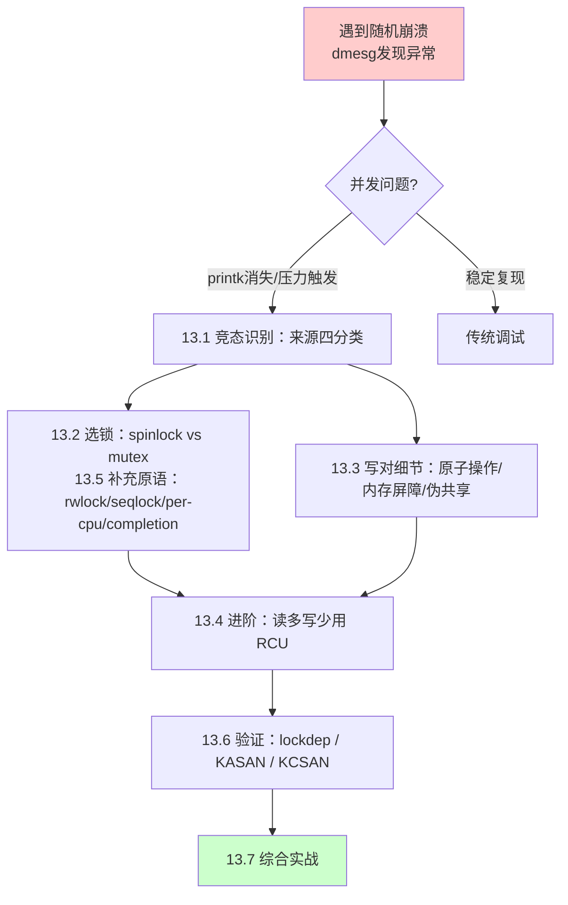

# 13.1.1 从随机崩溃案例引入

> 所属章节：第13章 并发与同步 > 13.1 竞态识别
>
> 难度：[I] | 预计阅读时间：12分钟

## <span class="blue"> 本节导读

本节覆盖：一个典型的压力测试偶发崩溃案例、`scheduling while atomic` 与 `kernel paging request` 两类关键日志的判读、并发 bug 的三大特征（不可复现 / 时序依赖 / 观测即改变）、常见并发 bug 症状速查表，以及本章的学习路线图。

---

## <span class="blue"> 一个典型的偶发崩溃 [I]

场景：工业网关设备，ARM Cortex-A53 四核，内核 5.15。功能测试一切正常，但 72 小时压力测试平均每 10 小时随机崩溃一次。重启后继续跑，仿佛什么都没发生过。

崩溃时 `dmesg` 里最常见的两类信息：

```
[  123.456] BUG: scheduling while atomic: kworker/0:3/1234/0x00000002
[  456.789] Unable to handle kernel paging request at virtual address 00000000
```

第一条 `scheduling while atomic`：内核代码在**不允许睡眠的上下文**里（中断处理、持有自旋锁期间）调用了可能睡眠的函数。第二条是空指针解引用——但这个指针在 99.9% 的时间里都不是 NULL。

这类问题的根因，资深工程师看一眼日志就能给出判断：竞态条件。为什么竞态能让代码在绝大多数时候正常工作，偏偏偶尔炸一次？这是本节要回答的问题。

---

## <span class="blue"> 并发bug为什么难缠 [I]

并发 bug 与普通 bug 最大的区别在于它**依赖时序**。

单线程程序里，同样的输入永远走同样的路径，出问题就能稳定复现。多核 CPU 上，多个线程和中断同时操作共享资源时，谁先谁后取决于硬件调度。十次里有一次时序不对，bug 就触发——而你控制不了这个"第十次"什么时候来。

这带来并发 bug 的三大特征：

| 特征 | 说明 | 给调试带来的影响 |
|:---:|:---|:---|
| **不可复现** | 十次测试可能只出现一次，没有固定规律 | 传统"复现→定位→修复"流程失效 |
| **时序依赖** | 结果取决于多核调度、中断到来时机、缓存状态 | 本地调试不出问题，上线才暴露 |
| **观测即改变** | 加 `printk` 会改变执行速度，可能让 bug 消失 | 调试手段本身可能掩盖问题 |

> ⚠️ 加 `printk` 想看清现场，结果时序被拖慢、bug 反而不出现了——这种"一观察就消失"的 bug 有个专门的名字：**海森堡 bug（Heisenbug）**。去掉日志上线，问题卷土重来，这个循环是内核调试中最耗人的一类。

> 💡 遇到随机崩溃，先确认是否是并发问题：翻 `dmesg` 看有没有 `atomic`、`oops`、`BUG:`、`spinlock` 这些关键词。同时记录崩溃频率与系统负载——压力测试下更容易触发，本身就是并发 bug 的重要信号。

---

## <span class="blue"> 常见并发bug症状速查 [I]

不同并发问题的症状不同，先用这张表建立初步判断：

| 症状 | 可能原因 | 紧急程度 |
|:---|:---|:---:|
| `scheduling while atomic` | 中断/原子上下文里调用了睡眠函数 | 🔴 高 |
| `Unable to handle kernel paging request` + 随机地址 | 无保护并发访问指针，读到中间状态 | 🔴 高 |
| 数据"偶尔"不对（如计数器少几次） | 读-改-写非原子，发生竞态 | 🟡 中 |
| 系统偶尔"卡住"几秒后恢复 | 死锁被 watchdog 超时解开 | 🔴 高 |
| 模块卸载时 panic | 资源仍被其他 CPU 使用就释放 | 🔴 高 |
| 内存泄漏（长期运行后耗尽） | 锁保护下的分配/释放路径不匹配 | 🟡 中 |

这张表不需要现在记住，后面的节会逐一展开。先建立"症状 → 方向"的直觉即可。

---

## <span class="blue"> 本章路线图 [I]

确认是并发问题后，按本章的链条走：



**第一步（13.1）**：搞清并发从哪里来。多线程、中断、底半部、SMP 四类来源各有不同的约束，来源没识别全，锁就加不对。

**第二步（13.2 / 13.5 / 13.3）**：根据上下文选原语、写对细节。spinlock 还是 mutex？持有锁时能不能睡眠？无锁场景下内存序怎么保证？没有"最好的"锁，只有"最合适的"。

**第三步（13.4）**：读多写少的热路径，用 RCU 把读端的锁去掉。

**第四步（13.6 / 13.7）**：用工具验证。`lockdep` 检测死锁，`KASAN` 查 use-after-free，`KCSAN` 查数据竞争——这些比加 `printk` 可靠得多。最后通过综合实战把"发现→分析→修复→验证"完整走一遍。

与前面章节的衔接：第 10 章讲了中断上下文不能睡眠——这正是 `scheduling while atomic` 的根本原因；第 9 章讲的内存分配器（`kmalloc`/`kfree`）内部用锁保护，是锁机制的大规模应用实例。

---

## <span class="blue"> 本节总结

| 要点 | 内容 |
|:---|:---|
| **核心问题** | 压力测试下的偶发崩溃，往往是并发 bug 的表现 |
| **关键症状** | `scheduling while atomic`、随机 oops、数据偶尔错乱 |
| **并发bug特征** | 不可复现、时序依赖、Heisenbug（观测即改变） |
| **排查起点** | 查看 `dmesg` 中的 `atomic`/`oops`/`BUG:`/`spinlock` 关键字 |
| **本章路线** | 识别竞态 → 选原语 → 写对细节 → RCU 进阶 → 工具验证 → 实战 |
| **前置知识** | 第9章（内存分配器的锁）、第10章（中断上下文不能睡眠） |

---

## <span class="blue"> 下一步

> **13.1.2 并发来源的四分类**
>
> 系统梳理 Linux 内核中所有可能的并发场景——多线程、硬中断、底半部、SMP，各自有什么约束，如何用 `in_interrupt()` 一族宏判断当前上下文，以及如何给自己的驱动画并发分析矩阵。

---

## <span class="blue"> 配套资源

| 资源 | 说明 |
|:---|:---|
| 症状速查表 | 本节"常见并发bug症状速查"，排查时按症状定方向 |
| 内核文档 | `Documentation/locking/` 目录（锁机制官方文档） |
| 延伸阅读 | `Documentation/atomic_ops.rst`（原子操作文档） |
