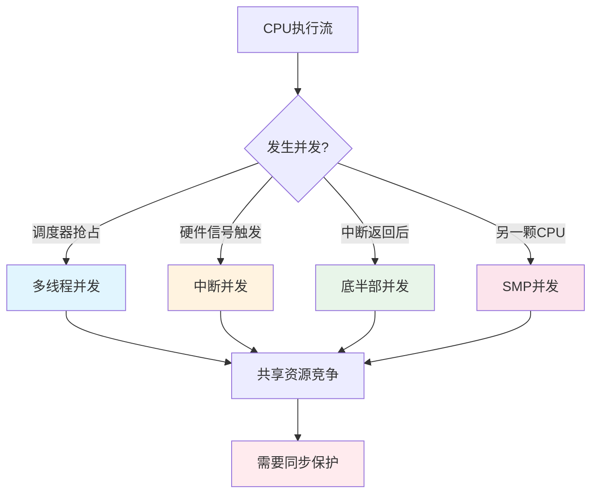
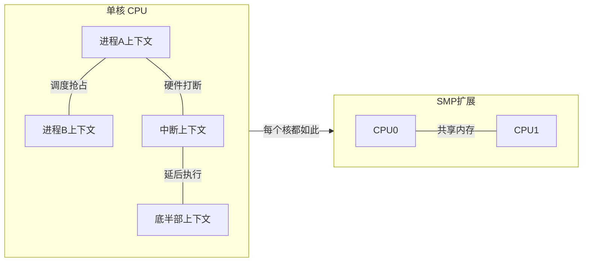

# 13.1.2 并发来源的四分类

> 所属章节：第13章 并发与同步 > 13.1 竞态识别
>
> 难度：[I→M] | 预计阅读时间：18分钟

## <span class="blue"> 本节导读

本节覆盖：Linux 内核中四类并发来源（多线程、中断、底半部、SMP）的触发条件与保护策略、`in_interrupt()` 一族上下文判断宏的用法、"谁在什么上下文中访问什么数据"的临界区识别矩阵，以及 data race 与 race condition 两个概念的严格区分。

---

## <span class="blue"> 并发来源的完整分类 [I→M]

写一个 LED 驱动，控制一个 GPIO。看似简单的读写操作，背后有四类执行流可能同时碰同一份数据：

```
  进程A write(gpio)
         |
         v
  +------------------+      +------------------+
  |   多线程并发      |      |   中断并发        |
  | (进程B抢占调度)   |      | (硬中断打断)      |
  +------------------+      +------------------+
         ^                          |
         |                          v
  +------------------+      +------------------+
  |   SMP并发        |      |   底半部并发      |
  | (CPU1同时执行)    |      | (tasklet延后执行) |
  +------------------+      +------------------+
```

### 1. 多线程并发

进程 A 和进程 B 同时打开同一个设备文件，或内核中多个线程访问同一个数据结构。调度器随时可能抢占当前执行流，把 CPU 让给另一个访问者。

```c
// 典型场景：两个进程同时操作同一个设备文件
static ssize_t led_write(struct file *filp, const char __user *buf,
                         size_t count, loff_t *off)
{
    // 这里读-改-写 led_state，如果进程B在中间被调度进来...
    led_state = !led_state;          // 非原子操作！
    gpio_set_value(LED_GPIO, led_state);
    return count;
}
```

这是最直观的一类并发，但内核里还有很多隐蔽的共享路径（sysfs 回调、proc 接口、定时器），识别时容易漏。

### 2. 中断并发

中断处理程序（顶半部）是一个**完全独立的执行上下文**：跟进程无关、不能被调度、不能睡眠，而且**随时可能打断当前执行流**。

```c
// 定时器中断周期性触发，读取传感器状态
static irqreturn_t timer_irq_handler(int irq, void *dev_id)
{
    // 这里访问 sensor_data[]，
    // 而与此同时进程上下文可能正在读取同一块数据
    sensor_data[idx++] = read_sensor();
    return IRQ_HANDLED;
}
```

进程上下文访问共享数据的代码，随时可能被这个 handler 打断——如果 handler 也碰同一份数据，竞态就发生了。中断上下文的完整约束见第 10 章。

### 3. 底半部并发

Linux 把中断处理拆成两半：顶半部快速响应，底半部延后处理。底半部有 softirq、tasklet、workqueue 几种形式，其中 **softirq 和 tasklet 不能睡眠**，且可能在中断返回后的任意时刻执行。

```c
static void my_tasklet_handler(unsigned long data)
{
    struct my_device *dev = (struct my_device *)data;

    // 同一个 tasklet 实例不会并行（串行保证，见10.3.3），
    // 但同类型的不同实例可以在多个 CPU 上并行执行
    process_buffer(dev);
}
```

底半部容易被忽视的原因：它是"延后"执行的，写代码时感觉不到它的存在，但它对共享数据的访问同样需要保护。

### 4. SMP并发

前三类在单核上本质是"伪并发"——靠中断和调度穿插执行。SMP 不一样：**两个 CPU 的指令真正在同一时刻执行**。

```
  CPU 0                          CPU 1
  -----                          -----
  read counter (0)               read counter (0)
  add 1                          add 1
  write counter (1)              write counter (1)

  // 结果：counter = 1，但期望是 2
  // 这就是 lost update——更新丢失
```

SMP 还带来内存可见性问题：每个核有自己的缓存和写缓冲区，一个核的写入何时、以什么顺序对另一个核可见，硬件不做默认保证——这是内存屏障存在的理由，13.3 会完整展开。

> ⚠️ 不要以"我的板子是单核"为由省略 SMP 保护。驱动代码的生命周期远比一块板子长：今天跑在单核 Cortex-A7 上的驱动，明天可能原样编译到四核 A53 平台上。写驱动时默认按多核设计。

> 🔴 SMP 下即使驱动只有一个用户进程，中断也可能在 CPU 0 处理而进程在 CPU 1 执行——这是真正的并行访问，spinlock 不能省。

### 四分类对比总表

| 并发来源 | 触发条件 | 识别方法 | 典型保护策略 | 示例场景 |
|---------|---------|---------|------------|---------|
| 多线程并发 | 调度器抢占、进程切换 | 多个进程/线程访问同一设备文件 | `mutex`、`rwsem` | 两个 shell 同时 `echo` 到 `/dev/led` |
| 中断并发 | 硬件信号触发，打断当前上下文 | 存在 `request_irq()` 注册的处理函数 | `spin_lock_irqsave()`、`local_irq_disable()` | 网卡收包中断与进程读数据竞争 |
| 底半部并发 | 中断返回后、或显式 `tasklet_schedule()` | 使用了 tasklet/softirq | `spin_lock_bh()`、`tasklet_disable()` | 定时器 tasklet 与用户 ioctl 竞争 |
| SMP并发 | 多核真正并行执行 | `num_online_cpus() > 1` | `spinlock`、`atomic_t`、`smp_mb()` | 双核同时操作共享计数器 |

### 上下文判断宏

排查并发问题，先要知道当前代码运行在什么上下文。Linux 提供一组判断宏：

| 宏名 | 判断内容 | 返回真时的上下文 | 典型用途 |
|-----|---------|----------------|---------|
| `in_interrupt()` | 是否在中断上下文（含硬中断和软中断） | 硬中断 handler、softirq、tasklet | 判断能否睡眠（不能） |
| `in_irq()` | 是否在硬中断 handler | 顶半部中断处理函数 | 确认最严格的上下文限制 |
| `in_softirq()` | 是否在 softirq/tasklet 上下文 | 底半部执行期间 | 判断 bh 级别的约束 |
| `in_atomic()` | 是否在原子上下文 | 中断上下文、持有 spinlock、`preempt_disable()` 期间 | 判断能否调度和睡眠 |

```c
// 实战：根据上下文打印诊断信息
void debug_context(void)
{
    if (in_irq())
        pr_info("Running in hard-IRQ context\n");
    else if (in_softirq())
        pr_info("Running in softirq/tasklet context\n");
    else if (in_interrupt())
        pr_info("Running in interrupt context (generic)\n");
    else if (in_atomic())
        pr_info("Running in atomic context (preempt off)\n");
    else
        pr_info("Running in process context (can sleep)\n");
}
```

这组宏是定位 `scheduling while atomic` 类问题的直接工具：在可疑路径上加一行判断，就能确认代码实际运行在什么上下文。



### 四类来源会叠加

四种来源不是孤立的。SMP 系统上，CPU0 的进程持有 spinlock，同时 CPU1 上中断触发，handler 试图获取同一把锁——这就是最复杂的叠加场景，进程侧必须用 `spin_lock_irqsave()` 把本地中断也关掉。锁变种的选择依据见 13.2.1。



---

## <span class="blue"> 临界区识别：谁在什么上下文访问什么数据 [I]

识别临界区是并发编程的核心技能，用一个固定模板就能做：

| 共享数据 | 访问者 | 上下文 | 是否需要保护 | 保护策略 |
|---------|-------|-------|------------|---------|
| `led_state` | `led_write()` | 进程 | 是（多线程） | `mutex` |
| `led_state` | `led_ioctl()` | 进程 | 是（同上） | 同一把锁 |
| `rx_ring[]` | `irq_handler()` | 硬中断 | 是（中断+进程） | `spinlock_irqsave` |
| `rx_ring[]` | `netdev_rx()` | 进程 | 是（同上） | 同一把锁 |
| `stats.packets` | `irq_handler()` | 硬中断 | 是（SMP） | `atomic64_inc` |
| `dev->flags` | `probe()` | 进程 | 否（此时未注册中断） | 无 |

> 💡 填这张表时，对每一行问同一个问题——**这段代码被中断或调度打断后，另一个执行者能看到不一致状态吗？** 答案是"能"，这一行就需要保护。

### 第一步：找共享数据

找出所有**被多个执行路径访问的数据**：

- 全局变量（加不加 `static` 都算）
- 驱动结构体的字段（`struct my_dev` 的成员）
- 硬件寄存器映射的内存区域
- 环形缓冲区、队列、链表头

一个实用做法：给共享数据加注释标记，如 `/* shared: protected by dev->lock */`，保护与数据的关系一目了然。

### 第二步：列访问者

列出**所有可能访问这份数据的代码路径**，不要漏：

- 设备的 `open/read/write/ioctl/mmap` 等文件操作
- `probe/remove/suspend/resume` 等生命周期函数
- 中断处理函数和底半部
- 定时器回调
- sysfs/proc 的读写回调

### 第三步：构造最坏场景

主动构造最不利的时序组合：

```
场景1：进程A读数据到一半被抢占，进程B修改了数据
场景2：中断在处理数据时，另一个CPU的进程也在读取
场景3：tasklet执行到一半，同类型另一个实例在另一个CPU上触发
```

### data race 与 race condition 的区别

这两个概念常被混用，严格来说有区别：

| 维度 | Data Race | Race Condition |
|-----|-----------|---------------|
| 定义 | 对共享内存的非同步并发访问 | 程序行为依赖不可控的事件时序 |
| 关注点 | **内存访问层面** | **程序逻辑层面** |
| 必要条件 | 多执行流 + 共享数据 + 至少一个写 | 逻辑正确性依赖时序 |
| 示例 | 两个 CPU 同时 `counter++` | 先 check 再 use 的 TOCTOU |
| 检测工具 | KCSAN、ThreadSanitizer | 代码审查、形式化验证 |

**Data race**：两个执行流对同一内存位置做非同步访问，且至少一个是写。危险在于编译器可能重排指令、CPU 可能乱序执行，读到"半完成"的状态。

**Race condition**：更高层的逻辑问题——代码假设 A 一定先于 B 发生，但时序不受控。即使所有内存访问都加了锁（没有 data race），race condition 依然可能存在。经典的 TOCTOU（检查到使用）：

```c
// 有锁，但仍有 race condition
if (file_exists(path)) {        // 检查
    // ← 攻击者在这里删除文件，换成符号链接
    fd = open(path, O_RDONLY);  // 使用
    read(fd, buf, sizeof(buf));
}
```

检查和使用之间存在窗口，锁保护不了这个逻辑漏洞。

> 💡 两者的关系：**data race 是 race condition 的子集**。所有 data race 都是 race condition，反之不然。消灭 data race 靠同步原语，消灭 race condition 还得靠逻辑设计。

---

## <span class="blue"> 本节总结

| 主题 | 核心要点 |
|-----|---------|
| 并发四分类 | 多线程、中断、底半部、SMP——来源不同，策略各异 |
| 多线程并发 | 调度器抢占导致，最直观的并发来源 |
| 中断并发 | 硬中断随时打断进程，上下文完全独立 |
| 底半部并发 | tasklet/softirq 延后执行，不能睡眠 |
| SMP并发 | 真正的并行执行，内存可见性需屏障保证（13.3） |
| 上下文判断 | `in_interrupt()`/`in_irq()`/`in_softirq()`/`in_atomic()` |
| 临界区识别 | "谁在什么上下文中访问什么数据"矩阵法 |
| data race | 内存访问层面的非同步并发写，KCSAN 可检测 |
| race condition | 逻辑层面的时序依赖，data race 的超集 |

写驱动前先把临界区分析表填一遍——多花五分钟，可能省去五小时的调试。

---

## <span class="blue"> 下一步

> **13.2.1 spinlock的实现与变种**
>
> 识别完并发来源，接下来选武器。13.2.1 深入 Linux 内核最基础、最常用的锁——spinlock 的底层实现只有几条汇编指令，却撑起了整个内核的并发安全；`spin_lock_irqsave()`、`spin_lock_bh()` 这些变种各自防的是哪一类叠加竞态。

---

## <span class="blue"> 配套资源

| 资源 | 描述 |
|-----|------|
| 内核文档 | `Documentation/locking/spinlocks.rst` |
| 上下文宏源码 | `include/linux/preempt.h` |
| KCSAN 检测器 | `Documentation/dev-tools/kcsan.rst`（检测 data race） |
| 推荐实验 | 双核板子上故意去掉锁，用 `taskset` 绑定到不同 CPU，观察数据不一致 |
| 进阶阅读 | 《Linux Kernel Development》第10章（Robert Love） |
