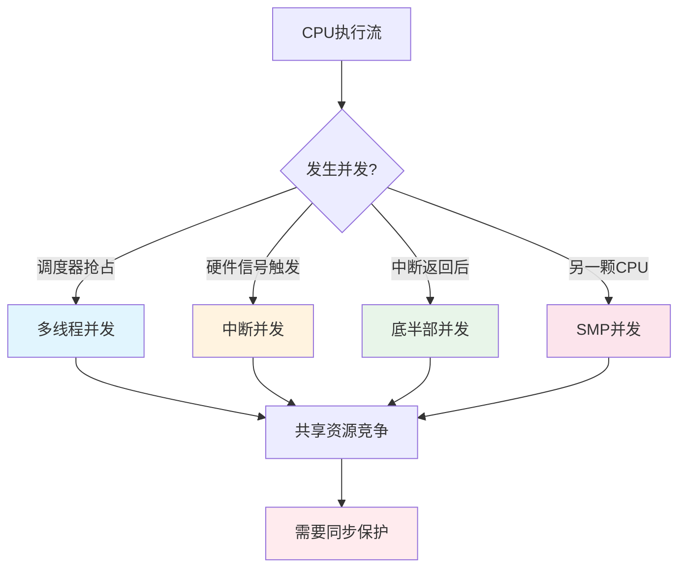
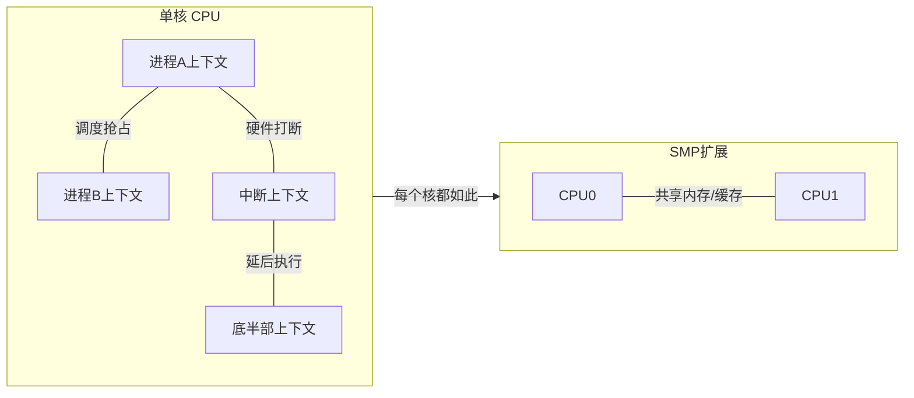

# 13.1.2 并发来源的四分类

> 所属章节：第13章 并发与同步 > 13.1 为什么嵌入式Linux必须关心并发
>
> 难度：[I][M] | 预计阅读时间：18分钟

## <span class="blue"> 本节导读

上一节我们聊了一个看似正常的驱动"诡异地崩溃"的故事。本节我们把镜头拉近，拆解并发到底从哪来。说白了，在嵌入式Linux世界里，**"敌人"不是一只，而是四只**——它们各自有不同的偷袭方式和应对策略。<br>

学完后，你将：
- 一眼看出代码中的并发威胁来自哪一类
- 掌握上下文判断宏的实战用法
- 能画出自己驱动的并发分析矩阵

---

## <span class="blue"> 知识点188 [I][M]：并发来源的完整分类

### 四种"敌人"登场

想象你正在写一个LED驱动，控制一个GPIO。看似简单的读写操作，哪些东西可能在背后"捣乱"？四种并发来源，一个都不能忽视。

```
  进程A write(gpio)
         |
         v
  +------------------+      +------------------+
  |   多线程并发      |      |   中断并发        |
  | (进程B抢占调度)   |      | (硬中断打断)      |
  +------------------+      +------------------+
         ^                          |
         |                          v
  +------------------+      +------------------+
  |   SMP并发        |      |   底半部并发      |
  | (CPU1同时执行)    |      | (tasklet延后执行) |
  +------------------+      +------------------+
```

### 1. 多线程并发：最熟悉的陌生人

进程A和进程B共享同一个文件描述符，或者内核中多个线程访问同一个数据结构。调度器是它们的"帮凶"——**随时可能发生抢占**。

```c
// 典型场景：两个进程同时操作同一个设备文件
static ssize_t led_write(struct file *filp, const char __user *buf,
                         size_t count, loff_t *off)
{
    // 这里读-改-写 led_state，如果进程B在中间被调度进来...
    led_state = !led_state;          // 非原子操作！
    gpio_set_value(LED_GPIO, led_state);
    return count;
}
```

说白了，这种并发是最容易想到的——毕竟"多线程"就是并发的代名词嘛。但别掉以轻心，内核里还有很多隐蔽的共享路径。

### 2. 中断并发：来自"另一个世界"的访客

中断处理程序（Top Half）是一个**完全独立的执行上下文**。它跟进程毫无关系，没有进程栈，不能被调度，也不能睡眠。但可怕的是——**它随时会打断你**。

```c
// 定时器中断每秒触发，读取传感器状态
static irqreturn_t timer_irq_handler(int irq, void *dev_id)
{
    // 这里访问 sensor_data[]，
    // 而与此同时进程上下文可能正在读取同一块数据
    sensor_data[idx++] = read_sensor();
    return IRQ_HANDLED;
}
```

中断就像突然响起的电话——你正在做饭（进程上下文），电话响了（中断发生），你必须放下锅铲去接听。等你回来，锅可能已经糊了。

### 3. 底半部并发：延后的危险

Linux把中断处理拆成两半：顶半部（快速响应）和底半部（延后处理）。底半部有 tasklet、softirq、workqueue 几种形式。其中 **softirq 和 tasklet 不能睡眠**，且可能在**中断返回的任意时刻**被执行。

```c
static void my_tasklet_handler(unsigned long data)
{
    struct my_device *dev = (struct my_device *)data;
    
    // tasklet 执行时，进程上下文可能被调度
    // 但如果另一个 tasklet（同类或不同类）也触发...
    // 在 SMP 上，tasklet 甚至可能在另一个 CPU 上并行执行！
    process_buffer(dev);
}
```

底半部的狡猾之处在于：它"假装"是异步的，让人放松警惕，但它对共享数据的访问同样需要保护。

### 4. SMP并发：真正的"同时"

前面三种在单核上本质上都是"伪并发"——通过中断和调度穿插执行。但 SMP（对称多处理器）不一样：**两个 CPU 的指令真的在同一纳秒执行**。

```
  CPU 0                          CPU 1
  -----                          -----
  read counter (0)               read counter (0)
  add 1                          add 1
  write counter (1)              write counter (1)
  
  // 结果：counter = 1，但期望是 2！
  // 这叫做" lost update "——更新丢失了
```

SMP 不仅带来真正的并行性，还带来 **缓存一致性** 的问题。每个 CPU 有自己的 L1/L2 缓存，当你修改一个变量时，其他 CPU 的缓存可能还是旧值。这就是为什么要用 `smp_mb()` 等内存屏障。

> ⚠️ **陷阱**：很多开发者说"我的系统是单核的，不用考虑 SMP"。错！Linux 内核代码通常是通用的，今天跑在单核 ARM Cortex-A7 上的驱动，明天可能就被移植到双核 A53 上。另外，即使单核配置，**CONFIG_SMP 的代码路径也可能存在**。养成良好的并发习惯，不要假设只有一个 CPU。

> 🔴 **危险**：SMP 下，即使你的驱动是单线程的（只有一个进程打开设备），中断可能在 CPU 0 处理，而你的进程在 CPU 1 执行——这才是真正的并发，spinlock 是必选项，不能省略！

### 四分类对比总表

| 并发来源 | 触发条件 | 识别方法 | 典型保护策略 | 示例场景 |
|---------|---------|---------|------------|---------|
| 多线程并发 | 调度器抢占、进程切换 | 多个进程/线程访问同一设备文件 | `mutex`、`semaphore`、`fasync` | 两个shell同时`echo`到 `/dev/led` |
| 中断并发 | 硬件信号触发，打断当前上下文 | 存在 `request_irq()` 注册的处理函数 | `local_irq_disable()`、`spin_lock_irqsave()` | 网卡收包中断与进程读数据竞争 |
| 底半部并发 | 中断返回后、或显式 `tasklet_schedule()` | 使用了 `tasklet_*`、`softirq` | `spin_lock_bh()`、`tasklet_disable()` | 定时器 tasklet 与用户 ioctl 竞争 |
| SMP并发 | 多核真正并行执行 | `num_online_cpus() > 1` | `spinlock`、`atomic_t`、`smp_mb()` | 双核同时操作共享计数器 |

### 上下文判断：你的"雷达"系统

怎么知道当前运行在什么上下文？Linux 提供了一组宏帮你判断：

| 宏名 | 判断内容 | 返回真时的上下文 | 典型用途 |
|-----|---------|----------------|---------|
| `in_interrupt()` | 是否在中断上下文（含硬中断和软中断） | 硬中断 handler、softirq、tasklet | 判断能否睡眠（不能！） |
| `in_irq()` | 是否在硬中断 handler | 顶半部中断处理函数 | 确认最严格的上下文限制 |
| `in_softirq()` | 是否在 softirq/tasklet 上下文 | 底半部执行期间 | 判断 bh 级别的约束 |
| `in_atomic()` | 是否在原子上下文（含中断、关抢占等） | 中断上下文、持有 spinlock、 preempt_disable() 期间 | 判断能否调度和睡眠 |

```c
// 实战：根据上下文选择不同的代码路径
void debug_context(void)
{
    if (in_irq())
        pr_info("Running in hard-IRQ context\n");
    else if (in_softirq())
        pr_info("Running in softirq/tasklet context\n");
    else if (in_interrupt())
        pr_info("Running in interrupt context (generic)\n");
    else if (in_atomic())
        pr_info("Running in atomic context (preempt off)\n");
    else
        pr_info("Running in process context (can sleep)\n");
}
```

这组宏是排查并发问题的利器。比如你发现 `kmalloc(GFP_KERNEL)` 在不该睡眠的地方睡眠了，加一个 `in_interrupt()` 判断就能快速定位。



### 并发来源的交互关系

这四种来源不是孤立的——它们会**叠加**！比如一个 SMP 系统上，CPU0 的进程持有 spinlock，同时 CPU1 的中断触发，中断 handler 又试图获取同一个锁。这种情况是最复杂的，需要 `spin_lock_irqsave()` 把中断也关了。



---

## <span class="blue"> 知识点189 [I]：临界区识别方法

### "谁在什么上下文中访问什么数据"

识别临界区是并发编程的核心技能。我有一个屡试不爽的模板：

| 共享数据 | 访问者 | 上下文 | 是否需要保护 | 保护策略 |
|---------|-------|-------|------------|---------|
| `led_state` | `led_write()` | 进程 | 是（多线程） | `mutex` |
| `led_state` | `led_ioctl()` | 进程 | 是（同上） | 同一把锁 |
| `rx_ring[]` | `irq_handler()` | 硬中断 | 是（中断+进程） | `spinlock_irqsave` |
| `rx_ring[]` | `netdev_rx()` | 进程 | 是（同上） | 同一把锁 |
| `stats.packets` | `irq_handler()` | 硬中断 | 是（SMP） | `atomic64_inc` |
| `dev->flags` | `probe()` | 进程 | 否（此时未注册中断） | 无 |

> 💡 **提示**：填写这个表格时，反复问自己一句话——**"如果这段代码被中断/调度打断，另一个执行者能看到不一致状态吗？"** 如果答案是"是"，那一行就需要保护。

### 共享数据识别

第一步：找出所有**被多个执行路径访问的数据**。这包括：

- 全局变量（`static` 或不加 `static` 的全局）
- 驱动结构体的字段（`struct my_dev` 中的成员）
- 硬件寄存器映射的内存区域
- 环形缓冲区、队列、链表头

有个小技巧：给所有共享数据加一个注释标记，比如 `/* shared: protected by dev->lock */`，一目了然。

### 访问者分析

第二步：列出**所有可能访问这段数据的代码路径**。不要漏掉：

- 设备的 `open/read/write/ioctl/mmap` 等文件操作
- `probe/remove/suspend/resume` 等生命周期函数
- 中断处理函数和底半部
- 定时器回调
- sysfs/proc 的读写回调

### 竞态条件场景构造

第三步：像黑客一样思考——**构造最坏的情况**。比如：

```
场景1：进程A读数据到一半被抢占，进程B修改了数据
场景2：中断在处理数据时，另一个CPU的进程也在读取
场景3：tasklet执行到一半，同类型tasklet在另一个CPU上触发
```

### data race vs race condition：一对"近义词"

很多人把这两个概念混用，但严格来说有区别：

| 维度 | Data Race | Race Condition |
|-----|-----------|---------------|
| 定义 | 对共享内存的非同步并发访问 | 程序行为依赖不可控的事件时序 |
| 关注点 | **内存访问层面** | **程序逻辑层面** |
| 必要条件 | 多执行流 + 共享数据 + 至少一个写 | 逻辑正确性依赖时序 |
| 示例 | 两个 CPU 同时 `counter++` | 先 `check` 再 `use` 的经典 TOCTOU |
| 检测工具 | KCSAN、ThreadSanitizer | 代码审查、形式化验证 |

**Data race** 说的是：两个执行流对同一内存位置做非同步的访问，且至少一个是写。这是**编译器和 CPU 层面的危险行为**——编译器可能重排指令，CPU 可能乱序执行，导致你看到"半完成"的状态。

**Race condition** 说的是更高层的问题：你的程序逻辑假设 A 一定先于 B 发生，但实际上这个时序是不受控的。即使没有 data race（所有访问都加了锁），race condition 依然可能存在。经典的例子是"检查到使用"（TOCTOU）漏洞：

```c
// 有锁，但仍有 race condition！
if (file_exists(path)) {        // 检查
    // <-- 攻击者在这里删除了文件，创建了符号链接！
    fd = open(path, O_RDONLY);  // 使用
    read(fd, buf, sizeof(buf));
}
```

这段代码每次都持有锁，所以不存在 data race，但检查和使用之间存在一个"窗口"，攻击者可以利用。这就是 race condition——**锁保护不了逻辑漏洞**。

> 💡 **提示**：记住这个关系——**data race 是 race condition 的子集**。所有 data race 都是 race condition，但反过来不成立。消灭 data race 靠同步原语（spinlock、mutex），消灭 race condition 还得靠仔细设计逻辑。

---

## <span class="blue"> 本节总结

| 主题 | 核心要点 |
|-----|---------|
| 并发四分类 | 多线程、中断、底半部、SMP——来源不同，策略各异 |
| 多线程并发 | 调度器抢占导致，最直观的并发来源 |
| 中断并发 | 硬中断随时打断进程，上下文完全独立 |
| 底半部并发 | tasklet/softirq 延后执行，不能睡眠 |
| SMP并发 | 真正的并行执行，缓存一致性不可忽视 |
| 上下文判断 | `in_interrupt()`/`in_irq()`/`in_softirq()`/`in_atomic()` |
| 临界区识别 | "谁在什么上下文中访问什么数据"矩阵法 |
| data race | 内存访问层面的非同步并发写，工具可检测 |
| race condition | 逻辑层面的时序依赖，需代码审查 |

本节给了你一张"并发威胁地图"。下次写一个驱动时，先把那张临界区分析表格填一遍——多花五分钟，可能省去五小时的调试。

---

## <span class="blue"> 下一步

知道了"敌人从哪来"，下一节我们研究怎么"打"。13.2.1 将深入 spinlock 的实现与变种——Linux 内核最基础、最常用的锁，没有之一。你会看到它的底层实现只有几条汇编指令，却撑起了整个内核的并发安全。

---

## <span class="blue"> 配套资源

| 资源 | 描述 |
|-----|------|
| 内核文档 | `Documentation/locking/spinlocks.rst` |
| 上下文宏源码 | `include/linux/preempt.h` |
| KCSAN 检测器 | `Documentation/dev-tools/kcsan.rst`（检测 data race） |
| 推荐实验 | 在一个双核板子上，故意去掉锁操作，用 `taskset` 绑定到不同 CPU，观察数据不一致 |
| 进阶阅读 | 《Linux Kernel Development》第10章 —— Robert Love |
