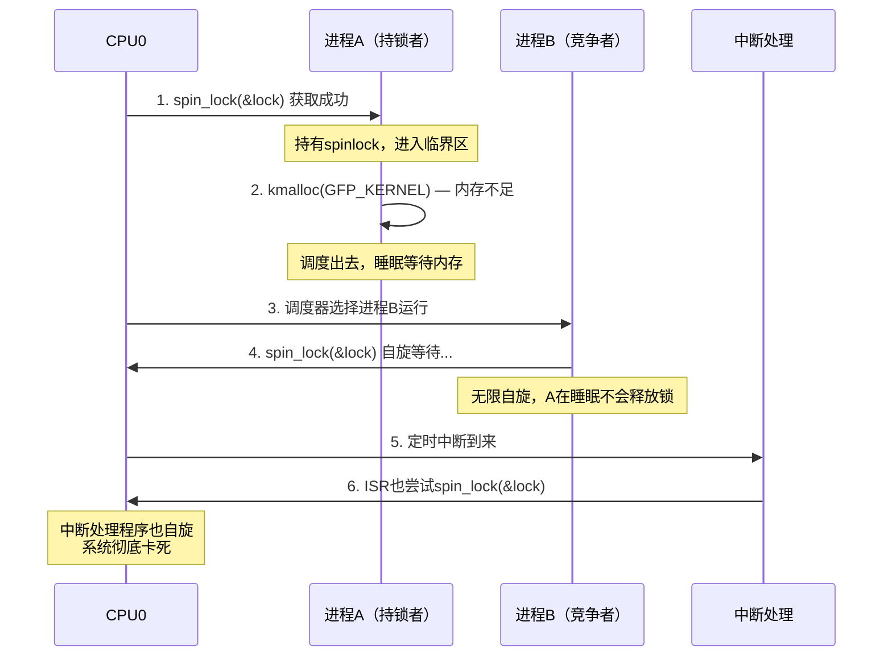

# 13.2.1 spinlock的实现与变种

> 所属章节：第13章 并发与同步 > 13.2 spinlock与mutex
>
> 难度：[E→M] | 预计阅读时间：25分钟

## <span class="blue"> 本节导读

本节覆盖：spinlock 的忙等本质、v6.6 的真实实现（queued spinlock / MCS 队列，而非旧资料里的 ticket lock）、四种 `spin_lock` 变种的适用场景，以及"持有 spinlock 为什么不能睡眠"的死锁原理与 `preempt_count` 机制。

---

## <span class="blue"> spinlock核心：忙等与v6.6的qspinlock [E→M]

### 忙等原理

spinlock 的本质是**忙等**：获取锁失败时，在一个紧凑循环里反复检查锁状态，直到成功为止。等锁期间**不会**调用 `schedule()` 让出 CPU——就一直自旋，烧 CPU 周期。所以 spinlock 只适合持有时间极短（微秒级）的临界区，否则就是白白浪费 CPU。

### v6.6 的真实实现：qspinlock

很多资料（包括旧版内核书）讲 ARM64 的 spinlock 就是一对 `LDAXR`/`STXR` 独占指令加 ticket 计数——那是 **ARM64 早期的 ticket lock 实现，早已不是现状**。ARM64 从 4.x 起就切换到 **queued spinlock（qspinlock）**，v6.6 的 `arch/arm64/include/asm/spinlock.h` 只有一行关键 include：`#include <asm/qspinlock.h>`，具体实现走 `include/asm-generic/qspinlock.h` + `kernel/locking/qspinlock.c`。

**快速路径**只有一条原子比较交换（asm-generic/qspinlock.h，真实代码）：

```c
static __always_inline void queued_spin_lock(struct qspinlock *lock)
{
	int val = 0;

	/* 锁空闲时，一条原子 cmpxchg（带 acquire 语义）直接拿下 */
	if (likely(atomic_try_cmpxchg_acquire(&lock->val, &val, _Q_LOCKED_VAL)))
		return;

	/* 锁被占，进入 MCS 队列慢速路径 */
	queued_spin_lock_slowpath(lock, val);
}
```

**慢速路径**是 qspinlock 的核心设计，基于 **MCS 锁**思想：

- 拿不到锁的 CPU 不再都盯着同一个锁变量自旋（那叫 test-and-set 自旋，多核下所有核反复抢同一条缓存行，总线被打爆）。
- 每个等待者挂进一个**每 CPU 的队列节点（qnode）**，然后**只在自己的节点上自旋**——各自转各自的缓存行，互不干扰。
- 持锁者释放时，把锁"递"给队首节点，只唤醒一个等待者。队列天然 FIFO，先到先得，公平性也有了。

<!--
【待补图·优先级△（可选）】文件路径：images/13.2.1-qspinlock-MCS队列结构.png

生图说明（整段复制给生图 AI，中文标注）：
画面主题：qspinlock 的 MCS 队列——多核抢锁时各等待者"在自己的节点上自旋"的链式结构。
构图：横向结构图。最左侧一个小方框代表锁变量（标注"qspinlock val（locked/pending/tail）"）。从 tail 字段引出一条箭头链，串联三个圆角矩形节点："qnode（CPU2）"→"qnode（CPU3）"→"qnode（CPU1）"，每个节点下方标注"per-CPU 节点，各在自己的缓存行上自旋"并用一个小循环箭头表示自旋。链头（最早等待者）用绿色边框标出，旁注"队首：持锁者释放时只通知它"；链尾旁注"新等待者用原子交换挂到 tail"。左上角配一个小对比框，画多个 CPU 同时指向同一个锁变量的放射状箭头，打红色叉，标注"test-and-set：所有核抢同一条缓存行（已淘汰）"。
风格：扁平矢量技术插图，白底，蓝灰主色 + 绿色高亮队首 + 红色仅用于反例叉号，细线框，16:9 横版。
禁用：照片质感、3D 效果、卡通元素、英文标注。
注意：生图 AI 对中文文字标注容易出错，生成后需人工核对所有文字，必要时后期补字。

图片生成完成后删除本注释块，替换为：

-->

**释放路径**同样简短（asm-generic/qspinlock.h，真实代码）：

```c
static __always_inline void queued_spin_unlock(struct qspinlock *lock)
{
	/* unlock() needs release semantics */
	smp_store_release(&lock->locked, 0);
}
```

### 内存序：acquire 进，release 出

注意两个细节：`atomic_try_cmpxchg_**acquire**` 和 `smp_store_**release**`。这一对语义构成完整的临界区屏障：

- **acquire**（加锁时）：保证临界区内的内存访问不会被重排到加锁之前。
- **release**（解锁时）：保证临界区内的写入先于解锁对其他核可见。

所以用 spinlock 保护数据时，不需要在临界区里再额外加 `smp_mb()`。旧资料里"LDAXR 的 A 是 Acquire、STXR 默认 Release"的说法只有前半对——ARM64 的 `STXR` 是普通条件存储，**不带** release 语义（带 release 的是 `STLXR`），v6.6 的 release 由上面的 `smp_store_release` 承担。

> 💡 `LDAXR`/`STXR` 独占指令并没有消失——它们是 ARM64 上 `atomic_cmpxchg`、`atomic_add` 这类原子操作的底层实现机制，qspinlock 的那条 `atomic_try_cmpxchg_acquire` 最终也落在它们身上。这部分硬件细节在 13.3.1 展开。

### 四种spinlock变种：该用哪个？

四种获取函数的区别只在一点：**获取锁的同时，额外关掉了什么？**

| 函数 | 保存的状态 | 适用场景 | 嵌套安全性 |
|:---:|:---:|:---|:---:|
| `spin_lock()` | 无 | 进程上下文，不与其他上下文共享锁 | — |
| `spin_lock_irq()` | 无（直接关中断） | 进程上下文，需与ISR共享锁 | ❌ 不安全 |
| `spin_lock_irqsave()` | 保存中断状态到 flags | 进程上下文，不确定中断状态，需与ISR共享锁 | ✅ 安全 |
| `spin_lock_bh()` | 无（直接关底半部） | 进程上下文，需与softirq/tasklet共享锁 | — |

逐个看：

**`spin_lock()` — 基本版**。纯粹获取锁，不动中断和底半部。确定共享数据不会被中断处理或软中断触碰时用它。

```c
// 场景：进程上下文线程间共享数据
spin_lock(&my_lock);
// ... 临界区 ...
spin_unlock(&my_lock);
```

**`spin_lock_irq()` — 关中断版**。内部执行 `local_irq_disable()` 关本地中断再取锁，适用于进程上下文与 ISR 共享数据。但它**不保存**之前的中断状态：

```c
// 场景：进程上下文 + ISR共享数据
spin_lock_irq(&my_lock);
// ... 临界区（ISR不会闯入，因为它被关了）...
spin_unlock_irq(&my_lock);  // 直接开中断！
```

> ⚠️ `spin_lock_irq()` 在**已经关闭中断**的上下文中使用，会在 `spin_unlock_irq()` 时**无条件开启中断**——调用前的中断状态就此丢失。嵌套调用更糟：外层还在临界区里，内层的 unlock 已经把中断打开了。

**`spin_lock_irqsave()` — 保存中断状态版**。先用 `local_irq_save(flags)` 把中断状态存进 `flags`，再关中断取锁；unlock 时按 `flags` 精确恢复。在已关中断的上下文中也能正确工作，是最安全的版本：

```c
unsigned long flags;
// 场景：不确定调用点中断是否开启，或可能嵌套调用
spin_lock_irqsave(&my_lock, flags);
// ... 临界区 ...
spin_unlock_irqrestore(&my_lock, flags);
```

> 💡 不确定该用哪个变种时，直接用 `spin_lock_irqsave()`——性能敏感且上下文明确时才考虑其他版本。

**`spin_lock_bh()` — 关底半部版**。只关本地 CPU 的底半部执行（softirq/tasklet），不关硬中断。适用于进程上下文与 softirq/tasklet 共享数据的场景。底半部机制本身见第 10 章 10.3。

```c
// 场景：进程上下文 + tasklet/softirq共享数据
spin_lock_bh(&my_lock);
// ... 临界区（softirq不会执行，但硬中断仍响应）...
spin_unlock_bh(&my_lock);
```

### spinlock适用上下文速查

| 上下文 | 能否使用spinlock | 推荐变种 | 注意事项 |
|:---|:---:|:---|:---|
| 进程上下文 | ✅ | `spin_lock()` / `_irqsave()` | 禁止睡眠 |
| 硬中断（ISR） | ✅ | `spin_lock()` | 已处于关抢占状态 |
| 软中断/tasklet | ✅ | `spin_lock()` | 同 ISR |
| 已关中断的代码 | ✅ | `spin_lock()` | 中断已关，无需重复操作 |
| 定时器回调 | ✅ | `spin_lock()` | 同属中断上下文 |

一句话：**所有不能睡眠的上下文都能用 spinlock**。那问题就来了——如果 spinlock 保护的代码睡眠了，会发生什么？

---

## <span class="blue"> 为什么spinlock不能睡眠：死锁原理与preempt_count [E]

### 死锁场景推演

经典内核死锁场景：进程 A 持有 spinlock 后调用了 `kmalloc(GFP_KERNEL)`（可能睡眠）：



链条是这样的：

1. 进程 A 拿到锁，进入临界区；
2. A 调用可能睡眠的函数（如 `kmalloc(GFP_KERNEL)`），被调度出去；
3. CPU 切到进程 B，B 获取同一把 spinlock——**开始自旋，占满 CPU**；
4. 关键在"同一个 CPU"：A 被换出、B 在运行，B 自旋占住 CPU，A 永远没有调度回来释放锁的机会；
5. 此时中断到来，ISR 也获取同一把锁——**彻底卡死**。

根本原因一句话：**自旋等待的执行流不会让出 CPU 给持锁者，持锁者永远没有释放锁的机会。**

### preempt_count：内核的"防睡眠"计数

内核用 `preempt_count`（嵌在 `thread_info` 中的计数器）跟踪"当前上下文能不能调度"：

- 获取 spinlock 时，内部先 `preempt_disable()`，`preempt_count` 递增；
- `preempt_count != 0` 时，抢占点（如从中断返回时的抢占检查）**不会触发**调度；
- 但计数器拦不住**主动**调用的睡眠函数——`msleep()`、`kmalloc(GFP_KERNEL)`、`mutex_lock()` 里的 `might_sleep()` 会检测到原子上下文，打印：

```
BUG: scheduling while atomic: swapper/0/0x00000103
```

开启 `CONFIG_DEBUG_ATOMIC_SLEEP` 的开发内核会额外 dump 调用栈。警告打印之后系统"继续跑"，但此时已处于不可预期状态——比如撞上前一节推演的死锁链条。

> 🔴 在**中断上下文**调用可能睡眠的函数（`kmalloc(GFP_KERNEL)`、`copy_from_user()`、`mutex_lock()` 等）几乎必然触发 kernel oops。中断上下文没有进程栈可供切换，`schedule()` 无处可跳——这不是"侥幸能过"的灰色地带，是直接崩溃。

| 上下文 | preempt_count状态 | 调用睡眠函数的后果 |
|:---|:---|:---|
| 普通进程 | 0 | 正常睡眠 |
| 持有spinlock | PREEMPT 位 > 0 | `scheduling while atomic` 警告，可能死锁 |
| 硬中断 | HARDIRQ 位 > 0 | **kernel oops** |
| 软中断 | SOFTIRQ 位 > 0 | `scheduling while atomic` 警告 |
| 关抢占 | PREEMPT 位 > 0 | 同上 |

### 如何排查这类死锁

> 💡 开启 `CONFIG_DEBUG_SPINLOCK` 和 `CONFIG_LOCKDEP`。lockdep 检测到可能的死锁场景时会打印完整的锁依赖链——哪两把锁、哪两个 CPU、哪两条调用栈构成循环。lockdep 的用法在 13.6.1 展开。

运行时还可以用 SysRq+d（`echo d > /proc/sysrq-trigger`）打印当前所有被持有的锁，或通过 `/proc/lock_stat` 查看锁争用统计（需 `CONFIG_LOCK_STAT`）。某把 spinlock 的等待时间异常长，基本就是有人在持锁期间睡眠了。

---

## <span class="blue"> 本节总结

| 主题 | 核心要点 |
|:---|:---|
| spinlock本质 | 忙等：获取失败循环检查，不让出 CPU |
| v6.6 实现 | **qspinlock**（MCS 队列），ARM64 早已不是 ticket lock；快路径一条 `atomic_try_cmpxchg_acquire` |
| 慢速路径 | 等待者挂 per-CPU qnode，各自在本地缓存行自旋，FIFO 唤醒 |
| 内存序 | 加锁 acquire + 解锁 `smp_store_release`，临界区不需额外屏障 |
| 四种变种 | `spin_lock()` 基本；`_irq()` 关中断；`_irqsave()` 保存后关（最安全）；`_bh()` 关底半部 |
| 不能睡眠的原因 | 持锁者睡眠后，同 CPU 竞争者自旋占满 CPU，持锁者永无释放机会 → 死锁 |
| preempt_count | 持锁时 >0 挡住抢占点；主动睡眠由 `might_sleep()` 抓出 |

**spinlock 使用四法则**：

1. 临界区越短越好（微秒级）
2. 临界区内绝不睡眠
3. 不确定中断状态时，用 `spin_lock_irqsave()`
4. 中断上下文分配内存只能用 `GFP_ATOMIC`

---

## <span class="blue"> 下一步

> **13.2.2 mutex的实现与优先级继承**
>
> spinlock 是忙等的，临界区长、或者需要睡眠时怎么办？下一节看 mutex——等待者睡眠让出 CPU 的互斥锁：v6.6 的快速路径、乐观自旋、FIFO 等待队列，以及 rt_mutex 的优先级继承如何解决优先级反转。

---

## <span class="blue"> 配套资源

| 资源类型 | 内容 | 获取方式 |
|:---|:---|:---|
| 参考源码 | `include/asm-generic/qspinlock.h` | qspinlock 快速/释放路径（v6.6） |
| 参考源码 | `kernel/locking/qspinlock.c` | MCS 队列慢速路径 |
| 参考源码 | `kernel/locking/spinlock.c` | spinlock 通用层 |
| 代码 | spinlock 四种变种的典型调用模板 | 本节代码块 |
| 调试命令 | `echo d > /proc/sysrq-trigger`（showlocks） | 内核运行时 |
| 内核配置 | `CONFIG_DEBUG_SPINLOCK`、`CONFIG_DEBUG_ATOMIC_SLEEP`、`CONFIG_LOCKDEP` | 内核编译选项 |
