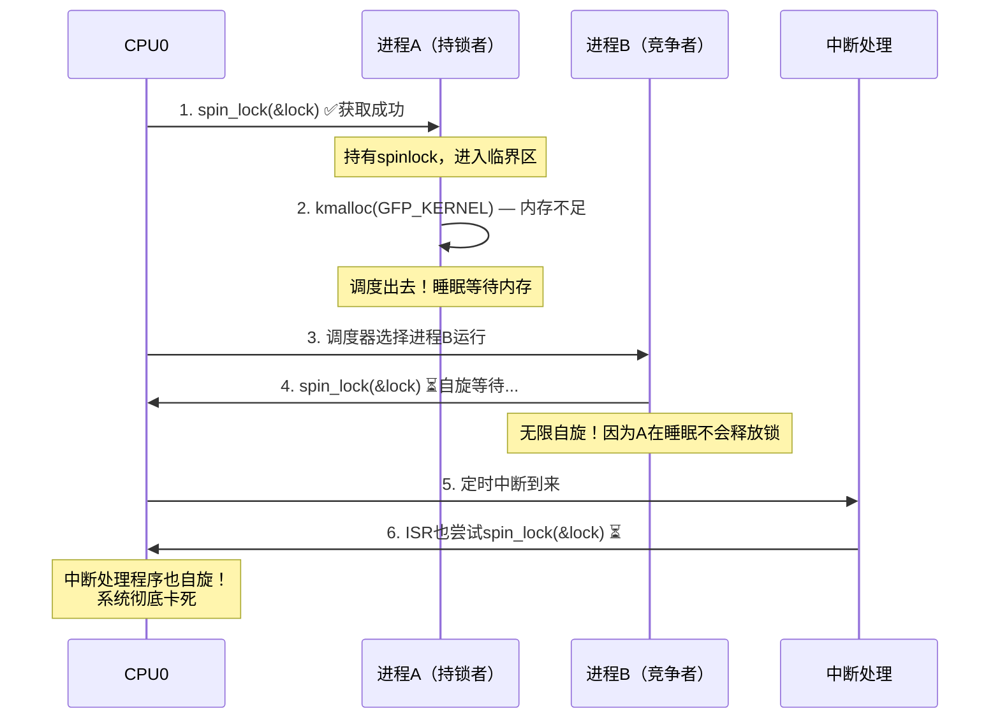

# 13.2.1 spinlock的实现与变种

> 所属章节：第13章 并发与同步 > 13.2 内核同步原语
>
> 难度：[E] Expert 专家 / [M] Master 大师 | 预计阅读时间：25分钟

## <span class="blue"> 本节导读

spinlock是内核中最基础、使用最广泛的同步原语。它实现简单，但背后的细节却暗藏杀机——选错了变种可能丢失中断状态，在不合适的场景睡眠会直接导致死锁。<br>

本节带你深入spinlock的ARM64硬件实现，搞懂LDAXR/STXR独占指令的工作机制，区分四种spin_lock变种的适用场景。然后回答一个致命问题：为什么持有spinlock时绝对不能睡眠？<br>

学完后，你将能根据上下文（进程/中断/软中断）正确选择spinlock变种，并彻底理解spinlock与睡眠的"生死矛盾"。

---

## <span class="blue"> spinlock核心：忙等与ARM64实现 [E][M]

### 忙等原理

spinlock的本质就一个字：**忙等**。当线程尝试获取spinlock失败时，它会在一个紧凑的循环中反复检查锁的状态，直到获取成功为止。说白了，就是"死磕"——不拿到锁绝不罢休。<br>

与mutex不同，spinlock在等锁期间**不会**调用schedule()让出CPU。它就一直自旋， burning CPU cycles。这意味着什么？spinlock只应该在持有时间极短（几微秒级别）的场景使用，否则就是在白白浪费CPU。<br>

那内核为什么不直接用一条原子指令搞定？因为ARM64架构为了保证多核之间的缓存一致性，设计了一套**独占内存访问**机制。这就是LDAXR和STXR的由来。

### ARM64独占指令：LDAXR + STXR

ARM64实现spinlock的核心，是一对独占访问指令。整个获取锁的过程可以拆解为三步：<br>

```c
// spin_lock() 伪代码（ARM64架构）
void spin_lock(spinlock_t *lock)
{
    u32 tmp;
    u32 newval = 1;  // 锁被占用时写入的值

    asm volatile(
        "   prfm    pstl1strm, %3\n"     // 预取锁变量到L1缓存
        "1: ldaxr   %w0, %3\n"           // [1] 独占加载：读取lock值并标记独占
        "   add     %w1, %w0, #1\n"      //     计算新值（模拟ticket逻辑）
        "   stxr    %w2, %w1, %3\n"      // [2] 条件存储：仅当独占标记有效时才写入
        "   cbnz    %w2, 1b\n"           // [3] 存储失败？跳回重试（自旋）
        : "=&r"(tmp), "=&r"(newval), "=&r"(tmp2)
        : "Q"(*lock)
        : "memory"
    );
}
```

这三步的精妙之处在于**独占监控器（Exclusive Monitor）** 的硬件机制：<br>

| 步骤 | 指令 | 硬件行为 |
|:---:|:---:|:---|
| 1 | `LDAXR` | 从内存读取锁值，同时在本地独占监控器标记该地址为"独占"状态 |
| 2 | 修改 | CPU内部计算新锁值（不涉及总线） |
| 3 | `STXR` | 条件存储：检查独占标记是否仍有效。若有效则写入并返回0；若被其他核清除则返回1 |

为什么STXR可能失败？因为如果在LDAXR和STXR之间，另一个CPU核也对该地址执行了独占存储，当前核的独占标记就会被硬件**自动清除**。STXR检测到标记失效，就拒绝写入，返回失败码。当前核于是`cbnz`（compare and branch if non-zero）跳回标签`1b`，重新来过。<br>

> 💡 **提示**：`LDAXR`中的`A`表示Acquire语义，`STXR`默认是Release语义。这对组合天然构成一个完整的内存屏障，保证了临界区内外的内存访问顺序——你不需要额外地调用`smp_mb()`。

### 四种spinlock变种：该用哪个？

内核提供了四种spinlock获取函数。它们的区别只在一点：**获取锁的同时，额外关掉了什么？**<br>

| 函数 | 保存的状态 | 适用场景 | 嵌套安全性 |
|:---:|:---:|:---|:---:|
| `spin_lock()` | 无 | 进程上下文，不与其他上下文共享锁 | — |
| `spin_lock_irq()` | 无（直接关中断） | 进程上下文，需与ISR共享锁 | ❌ 不安全 |
| `spin_lock_irqsave()` | 保存`cpsr`中断位 | 进程上下文，不确定中断状态，需与ISR共享锁 | ✅ 安全 |
| `spin_lock_bh()` | 无（直接关底半部） | 进程上下文，需与softirq/tasklet共享锁 | — |

来，逐个拆解：<br>

**`spin_lock()` — 基本版**。纯粹获取锁，不做任何中断/底半部操作。适用于纯粹在进程上下文线程之间保护共享数据。如果你确定这块数据不会被中断处理程序或软中断触碰，用它就对了。<br>

```c
// 场景：进程上下文线程间共享数据
spin_lock(&my_lock);
// ... 临界区 ...
spin_unlock(&my_lock);
```

**`spin_lock_irq()` — 关中断版**。内部执行`local_irq_disable()`关本地CPU中断，然后获取锁。适用于进程上下文需要与ISR共享数据的场景。但注意——它**不保存**之前的中断状态！<br>

```c
// 场景：进程上下文 + ISR共享数据
spin_lock_irq(&my_lock);
// ... 临界区（ISR不会闯入，因为它被关了）...
spin_unlock_irq(&my_lock);  // 直接开中断！
```

> ⚠️ **陷阱**：`spin_lock_irq()`在**已经关闭中断**的上下文中使用时，会在`spin_unlock_irq()`时**无条件开启中断**。如果调用前中断本就是关的，你的中断状态就此丢失！嵌套调用时更是灾难——第一次unlock就把中断开了，里面那层还在临界区裸奔。

**`spin_lock_irqsave()` — 保存中断状态版**。先用`local_irq_save(flags)`把当前中断状态（`cpsr`的I/F位）保存到`flags`变量，再关中断，最后获取锁。unlock时用`flags`恢复之前的中断状态。这是最安全的版本，哪怕在已经关中断的上下文中也能正确工作。<br>

```c
unsigned long flags;
// 场景：不确定调用点中断是否开启，或可能嵌套调用
spin_lock_irqsave(&my_lock, flags);
// ... 临界区 ...
spin_unlock_irqrestore(&my_lock, flags);  // 精确恢复之前的中断状态
```

> 💡 **提示**：如果你不确定该用哪个变种——**直接用`spin_lock_irqsave()`**。它是最安全的"万金油"选择。性能敏感且明确上下文时，才考虑其他版本。

**`spin_lock_bh()` — 关底半部版**。只关闭本地CPU的底半部执行（softirq/tasklet），不关硬中断。适用于进程上下文需要与软中断/tasklet共享数据的场景。硬件中断仍可响应，只是底半部被延迟了。<br>

```c
// 场景：进程上下文 + tasklet/softirq共享数据
spin_lock_bh(&my_lock);
// ... 临界区（softirq不会执行，但硬中断仍响应）...
spin_unlock_bh(&my_lock);
```

### spinlock适用上下文速查

spinlock可以在哪些上下文中安全使用？一张表说清楚：<br>

| 上下文 | 能否使用spinlock | 推荐变种 | 注意事项 |
|:---|:---:|:---|:---|
| 进程上下文 | ✅ | `spin_lock()` / `_irqsave()` | 禁止睡眠！ |
| 硬中断（ISR） | ✅ | `spin_lock()` | 已处于关中断状态，无需再关 |
| 软中断/ tasklet | ✅ | `spin_lock()` | 同ISR，已关本地中断 |
| 已关中断的代码 | ✅ | `spin_lock()` | 中断已关，无需重复操作 |
| 定时器中断 | ✅ | `spin_lock()` | 同属中断上下文 |

一句话总结：**只要不开schedule()，所有不能睡眠的上下文都能用spinlock**。问题恰恰在于——spinlock本身不能睡眠，但它保护的代码如果睡眠了，会发生什么？<br>

---

## <span class="blue"> 为什么spinlock不能睡眠：死锁原理与preempt_count [E]

### 死锁场景推演

这是一个经典的内核死锁场景。假设进程A在持有spinlock后调用了`kmalloc(GFP_KERNEL)`（可能睡眠）：<br>



看明白了吗？悲剧的链条是这样的：<br>

1. 进程A拿到锁，进入临界区<br>
2. A调用可能睡眠的函数（如`kmalloc(GFP_KERNEL)`），因内存不足被调度出去<br>
3. CPU切换到进程B，B尝试获取同一个spinlock → **开始自旋，100% CPU burning**<br>
4. 更严重的是——**这是同一个CPU**！A被换出去了，B在运行。B自旋占满CPU，A再也没有机会被调度回来释放锁<br>
5. 如果此时中断来了，ISR也尝试获取同一把锁 → **双重死锁**<br>

这就是spinlock与睡眠水火不容的根本原因：**自旋等待的线程永远不会让出CPU给持锁者，持锁者永远没有机会释放锁。**

### preempt_count：内核的"防睡眠"标记

内核怎么防止你在持有spinlock时不小心睡眠？答案是`preempt_count`——一个嵌在`thread_info`中的计数器。<br>

每次获取spinlock时，`preempt_count`的`PREEMPT_MASK`位域会递增。这个计数器不为零时，`schedule()`会拒绝执行抢占调度。换句话说：<br>

```c
// 简化逻辑
void schedule(void)
{
    if (preempt_count() != 0) {
        // 持有spinlock或处于中断上下文
        // 拒绝调度！直接返回
        return;
    }
    // ... 正常调度逻辑 ...
}
```

但这只能阻止**显式抢占点**（如`schedule()`、`might_sleep()`检查）。如果你直接调用`msleep()`或`kmalloc(GFP_KERNEL)`这类可能睡眠的函数，内核的`might_sleep()`宏会触发警告：<br>

```
BUG: scheduling while atomic: swapper/0/0x00000103
```

在开发版本内核中，这直接变成`BUG()`调用——**内核panic**。在生产内核中，它会打印这条警告然后继续，但你已经踩在了悬崖边上。<br>

> 🔴 **危险**：在**中断上下文中**调用可能睡眠的函数（`kmalloc(GFP_KERNEL)`、`copy_from_user()`、`mutex_lock()`等）= 几乎必然触发**kernel oops**。中断上下文根本没有进程栈可供切换，`schedule()`无处可跳。这不像进程上下文还能"侥幸"走个过场，中断里睡眠是直接的内核崩溃。<br>

| 上下文 | preempt_count状态 | 调用睡眠函数的后果 |
|:---|:---|:---|
| 普通进程 | 0 | 正常睡眠 |
| 持有spinlock | `PREEMPT_MASK > 0` | `BUG()`警告，调度被拒绝 |
| 硬中断 | `HARDIRQ_MASK > 0` | **kernel oops，系统崩溃** |
| 软中断 | `SOFTIRQ_MASK > 0` | `BUG()`警告 |
| 关抢占 | `PREEMPT_MASK > 0` | 调度被延迟到开抢占后 |

### 如何 debug 这类死锁？

如果你怀疑系统卡在了spinlock死锁，可以用这个技巧：<br>

> 💡 **提示**：开启内核配置`CONFIG_DEBUG_SPINLOCK`和`CONFIG_DEBUG_LOCKDEP`。Lockdep会在检测到可能的死锁场景时打印详细的依赖链，告诉你哪两个锁、哪两个CPU、哪两个调用栈形成了循环依赖。这是调试spinlock死锁的核武器。<br>

还可以在每个CPU的sysrq触发`showlocks`命令（Alt+SysRq+d），或者通过`/proc/lock_stat`查看锁的争用统计。如果某个spinlock的等待时间异常长，基本可以锁定它在"等人"——而那个人，正在别处睡觉呢。<br>

---

## <span class="blue"> 本节总结

| 主题 | 核心要点 |
|:---|:---|
| spinlock本质 | 忙等：获取失败时循环检查，不调用schedule() |
| ARM64实现 | `LDAXR`标记独占 + 修改 + `STXR`条件存储，失败则重试 |
| 四种变种 | `spin_lock()`基本；`_irq()`关中断；`_irqsave()`保存后关中断（最安全）；`_bh()`关底半部 |
| 不能睡眠的原因 | 持锁者睡眠后，同CPU的竞争者自旋占满CPU，持锁者永无释放机会 → 死锁 |
| preempt_count | 持spinlock时>0，阻止抢占调度，但阻止不了主动睡眠 |
| 中断上下文禁忌 | 中断里调用睡眠函数 = kernel oops，无商量余地 |

**spinlock的黄金法则**：<br>
1. 临界区越短越好（微秒级）<br>
2. 临界区内绝不睡眠<br>
3. 不确定中断状态时，`spin_lock_irqsave()`是最安全选择<br>
4. 中断上下文只能用`GFP_ATOMIC`分配内存

---

## <span class="blue"> 下一步

spinlock是"忙等"的，那如果临界区较长、可能需要睡眠怎么办？下一节我们来看mutex——支持睡眠的互斥锁。你将了解它的底层实现、与spinlock的抉择策略，以及一个关键特性：**优先级继承**（Priority Inheritance），它是如何解决优先级反转问题的。继续阅读 → [13.2.2 mutex的实现与优先级继承](13.2.2_mutex的实现与优先级继承.md)

---

## <span class="blue"> 配套资源

| 资源类型 | 内容 | 获取方式 |
|:---|:---|:---|
| 图示 | ARM64独占监控器状态机 | 本节节选图（LDAXR→STXR流程） |
| 代码 | spinlock四种变种的典型调用模板 | 本节代码块 |
| 调试命令 | `echo d > /proc/sysrq-trigger`（showlocks） | 内核运行时 |
| 内核配置 | `CONFIG_DEBUG_SPINLOCK=y`, `CONFIG_LOCKDEP=y` | 内核编译选项 |
| 参考源码 | `arch/arm64/include/asm/spinlock.h` | Linux内核源码树 |
| 参考源码 | `kernel/locking/spinlock.c` | Linux内核源码树 |
