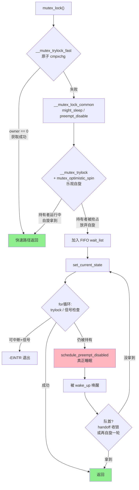
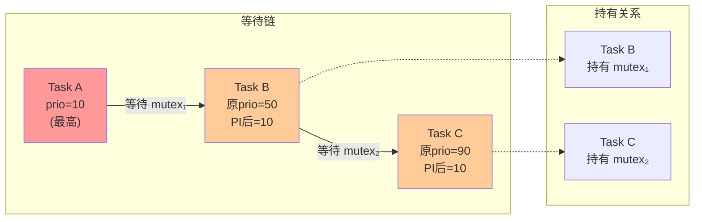

# 13.2.2 mutex的实现与优先级继承

> 所属章节：第13章 并发与同步 > 13.2 spinlock与mutex
>
> 难度：[E→M] | 预计阅读时间：25分钟

## <span class="blue"> 本节导读

本节覆盖：mutex 在 v6.6 的真实实现（快速路径原子交换 → 乐观自旋 → FIFO 等待队列睡眠）、handoff 移交优化、优先级反转问题与优先级继承（PI）的基本原理，以及 rt_mutex 与 PREEMPT_RT 的关系——包括几处常见资料中的错误说法澄清。

---

## <span class="blue"> mutex的实现机制：从原子指令到等待队列 [E→M]

### 快速路径：一条指令定胜负

mutex 的核心字段是 `atomic_long_t owner`：值为 0 表示无人持有，非 0 则是持有者的 `task_struct` 指针（低位几个 bit 兼作标志位）。调用 `mutex_lock()` 时先走**快速路径**（kernel/locking/mutex.c，v6.6 真实代码）：

```c
static __always_inline bool __mutex_trylock_fast(struct mutex *lock)
{
	unsigned long curr = (unsigned long)current;
	unsigned long zero = 0UL;

	if (atomic_long_try_cmpxchg_acquire(&lock->owner, &zero, curr))
		return true;
	return false;
}
```

`atomic_long_try_cmpxchg_acquire` 用 CPU 的原子比较-交换指令，在一条不可中断的操作里检查"owner 是否为 0"，是就写入自己。无队列、无睡眠。非高度争用时绝大多数获取都走这条路。

### 慢速路径：先乐观自旋，再排队睡觉

快速路径失败，进入 `__mutex_lock_common()`（mutex.c:569）。v6.6 的慢速路径比旧资料里"直接入队睡眠"的实现多了一步关键环节——**乐观自旋（optimistic spinning）**。整体流程：

```c
__mutex_lock_common(lock, state, ...)              /* mutex.c:569 */
{
	might_sleep();                                /* 原子上下文里调用直接告警 */

	preempt_disable();

	/* 第一步：持 wait_lock 再试一次快速获取 */
	if (__mutex_trylock(lock) ||
	    mutex_optimistic_spin(lock, ww_ctx, NULL))  /* 第二步：乐观自旋 */
		goto acquired;                            /* 拿到了，不走睡眠 */

	raw_spin_lock(&lock->wait_lock);

	/* 第三步：加入等待队列末尾（FIFO，list_head 链表） */
	__mutex_add_waiter(lock, &waiter, &lock->wait_list);

	set_current_state(state);
	for (;;) {
		if (__mutex_trylock(lock))
			goto acquired;

		if (signal_pending_state(state, current)) {
			ret = -EINTR;                  /* 可中断版本被信号打断 */
			goto err;
		}

		raw_spin_unlock(&lock->wait_lock);
		schedule_preempt_disabled();          /* 第四步：真正睡眠 */

		set_current_state(state);
		if (__mutex_trylock_or_handoff(lock, first))
			break;

		/* 队首等待者被唤醒后再自旋一轮，避免刚醒又睡 */
		if (first && mutex_optimistic_spin(lock, ww_ctx, &waiter))
			break;

		raw_spin_lock(&lock->wait_lock);
	}
}
```

**乐观自旋**（`mutex_optimistic_spin`，mutex.c:441）是 v6.6 mutex 性能的关键：获取失败后**不立刻睡眠**，而是先自旋等待持有者释放——因为多数临界区很短，持有者很可能在几十纳秒内就解锁，这时候自旋比"睡眠+唤醒"两次上下文切换（微秒级开销）划算得多。自旋的前提条件是持有者正在别的 CPU 上运行（`mutex_can_spin_on_owner` 检查）；持有者一旦被抢占或睡眠，自旋立即放弃转入排队。为避免多个自旋者踩踏，自旋前要先拿一个 MCS 队列锁（`osq_lock`）排队自旋资格。

过了自旋这关仍没拿到锁，才真正加入等待队列。注意两点与常见旧资料的出入：

- **等待队列是 FIFO 的 `list_head` 链表**（`lock->wait_list`），不是红黑树。按优先级排序的红黑树是 rt_mutex 的结构，见下文。
- 双重检查模式（入队后睡眠前再 trylock 一次）仍然存在，防止"刚入队对方就释放"的竞态导致睡眠丢失唤醒。

### 释放与 handoff 移交

`mutex_unlock()` 的慢速路径（`__mutex_unlock_slowpath`）从等待队列取出队首等待者，通过 `__mutex_handoff()`（mutex.c:231）把 `MUTEX_FLAG_HANDOFF` 标志（mutex.c:69）写进 owner，**直接把所有权移交给队首**，再唤醒它：

```c
/* __mutex_unlock_slowpath 尾部（mutex.c:946 附近） */
if (owner & MUTEX_FLAG_HANDOFF)
	__mutex_handoff(lock, next);

wake_up_process(next->task);
```

> 💡 handoff 的意义：释放者不是简单清空 owner 让所有等待者醒来自抢，而是把锁"递"给队首。队首被唤醒后通过 `__mutex_trylock_or_handoff` 直接收锁，避免了 Thundering Herd（一群等待者同时惊醒抢一把锁）和抢锁失败重新入睡的往返。

> ⚠️ `mutex_lock()` 会调用 `schedule()` 睡眠。中断上下文、软中断、以及持有 spinlock 期间**禁止**调用，否则触发 `BUG: scheduling while atomic`。规则一句话：**能睡眠的地方才能用 mutex，不能睡眠的地方只能用 spinlock。**

---

## <span class="blue"> 优先级继承与rt_mutex [M]

### 优先级反转

三个任务：H（高优先级，负责紧急停止）、M（中优先级，记日志）、L（低优先级，读传感器）。L 持有保护传感器数据的 mutex；H 被触发后也要拿这把锁，只能等 L 释放——这本身正常。问题是 L 释放前 M 被唤醒，M 抢占 L，L 迟迟跑不到解锁点，于是**最高优先级的 H 被中优先级的 M 间接堵住**，阻塞时间不可预期。这就是**优先级反转**（Priority Inversion），在实时系统中意味着关键任务错过截止时间。

### 优先级继承PI

解决思路：**当高优先级任务阻塞在 mutex 上时，临时把持有者的优先级提升到等待者的级别**，持有者释放后恢复。回到上面的场景：H 等 L → L 被提升到 H 的优先级 → M 抢不动 L → L 尽快跑完临界区释放 → H 立即获得锁。H 的阻塞时间被收敛到"L 的临界区长度"，不再受 M 影响。

锁等待还可以成链：A 等 B 持有的锁，B 又在等 C 持有的锁。PI 会**沿等待链递归传播**——C 也被提升到 A 的优先级，否则链中间的环节照样能被无关的中优先级任务抢占。v6.6 中这个传播由 `rt_mutex_adjust_prio_chain()`（kernel/locking/rtmutex.c:655）实现。

> 💡 PI 的完整实现细节（rt_mutex 源码路径、PI-futex、著名的火星探路者优先级反转案例）在 **8.4.2** 有深入展开，本节只建立概念，不重复。

### rt_mutex：真正带PI的锁

先澄清一个广泛流传的错误说法：**标准 `struct mutex` 没有 PI 代码框架，任何配置下都不提供优先级继承**。提供 PI 的是另一套独立实现——**rt_mutex**。它的核心数据结构（include/linux/rtmutex.h:23）：

```c
struct rt_mutex_base {
	raw_spinlock_t		wait_lock;   /* 保护本结构 */
	struct rb_root_cached	waiters;     /* 按优先级排序的红黑树等待队列 */
	struct task_struct	*owner;
};
```

等待者放在**红黑树**里按优先级排序，唤醒时直接取最高优先级的那个——这就是上文说的"红黑树是 rt_mutex 的，不是 mutex 的"。普通内核里 rt_mutex 的主要用户是 PI-futex（用户态实时锁）；启用 `CONFIG_PREEMPT_RT` 后，它成为内核锁的底座。

关于 PREEMPT_RT 还有第二个常见错误需要澄清：

> ⚠️ "PREEMPT_RT 把所有 mutex 和 semaphore 替换为 rt_mutex"——**这是错的**。按官方文档 Documentation/locking/locktypes.rst：RT 下被转成基于 rt_mutex 的睡眠锁的是 **`spinlock_t`、`rwlock_t`、`local_lock`**（外加 `rw_semaphore`）；**`mutex` 和 `semaphore` 不做替换**——mutex 本来就是进程上下文的睡眠锁，RT 不改动它。RT 锁转换的完整对照表见 **10.4.3**，本节不展开。

第三个要澄清的错误：**rt_mutex 不支持递归获取**。有些资料（以及从 Windows 转过来的经验）声称 rt_mutex 是"递归锁"、同一任务可重复加锁计数——v6.6 源码中不存在任何递归支持，同一任务对同一把 rt_mutex 二次加锁就是自死锁。事实上**整个 Linux 内核的锁都不支持递归**（spinlock、mutex、rt_mutex 无一例外），重入需求的正确解法是重构调用路径、消除重入，而不是找一把"能重入的锁"。详见 13.2.4。

### mutex vs spinlock：全面对比

| 维度 | spinlock | mutex |
|------|----------|-------|
| **等待方式** | 忙等（CPU 空转） | 先乐观自旋，失败后睡眠 |
| **上下文要求** | 任何上下文（中断、进程均可） | **仅进程上下文** |
| **临界区长度** | 短（微秒级，无阻塞操作） | 可长（允许 IO、内存分配等） |
| **优先级继承** | 无 | 无（PI 由独立的 rt_mutex 提供） |
| **性能开销** | 低（无上下文切换） | 高（争用时两次上下文切换） |
| **递归获取** | 不支持（自死锁） | 不支持（自死锁） |
| **等待队列** | MCS 队列（qspinlock） | FIFO 链表 `wait_list` |
| **公平性** | qspinlock 按队列顺序，较公平 | FIFO + handoff，较公平 |
| **适用场景** | 修改共享计数器、链表头插入 | 文件系统操作、设备访问 |
| **调试支持** | lockdep 追踪 | lockdep + 所有者追踪 |

> ⚠️ `spin_lock()` 与 `mutex_lock()` 的嵌套顺序只有一条铁律：**持 spinlock 期间再调 `mutex_lock()`——禁止**（持 spinlock 禁止睡眠）；**持 mutex 期间再拿 spinlock——可以**（mutex 上下文允许睡眠，而 spinlock 的临界区本来就不睡）。两条规则记牢：**先 mutex 后 spinlock 可以，反过来不行；mutex 里可以睡，spinlock 里不能睡。**

---

## <span class="blue"> 本节总结

| 要点 | 一句话总结 |
|------|-----------|
| mutex 快速路径 | `atomic_long_try_cmpxchg_acquire` 一条指令尝试获取 |
| 乐观自旋 | 获取失败先自旋等持有者释放，持有者被抢占才放弃（v6.6 慢速路径的第一站） |
| mutex 慢速路径 | 入 FIFO `wait_list` → `set_current_state` → 循环 trylock + `schedule()` 睡眠 → 唤醒重试 |
| handoff | 释放时把所有权直接移交队首，避免群抢 |
| 优先级继承 PI | 高优先级任务阻塞时，临时提升持有者优先级，沿等待链递归传播 |
| PI 的归属 | 标准 mutex 无 PI；PI 由 rt_mutex 提供（红黑树等待队列），深入内容见 8.4.2 |
| PREEMPT_RT | 转换的是 spinlock_t/rwlock_t/local_lock/rw_semaphore，不替换 mutex；详见 10.4.3 |
| 递归获取 | Linux 内核锁（含 rt_mutex）一律不支持，重入靠重构解决 |
| 最大禁忌 | mutex 不能在中断/软中断/spinlock 保护区中使用 |

---

## <span class="blue"> 下一步

spinlock 和 mutex 的机制都清楚了，剩下的是工程决策：给一个具体临界区，选哪把锁？

> **13.2.3 spinlock vs mutex选择决策树**

---

## <span class="blue"> 配套资源

| 资源类型 | 内容 | 位置 |
|----------|------|------|
| 图示 | mutex 获取完整流程（快速→自旋→排队睡眠→唤醒） | 见下方 mermaid 图 |
| 图示 | PI 优先级链式传播示意 | 见下方 mermaid 图 |
| 代码清单 | v6.6 真实代码：快速路径 / `__mutex_lock_common` / `rt_mutex_base` | 见正文代码块 |
| 对比表格 | spinlock vs mutex 10 维度对比 | 见正文表格 |
| 内核源码 | `kernel/locking/mutex.c`（v6.6） | Linux 源码 |
| 内核源码 | `kernel/locking/rtmutex.c`、`include/linux/rtmutex.h` | Linux 源码 |
| 内核文档 | `Documentation/locking/locktypes.rst`（RT 锁转换口径） | Linux 源码 |

### mermaid图：mutex获取完整流程（v6.6）



### mermaid图：PI优先级链式传播



<br><br>

> 🔴 硬实时系统里注意 PI 链的长度：`rt_mutex_adjust_prio_chain()` 传播要逐级遍历等待链，链过长（十几个任务串联）会产生可测量的延迟尖峰。系统设计时应控制跨任务锁依赖的深度。
