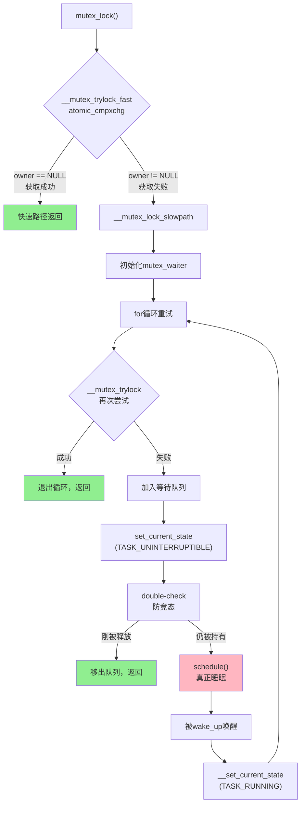
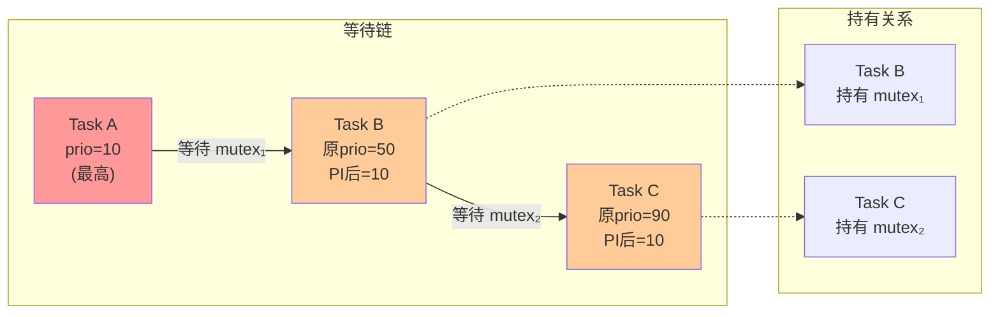

# 13.2.2 mutex的实现与优先级继承

> 所属章节：第13章 并发与同步 > 13.2 内核互斥机制
>
> 难度：[E][M] | 预计阅读时间：25分钟

## <span class="blue"> 本节导读

上一节我们搞懂了spinlock——忙等、不睡眠、适合短临界区。可如果临界区里要访问的文件系统需要读磁盘，或者要分配内存可能触发页回收，忙等就不划算了。怎么办？让拿不到锁的线程去睡觉，把CPU让给別人。<br>

本节带你深入mutex的内核实现：从一条`atomic_cmpxchg`指令走通的"快速路径"，到挤不进去只能进等待队列睡大觉的"慢速路径"，再到PREEMPT_RT中为了消灭优先级反转而引入的优先级继承（PI）机制。学完这节，你会明白为什么`mutex_lock()`里藏了一整套调度逻辑，以及为什么实时Linux要把所有mutex替换成`rt_mutex`。<br>

学完后，你将能：
- 画出mutex的完整获取流程（快速路径→慢速路径→唤醒重试）
- 解释优先级继承PI的原理和链式传播机制
- 在spinlock和mutex之间做出正确选择

---

## <span class="blue"> mutex的实现机制：从原子指令到等待队列 [E]

### 快速路径：一条指令定胜负

mutex在Linux内核里的数据结构核心是`struct mutex`，里面有一个`atomic_long_t owner`字段。这个字段既是状态标志，又记录了当前持有者的task_struct指针。<br>

当你调用`mutex_lock()`时，内核首先走**快速路径**（fast path）：

```c
/* 快速路径：尝试原子交换获取mutex */
static __always_inline bool __mutex_trylock_fast(struct mutex *lock)
{
    unsigned long curr = (unsigned long)current;
    unsigned long zero = 0UL;

    /* atomic_cmpxchg: 如果owner为0(无人持有)，则设为当前任务 */
    if (atomic_long_try_cmpxchg_acquire(&lock->owner, &zero, curr))
        return true;    /* 获取成功，直接返回 */
    return false;       /* 获取失败，走慢速路径 */
}
```

`atomic_long_try_cmpxchg_acquire`是核心。它用CPU的原子比较-交换指令，在一条不可中断的操作里检查"owner是否为空"，如果是就把自己写进去。整个过程没有锁、没有队列、没有睡眠，就是一条硬件指令的事。绝大多数情况下（尤其是非高度争用的mutex），这条路就能走通。<br>

### 慢速路径：进等待队列睡觉

快速路径失败了——有人正拿着mutex。这时候内核切换到**慢速路径**（slow path）：

```c
/* 慢速路径：获取失败，加入等待队列并进入睡眠 */
static noinline void __sched __mutex_lock_slowpath(struct mutex *lock)
{
    struct mutex_waiter waiter;

    /* 1. 准备等待者结构 */
    waiter.task = current;
    waiter.lock = lock;

    for (;;) {
        /* 2. 如果mutex已被释放，尝试获取 */
        if (__mutex_trylock(lock))
            return;

        /* 3. 将当前任务加入mutex的等待队列 */
        __mutex_add_waiter(lock, &waiter, &lock->wait_list);

        /* 4. 设置任务状态为可中断睡眠 */
        set_current_state(TASK_UNINTERRUPTIBLE);

        /* 5. 再次检查，防止在加入队列和睡眠之间mutex被释放 */
        if (__mutex_trylock(lock)) {
            __mutex_remove_waiter(lock, &waiter);
            __set_current_state(TASK_RUNNING);
            return;
        }

        /* 6. 主动放弃CPU，进入睡眠 */
        schedule();     /* <-- 这里真正发生上下文切换 */

        /* 7. 被唤醒后继续循环，回到步骤2重试 */
        __set_current_state(TASK_RUNNING);
    }
}
```

注意第5步那个双重检查（double-check）。为什么要这样？想象一下：你在排队登机，刚站到队尾还没来得及坐下，前面的人突然说"我不飞了"。如果不再次确认，你就白睡了一觉。<br>

第6步的`schedule()`是关键调用。它触发上下文切换，当前任务从运行队列移除，CPU转去执行别的任务。当持有mutex的线程最终释放时，它会从等待队列里唤醒一个睡眠者。<br>

```c
/* mutex_unlock：释放时唤醒等待队列中的下一个任务 */
static noinline void __sched __mutex_unlock_slowpath(struct mutex *lock)
{
    struct mutex_waiter *waiter;

    /* 从等待队列取出第一个等待者 */
    waiter = __mutex_get_waiter(lock);

    /* 将mutex所有权直接移交给等待者（handoff优化） */
    __mutex_handoff(lock, waiter);

    /* 唤醒等待者 */
    wake_up_process(waiter->task);
}
```

> 💡 **提示**：较新内核实现了**handoff优化**——释放mutex时不是简单清空owner然后让等待者们再去抢，而是直接把所有权转交给等待队列中的第一个任务。这减少了不必要的抢锁开销，也改善了公平性。

> ⚠️ **陷阱**：`mutex_lock()`会调用`schedule()`进入睡眠。这意味着你**绝对不能**在中断上下文、软中断、或者持有spinlock的情况下调用它！如果你这么做了，内核会打印一个`BUG: scheduling while atomic`然后 panic（如果配置了`CONFIG_BUG_ON_SCHED`）。说白了：**能睡眠的地方才能用mutex，不能睡眠的地方只能用spinlock。**

---

## <span class="blue"> 优先级继承与rt_mutex：消灭优先级反转 [M]

### 优先级反转：一个经典噩梦

来看一个让你血压飙升的场景：<br>

假设有三个任务：
- **H**（高优先级，prio=10）：控制机械臂紧急停止
- **M**（中优先级，prio=50）：记录日志
- **L**（低优先级，prio=90）：定期读取传感器数据

L先运行，拿到一个mutex保护传感器数据。此时H被触发需要紧急停止机械臂——它也要拿同一个mutex。但mutex在L手里，H只能等。这本身没问题。<br>

可就在L准备释放mutex之前，M被唤醒了。M的优先级比L高，于是L被抢占，M开始欢快地记日志。H呢？干等着，因为M优先级不够高，H抢不过M；但L又被M抢占了，释放不了mutex。结果：**最高优先级的H被中优先级的M堵住了。**<br>

这就是**优先级反转**（Priority Inversion）。在工业控制、汽车电子、航空航天里，这可能意味着机械臂失控或者飞机坠毁。<br>

### 优先级继承PI：临时"借"优先级

Linux的解决方案是**优先级继承**（Priority Inheritance，PI）。规则很简单：<br>

> 当高优先级任务H阻塞在mutex上，而这个mutex被低优先级任务L持有时，**临时把L的优先级提升到H的级别**。L执行完临界区、释放mutex后，优先级恢复。

回到上面的场景，有了PI之后：
- H等L的mutex → L的优先级被提升到10
- M唤醒 → 但L现在优先级是10，比M高，所以L继续执行
- L释放mutex → 优先级恢复为90 → H立即拿到mutex运行
- M继续等，因为H优先级更高<br>

问题解决！H只等了L的临界区时间，没有被M插队。<br>

### PI的链式传播

事情还能更复杂。假设任务A等着B手里的mutex₁，B又在等C手里的mutex₂。B已经被A的优先级提升了，但C还在以原始低优先级慢悠悠跑。<br>

Linux的PI机制会**链式传播**：A的优先级沿着等待链传递，C也会被提升到A的优先级！<br>

```
优先级链式传播示意图：

  原始优先级:      A(prio=10)          B(prio=50)          C(prio=90)
                    |                   |                   |
                    | 等待mutex₁        | 持有mutex₁        | 持有mutex₂
                    | 被B持有           | 等待mutex₂        |
                    v                   v 被C持有            v
                [阻塞]              [阻塞]              [运行，但] 
                                                        [会被提]
                                                        [升到10]

  PI生效后:      A(prio=10)         B(prio=10)          C(prio=10)
                    |                  |                   |
                    |  A还在等B        |  B还在等C         |  C以prio=10运行
                    v                  v                   v
                [阻塞]             [阻塞]              [尽快释放mutex₂]
```

PI链式传播由内核的`rt_mutex_adjust_prio_chain()`函数递归处理。它能沿着等待链无限传播（当然有递归深度限制，防止死循环），确保链上所有任务的优先级都被正确提升。<br>

### rt_mutex：PREEMPT_RT中的实时mutex

标准Linux内核的`struct mutex`虽然有PI相关的代码框架，但默认并不启用完整PI。真正的全功能PI实现在**`rt_mutex`**（实时mutex）中。<br>

当你启用`CONFIG_PREEMPT_RT`（实时补丁）时，一个颠覆性的事情发生了：<br>

> 💡 **提示**：`CONFIG_PREEMPT_RT`会把内核中**所有的`mutex`和`semaphore`**替换为`rt_mutex`。整个内核的互斥机制都带上了优先级继承。这是PREEMPT_RT能达到微秒级延迟的关键之一——高优先级任务不会因为低优先级任务持有内核锁而被无限期阻塞。<br>

`struct rt_mutex`比标准mutex更复杂：

```c
/* rt_mutex 数据结构（简化版） */
struct rt_mutex {
    raw_spinlock_t          wait_lock;    /* 保护本结构体的spinlock */
    struct rb_root_cached   waiters;      /* 按优先级排序的红黑树等待队列 */
    struct task_struct      *owner;       /* 持有者，包含PI信息 */
    /* ... PI相关字段 ... */
};
```

注意等待队列用的是**红黑树**而不是链表。为什么？因为等待者需要按优先级排序，唤醒时总是选优先级最高的那个。红黑树的O(log n)插入比链表的O(n)更适合高频优先级调整的场景。<br>

rt_mutex还支持**嵌套获取**（递归锁）：同一个任务可以多次`rt_mutex_lock()`同一个mutex，每次计数加一，解锁计数减一到零时才真正释放。这对某些复杂调用链很有用，不过用的时候要格外小心——嵌套层级太深容易把自己绕晕。<br>

### mutex vs spinlock：全面对比

前面两节分别讲了spinlock和mutex，现在一张表格把它们彻底对比清楚：<br>

| 维度 | spinlock | mutex |
|------|----------|-------|
| **等待方式** | 忙等（CPU空转） | 睡眠（释放CPU） |
| **上下文要求** | 任何上下文（中断、进程均可） | **仅进程上下文** |
| **临界区长度** | 短（几行代码，无IO） | 长（可阻塞操作、IO） |
| **优先级继承** | 无（raw_spinlock明确不支持） | 有（rt_mutex完整PI） |
| **性能开销** | 低（无上下文切换） | 高（两次上下文切换：睡+醒） |
| **嵌套支持** | 否（递归获取会死锁） | 是（rt_mutex支持递归） |
| **公平性** | 先到先得不保证（Ticket/MCS有） | FIFO等待队列，较公平 |
| **适用场景** | 修改共享计数器、链表头插入 | 文件系统操作、设备访问 |
| **内存占用** | 极小（一个整数） | 较大（struct mutex ≈ 40字节） |
| **调试支持** | lockdep追踪 | lockdep + 所有者追踪 + 超时检测 |

> ⚠️ **陷阱**：`spin_lock()`和`mutex_lock()`混用是并发编程里的经典错误模式。比如先拿spinlock再调用`mutex_lock()`——后者会睡眠，但前者禁止睡眠，结果就是`BUG: scheduling while atomic`。反过来也不行：`mutex_lock()`里不能拿spinlock去保护一个会睡眠的操作。两条规则记牢：**先拿mutex再拿spinlock可以，反过来不行；mutex里可以睡，spinlock里不能睡。**

---

## <span class="blue"> 本节总结

| 要点 | 一句话总结 |
|------|-----------|
| mutex快速路径 | `atomic_cmpxchg`一条指令尝试获取，无锁无睡眠 |
| mutex慢速路径 | 加入等待队列→`set_current_state(TASK_UNINTERRUPTIBLE)`→`schedule()`睡觉→被唤醒重试 |
| 等待队列实现 | 基于`waitqueue`机制，较新内核用红黑树按优先级排序 |
| 优先级继承PI | 高优先级任务阻塞时，临时提升低优先级持有者的优先级 |
| PI链式传播 | 优先级沿等待链递归传递，防止多级优先级反转 |
| rt_mutex | PREEMPT_RT中的实时mutex，完整PI支持，红黑树等待队列，可嵌套 |
| 最大陷阱 | mutex不能在中断上下文、软中断、spinlock保护区中使用（会睡眠） |
| 选择原则 | 短临界区+不能睡→spinlock；长临界区+进程上下文→mutex |

---

## <span class="blue"> 下一步

掌握了spinlock和mutex的内部机制，下一节（13.2.3）我们要解决一个实际决策问题：**给你一个临界区，到底选spinlock还是mutex？** 我们会构建一个决策树，综合临界区长度、上下文类型、是否需要PI、延迟要求等因素，帮你做出正确选择。<br>

---

## <span class="blue"> 配套资源

| 资源类型 | 内容 | 位置 |
|----------|------|------|
| 图示 | mutex获取完整流程（快速→慢速→唤醒） | 见下方mermaid图 |
| 图示 | PI优先级链式传播示意 | 见下方mermaid图 |
| 代码清单 | `mutex_lock()`快速/慢速路径 + `rt_mutex`数据结构 | 见正文代码块 |
| 对比表格 | spinlock vs mutex 10维度全面对比 | 见正文表格 |
| 内核源码 | `kernel/locking/mutex.c` | Linux源码 |
| 内核源码 | `kernel/locking/rtmutex.c` | Linux源码 |

### mermaid图：mutex获取完整流程



### mermaid图：PI优先级链式传播



<br><br>

> 🔴 **危险**：如果你正在开发`CONFIG_PREEMPT_RT`实时系统，记住`rt_mutex`的PI链式传播虽然强大，但调整优先级链需要遍历数据结构，最坏情况下的延迟是可测量的。在极端硬实时场景里，优先级链过长（比如十几个任务串成链）可能导致意外的延迟尖峰。设计系统时应尽量减少跨任务锁的依赖深度。
