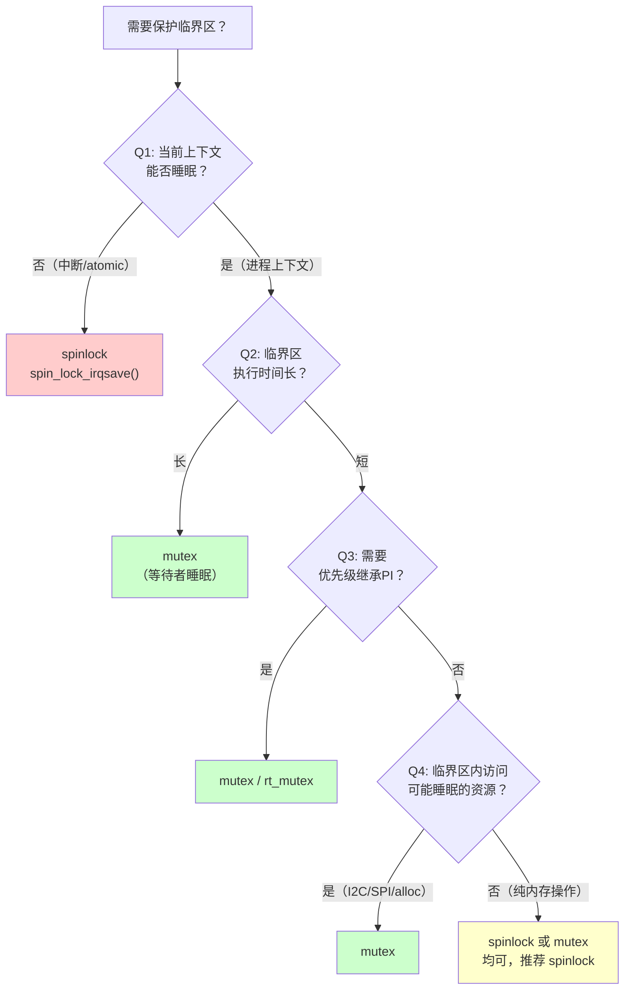

# 13.2.3 Spinlock vs Mutex 选择决策树

> 所属章节：第13章 并发与同步 > 13.2 内核同步原语
>
> 难度：[I][M] | 预计阅读时间：12分钟

## <span class="blue"> 本节导读

`spinlock` 还是 `mutex`？这是每个写内核代码的人都要面对的灵魂拷问。选对了，代码稳如老狗；选错了，要么浪费 CPU 空转，要么直接触发 "sleeping function called from invalid context" 的 oops。<br>

本节带你走一遍决策树的四个关键判断节点，用一张流程图 + 两个速查表格，帮你快速做出正确选择。学完后，你将能在 5 秒钟内判断当前场景该用哪种锁，并且知道常见的错误选择会导致什么后果。

## <span class="blue"> 决策树：四问定锁型 [I]

面对临界区保护需求，别急着写代码。先问自己四个问题，答案会自然引导你走向正确的锁类型。

### 第一问：当前上下文能否睡眠？

这是最致命的分水岭。

如果你在中断上下文（hardirq、softirq、tasklet）、持有自旋锁期间、或者在 `preempt_disable()` 保护的区域内——**绝对不能睡眠**。这时 `mutex` 是禁选项，因为它内部会调用 `might_sleep()`。只能选 `spinlock`（或更精确的 `raw_spinlock`）。<br>

反过来说，如果你在普通的进程上下文（`process context`），没有禁止抢占，没有持有任何自旋锁，那你可以睡眠。这时 `mutex` 和 `spinlock` 都可选，但别急着选，继续往下看。

### 第二问：临界区执行时间长吗？

能睡眠的上下文中，第二个判断标准是临界区的长度。

`spinlock` 的本质是忙等待——CPU 疯狂地执行 `while (locked);` 这条指令，直到锁释放。临界区只有几条指令？没问题，空转时间忽略不计。但临界区里要遍历一个链表、拷贝一块缓冲区、或者调用复杂的计算逻辑？这时候用 `spinlock` 就是在浪费 CPU 周期，其他 CPU 上的线程干瞪眼等着。<br>

**经验法则**：临界区超过 "几十个 CPU 周期" 或者 "可能触发 cache miss" 的操作，优先考虑 `mutex`。`mutex` 会让等待者睡眠，把 CPU 让给其他任务，系统整体的吞吐率更好。

### 第三问：需要优先级继承吗？

如果你的系统开启了 `CONFIG_PREEMPT_RT`（实时抢占补丁），或者你写的代码需要面对优先级反转问题，这问就很关键。

`mutex` 支持优先级继承协议（PI, Priority Inheritance）。当一个高优先级任务被一个低优先级任务持有的 `mutex` 阻塞时，低优先级任务会临时提升到高优先级，尽快释放锁。`spinlock` 不做这种事情——在 RT 内核中，普通的 `spinlock` 甚至被实现为可以睡眠的互斥体（通过 `rt_mutex` 转换），但行为语义仍然保持兼容。<br>

需要 PI？→ `mutex`（或 `rt_mutex`）。不需要？→ 继续看。

### 第四问：临界区内会访问可能睡眠的资源吗？

有时候你以为临界区很短，但里面藏了一个 "地雷"。

比如，临界区里要读一个 I2C EEPROM 获取配置数据，或者要从 SPI Flash 加载固件。I2C/SPI 总线操作内部会调用 `msleep()` 等待硬件应答。这时候如果你用了 `spinlock`，进去之后调用 I2C 传输函数 → 尝试睡眠 → oops。<br>

**任何涉及 I/O、内存分配（`kmalloc` 不带 `GFP_ATOMIC`）、用户空间拷贝的操作，默认视为"可能睡眠"**。

把上面四问串起来，就是这个决策流程：



> 💡 **提示**："能睡用 mutex，不能睡用 spinlock，不确定用 irqsave"。这句话背下来，关键时刻能救命。最后一句话的意思是：如果你不确定当前上下文是否可能被中断打断，直接用 `spin_lock_irqsave()`——它自动关中断并保存中断状态，是最安全的保守策略。

## <span class="blue"> 选择决策速查表 [M]

下面这张表覆盖了内核开发中最常见的场景，直接对号入座：

| 场景 | 推荐选择 | 理由 | 错误选择的后果 |
|------|---------|------|--------------|
| 中断处理函数（hardirq） | `spin_lock_irqsave()` | 中断上下文不能睡眠 | 用 `mutex` → 睡眠 → oops 崩溃 |
| Tasklet / Softirq | `spin_lock()` | 软中断上下文不能睡眠 | 用 `mutex` → 同样的 oops |
| 进程上下文 + 长临界区 | `mutex` | 等待者睡眠，不浪费 CPU | 用 `spinlock` → 其他 CPU 空转，系统卡顿 |
| 进程上下文 + 短临界区 | `spinlock` 或 `mutex` | 都可以，spinlock 开销更低 | 用 `mutex` → 上下文切换开销反而更大 |
| 访问 I2C / SPI 设备 | `mutex` | 总线传输可能睡眠等待 | 用 `spinlock` → 传输函数尝试睡眠 → oops |
| RT 实时内核 + 优先级敏感 | `rt_mutex` | 支持优先级继承，防反转 | 用普通 `spinlock` → 优先级反转，实时性破坏 |
| 不确定中断状态时 | `spin_lock_irqsave()` | 保守策略，自动关中断保存状态 | 用 `spin_lock()` → 可能被同中断打断 → 死锁 |
| 仅本 CPU 访问的 per-CPU 数据 | 不需要锁 | 天然避免跨 CPU 竞争 | 加任何锁 → 纯浪费 |

## <span class="blue"> 错误选择案例分析 [M]

理论说完了，看看真实世界里那些踩过的坑。

### 案例一：进程上下文用 spinlock 保护 I2C 通信

```c
/* 错误代码 */
static DEFINE_SPINLOCK(eeprom_lock);

static int read_eeprom(struct device *dev, u8 *buf, int len)
{
    unsigned long flags;
    spin_lock_irqsave(&eeprom_lock, flags);  /* 错了！ */
    i2c_master_recv(client, buf, len);       /* 内部可能睡眠 */
    spin_unlock_irqrestore(&eeprom_lock, flags);
    return 0;
}
```

I2C 控制器驱动内部会等待总线应答，这个等待过程会调用 `msleep()` 或类似的睡眠函数。你在 `spinlock` 保护的临界区里调用它？boom——"scheduling while atomic"。

**修复**：把 `spin_lock_irqsave` 换成 `mutex_lock(&eeprom_mutex)`，完全解决问题。

### 案例二：中断上下文中用 mutex

```c
/* 错误代码 */
static DEFINE_MUTEX(sensor_mutex);

irqreturn_t sensor_irq_handler(int irq, void *dev_id)
{
    mutex_lock(&sensor_mutex);  /* 大错特错！ */
    /* 读取传感器数据... */
    mutex_unlock(&sensor_mutex);
    return IRQ_HANDLED;
}
```

中断处理函数运行在中断上下文，`mutex_lock()` 第一件事就是检查 `might_sleep()`，然后尝试获取锁失败时会调用 `schedule()` 把自己挂起。中断上下文能调度吗？不能。结果就是一个漂亮的 oops，堆栈里躺着 `__schedule_bug`。

**修复**：中断里用 `spin_lock_irqsave(&sensor_lock, flags)`。如果临界区确实长，考虑中断上半部只做 "唤醒下半部" 的工作，把实际处理放到进程上下文的 workqueue 或 threaded IRQ 里再做。

### 案例三：长临界区用 spinlock

```c
/* 错误代码 */
static DEFINE_SPINLOCK(hash_lock);

void process_packets(struct packet *pkts, int n)
{
    unsigned long flags;
    spin_lock_irqsave(&hash_lock, flags);
    for (int i = 0; i < n; i++) {
        /* 遍历一个巨大的 hash 表做匹配、重组、超时检查 */
        hash_table_lookup_and_reassemble(pkts[i]);  /* 可能执行很久 */
    }
    spin_unlock_irqrestore(&hash_lock, flags);
}
```

这个场景在网络协议栈里特别常见。一个 hash 表有成百上千个桶，遍历一遍、做超时检查、重组分片……在 `spinlock` 保护下干这些，其他 CPU 就在那硬等。系统出现明显卡顿，网卡队列溢出，丢包。

**修复**：用 `mutex_lock(&hash_mutex)` 替代。如果 hash 表可以拆分成多个 bucket 锁，还可以进一步用细粒度的 `spinlock` 数组来降低竞争。

| 错误 | 后果 | 修复方案 |
|------|------|---------|
| 进程上下文用 `spinlock` 保护 I2C/SPI | "scheduling while atomic" oops | 换 `mutex` |
| 中断上下文用 `mutex` | `__schedule_bug` oops 崩溃 | 换 `spin_lock_irqsave()` |
| 长临界区用 `spinlock` | 其他 CPU 空转，系统卡顿 | 换 `mutex` 或拆细粒度锁 |
| 不确定中断状态用 `spin_lock()` | 同中断重入导致死锁 | 换 `spin_lock_irqsave()` |

> ⚠️ **陷阱**：在进程上下文中用 `spinlock` 保护长临界区，等于白白浪费 CPU。你可能会说"但我测试的时候没问题啊"——那是因为你的测试环境 CPU 负载低、核数多。一到生产环境高并发场景，这个问题就会暴露出来，而且定位起来极其痛苦。

> 🔴 **危险**：永远不要在中断上下文里调用任何可能睡眠的函数。这条红线包括但不限于：`mutex_lock()`、`kmalloc(GFP_KERNEL)`、`copy_from_user()`、`schedule()` 以及所有的 I/O 操作。不确定一个函数是否睡眠？查它的源码，看有没有 `might_sleep()` 宏。

## <span class="blue"> 本节总结

| 检查项 | 关键要点 |
|--------|---------|
| 第一问 | 不能睡眠的上下文（中断/atomic）→ 必须用 `spinlock` |
| 第二问 | 临界区长 → `mutex`，短 → `spinlock` 或 `mutex` |
| 第三问 | 需要优先级继承 → `mutex` / `rt_mutex` |
| 第四问 | 临界区访问 I2C/SPI/alloc → 必须用 `mutex` |
| 保守策略 | 不确定时 → `spin_lock_irqsave()` |
| 核心口诀 | "能睡用 mutex，不能睡用 spinlock，不确定用 irqsave" |

本节讲完了决策树的四个判断节点和三个典型错误案例。记住那个口诀——它会在你面对各种上下文时，帮你快速做出正确的选择。

## <span class="blue"> 下一步

锁选对了只是第一步。现实世界中，你很少只用一个锁——多个锁嵌套使用的情况比比皆是。但锁的嵌套顺序一旦出错，就是经典的死锁（Deadlock）：A 等 B、B 等 A，双双卡住。接下来 **13.2.4 锁的嵌套与死锁预防**，我们来聊聊如何安全地嵌套多个锁，以及内核提供的 lockdep 神器如何帮你自动检测潜在的死锁风险。

## <span class="blue"> 配套资源

| 资源类型 | 内容 | 说明 |
|---------|------|------|
| 图示 | mermaid 决策流程图 | 本节的四问决策树，建议打印贴桌边 |
| 表格 | 选择决策速查表 | 7 种常见场景的对号入座指南 |
| 表格 | 错误选择案例表 | 4 种典型错误 + 后果 + 修复方案 |
| 代码 | 三个错误案例的 C 代码片段 | 可直接对照自己的代码做审查 |
| 口诀 | "能睡用mutex，不能睡用spinlock，不确定用irqsave" | 背下来，关键时刻救命 |
