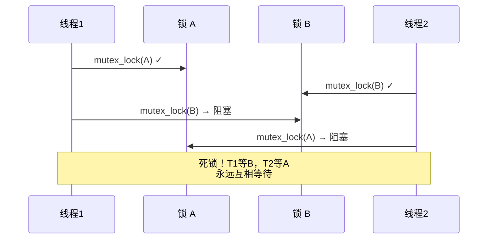

# 13.2.4 锁的嵌套与死锁预防

> 所属章节：第13章 并发与同步 > 13.2 spinlock与mutex
>
> 难度：[E] | 预计阅读时间：12分钟

## <span class="blue"> 本节导读

本节覆盖：多锁环境下的四种典型并发故障（AB-BA 死锁、重入死锁、IRQ 反转、优先级反转）、锁分级与 trylock 回退两种核心防御策略，以及"同一线程需要重复拿同一把锁"时的正确解法——为什么不是找一把递归锁，而是重构调用路径。

---

## <span class="blue"> 多锁场景下的并发故障全景图 [E]

### 四种典型并发故障

死锁不是只有一种"互相等待"的面孔。在内核多锁编程中，你至少会碰到下面四种故障（注意第四种不是死锁，但同样致命）：

| 类型 | 触发条件 | 典型示例 | 预防方法 |
|------|---------|---------|---------|
| AB-BA 死锁 | 两个线程以**相反顺序**获取两个锁 | 线程1: A→B, 线程2: B→A | 全局一致的加锁顺序 |
| 重入死锁 | 同一线程重复获取**不支持递归**的锁 | 持锁后调用了同样加锁的函数 | 重构调用路径消除重入 |
| IRQ 反转 | irq-safe 与 irq-unsafe 路径争用同一锁 | 进程上下文持有锁时被硬中断打断 | 统一加 `spin_lock_irqsave()` |
| 优先级反转 | 高优先级任务被低优先级任务持有的锁阻塞 | 高优线程等低优线程释放锁 | 使用带 PI 的 rt_mutex（见 13.2.2） |

<br>

> ⚠️ 锁的获取顺序不一致是 AB-BA 死锁的根源。哪怕只有两把锁，只要两个路径的顺序不同，死锁就一定会发生——不是"可能"，是"一定"。

### AB-BA 死锁的时序

用 Mermaid 图直观展示两个线程如何"互相卡住"：



两条对角线一交叉，系统就挂了。而且死锁问题在测试阶段极难复现——它依赖于特定的调度时序，可能上线三个月才爆发一次。

---

### 锁分级（Lock Leveling）

怎么从根本上消灭 AB-BA 死锁？答案是**锁分级**：给系统中每个锁分配一个全局唯一的级别编号，规定只能按**从低到高**的顺序获取。

```c
/* 锁分级示例：全局级别定义 */
enum lock_level {
    LEVEL_DEVICE_LIST = 1,   /* 设备链表锁 —— 最底层 */
    LEVEL_IO_QUEUE    = 2,   /* I/O 请求队列锁 */
    LEVEL_BUFFER_POOL = 3,   /* 缓冲区池锁 —— 更高层 */
    LEVEL_USER_DATA   = 4,   /* 用户数据锁 —— 最高层 */
};

struct my_lock {
    struct mutex     mutex;
    enum lock_level  level;  /* 每个锁携带自己的级别 */
};

/* 安全的嵌套加锁：只能低 → 高 */
void safe_nested_lock(struct my_lock *first, struct my_lock *second)
{
    /* 用级别比较确定顺序，保证全局一致 */
    if (first->level < second->level) {
        mutex_lock(&first->mutex);
        mutex_lock(&second->mutex);
    } else if (first->level > second->level) {
        mutex_lock(&second->mutex);
        mutex_lock(&first->mutex);
    } else {
        /* 同级锁不允许嵌套！需要重构设计 */
        WARN_ONCE(1, "同层级锁嵌套，死锁风险!\n");
    }
}
```

关键点在于：**级别比较必须覆盖所有代码路径**。无论是正常流程还是错误处理，只要同时需要两把锁，就必须走 `safe_nested_lock` 这样的统一入口。

---

### trylock + 回退策略

锁分级有个限制——它需要你在编码时就确定所有锁的级别关系。那如果锁的集合是动态变化的呢？比如一个网络包处理函数需要根据协议类型获取不同的锁？

这时可以用 **trylock + 回退**：

```c
/* trylock 回退策略示例 */
int process_with_retry(struct mutex *lock_a, struct mutex *lock_b)
{
    int retries = MAX_RETRIES;

    while (retries--) {
        /* 步骤1：用 trylock 尝试获取第一把锁 */
        if (mutex_trylock(lock_a)) {
            /* 步骤2：继续 trylock 第二把 */
            if (mutex_trylock(lock_b))
                goto success;   /* 两把都拿到了！ */

            /* 步骤3：B 失败，释放已拿到的 A */
            mutex_unlock(lock_a);
        }

        /* 步骤4：等一小段时间后重试 */
        usleep_range(100, 200);  /* 避免忙等 */
    }
    return -EBUSY;  /* 重试耗尽，返回错误 */

success:
    /* 执行业务逻辑... */
    do_work();

    /* 必须按反向顺序释放 */
    mutex_unlock(lock_b);
    mutex_unlock(lock_a);
    return 0;
}
```

这个策略的核心思想是"要么全拿到，要么一个都不拿"。它避免了传统阻塞式加锁中"持有 A 等 B"的危险状态。

<br>

> 💡 尽量减少锁的数量——最简单的死锁预防就是不产生死锁的条件。问问自己：这两把锁能不能合并成一个？这个全局状态能不能用 RCU 替代？

---

### 重入问题：同一线程重复拿同一把锁

有些场景下，同一线程确实会重复碰到同一把锁。比如一个驱动框架，上层调用 `read()` 时已经持有了设备锁，底层通用代码又尝试获取同一锁——第二次 `mutex_lock()` 下去，线程自己把自己锁死。

从其他操作系统（如 Windows）转过来的开发者常会去找"递归锁"（recursive lock）：同一线程可重复加锁、内部计数、解锁计数归零才释放。**Linux 内核不提供这种锁**——`spinlock`、`mutex`、`rt_mutex` 全部不支持递归，13.2.2 已说明。这不是能力缺失，是刻意的工程决策：递归锁会掩盖调用路径上的设计缺陷，让锁的所有权关系变得无法静态分析（lockdep 也帮不了你），还会破坏 PI 等机制的语义。

正确的解法是**重构调用路径**，常见两种手法：

1. **拆出无锁内部函数**：把核心逻辑提取为 `__device_read()`（约定调用方必须已持锁，内核里双下划线前缀就是这个含义），`read()` 入口加锁后调它，底层通用代码也直接调它——加锁只发生在一个入口。
2. **锁的粒度上移或下移**：要么把锁提到唯一入口统一持有，要么把锁降到真正访问共享数据的最内层，让中间层不碰锁。

```c
/* 重构后的结构：加锁入口唯一，内部函数约定"调用方持锁" */
static void __device_update(struct mydev *dev)   /* 调用方必须持有 dev->lock */
{
    /* 核心逻辑，不加锁 */
}

void device_read(struct mydev *dev)              /* 入口1 */
{
    mutex_lock(&dev->lock);
    __device_update(dev);
    /* ... */
    mutex_unlock(&dev->lock);
}

void device_write(struct mydev *dev)             /* 入口2，同一把锁 */
{
    mutex_lock(&dev->lock);
    __device_update(dev);                        /* 复用，不重复加锁 */
    /* ... */
    mutex_unlock(&dev->lock);
}
```

顺带强调：**自旋锁的重入同样致命**——持有自旋锁的上下文中再次 `spin_lock()` 同一锁，CPU 自旋到死，连 `might_sleep()` 的告警机会都没有。

---

### 死锁预防策略对比

| 策略 | 适用场景 | 代价 |
|------|---------|------|
| 锁分级（Lock Leveling） | 锁集合稳定、可静态定义 | 设计成本高，需全局维护级别 |
| trylock + 回退 | 动态锁集合、不可静态排序 | 可能活锁，需要重试机制 |
| 重构消除重入 | 同一线程必然重入的场景 | 需要梳理调用路径，改动面可能较大 |
| 锁合并（减少锁数） | 任何场景都优先考虑 | 可能降低并发度 |
| 无锁设计（RCU/原子操作） | 读多写少场景 | 编程复杂度高 |

<br>

> 🔴 优先级反转可能导致系统彻底失去实时性。在工业控制、自动驾驶等硬实时场景中，务必使用 `rt_mutex` 并利用其 PI（优先级继承）能力，确保高优先级任务不会被无限期阻塞（PI 原理见 13.2.2，深入实现见 8.4.2）。

---

## <span class="blue"> 本节总结

| 要点 | 核心结论 |
|------|---------|
| AB-BA 死锁 | 相反顺序加锁必然导致死锁，必须全局一致 |
| 锁分级 | 给锁编号，只允许低→高获取，彻底杜绝循环等待 |
| trylock 回退 | 要么全拿到要么全不拿，适合动态锁场景 |
| 重入问题 | Linux 内核锁一律不支持递归，解法是重构调用路径 |
| 优先级反转 | 实时场景必须用带 PI 的 rt_mutex |
| 终极建议 | 锁越少越好，能用一把就不用两把 |

---

## <span class="blue"> 下一步

防御死锁的"软件策略"到此为止——但还有一类并发控制根本不用锁：原子操作在指令级别保证"读-改-写"一气呵成。

> **13.3.1 原子操作的硬件基础**

## <span class="blue"> 配套资源

| 资源类型 | 内容 | 说明 |
|----------|------|------|
| 图示 | AB-BA 死锁时序图 | 见上方 Mermaid 图 |
| 代码清单 | 锁分级实现 | `enum lock_level` + 排序加锁 |
| 代码清单 | trylock 回退策略 | `process_with_retry()` 完整示例 |
| 代码清单 | 重入重构示例 | `__device_update()` 无锁内部函数模式 |
| 参考文档 | Documentation/locking/spinlocks.rst | 内核官方锁文档 |
| 参考文档 | Documentation/locking/rt-mutex.rst | RT-Mutex 设计文档 |
