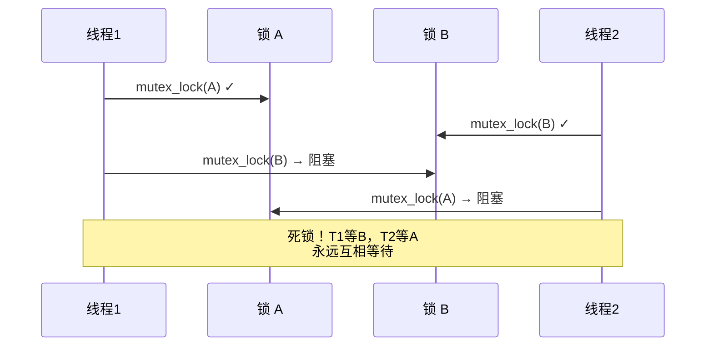

# 13.2.4 锁的嵌套与死锁预防

> 所属章节：第13章 并发与同步 > 13.2 内核互斥机制
>
> 难度：[E] Expert | 预计阅读时间：12分钟

## <span class="blue"> 本节导读

你已经掌握了自旋锁、信号量、互斥锁的基本用法。但现实项目中，一个函数往往需要同时持有多个锁——比如既要保护设备状态表（锁A），又要保护I/O请求队列（锁B）。锁一多，死锁就悄悄找上门了。<br>
本节带你深入四种典型死锁场景，掌握锁分级和trylock回退这两个核心防御策略。学完后，你将能设计出"多锁环境下不死锁"的代码架构。

---

## <span class="blue"> 多锁场景下的死锁全景图 [E]

### 四种死锁类型一览

死锁不是只有一种"互相等待"的面孔。在内核多锁编程中，你至少会碰到下面四种：

| 类型 | 触发条件 | 典型示例 | 预防方法 |
|------|---------|---------|---------|
| AB-BA 死锁 | 两个线程以**相反顺序**获取两个锁 | 线程1: A→B, 线程2: B→A | 全局一致的加锁顺序 |
| 递归死锁 | 同一线程重复获取**不支持递归**的锁 | 自旋锁内调用了同样加锁的函数 | 使用递归锁（rt_mutex）或重构代码 |
| IRQ 反转 | irq-safe 与 irq-unsafe 路径争用同一锁 | 进程上下文持有锁时被硬中断打断 | 统一加 `spin_lock_irqsave()` |
| 优先级反转 | 高优先级任务被低优先级任务持有的锁阻塞 | 高优线程等低优线程释放 mutex | 使用 PI（优先级继承）互斥锁 |

<br>

> ⚠️ **陷阱**：锁的获取顺序不一致是 AB-BA 死锁的根源。哪怕只有两把锁，只要两个路径的顺序不同，死锁就一定会发生——不是"可能"，是"一定"。

### AB-BA 死锁的时序

用 Mermaid 图直观展示两个线程如何"互相卡住"：



看出来了吗？两条对角线一交叉，系统就挂了。而且死锁问题在测试阶段极难复现——它依赖于特定的调度时序，可能上线三个月才爆发一次。

---

### 锁分级（Lock Leveling）

怎么从根本上消灭 AB-BA 死锁？答案是**锁分级**：给系统中每个锁分配一个全局唯一的级别编号，规定只能按**从低到高**的顺序获取。

```c
/* 锁分级示例：全局级别定义 */
enum lock_level {
    LEVEL_DEVICE_LIST = 1,   /* 设备链表锁 —— 最底层 */
    LEVEL_IO_QUEUE    = 2,   /* I/O 请求队列锁 */
    LEVEL_BUFFER_POOL = 3,   /* 缓冲区池锁 —— 更高层 */
    LEVEL_USER_DATA   = 4,   /* 用户数据锁 —— 最高层 */
};

struct my_lock {
    struct mutex     mutex;
    enum lock_level  level;  /* 每个锁携带自己的级别 */
};

/* 安全的嵌套加锁：只能低 → 高 */
void safe_nested_lock(struct my_lock *first, struct my_lock *second)
{
    /* 用指针比较确定顺序，保证全局一致 */
    if (first->level < second->level) {
        mutex_lock(&first->mutex);
        mutex_lock(&second->mutex);
    } else if (first->level > second->level) {
        mutex_lock(&second->mutex);
        mutex_lock(&first->mutex);
    } else {
        /* 同级锁不允许嵌套！需要重构设计 */
        WARN_ONCE(1, "同层级锁嵌套，死锁风险!\n");
    }
}
```

关键点在于：**级别比较必须覆盖所有代码路径**。无论是正常流程还是错误处理，只要同时需要两把锁，就必须走 `safe_nested_lock` 这样的统一入口。

---

### trylock + 回退策略

锁分级有个限制——它需要你在编码时就确定所有锁的级别关系。那如果锁的集合是动态变化的呢？比如一个网络包处理函数需要根据协议类型获取不同的锁？

这时可以用 **trylock + 回退**：

```c
/* trylock 回退策略示例 */
int process_with_retry(struct mutex *lock_a, struct mutex *lock_b)
{
    int retries = MAX_RETRIES;

    while (retries--) {
        /* 步骤1：用 trylock 尝试获取第一把锁 */
        if (mutex_trylock(lock_a)) {
            /* 步骤2：继续 trylock 第二把 */
            if (mutex_trylock(lock_b))
                goto success;   /* 两把都拿到了！ */

            /* 步骤3：B 失败，释放已拿到的 A */
            mutex_unlock(lock_a);
        }

        /* 步骤4：等一小段时间后重试 */
        usleep_range(100, 200);  /* 避免忙等 */
    }
    return -EBUSY;  /* 重试耗尽，返回错误 */

success:
    /* 执行业务逻辑... */
    do_work();

    /* 必须按反向顺序释放 */
    mutex_unlock(lock_b);
    mutex_unlock(lock_a);
    return 0;
}
```

这个策略的核心思想是"要么全拿到，要么一个都不拿"。它避免了传统阻塞式加锁中"持有A等B"的危险状态。

<br>

> 💡 **提示**：尽量减少锁的数量——最简单的死锁预防就是不产生死锁的条件。问问自己：这两把锁能不能合并成一个？这个全局状态能不能用 RCU 替代？

---

### 递归锁：一把锁重复获取

有些场景下，同一线程确实需要重复获取同一把锁。比如一个驱动框架，上层调用 `read()` 时已经持有了设备锁，而底层通用代码又尝试获取同一锁。

Linux 的 `rt_mutex` 支持递归语义：

```c
#include <linux/rtmutex.h>

static DEFINE_RT_MUTEX(recursive_lock);

void outer_function(void)
{
    rt_mutex_lock(&recursive_lock);   /* 第1次获取 */
    inner_function();                  /* 内部同样会加锁 */
    rt_mutex_unlock(&recursive_lock);
}

void inner_function(void)
{
    rt_mutex_lock(&recursive_lock);   /* 第2次获取 —— 递归锁允许 */
    /* 执行业务... */
    rt_mutex_unlock(&recursive_lock); /* 释放第2层 */
}
```

但注意：**自旋锁（`spinlock_t`）绝对不支持递归**。在持有自旋锁的上下文中再次 `spin_lock()` 同一锁，会导致 CPU 自旋到死。

---

### 死锁预防策略对比

| 策略 | 适用场景 | 代价 |
|------|---------|------|
| 锁分级（Lock Leveling） | 锁集合稳定、可静态定义 | 设计成本高，需全局维护级别 |
| trylock + 回退 | 动态锁集合、不可静态排序 | 可能活锁，需要重试机制 |
| 递归锁 | 同一线程必然重入的场景 | 增加锁实现的复杂度，影响性能 |
| 锁合并（减少锁数） | 任何场景都优先考虑 | 可能降低并发度 |
| 无锁设计（RCU/原子操作） | 读多写少场景 | 编程复杂度高 |

<br>

> 🔴 **危险**：优先级反转可能导致系统彻底失去实时性。在工业控制、自动驾驶等硬实时场景中，务必使用 `rt_mutex` 并开启 PI（优先级继承）功能，确保高优先级任务不会被无限期阻塞。

---

## <span class="blue"> 本节总结

| 要点 | 核心结论 |
|------|---------|
| AB-BA 死锁 | 相反顺序加锁必然导致死锁，必须全局一致 |
| 锁分级 | 给锁编号，只允许低→高获取，彻底杜绝循环等待 |
| trylock 回退 | 要么全拿到要么全不拿，适合动态锁场景 |
| 递归锁 | `rt_mutex` 支持递归，`spinlock` 绝对不支持 |
| 优先级反转 | 实时场景必须用 PI 互斥锁 |
| 终极建议 | 锁越少越好，能用一把就不用两把 |

---

## <span class="blue"> 下一步

你已经掌握了防御死锁的"软件策略"——但还有一类并发控制根本不用锁。13.3.1 将带你深入 CPU 硬件层面，理解**原子操作**是如何在指令级别保证"读-改-写"一气呵成的，以及为什么 `atomic_inc()` 比 `spinlock` 快得多。

## <span class="blue"> 配套资源

| 资源类型 | 内容 | 说明 |
|----------|------|------|
| 图示 | AB-BA 死锁时序图 | 见上方 Mermaid 图 |
| 代码清单 | 锁分级实现 | `enum lock_level` + 排序加锁 |
| 代码清单 | trylock 回退策略 | `process_with_retry()` 完整示例 |
| 代码清单 | 递归锁使用 | `rt_mutex` 重入示例 |
| 参考文档 | Documentation/locking/spinlocks.rst | 内核官方锁文档 |
| 参考文档 | Documentation/locking/rt-mutex.rst | RT-Mutex 设计文档 |
