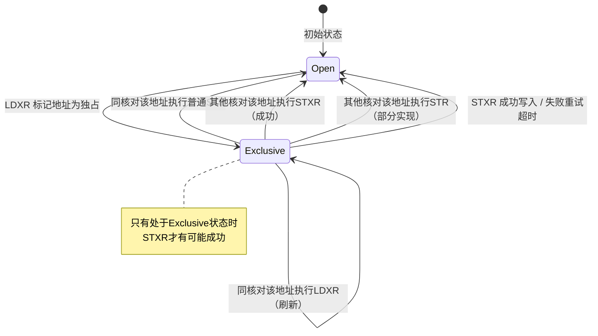

# 13.3.1 原子操作的硬件基础

> 所属章节：第13章 并发与同步 > 13.3 原子操作与内存屏障
>
> 难度：[E][M] | 预计阅读时间：18分钟

## <span class="blue"> 本节导读

你有没有好奇过，`atomic_inc()` 这样的函数到底在硬件层面是怎么保证"原子性"的？说白了，CPU不可能真的"一口气"完成读-修改-写，它也得先读、再算、再存。那中间被打断了怎么办？<br>

本节带你深入ARM64的独占访问机制——LDXR/STXR指令对，看看硬件是怎么用"独占监视器"这个巧妙设计来兜底的。同时你也会明白，原子操作虽然好用，但绝不是万能药。<br>

学完后，你将理解原子操作的硬件根基，掌握 Linux 内核中原子类型的正确用法，并能判断什么场景该用原子操作、什么场景该上锁。

---

## <span class="blue"> ARM64的LDXR/STXR独占访问机制 [E][M]

### 从"读改写"的困境说起

假设你要对一个计数器做 `++` 操作。在C语言里写成 `counter++`，编译后其实是三步：

```
1. 从内存读取 counter 到寄存器
2. 寄存器值 +1
3. 写回内存
```

问题很明显——这三步之间，别的核完全可能插进来改了这个值。那硬件怎么帮你兜底？<br>

ARM64的方案非常优雅：**独占加载（LDXR） + 独占存储（STXR）**。这套机制不靠关中断、不靠锁总线，而是用一对指令和一个叫**独占监视器（Exclusive Monitor）**的硬件状态机来解决问题。

### LDXR/STXR的工作流程

看图理解最直观：

```
CPU0 要执行 atomic_add(v, 1):

   LDXR  [v]          ← 加载v的值到寄存器，同时把v的物理地址标记为"独占"
      ↓
   ADD   x0, x0, #1   ← 寄存器里做加法
      ↓
   STXR  w1, x0, [v]  ← 尝试写回！硬件检查：这个地址还是"独占"状态吗？
      ↓
   CBNZ  w1, retry    ← w1=0表示成功，w1=1表示失败，重来！
```

整个流程的本质是 **"乐观锁"** ——先假设没人打扰我，做完运算再回头确认。如果发现期间有人动了这块内存，STXR 就拒绝写入，返回失败，软件负责重试。<br>

这就是 Load-Link/Store-Conditional（LL/SC）范式的ARM64实现。

### 独占监视器：谁来"监视"？

独占监视器分两层，这一点很关键：

| 监视器类型 | 作用范围 | 职责 |
|:---:|:---|:---|
| **Local Monitor** | 每个CPU核心内部 | 追踪本核的独占访问状态，检测本核内的访问冲突 |
| **Global Monitor** | 多核之间 | 追踪各核标记的独占地址，检测跨核冲突 |

Local Monitor的状态机如下：



STXR 写入之前，硬件会查两层监视器：本地状态和全局状态。任何一层显示"独占状态已丢失"，STXR 就返回失败（w1=1），强制软件重走一轮。<br>

> 💡 **提示**：Global Monitor 的实现高度依赖具体的 ARM 核心设计。Cortex-A53、A72、A76 的 Global Monitor 行为略有差异，做底层移植时要查手册。

### 代码视角：atomic_add()的ARM64实现

内核里 `atomic_add()` 在 ARM64 上最终长成这样（精简版）：

```asm
// arch/arm64/include/asm/atomic.h
// atomic_add(int i, atomic_t *v)

ENTRY(atomic_add)
    // x0 = i (要加的值)
    // x1 = v (atomic_t指针)
1:                          // retry标签
    ldxr    w2, [x1]       // 独占加载v->counter到w2
    add     w2, w2, w0     // w2 = w2 + i
    stxr    w3, w2, [x1]   // 独占存储，结果写入w3（0=成功）
    cbnz    w3, 1b         // 失败？跳回重试！
    ret
ENDPROC(atomic_add)
```

注意 `cbnz w3, 1b` 这一行——**失败重试是软件的责任**。硬件只负责检测冲突，重试循环由汇编代码完成。好在绝大多数情况下 STXR 一次就成功，所以这个循环极少真正执行多轮。<br>

再看看内核怎么封装给C代码用的：

```c
// include/linux/atomic.h

static inline void atomic_inc(atomic_t *v)
{
    atomic_add(1, v);
}

// 使用示例：引用计数
atomic_t refcnt = ATOMIC_INIT(1);

void get_resource(struct resource *r)
{
    atomic_inc(&r->refcnt);   // 安全地+1
}

void put_resource(struct resource *r)
{
    if (atomic_dec_and_test(&r->refcnt))  // 安全地-1，到0则释放
        kfree(r);
}
```

### atomic_t与atomic64_t的封装

内核不让你直接对 `int` 做原子操作，而是用封装类型：

```c
// include/linux/types.h
typedef struct {
    int counter;
} atomic_t;

typedef struct {
    long counter;
} atomic64_t;
```

为什么要包一层结构体？为了**防止你 accidentally 用普通运算符**。如果你写 `v.counter++`，编译器不会拦你，但至少看起来就很可疑。而且用封装类型后，`atomic_*` 系列 API 可以做类型检查。<br>

### 常用原子操作API速查

| 函数 | 功能 | 返回值 | 典型使用场景 |
|:---|:---|:---:|:---|
| `atomic_read(v)` | 读取原子变量 | `int` | 获取当前计数值 |
| `atomic_set(v, i)` | 设置原子变量 | void | 初始化 |
| `atomic_add(i, v)` | `v += i` | void | 统计计数增加 |
| `atomic_inc(v)` | `v++` | void | 引用计数+1 |
| `atomic_dec(v)` | `v--` | void | 引用计数-1 |
| `atomic_sub_and_test(i, v)` | `v -= i`，结果为0？ | bool | 递减后检查是否为0 |
| `atomic_dec_and_test(v)` | `v--`，结果为0？ | bool | 引用计数到0时释放资源 |
| `atomic_cmpxchg(v, old, new)` | 如果`v==old`，则`v=new` | 旧值 | **无锁算法的核心原语** |
| `atomic_or(i, v)` | `v \|= i` | void | 按位设置标志 |
| `atomic_and(i, v)` | `v &= i` | void | 按位清除标志 |

> 💡 **提示**：`atomic_cmpxchg()` 是实现无锁数据结构的基石。它把"比较"和"交换"绑定成一个原子操作，是构建无锁队列、无锁栈的核心原语。可以说，整个无锁编程的世界都建立在这一个API之上。

---

## <span class="blue"> 原子操作的适用场景与边界 [E]

### 什么时候用原子操作？

原子操作最适合的场景有鲜明的特征：**单个变量的简单修改**。具体来说：

**计数器**。比如统计中断发生了多少次、网络包接收了多少个。`atomic_inc()` 一行搞定，不需要锁的开销。<br>

**引用计数**。内核里到处可见——`kref`、`struct page` 的 `_refcount`，本质上都是 `atomic_t`。拿到引用就 `atomic_inc()`，释放就 `atomic_dec_and_test()`，到零就销毁。<br>

**标志位**。用 `atomic_or()` 设置标志、`atomic_and()` 清除标志。按位操作也是原子的，很省心。<br>

来看一个典型的引用计数场景：

```c
struct my_device {
    void __iomem *regs;
    atomic_t open_count;  // 记录打开了几次
};

static int my_open(struct inode *inode, struct file *file)
{
    // 只允许一个进程打开
    if (atomic_inc_return(&dev->open_count) > 1) {
        atomic_dec(&dev->open_count);  // 回滚
        return -EBUSY;
    }
    return 0;
}

static int my_release(struct inode *inode, struct file *file)
{
    atomic_dec(&dev->open_count);
    return 0;
}
```

这段代码用 `atomic_inc_return()` 做"先加后判断"，原子地完成了"检查+更新"。如果换成普通变量加锁，至少需要读锁、判断、写锁、解锁四步，代码膨胀不说，还容易漏掉边界情况。<br>

### 什么时候**不该**用原子操作？

这是一个常见的陷阱。很多新手觉得原子操作"快"，就到处用。但原子操作有一个致命的局限：**它只能保护单个变量的一次操作**。如果你要修改多个相互关联的字段，原子操作无能为力。<br>

比如你要维护一个统计结构：

```c
struct stats {
    atomic_t total_packets;   // 总包数
    atomic_t total_bytes;     // 总字节数
    atomic_t error_packets;   // 错误包数
};
```

表面上看三个都是 `atomic_t`，但你能在一次原子操作里同时更新 `total_packets` 和 `total_bytes` 吗？**不能**。别的核完全可能看到你只更新了包数、还没更新字节数的状态。这两个字段之间存在逻辑关联，需要一致地看到，这时候就得用**锁**或者**RCU**。<br>

另一个经典反例是无锁链表的多字段更新。要插入一个节点，你至少要改 `next` 指针和链表长度两个字段。两个独立的 `atomic_set()` 中间，其他核看到的链表就是残缺的。<br>

> ⚠️ **陷阱**：`atomic_read()` 在大多数架构上是原子的，但内核文档明确警告——不要假设它提供任何同步语义！在ARM64上读一个对齐的32位整数确实是单指令完成的，但在某些架构（如早期的Alpha）上，`atomic_read()` 甚至可能需要特殊处理。正确的做法是：把 `atomic_read()` 视为"尽可能原子的读取"，跨核同步时仍需配合 `smp_rmb()` 等屏障。

### 原子操作 vs 锁：怎么选？

| 维度 | 原子操作 | 锁（spinlock/mutex） |
|:---|:---|:---|
| **适用场景** | 单变量的简单读/写/加减 | 多字段关联修改、临界区代码段 |
| **性能** | 极低开销（通常1~3条指令） | 较高（内存屏障 + 可能的自旋/睡眠） |
| **编程复杂度** | 低（但容易误用） | 中等（需配对加解锁） |
| **可组合性** | **差**（无法组合多个操作为原子单元） | 好（临界区内任意代码序列） |
| **可移植性** | 依赖具体架构的LL/SC实现 | 内核抽象层屏蔽架构差异 |
| **调试难度** | 高（无锁bug极难复现） | 中等（lockdep等工具可检测） |

这张表的核心结论是：**原子操作和锁不是替代关系，是互补关系**。原子操作做它擅长的"最小粒度"操作，锁负责"需要包裹逻辑的区域"。<br>

> 🔴 **危险**：不要在原子操作的"甜头"里迷失。内核里很多 bug 的根源就是"该上锁的时候用了原子操作"——你以为两个 `atomic_inc()` 是原子的，但它们之间没有任何顺序保证，也不是一个整体。

---

## <span class="blue"> 本节总结

| 要点 | 核心内容 |
|:---|:---|
| **LDXR/STXR机制** | Load-Exclusive / Store-Exclusive 构成 LL/SC 范式，STXR 条件写入，失败则重试 |
| **独占监视器** | Local Monitor（核内）+ Global Monitor（多核），双层检测保证跨核原子性 |
| **内核封装** | `atomic_t`/`atomic64_t` 结构体封装，配合 `atomic_*` API 系列使用 |
| **关键API** | `atomic_inc/dec/cmpxchg/or/and` 等，`cmpxchg` 是无锁算法的基石 |
| **适用场景** | 单变量计数器、引用计数、标志位操作 |
| **不适用场景** | 多字段关联修改（需要锁或RCU），不要认为原子操作能替代锁 |
| **陷阱提醒** | `atomic_read()` 本身不保证跨核同步语义，不要过度依赖其"可见性" |

---

## <span class="blue"> 下一步

理解了原子操作的硬件根基后，下一个关键问题是：**原子操作之间的顺序怎么保证？** <br>

比如你在一个核上先 `atomic_set(&flag, 1)` 再 `atomic_set(&data, 42)`，另一个核上读的时候，会不会先看到 `data=42` 再看到 `flag=1`？<br>

**13.3.2 内存屏障详解** ——带你搞懂 `smp_mb()`、`smp_rmb()`、`smp_wmb()` 这些让无数内核开发者掉过坑的屏障原语。

---

## <span class="blue"> 配套资源

| 资源 | 说明 | 推荐度 |
|:---|:---|:---:|
| `arch/arm64/include/asm/atomic.h` | ARM64原子操作头文件 | ⭐⭐⭐⭐⭐ |
| `arch/arm64/include/asm/atomic_lse.h` | LSE扩展的原子指令实现 | ⭐⭐⭐⭐ |
| `include/linux/atomic.h` | 内核原子操作API定义 | ⭐⭐⭐⭐⭐ |
| `Documentation/atomic_ops.rst` | 内核原子操作官方文档 | ⭐⭐⭐⭐⭐ |
| ARM DDI 0487 (ARMv8手册) | Chapter B2: 独占访问指令详细描述 | ⭐⭐⭐⭐⭐ |
