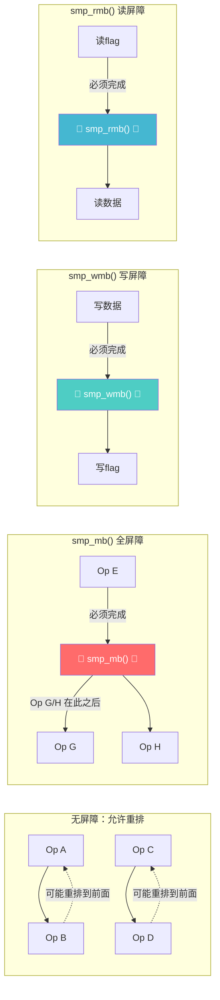

# 13.3.2 内存屏障详解

> 所属章节：第13章 并发与同步 > 13.3 无锁编程与内存序
>
> 难度：[E][M] | 预计阅读时间：15分钟

## <span class="blue"> 本节导读

你有没有想过，明明代码里先写了A再写了B，实际执行时却可能先完成B后完成A？这不是你的错觉——编译器和CPU都在"偷偷"重排你的指令顺序。单线程下这毫无问题，但一到多核并发场景，这种重排就可能成为最隐蔽的Bug来源。<br>
本节带你深入理解**内存屏障**的本质：为什么需要它，Linux内核提供了哪几种屏障，它们在ARM64上对应什么指令，以及典型的使用模式。学完后，你将能判断自己的无锁代码是否需要屏障，该用哪种屏障，而不是盲目地到处插`smp_mb()`。

## <span class="blue"> 从编译器重排到CPU乱序 [E]

要理解内存屏障，得先理解"为什么指令会不按顺序执行"。这里有两层来源。

### 编译器重排

编译器优化代码时，认为你的程序是单线程的。它看到两条没有数据依赖的内存操作，就可能交换它们的顺序来隐藏延迟、提高流水线利用率。

看这段代码：

```c
/* 全局变量 */
int data = 0;
int flag = 0;

void writer(void)
{
    data = 42;      /* 写数据 */
    flag = 1;       /* 设置标志，通知读者数据已就绪 */
}
```

编译器一看：`data`和`flag`之间没有依赖关系，那把`flag = 1`提到前面去也没事嘛，还能减少一次缓存未命中。于是优化后变成：

```asm
/* 编译器重排后的伪代码 */
store flag, #1      /* 先写flag！ */
store data, #42     /* 后写data */
```

多核场景下，另一个CPU可能在`flag = 1`之后立刻读取`data`，结果拿到的是0——数据还没准备好呢。这种Bug在生产环境中极难复现，因为它高度依赖时序和缓存状态。

### CPU乱序执行

就算编译器老老实实按顺序生成代码，现代CPU的硬件也会乱序执行。以ARM64为例：

- **Store Buffer**：CPU不需要等写操作真正到达内存，就可以继续执行后续指令
- **Invalidate Queue**：收到缓存失效请求后，CPU可以先应答"已失效"，稍后再真正处理
- **Load/Store Speculation**：CPU可能预测性地提前执行读操作

> 💡 **提示**：ARM64的内存模型是"弱序"（weakly ordered），允许大量重排；x86则是"强序"（TSO），允许的重排类型少很多。这就是为什么同一段无锁代码在x86上能跑、到ARM上就崩溃的典型原因。

两者对比一目了然：

| 维度 | 编译器重排 | CPU乱序执行 |
|:---|:---|:---|
| **来源** | 编译器优化阶段（-O2及以上） | CPU硬件执行阶段 |
| **影响范围** | 同一编译单元内的指令 | 跨核心的内存可见性 |
| **检测方法** | 对比C代码与汇编输出（`objdump -d`） | 仅在高并发+弱序CPU上偶发 |
| **解决方式** | `barrier()`编译器屏障 | `smp_mb()`等运行时内存屏障 |
| **是否可单独控制** | 可以，`barrier()`不涉及CPU指令 | 必须配合编译器屏障使用 |

> ⚠️ **陷阱**：很多人只关心CPU乱序，却忽略了编译器重排。实际上，你插了`smp_mb()`就同时解决了两层问题——它既是编译器屏障也是CPU屏障。

## <span class="blue"> 三种内存屏障与ARM64映射 [E][M]

Linux内核提供了三种主要的SMP内存屏障，对应不同的重排限制。

### 屏障函数速查

| 函数 | 功能 | ARM64指令 | 使用场景 | 性能影响 |
|:---|:---|:---|:---|:---|
| `smp_mb()` | 全屏障，前后读写均不可重排 | `DMB ISH`（Inner Shareable，Full） | 需要严格序保证的关键路径 | 最高，需等待所有操作完成 |
| `smp_rmb()` | 读屏障，前后读操作不可重排 | `DMB ISHLD`（Load） | 读者检查flag后读取数据 | 中等，仅序化读操作 |
| `smp_wmb()` | 写屏障，前后写操作不可重排 | `DMB ISHST`（Store） | 写者写入数据后设置flag | 最低，仅序化写操作 |

> 💡 **提示**：`ISH` = Inner Shareable，表示屏障影响同一个inner shareable domain内的所有CPU核心。这是Linux内核SMP场景的默认范围。

### mermaid图：屏障前后的重排限制



## <span class="blue"> 典型模式：Flag + Data 双缓冲 [M]

这是内核中最经典的内存屏障使用场景。一个CPU写入数据后通过flag通知另一个CPU。

### 完整代码示例

```c
/* 全局共享变量 */
static int   shared_data;    /* 要传递的数据 */
static int   data_ready;     /* 标志位：0=未就绪, 1=已就绪 */

/*========== 写者（CPU 0）==========*/
void writer_submit(int value)
{
    /* 步骤1：先写入实际数据 */
    shared_data = value;          /* 数据必须先到达内存 */

    /* 步骤2：写屏障 —— 确保shared_data在data_ready之前 */
    smp_wmb();

    /* 步骤3：设置标志，通知读者 */
    data_ready = 1;               /* 读者看到这个就知道数据有效了 */
}

/*========== 读者（CPU 1）==========*/
int reader_poll(void)
{
    int ready;

    /* 步骤1：读取标志 */
    ready = data_ready;

    /* 步骤2：读屏障 —— 确保flag读在data读之前完成 */
    smp_rmb();

    /* 步骤3：只有flag为1时，data才是有效的 */
    if (ready) {
        /* 此时读取shared_data，一定能看到写者写入的值 */
        return shared_data;       /* 安全读取 */
    }
    return -EAGAIN;               /* 数据还没准备好 */
}
```

这个模式的精髓在于：写者用`smp_wmb()`保证"数据先于标志"，读者用`smp_rmb()`保证"标志先于数据"。两者配合，就形成了一个安全的**发布/订阅**（Publish/Subscribe）通道。

> 💡 **提示**：RCU（Read-Copy-Update）的指针发布就是这种模式的高级版本——先构造好新数据结构，再`smp_wmb()`，最后原子替换指针。读者侧则反过来：先读指针，再`smp_rmb()`，最后解引用。

## <span class="blue"> 过度屏障与性能代价 [M]

内存屏障不是免费的午餐。每次调用`smp_mb()`，CPU都要做额外工作来确保序。

### 性能影响对比

| 操作 | 大致开销（周期） | 说明 |
|:---|:---|:---|
| 普通内存访问 | 3~100+ | 取决于缓存命中情况 |
| `smp_rmb()` | ~10-20 | 仅需排空读队列 |
| `smp_wmb()` | ~15-25 | 需排空Store Buffer |
| `smp_mb()` | ~30-60+ | 需排空所有读写队列，可能触发缓存同步 |
| 原子操作（带序） | 15-30 | 通常隐含屏障语义 |

> 🔴 **危险**：在热路径上滥用`smp_mb()`可能导致性能暴跌。我见过有人在循环里每轮都插全屏障，结果把多核并行的优势全耗光了。原则是：**用最弱的屏障满足语义需求，只在真正需要序保证的地方使用。**

> 💡 **提示**：99%的场景你不需要显式调用`smp_mb()`——用原子操作（如`atomic_inc()`、`atomic_set()`）或者自旋锁就够了。原子操作在内核中通常带有适当的内存序语义，Linux的`atomic_t`接口默认就是顺序一致性的。

## <span class="blue"> 本节总结

| 要点 | 内容 |
|:---|:---|
| **为什么需要内存屏障** | 编译器重排 + CPU乱序执行，多核下导致内存操作可见性失控 |
| **三种屏障** | `smp_mb()`全屏障、`smp_rmb()`读屏障、`smp_wmb()`写屏障，限制重排范围递增递减 |
| **ARM64映射** | `DMB ISH` / `DMB ISHLD` / `DMB ISHST`，理解ISH的共享域范围 |
| **核心模式** | Flag+Data发布/订阅：写者先写数据→`smp_wmb()`→写flag；读者先读flag→`smp_rmb()`→读数据 |
| **使用原则** | 能不用就不用，需要时选最弱的，热路径尤其谨慎 |
| **常见替代** | 原子操作、自旋锁、RCU——它们内部已处理内存序 |

## <span class="blue"> 下一步

内存屏障解决的是"指令重排导致的可见性问题"，但它有一个前提：编译器不能把你对共享变量的访问"优化掉"。比如编译器发现你读了一个变量但"没用"，就直接删掉这行代码——那你精心设计的屏障就白费了。下一节 **13.3.3 READ_ONCE与WRITE_ONCE** 将告诉你如何告诉编译器"不要碰这个变量的读写"，它是内存屏障的黄金搭档。

## <span class="blue"> 配套资源

| 资源 | 说明 |
|:---|:---|
| 代码清单 | `writer_submit()` / `reader_poll()` —— 完整Flag+Data模式 |
| 图示 | mermaid屏障重排限制图 —— 三种屏障的约束范围 |
| 速查表 | 三种屏障函数与ARM64指令映射表 |
| 内核文档 | `Documentation/memory-barriers.txt`（Linux内核源码） |
| ARM手册 | ARM Architecture Reference Manual，DMB指令章节 |
