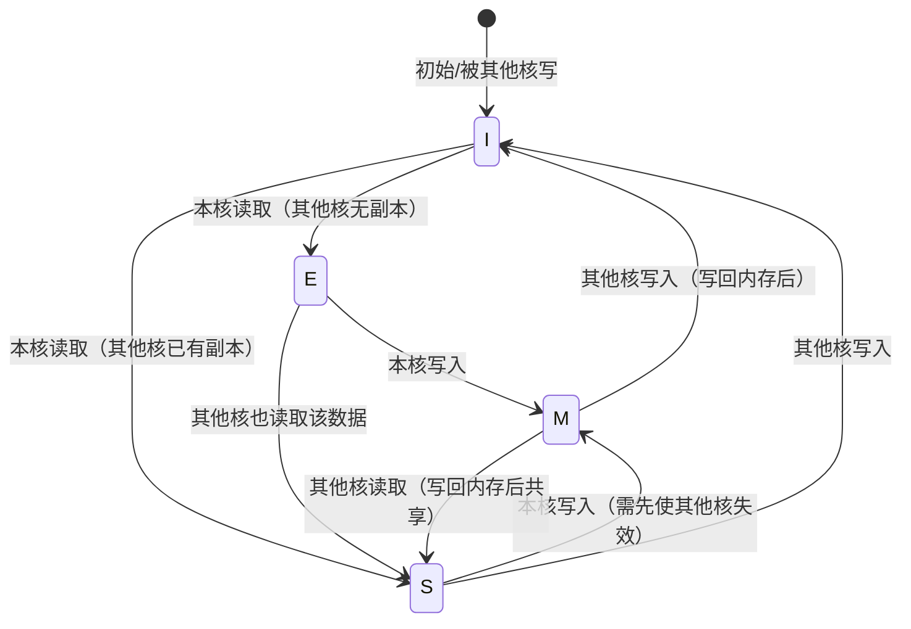
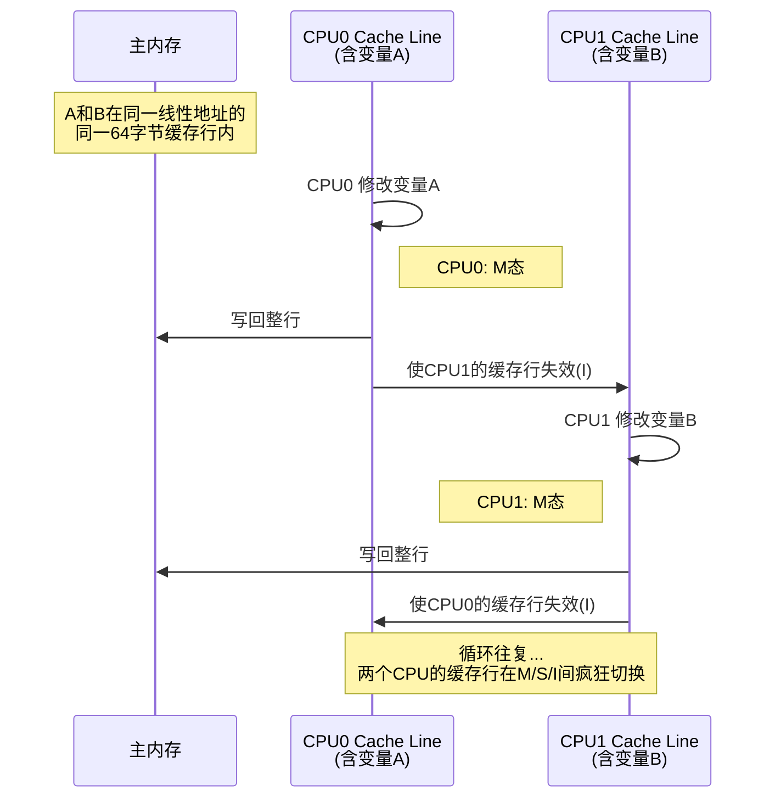

# 13.3.4 缓存一致性与伪共享

> 所属章节：第13章 并发与同步 > 13.3 内核同步机制
>
> 难度：[E] | 预计阅读时间：15分钟

## <span class="blue"> 本节导读

你已经学了自旋锁、信号量这些同步原语，但有没有想过——在SMP多核系统中，即使代码里没有显式加锁，CPU之间也会因为缓存的"暗地交流"而引发性能暴跌？<br>
本节带你深入CPU缓存的底层世界，搞懂MESI协议如何维系多核缓存的一致性，以及一个臭名昭著的隐形杀手——**伪共享（false sharing）**是如何让并行程序变慢的。<br>
学完后，你将能诊断和修复伪共享导致的性能退化，并用`perf c2c`这个利器定位问题。

## <span class="blue"> MESI协议：多核缓存的"外交规则" [E]

现代CPU为了弥合处理器与内存之间的速度鸿沟，引入了多级缓存（L1/L2/L3）。但在SMP架构下，每个核心都有自己的私有缓存，这就带来了一个棘手的问题：同一个内存地址的数据可能同时存在于多个CPU的缓存中，谁来保证它们是一致的？

Intel处理器采用的**MESI协议**就是解决这个问题的经典方案。说白了，MESI给每个缓存行（cache line）贴了一个"状态标签"，告诉CPU这行数据能不能读、能不能写、需不需要跟别的核心同步。

### 缓存行：数据搬运的最小单位

在深入MESI之前，你得先理解**缓存行（cache line）**这个概念。CPU缓存不是以单个字节为单位操作的，而是以一个固定大小的数据块——缓存行——为最小单位。典型的缓存行大小是**64字节**（x86_64架构）。这意味着，即使你只读取一个`int`（4字节），整个64字节的缓存行都会被加载到CPU缓存中。

```c
/* 缓存行的直观理解：访问 4 字节，搬运 64 字节 */
int a = 42;          // 触发加载包含 a 的整行 64 字节到 L1 Cache
```

### MESI四状态详解

MESI四个字母分别代表四种状态：

| 状态 | 含义 | 可读 | 可写 | 转换条件 |
|------|------|------|------|----------|
| **M** (Modified) | 已修改，独占该数据，与内存不一致 | 是 | 是 | 本核写入后独占，其他核缓存中该行为Invalid |
| **E** (Exclusive) | 未修改，独占该数据，与内存一致 | 是 | 是 | 本核首次读取且其他核无此数据，可直接写入升级为M |
| **S** (Shared) | 未修改，多份副本，与内存一致 | 是 | **否** | 多核同时读取同一份数据，各核缓存均为S态 |
| **I** (Invalid) | 无效，数据不可用 | **否** | **否** | 初始状态，或其他核写入导致本核数据失效 |

这四种状态构成了一个完整的状态机。一个缓存行在同一时刻只能处于其中一种状态。

**为什么S态不能写？** 因为多份副本同时存在，如果一个核擅自修改，其他核读到的就是旧数据。想写？先通知所有人把他们的副本变成I态，自己再升到E或M态。这个过程叫**缓存一致性事务**，由CPU硬件自动完成，但对性能有消耗。

### MESI状态转换图



来看一个典型的状态流转：

1. CPU0第一次读取变量`x`，缓存行从`I→E`（独占，因为其他核还没读）
2. CPU0修改`x`，缓存行从`E→M`（已修改，内存中的值已过时）
3. CPU1也想读`x`，CPU0先把数据写回内存，然后两行都从`M→S`（共享）
4. CPU1想写`x`，CPU0那行变成`I`，CPU1从`S→E→M`

看到了吗？**每次跨核写操作都会触发缓存同步**，这就是代价。

## <span class="blue"> 伪共享：隐形性能杀手 [E]

现在来到本节最狠的角色——**伪共享（false sharing）**。

### 伪共享场景示意



### 伪共享的本质

伪共享的核心矛盾在于：**逻辑上无关的两个变量，因为碰巧落在同一个缓存行里，导致两个CPU在物理层面争夺同一份缓存资源**。

来看这个经典场景：

```c
/* 臭名昭著的伪共享示例 */
struct counter_pair {
    uint64_t counter0;   // CPU0 频繁写
    uint64_t counter1;   // CPU1 频繁写
    /* counter0 和 counter1 很可能在同一个缓存行（共16字节 < 64字节） */
};

struct counter_pair cnt;

/* CPU0 线程 */
void *thread0(void *arg)
{
    for (int i = 0; i < 100000000; i++)
        cnt.counter0++;    // 每次写入都触发缓存同步！
    return NULL;
}

/* CPU1 线程 */
void *thread1(void *arg)
{
    for (int i = 0; i < 100000000; i++)
        cnt.counter1++;    // 每次写入都让CPU0的缓存失效！
    return NULL;
}
```

`counter0`和`counter1`是两个完全独立的变量，没有任何逻辑关联。但因为它们在内存中相邻，极大概率被加载到**同一个64字节缓存行**中。结果就是：

- CPU0写`counter0` → 缓存行变M态 → CPU1的副本变I态
- CPU1写`counter1` → 需要从内存重新加载 → 变M态 → CPU0的副本变I态
- CPU0再写`counter0` → 又要重新加载...

两个CPU明明在写不同的变量，却像是在"踢皮球"，缓存行在两个核心之间来回弹跳。这就是所谓的**缓存行乒乓（cache line ping-pong）**。性能可能暴跌到单核水平的零头。

| 问题 | 表现 | 根因 | 解决方案 |
|------|------|------|----------|
| 伪共享 | 多线程性能远低于预期，CPU利用率100%但吞吐量极低 | 多个CPU频繁修改同一缓存行中的不同变量 | `__cacheline_aligned` 将对齐到独立缓存行 |
| 缓存行乒乓 | 大量HITM事件（Hit Modified），`perf c2c`检测到高频c2c传输 | MESI状态在M/S/I间频繁切换 | 填充（padding）或对齐，确保热点变量独占缓存行 |
| 隐蔽性强 | 代码逻辑无锁无竞态，难以通过常规手段发现 | 问题出在硬件缓存层面，不在代码逻辑层面 | 使用`perf c2c`或Intel VTune检测 |

### 解决方案：缓存行对齐

Linux内核提供了一个利器来解决这个问题——`____cacheline_aligned`宏（注意是四个下划线前缀）。

```c
#include <linux/cache.h>

/* 解决方案：将每个计数器对齐到独立的缓存行 */
struct counter_aligned {
    uint64_t counter0 ____cacheline_aligned;   // 独占一行
    uint64_t counter1 ____cacheline_aligned;   // 独占另一行
};

/* 手动填充方案（用户态程序适用） */
#ifndef ____cacheline_aligned
#define ____cacheline_aligned \
    __attribute__((__aligned__(64)))
#endif

struct padded_counter {
    uint64_t value;
    /* 填充到64字节，确保不与其他变量共享缓存行 */
    uint8_t  pad[64 - sizeof(uint64_t)];
} ____cacheline_aligned;

/* 在kstat等内核统计结构中广泛使用的模式 */
struct kernel_stat {
    unsigned long per_cpu_user[NR_CPUS] ____cacheline_aligned;
    unsigned long per_cpu_system[NR_CPUS] ____cacheline_aligned;
    unsigned long per_cpu_idle[NR_CPUS] ____cacheline_aligned;
};
```

> 💡 **提示**：`____cacheline_aligned`（内核态）和`__attribute__((aligned(64)))`（GCC通用）会把变量对齐到缓存行边界。对于频繁被多核并发访问的统计计数器、生产者-消费者队列的索引变量，这招很管用，直接用独立缓存行把它们隔开。

> 🔴 **危险**：对齐填充会浪费内存。一个`uint64_t`本来只占8字节，对齐后独占64字节，是原来的8倍。只在**真正被多核高并发访问**的变量上使用，别滥用。

### 检测工具：perf c2c

伪共享隐蔽性极强——代码逻辑完全正确，没有竞态，甚至都没加锁，但性能就是差。怎么定位？

Intel提供了一个专门检测伪共享的工具——`perf c2c`（cache-to-cache）：

```bash
# 1. 录制 cache-to-cache 事件（需要 root 权限）
$ sudo perf c2c record -g -- ./your_program

# 2. 生成报告
$ sudo perf c2c report

# 典型输出示例：
# =================================================
#        Trace Event Information
# =================================================
#  Total records             :     123456
#  Locked Load/Store operations  :        0
#  Load HITM     :     65432   # <-- 这是关键指标！
#  Store HITM    :     32100
#  Load Store HITM :     8900
#
# HITM = Hit Modified，表示读取时命中了其他核已修改的缓存行
# HITM 数量高 = 伪共享严重
#
# 报告中会显示哪些缓存地址发生了最多的HITM
# 以及对应的源代码位置
```

> ⚠️ **陷阱**：`perf c2c`需要特定的硬件支持（Intel Skylake微架构及以上）。旧款CPU（如Haswell、Broadwell）不支持HITM事件的精确采样，无法使用此工具。AMD平台也不支持`perf c2c`，需要用其他工具（如AMD uProf）代替。

## <span class="blue"> 本节总结

| 要点 | 内容 |
|------|------|
| **MESI协议** | Modified/Exclusive/Shared/Invalid四种状态维系多核缓存一致性，硬件自动处理但非免费 |
| **缓存行** | 64字节（典型值），CPU缓存操作的最小单位，理解它是诊断伪共享的前提 |
| **伪共享本质** | 逻辑无关的变量因同处一个缓存行，引发多核间的缓存同步风暴 |
| **对齐解决方案** | `____cacheline_aligned` / `__attribute__((aligned(64)))` 将热点变量隔离到独立缓存行 |
| **检测手段** | `perf c2c`检测HITM事件定位伪共享（需Skylake+），高HITM计数 = 问题严重 |
| **性能代价** | 伪共享可让多线程程序性能跌至单核水平；对齐填充以空间换时间，需权衡使用 |

## <span class="blue"> 下一步

缓存一致性协议是理解RCU（Read-Copy-Update）的基础——RCU正是利用了现代CPU的缓存和内存序特性，实现了读端几乎零开销的并发机制。下一节 **13.4.1 RCU的核心概念与读端API**，我们将探索这个Linux内核中最优雅的同步机制。

## <span class="blue"> 配套资源

| 资源类型 | 资源名称 | 说明 |
|----------|----------|------|
| 图示 | MESI状态转换图 | 见上文mermaid状态机 |
| 图示 | 伪共享场景时序图 | 见上文sequenceDiagram |
| 代码 | cache line对齐的struct定义 | `____cacheline_aligned` 使用示例 |
| 代码 | perf c2c检测命令 | 录制 + 报告生成完整命令 |
| 工具 | `perf c2c` | Intel Skylake+ 专用伪共享检测工具 |
| 文档 | Intel SDM Vol.3A Ch.11 | 缓存一致性协议官方文档 |
| 论文 | "What Every Programmer Should Know About Memory" (Ulrich Drepper) | 深入理解CPU缓存与内存的经典读物 |
