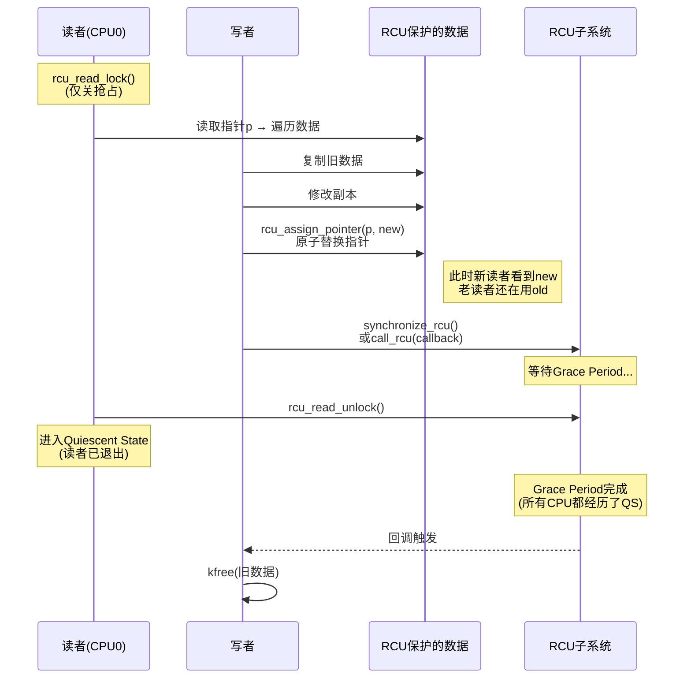

# 13.4.1 RCU的核心概念与读端API

> 所属章节：第13章 并发与同步 > 13.4 RCU同步机制
>
> 难度：[E][M] | 预计阅读时间：15分钟

## <span class="blue"> 本节导读

RCU（Read-Copy-Update）是Linux内核里最让人拍案叫绝的同步机制。它彻底颠覆了"读写锁"的思维定式——读者完全不需要上锁，性能接近裸奔。你没看错，RCU的读者不拿锁、不原子操作，仅仅是开关一下抢占而已。<br>
本节带你吃透RCU的三步模型和读端API。学完后，你将理解为什么RCU能让读者零开销并发，也能明白为什么写者必须承担"延迟释放"的代价。

---

## <span class="blue"> RCU的核心思想：读者无锁、写者延后 [E][M]

RCU的设计哲学非常大胆：**让读者彻底摆脱锁**。传统的读写锁里，读者至少要做一次原子操作来加锁和解锁；而RCU读者连这个都不需要——`rcu_read_lock()`本质上只是**关闭当前CPU的抢占**，`rcu_read_unlock()`再把它打开。

为什么关抢占就够了？因为RCU读者只读不改，而写者不会原地修改数据，而是**复制一份新的去改**，改完再用原子操作替换指针。老数据不是立刻释放，而是等所有可能读到老数据的读者都退出后，才安全回收。

这就是著名的RCU三步模型：

```
读者：rcu_read_lock()  →  遍历/读取数据  →  rcu_read_unlock()
                              ↓
写者：复制数据 → 修改副本 → rcu_assign_pointer()替换指针
                              ↓
回收：synchronize_rcu()等待grace period → kfree(旧数据)
```

用个比方：你在看一份公告板（读者），管理员（写者）想更新公告。他没直接在你眼前撕掉旧公告，而是把新公告贴到旁边，然后把"公告板"这块牌子指到新位置。等你离开了（grace period结束），他才默默收走旧公告。

### RCU读写并发流程



> 💡 **提示**：`rcu_read_lock()`只是关抢占，不是真正的锁——读者开销极低。这也是RCU的杀手级特性：读多写少的场景下，RCU读者的性能几乎和无同步的裸读一样快。

---

### Grace Period：RCU的灵魂机制

Grace period（宽限期）是RCU能安全回收旧数据的核心保障。它的定义是：**所有CPU都至少经历了一次quiescent state（静止状态）**。

什么是quiescent state？就是当前CPU上**没有任何RCU读者在临界区内**。常见的情况包括：

- 发生了上下文切换（进程调度）
- CPU进入用户态执行
- CPU进入idle状态
- 执行了`rcu_read_unlock()`

换句话说，一旦某个CPU经历了quiescent state，就意味着该CPU上所有**之前开始的**RCU读端临界区都已经结束——那些读者要么完成了`rcu_read_unlock()`，要么被调度走了。

```mermaid
sequenceDiagram
    participant CPU0 as CPU0
    participant CPU1 as CPU1
    participant CPU2 as CPU2
    participant GP as Grace Period检测

    Note over CPU0,CPU2: 写者替换指针后，开始等待Grace Period

    rect rgb(60, 40, 40)
    Note over CPU0: rcu_read_lock()<br/>读取数据...
    end

    CPU0->>GP: sched() → Quiescent State!
    Note over CPU0: 在RCU临界区内<br/>不能调度，所以sched()<br/>意味着unlock过了

    CPU1->>GP: 进入idle → Quiescent State!

    rect rgb(60, 40, 40)
    Note over CPU2: rcu_read_lock()<br/>还在遍历...
    end

    Note over GP: 等待CPU2...

    CPU2->>GP: rcu_read_unlock()<br/>然后schedule() → QS!

    Note over GP: 所有CPU都经历了QS<br/>Grace Period完成!
    GP-->>CPU0: 触发callback<br/>kfree(旧数据)
```



### RCU核心术语

| 术语 | 英文全称 | 含义 | 类比 |
|------|----------|------|------|
| 宽限期 | Grace Period | 所有CPU都经历至少一次QS的时间段 | 等所有人都离开房间 |
| 静止状态 | Quiescent State | CPU上无RCU读者在临界区内 | 某人已离开房间 |
| 回调 | RCU Callback | Grace Period结束后执行的清理函数 | 保洁员进来打扫 |
| 读端临界区 | Read-Side Critical Section | `rcu_read_lock()`到`rcu_read_unlock()`之间 | 你在房间里看书 |
| 发布 | Publish | `rcu_assign_pointer()`原子替换指针 | 管理员把牌子指向新公告 |
| 订阅 | Subscribe | `rcu_dereference()`安全读取指针 | 你看牌子指向哪 |

> ⚠️ **陷阱**：RCU读者**绝对不能睡眠**。如果在`rcu_read_lock()`和`rcu_read_unlock()`之间调用可能睡眠的函数（如`kmalloc(GFP_KERNEL)`、`mutex_lock()`、`schedule()`），内核会直接panic或者触发`BUG_ON`。原因很简单——读者睡眠就意味着该CPU无法进入quiescent state，grace period永远等不到它，旧数据就永远释放不了，系统内存泄漏事小，RCU回调队列堆积事大。

---

## <span class="blue"> 读端API详解 [E]

RCU的读端API只有三个核心函数，简单到令人发指：

```c
// 标记RCU读端临界区开始
static inline void rcu_read_lock(void);      // 关闭当前CPU抢占
static inline void rcu_read_unlock(void);    // 开启当前CPU抢占

// 安全地读取RCU保护的指针
#define rcu_dereference(p)      /* 编译屏障 + 解引用 */
```

### rcu_read_lock/unlock：不是锁，胜似锁

很多人第一次看RCU代码会懵：`rcu_read_lock()`里面到底锁了啥？答案是——**什么都没锁**。它的实现（以可抢占内核为例）就是一句话：

```c
static inline void rcu_read_lock(void)
{
    preempt_disable();      // 仅此而已！关抢占
}

static inline void rcu_read_unlock(void)
{
    preempt_enable();       // 开抢占
}
```

关抢占为什么就够了？因为RCU读者是只读的，不会修改共享数据。抢占禁止保证了读者在临界区内不会被调度走，从而保证了这个读者"一定能在某个时刻完成临界区"。RCU grace period机制只需要这个保证——**读者迟早会完**——就够了。

### rcu_dereference()：编译屏障的艺术

`rcu_dereference()`是RCU读端最关键也最容易被忽视的API。它的作用有两个：

1. **编译屏障**：防止编译器重排序——确保在读取指针之后，才去访问指针指向的数据。
2. **CPU内存序保障**：在某些架构上插入必要的内存屏障，确保你看到的是一个完整的、已初始化的数据结构。

```c
// 典型RCU读端模板：安全遍历RCU保护的链表
struct my_data *p;

rcu_read_lock();
p = rcu_dereference(global_ptr);    // ① 安全获取指针
if (p) {
    // ② 现在可以安全访问p指向的数据
    printk("value = %d\n", p->value);
    printk("name = %s\n", p->name);
}
rcu_read_unlock();
```

没有`rcu_dereference()`会怎样？编译器可能把"读取指针"和"访问数据"重排序，导致你拿到指针后，数据还没初始化完。更糟糕的是，CPU的乱序执行可能让你读到半新半旧的"混合态"数据。

> 🔴 **危险**：永远不要在RCU读端临界区之外使用`rcu_dereference()`获取的指针。一旦`rcu_read_unlock()`执行完毕，该指针随时可能被写者释放。如果你把`p`缓存起来、出了临界区再用，那就是悬垂指针，后果Undefined。

### 完整读端代码模板

```c
/* RCU读端标准模板：查找并安全引用数据 */
struct my_data *rcu_lookup_and_use(void)
{
    struct my_data *p;

    rcu_read_lock();                    // 进入读端临界区

    p = rcu_dereference(global_list);   // 安全获取RCU保护指针

    while (p) {
        if (p->id == target_id) {
            /* 在临界区内安全访问数据 */
            do_something_with(p);

            /* 如果需要持有引用出临界区，
             * 必须用kref_get_unless_zero()等机制
             */
            rcu_read_unlock();
            return p;   /* ⚠️ 危险！见下方说明 */
        }
        p = rcu_dereference(p->next);   // 安全遍历链表
    }

    rcu_read_unlock();                  // 退出读端临界区
    return NULL;
}

/* 更安全的做法：配合引用计数 */
struct my_data *safe_lookup(void)
{
    struct my_data *p;

    rcu_read_lock();
    p = rcu_dereference(global_list);
    while (p) {
        if (p->id == target_id) {
            if (kref_get_unless_zero(&p->refcount)) {
                rcu_read_unlock();
                return p;   // 持有引用计数后返回，安全
            }
        }
        p = rcu_dereference(p->next);
    }
    rcu_read_unlock();
    return NULL;
}
```

---

## <span class="blue"> RCU的开销权衡 [E]

RCU的设计本质上是一种**不对称优化**：把读端的成本压到最低，把写端的成本推高。

| 操作方 | 操作 | 开销 | 对比读写锁 |
|--------|------|------|------------|
| 读者 | `rcu_read_lock()` | 关抢占 ≈ 几条指令 | 远低于`read_lock()` |
| 读者 | `rcu_read_unlock()` | 开抢占 ≈ 几条指令 | 远低于`read_unlock()` |
| 读者 | `rcu_dereference()` | 编译屏障 ≈ 零成本 | 无需对应操作 |
| 写者 | 复制数据 | 完整malloc+copy | 无需复制 |
| 写者 | 替换指针 | 原子写 ≈ 一条指令 | 需加写锁 |
| 写者 | 等待GP | 毫秒级延迟 | 无需等待 |
| 写者 | 释放旧数据 | 延后到GP后 | 立即释放 |

这个权衡在什么场景下划算？**读操作远多于写操作的场景**。如果读写比例是100:1甚至更高，RCU的整体性能碾压读写锁。但如果写操作很频繁，每次都要复制数据+等待grace period，RCU反而更慢。

Linux内核中典型的RCU使用场景：
- 路由表（查多改少）
- 模块链表（遍历频繁，插入删除少）
- 文件系统挂载点（读多写少）
- `task_struct`的多种链表

> 💡 **提示**：RCU不是银弹。它解决的是"读端极速并发+写端可承受延迟"的问题。如果你的场景写操作频繁、读者少，或者读者需要睡眠，那mutex或rwlock可能更合适。

---

## <span class="blue"> 本节总结

| 主题 | 要点 |
|------|------|
| RCU核心思想 | 读者无锁（仅关抢占），写者复制替换，旧数据延后释放 |
| 三步模型 | ①读者无锁遍历 → ②写者copy+原子替换 → ③等GP后释放旧数据 |
| 读端API | `rcu_read_lock()`/`rcu_read_unlock()`标记临界区；`rcu_dereference()`安全读指针 |
| Grace Period | 所有CPU至少一次quiescent state；RCU回调在GP结束后执行 |
| 读者禁区 | **绝对不能睡眠**——会阻塞GP完成，导致内存无法回收 |
| 开销特点 | 读者接近零开销；写者承担复制+延迟释放的代价 |
| 适用场景 | 读多写少、读者不能睡眠、能接受写端延迟的数据结构 |

---

## <span class="blue"> 下一步

13.4.2 RCU的写端与内存回收——我们将深入`rcu_assign_pointer()`的内存序语义、写端的完整操作流程，以及`synchronize_rcu()`和`call_rcu()`的区别。写者怎么安全地发布新数据？旧数据到底什么时候才能真正`kfree()`？下节见分晓。

---

## <span class="blue"> 配套资源

| 资源类型 | 内容 | 位置 |
|----------|------|------|
| 代码清单 | RCU读端标准模板（查找/遍历/安全引用） | 本节代码示例 |
| 流程图 | RCU读写并发时序图 | 上方mermaid序列图 |
| 流程图 | Grace Period检测机制图 | 上方mermaid序列图 |
| 术语表 | RCU核心术语（GP/QS/Callback等） | 上方术语表格 |
| 内核文档 | `Documentation/RCU/whatisRCU.rst` | Linux源码树 |
| 经典论文 | "Read-Copy Update" (McKenney, 2002) | 搜索 "RCU McKenney" |
