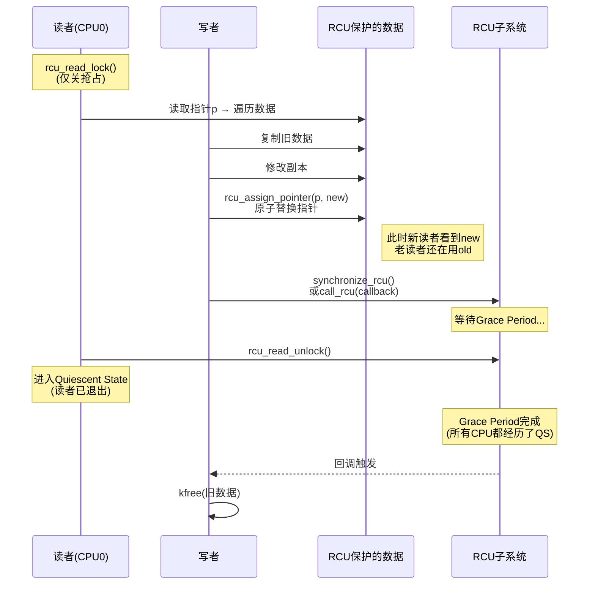

# 13.4.1 RCU的核心概念与读端API

> 所属章节：第13章 并发与同步 > 13.4 RCU
>
> 难度：[E→M] | 预计阅读时间：15分钟

## <span class="blue"> 本节导读

本节覆盖：RCU（Read-Copy-Update）的三步模型、"读者零开销"的实现原理（`rcu_read_lock()` 的本质）、宽限期（grace period）与静止状态（quiescent state）的定义、读端三个核心 API 的用法与禁区（读者不能睡眠、指针不能带出临界区）。

---

## <span class="blue"> RCU的核心思想：读者无锁、写者延后 [E→M]

RCU的设计哲学非常大胆：**让读者彻底摆脱锁**。传统的读写锁里，读者至少要做一次原子操作来加锁和解锁；而RCU读者连这个都不需要——`rcu_read_lock()`本质上只是**关闭当前CPU的抢占**，`rcu_read_unlock()`再把它打开。

为什么关抢占就够了？因为RCU读者只读不改，而写者不会原地修改数据，而是**复制一份新的去改**，改完再用带 release 语义的操作替换指针。老数据不是立刻释放，而是等所有可能读到老数据的读者都退出后，才安全回收。

这就是著名的RCU三步模型：

```
读者：rcu_read_lock()  →  遍历/读取数据  →  rcu_read_unlock()
                              ↓
写者：复制数据 → 修改副本 → rcu_assign_pointer()替换指针
                              ↓
回收：synchronize_rcu()等待grace period → kfree(旧数据)
```

关键在于"指针替换"与"延迟回收"的组合：新读者沿新指针看到新数据；老读者手里还攥着旧指针，继续读旧数据也不会坏；写者只需等"所有老读者都读完"这个时间窗过去，再释放旧数据。这个时间窗就是下面要讲的宽限期。

### RCU读写并发流程



> 💡 `rcu_read_lock()`只是关抢占，不是真正的锁——读者开销极低。这也是RCU的杀手级特性：读多写少的场景下，RCU读者的性能几乎和无同步的裸读一样快。

---

### Grace Period：RCU的灵魂机制

Grace period（宽限期）是RCU能安全回收旧数据的核心保障。它的定义是：**所有CPU都至少经历了一次quiescent state（静止状态）**。

什么是quiescent state？就是当前CPU上**没有任何RCU读者在临界区内**。常见的情况包括：

- 发生了上下文切换（进程调度）
- CPU进入用户态执行
- CPU进入idle状态
- 执行了`rcu_read_unlock()`

换句话说，一旦某个CPU经历了quiescent state，就意味着该CPU上所有**之前开始的**RCU读端临界区都已经结束——那些读者要么完成了`rcu_read_unlock()`，要么被调度走了。

```mermaid
sequenceDiagram
    participant CPU0 as CPU0
    participant CPU1 as CPU1
    participant CPU2 as CPU2
    participant GP as Grace Period检测

    Note over CPU0,CPU2: 写者替换指针后，开始等待Grace Period

    rect rgb(60, 40, 40)
    Note over CPU0: rcu_read_lock()<br/>读取数据...
    end

    CPU0->>GP: sched() → Quiescent State!
    Note over CPU0: 在RCU临界区内<br/>不能调度，所以sched()<br/>意味着unlock过了

    CPU1->>GP: 进入idle → Quiescent State!

    rect rgb(60, 40, 40)
    Note over CPU2: rcu_read_lock()<br/>还在遍历...
    end

    Note over GP: 等待CPU2...

    CPU2->>GP: rcu_read_unlock()<br/>然后schedule() → QS!

    Note over GP: 所有CPU都经历了QS<br/>Grace Period完成!
    GP-->>CPU0: 触发callback<br/>kfree(旧数据)
```



<!--
【待补图·优先级★】文件路径：images/13.4.1-RCU宽限期时间轴.png

生图说明（整段复制给生图 AI，中文标注）：
画面主题：RCU 宽限期（Grace Period）时间轴——为什么"等所有 CPU 经过一次静止状态"就能安全释放旧数据。
构图：横向时间轴图（从左到右表示时间流逝，底部画一条带箭头的水平轴，标注"时间"）。三条水平泳道自上而下标注"CPU0""CPU1""CPU2"，每条泳道上用绿色圆角矩形段表示"读侧临界区（rcu_read_lock → rcu_read_unlock）"。时间轴约 1/3 处画一条竖直虚线，标注"写者 rcu_assign_pointer() 替换指针，宽限期开始"；该竖线向右到约 4/5 处的第二条竖直虚线之间，整个区域用浅黄色半透明底纹覆盖，标注"宽限期（Grace Period）"。关键布局：CPU0 的绿色段完全在宽限期开始之前结束；CPU1 的绿色段横跨宽限期起点竖线（强调：这是仍在读旧数据的老读者，必须等它结束）；CPU2 的绿色段从宽限期开始之后才出现（旁注"新读者，读到的是新数据，不受限"）。三条泳道各在宽限期覆盖范围内画一个小圆点，标注"静止状态 QS（调度/idle/进用户态）"。终点竖线右侧标注"所有 CPU 均经过 QS → GP 结束 → kfree(旧数据)"，并画一个垃圾桶小图标。
风格：扁平矢量技术插图，白底，绿色（临界区）+ 浅黄（宽限期）+ 灰色文字，细线框，16:9 横版。
禁用：照片质感、3D 效果、卡通人物、英文标注。
注意：生图 AI 对中文文字标注容易出错，生成后需人工核对所有文字，必要时后期补字。

图片生成完成后删除本注释块，替换为：

-->

### RCU核心术语

| 术语 | 英文全称 | 含义 | 关键点 |
|------|----------|------|--------|
| 宽限期 | Grace Period | 所有CPU都经历至少一次QS的时间段 | GP结束后旧数据才允许释放 |
| 静止状态 | Quiescent State | CPU上无RCU读者在临界区内 | 调度、进idle、进用户态都算 |
| 回调 | RCU Callback | Grace Period结束后执行的清理函数 | `call_rcu()`注册，RCU线程执行 |
| 读端临界区 | Read-Side Critical Section | `rcu_read_lock()`到`rcu_read_unlock()`之间 | 区内禁止睡眠 |
| 发布 | Publish | `rcu_assign_pointer()`替换指针 | 带 release 语义（13.4.2 展开） |
| 订阅 | Subscribe | `rcu_dereference()`安全读取指针 | 依赖 READ_ONCE + 数据依赖序 |

> ⚠️ RCU读者**绝对不能睡眠**。如果在`rcu_read_lock()`和`rcu_read_unlock()`之间调用可能睡眠的函数（如`kmalloc(GFP_KERNEL)`、`mutex_lock()`、`schedule()`），内核会直接panic或者触发`BUG_ON`。原因很简单——读者睡眠就意味着该CPU无法进入quiescent state，grace period永远等不到它，旧数据就永远释放不了，系统内存泄漏事小，RCU回调队列堆积事大。

---

## <span class="blue"> 读端API详解 [E]

RCU的读端API只有三个核心函数：

```c
/* 标记RCU读端临界区开始/结束 */
static inline void rcu_read_lock(void);      /* 关闭当前CPU抢占 */
static inline void rcu_read_unlock(void);    /* 开启当前CPU抢占 */

/* 安全地读取RCU保护的指针 */
#define rcu_dereference(p)      /* READ_ONCE + 数据依赖序 */
```

### rcu_read_lock/unlock：不是锁，胜似锁

很多人第一次看RCU代码会懵：`rcu_read_lock()`里面到底锁了啥？答案是——**什么都没锁**。它的实现（以可抢占内核为例）就是一句话：

```c
static inline void rcu_read_lock(void)
{
    preempt_disable();      /* 仅此而已！关抢占 */
}

static inline void rcu_read_unlock(void)
{
    preempt_enable();       /* 开抢占 */
}
```

关抢占为什么就够了？因为RCU读者是只读的，不会修改共享数据。抢占禁止保证了读者在临界区内不会被调度走，从而保证了这个读者"一定能在某个时刻完成临界区"。RCU grace period机制只需要这个保证——**读者迟早会完**——就够了。

### rcu_dereference()：READ_ONCE加数据依赖序

`rcu_dereference()`是RCU读端最关键也最容易被忽视的API。v6.6 的真实定义（include/linux/rcupdate.h）出乎意料地简单：

```c
#define __rcu_dereference_check(p, local, c, space)			\
({									\
	/* Dependency order vs. p above. */				\
	typeof(*p) *local = (typeof(*p) *__force)READ_ONCE(p);		\
	RCU_LOCKDEP_WARN(!(c), "suspicious rcu_dereference_check() usage"); \
	rcu_check_sparse(p, space);					\
	((typeof(*p) __force __kernel *)(local));			\
})

#define rcu_dereference(p) rcu_dereference_check(p, 0)
```

没有内存屏障指令。它的安全性建立在两点上：

1. **READ_ONCE**：阻止编译器优化合并/重复这次指针读取（见 13.3.3）。
2. **数据依赖序（data dependency ordering）**：后续访问的是 `p` 指向的内容，地址本身依赖刚读出的 `p` 值——除 Alpha 外的所有主流架构（含 ARM64、x86）都保证"依赖读不会被重排到指针读之前"，所以不需要显式屏障。配合写端 `rcu_assign_pointer()` 的 release 语义（13.4.2），读者看到新指针就一定能看到完整的新数据。

```c
/* 典型RCU读端模板：安全遍历RCU保护的链表 */
struct my_data *p;

rcu_read_lock();
p = rcu_dereference(global_ptr);    /* ① 安全获取指针 */
if (p) {
    /* ② 现在可以安全访问p指向的数据 */
    printk("value = %d\n", p->value);
    printk("name = %s\n", p->name);
}
rcu_read_unlock();
```

没有`rcu_dereference()`会怎样？编译器可能把指针读取优化成"读两次"或"缓存到寄存器"，导致两次解引用拿到不同版本的数据；在弱序架构上（ARM64）也可能读到指针的新值但数据的旧值。

> 🔴 永远不要在RCU读端临界区之外使用`rcu_dereference()`获取的指针。一旦`rcu_read_unlock()`执行完毕，该指针随时可能被写者释放。如果你把`p`缓存起来、出了临界区再用，那就是悬垂指针，后果Undefined。

### 完整读端代码模板

```c
/* RCU读端标准模板：查找并安全引用数据 */
struct my_data *rcu_lookup_and_use(void)
{
    struct my_data *p;

    rcu_read_lock();                    /* 进入读端临界区 */

    p = rcu_dereference(global_list);   /* 安全获取RCU保护指针 */

    while (p) {
        if (p->id == target_id) {
            /* 在临界区内安全访问数据 */
            do_something_with(p);

            /* 如果需要持有引用出临界区，
             * 必须用kref_get_unless_zero()等机制
             */
            rcu_read_unlock();
            return p;   /* 危险！见下方说明 */
        }
        p = rcu_dereference(p->next);   /* 安全遍历链表 */
    }

    rcu_read_unlock();                  /* 退出读端临界区 */
    return NULL;
}

/* 更安全的做法：配合引用计数 */
struct my_data *safe_lookup(void)
{
    struct my_data *p;

    rcu_read_lock();
    p = rcu_dereference(global_list);
    while (p) {
        if (p->id == target_id) {
            if (kref_get_unless_zero(&p->refcount)) {
                rcu_read_unlock();
                return p;   /* 持有引用计数后返回，安全 */
            }
        }
        p = rcu_dereference(p->next);
    }
    rcu_read_unlock();
    return NULL;
}
```

---

## <span class="blue"> RCU的开销权衡 [E]

RCU的设计本质上是一种**不对称优化**：把读端的成本压到最低，把写端的成本推高。

| 操作方 | 操作 | 开销 | 对比读写锁 |
|--------|------|------|------------|
| 读者 | `rcu_read_lock()` | 关抢占 ≈ 几条指令 | 远低于`read_lock()` |
| 读者 | `rcu_read_unlock()` | 开抢占 ≈ 几条指令 | 远低于`read_unlock()` |
| 读者 | `rcu_dereference()` | READ_ONCE ≈ 零成本 | 无需对应操作 |
| 写者 | 复制数据 | 完整malloc+copy | 无需复制 |
| 写者 | 替换指针 | release 写 ≈ 一条指令 | 需加写锁 |
| 写者 | 等待GP | 毫秒级延迟 | 无需等待 |
| 写者 | 释放旧数据 | 延后到GP后 | 立即释放 |

这个权衡在什么场景下划算？**读操作远多于写操作的场景**。如果读写比例是100:1甚至更高，RCU的整体性能碾压读写锁。但如果写操作很频繁，每次都要复制数据+等待grace period，RCU反而更慢。

Linux内核中典型的RCU使用场景：
- 路由表（查多改少）
- 模块链表（遍历频繁，插入删除少）
- 文件系统挂载点（读多写少）
- `task_struct`的多种链表

> 💡 RCU不是银弹。它解决的是"读端极速并发+写端可承受延迟"的问题。如果你的场景写操作频繁、读者少，或者读者需要睡眠，那mutex或rwlock可能更合适。

---

## <span class="blue"> 本节总结

| 主题 | 要点 |
|------|------|
| RCU核心思想 | 读者无锁（仅关抢占），写者复制替换，旧数据延后释放 |
| 三步模型 | ①读者无锁遍历 → ②写者copy+原子替换 → ③等GP后释放旧数据 |
| 读端API | `rcu_read_lock()`/`rcu_read_unlock()`标记临界区；`rcu_dereference()`安全读指针 |
| Grace Period | 所有CPU至少一次quiescent state；RCU回调在GP结束后执行 |
| 读者禁区 | **绝对不能睡眠**——会阻塞GP完成，导致内存无法回收 |
| 开销特点 | 读者接近零开销；写者承担复制+延迟释放的代价 |
| 适用场景 | 读多写少、读者不能睡眠、能接受写端延迟的数据结构 |

---

## <span class="blue"> 下一步

读端讲完了，写端的五步流程、`rcu_assign_pointer()` 的发布语义、同步与异步两种回收方式，全在下一节。

> **13.4.2 RCU的写端与内存回收**

---

## <span class="blue"> 配套资源

| 资源类型 | 内容 | 位置 |
|----------|------|------|
| 代码清单 | RCU读端标准模板（查找/遍历/安全引用） | 本节代码示例 |
| 代码清单 | `rcu_dereference()` v6.6 真实定义 | 见正文（rcupdate.h） |
| 流程图 | RCU读写并发时序图 | 上方mermaid序列图 |
| 流程图 | Grace Period检测机制图 | 上方mermaid序列图 |
| 术语表 | RCU核心术语（GP/QS/Callback等） | 上方术语表格 |
| 内核文档 | `Documentation/RCU/whatisRCU.rst` | Linux源码树 |
| 经典论文 | "Read-Copy Update" (McKenney, 2002) | 搜索 "RCU McKenney" |
