# 13.4.2 RCU的写端与内存回收

> 所属章节：第13章 并发与同步 > 13.4 RCU
>
> 难度：[E→M] | 预计阅读时间：18分钟

## <span class="blue"> 本节导读

本节覆盖：RCU 写端的完整五步流程（复制→修改→发布→等宽限期→回收）、`rcu_assign_pointer()` 的 release 发布语义（v6.6 真实实现）、`synchronize_rcu()` 与 `call_rcu()` 两种回收方式的对比与选型，以及写者之间必须自行加锁的边界。

---

## <span class="blue"> RCU写端五步流程 [E→M]

RCU写端没有读端那么轻松。写者要承担复制、等待、延迟释放的全部代价。一个标准的RCU写端更新，拆成五步：

### 五步一览

```
① copy 旧数据到新缓冲区
② 修改副本（在新缓冲区上随便改）
③ rcu_assign_pointer() 原子替换指针（发布新数据）
④ 等待 grace period（所有老读者退出）
⑤ 释放旧数据（kfree）
```

第①②步很直白——把旧数据结构`kmalloc`一份新的出来， memcpy过去，然后在副本上改。关键是第③④步，里面藏着RCU的精髓。

---

### 第③步：rcu_assign_pointer() —— 发布语义

`rcu_assign_pointer()`看起来只是赋值一个指针，但 v6.6 的真实实现（include/linux/rcupdate.h:494）用的是**带 release 语义的存储**：

```c
#define rcu_assign_pointer(p, v)					      \
({									      \
	uintptr_t _r_a_p__v = (uintptr_t)(v);				      \
	rcu_check_sparse(p, __rcu);					  \
									      \
	if (__builtin_constant_p(v) && (_r_a_p__v) == (uintptr_t)NULL)	      \
		WRITE_ONCE((p), (typeof(p))(_r_a_p__v));		      \
	else								      \
		smp_store_release(&p, RCU_INITIALIZER((typeof(p))_r_a_p__v)); \
	/* ...... 后续为 sparse 注解，略 ...... */			      \
})
```

核心是 `smp_store_release()`：**release 语义保证新指针写入之前，对新数据的所有修改都已经对其他CPU可见**（release 写之前的读写不得重排到它之后，见 13.2.1 的内存序部分）。

什么意思？假设你在第②步改了新副本的多个字段：

```c
struct my_data *new = kmalloc(sizeof(*new), GFP_KERNEL);
*new = *old;          /* 复制旧数据 */
new->value = 42;      /* 修改字段A */
new->flag = 1;        /* 修改字段B */
/* ... 更多修改 ... */

rcu_assign_pointer(global_ptr, new);   /* release 发布 */
```

没有这层 release 语义的话，编译器和CPU可能把"写`global_ptr`"重排到"写`new->value`"之前——别的CPU可能先看到了新指针，但新数据还没初始化完。`smp_store_release()`杜绝了这种乱序：**所有对新数据的写入，都必须在指针发布之前完成**。

> 💡 读者那边配合的是 `rcu_dereference()`。13.4.1 已给出它的 v6.6 真实定义——**就是 `READ_ONCE()` 加数据依赖序，没有屏障指令**。之所以成立，是因为主流架构保证"依赖指针值的读不会被重排到指针读之前"；写端的 release 发布 + 读端的依赖序，一搭一档构成完整的发布/订阅通道。

---

### 第④步：等待 Grace Period —— 两种选择

指针已经发布，新读者立刻就能看到新数据。但老读者呢？可能还有CPU正在`rcu_read_lock()`里拿着旧指针遍历。这时候释放旧数据，就是在玩火。

RCU提供两种等 grace period 的方式：

#### 方式A：synchronize_rcu() —— 阻塞等待

```c
void rcu_update_synchronous(struct my_data *old, struct my_data *new)
{
    /* ①② 复制并修改 */
    rcu_assign_pointer(global_ptr, new);   /* ③ 发布 */
    synchronize_rcu();                      /* ④ 阻塞等GP */
    kfree(old);                             /* ⑤ 安全释放 */
}
```

`synchronize_rcu()`会阻塞当前上下文，直到当前 grace period 结束——所有此前开始读临界区的读者都已退出。然后函数返回，此时旧数据无人引用，可以放心`kfree()`。

> 💡 `synchronize_rcu()`通常在几毫秒到几十毫秒内返回，具体取决于系统负载和RCU配置。对延迟敏感的路径可以用 `synchronize_rcu_expedited()` 加速版（强制各 CPU 尽快报告 QS，代价是额外 IPI 开销）。NO_HZ 配置下 GP 延迟的波动分析见 10.6.2。

#### 方式B：call_rcu() —— 异步回调

```c
void my_rcu_callback(struct rcu_head *rcu)
{
    struct my_data *old = container_of(rcu, struct my_data, rcu);
    kfree(old);          /* GP结束后安全释放 */
}

void rcu_update_async(struct my_data *old, struct my_data *new)
{
    /* ①② 复制并修改 */
    rcu_assign_pointer(global_ptr, new);   /* ③ 发布 */
    call_rcu(&old->rcu, my_rcu_callback);  /* ④⑤ 注册回调 */
    /* 立刻返回，不阻塞！ */
}
```

`call_rcu()`不阻塞，它把回调函数注册到RCU子系统就返回。等 grace period 结束后，RCU内核线程帮你调用`my_rcu_callback()`来释放旧数据。数据结构里要预留一个`struct rcu_head`字段。

---

### synchronize_rcu() vs call_rcu() 对比

| 维度 | synchronize_rcu() | call_rcu() |
|------|-------------------|------------|
| 同步方式 | 同步（阻塞） | 异步（非阻塞） |
| 当前上下文 | 原地等待GP结束 | 注册回调后立即返回 |
| 内存管理 | 写者自己kfree | 回调函数中kfree |
| 适用场景 | 写频率低、可以容忍延迟 | 写频率高、需要低延迟 |
| 代码复杂度 | 简单，线性流程 | 需管理回调函数和rcu_head |
| 死锁风险 | 低 | 回调中禁止调用`synchronize_rcu()` |
| 内核态/用户态 | 仅内核态 | 仅内核态 |

怎么选？

- 如果写操作不频繁，且当前上下文可以安全睡眠（比如进程上下文，不持有spinlock），用`synchronize_rcu()`——代码直来直去，好维护。
- 如果写操作频繁、对延迟敏感，或者当前上下文不能阻塞（比如持有spinlock、软中断上下文），用`call_rcu()`——发布完就走，回收交给"后台"。

> ⚠️ `call_rcu()`注册的回调函数中**绝对不能调用`synchronize_rcu()`**。为什么？回调在RCU内核线程的上下文执行，而`synchronize_rcu()`要等 grace period 结束——如果回调里调了它，就形成了"等自己完成"的死循环。内核会检测到这种情况并报`BUG_ON`，但那时候你的系统已经 hang 了。

---

### 写端完整代码模板

```c
#include <linux/rcupdate.h>
#include <linux/slab.h>

/* RCU保护的数据结构 */
struct my_data {
    struct rcu_head rcu;      /* call_rcu需要 */
    int value;
    char name[32];
    /* ... */
};

static struct my_data __rcu *global_ptr;  /* RCU保护的指针 */

/* ========== 同步回收方式：synchronize_rcu() ========== */
void rcu_write_sync(int new_val)
{
    struct my_data *old, *new;

    old = rcu_dereference_protected(global_ptr,
            lockdep_is_held(&my_mutex));

    /* ① 分配并复制 */
    new = kmalloc(sizeof(*new), GFP_KERNEL);
    if (!new)
        return;
    if (old)
        *new = *old;          /* copy旧数据 */
    else
        memset(new, 0, sizeof(*new));

    /* ② 修改副本 */
    new->value = new_val;

    /* ③ 原子发布 */
    rcu_assign_pointer(global_ptr, new);

    /* ④ 等待grace period */
    synchronize_rcu();

    /* ⑤ 释放旧数据 */
    kfree(old);
}

/* ========== 异步回收方式：call_rcu() ========== */
void rcu_write_async(int new_val)
{
    struct my_data *old, *new;

    old = rcu_dereference_protected(global_ptr,
            lockdep_is_held(&my_mutex));

    /* ① 分配并复制 */
    new = kmalloc(sizeof(*new), GFP_KERNEL);
    if (!new)
        return;
    if (old)
        *new = *old;
    else
        memset(new, 0, sizeof(*new));

    /* ② 修改副本 */
    new->value = new_val;

    /* ③ 原子发布 */
    rcu_assign_pointer(global_ptr, new);

    /* ④ 注册回调，⑤ 回调中释放 */
    call_rcu(&old->rcu, my_rcu_callback);
}

static void my_rcu_callback(struct rcu_head *rcu)
{
    struct my_data *p = container_of(rcu, struct my_data, rcu);
    kfree(p);
}
```

> 🔴 写端代码通常需要用锁（如mutex或spinlock）保护，防止多个写者同时修改。上方的`rcu_dereference_protected()`表示"我在持有锁的情况下解引用，lockdep请不要报警"。记住：RCU保护的是读者和写者之间的并发，**写者之间的并发需要自己加锁**。

---

### Grace Period 检测机制：quiescent state 序列图

```mermaid
sequenceDiagram
    participant W as 写者(CPU0)
    participant RC as RCU子系统
    participant CPU1 as CPU1(读者)
    participant CPU2 as CPU2(读者)
    participant CPU3 as CPU3(空闲)

    Note over W: ③ rcu_assign_pointer()<br/>发布新指针
    W->>RC: synchronize_rcu()<br/>或 call_rcu()<br/>开始等待GP

    Note over RC: GP开始：记录当前所有CPU状态

    rect rgb(60, 40, 40)
    Note over CPU1: rcu_read_lock()<br/>还在读旧数据...
    end

    CPU3->>RC: idle → Quiescent State!
    Note over RC: CPU3已QS ✓

    CPU2->>RC: rcu_read_unlock()<br/>→ Quiescent State!
    Note over RC: CPU2已QS ✓

    Note over RC: 等待CPU1...

    CPU1->>RC: rcu_read_unlock()<br/>→ Quiescent State!
    Note over RC: CPU1已QS ✓

    Note over RC: 所有CPU都经历了QS<br/>Grace Period完成!

    alt synchronize_rcu
        RC-->>W: 函数返回
        W->>W: kfree(旧数据)
    else call_rcu
        RC-->>W: 调度回调函数
        Note over W: 回调上下文中<br/>kfree(旧数据)
    end
```



---

## <span class="blue"> 本节总结

| 主题 | 要点 |
|------|------|
| 写端五步 | ①copy旧数据 → ②修改副本 → ③`rcu_assign_pointer()`发布 → ④等GP → ⑤释放旧数据 |
| `rcu_assign_pointer()` | v6.6 用 `smp_store_release()`，release 语义确保新数据可见后才发布指针 |
| `rcu_dereference()` 配合 | 读端是 READ_ONCE + 数据依赖序（无屏障），与写端 release 构成发布/订阅 |
| `synchronize_rcu()` | 同步阻塞，GP结束后返回，适合低频写、可睡眠上下文 |
| `call_rcu()` | 异步非阻塞，注册回调由RCU线程在GP后执行，适合高频写、不可睡眠上下文 |
| 死锁禁区 | `call_rcu`回调中**禁止**调用`synchronize_rcu()` |
| 写者互斥 | RCU不保护写者之间并发，多个写者需自行加锁 |
| GP等待时间 | 通常几毫秒到几十毫秒，取决于系统负载；加速版 `synchronize_rcu_expedited()` |

---

## <span class="blue"> 下一步

经典 RCU 之外还有一个变体家族：能睡眠的 SRCU、网络路径专用的 BH RCU、调度器专用的 SCHED RCU。

> **13.4.3 RCU变体与适用场景**

---

## <span class="blue"> 配套资源

| 资源类型 | 内容 | 位置 |
|----------|------|------|
| 代码清单 | RCU写端标准模板（同步/异步两种回收方式） | 本节代码示例 |
| 代码清单 | `rcu_assign_pointer()` v6.6 真实定义 | 见正文（rcupdate.h:494） |
| 对比表格 | `synchronize_rcu()` vs `call_rcu()` 六维对比 | 上方对比表 |
| 流程图 | Grace Period检测与回收时序图 | 上方mermaid序列图 |
| 内核源码 | `kernel/rcu/tree.c` — RCU核心实现 | Linux源码树 |
| 内核文档 | `Documentation/RCU/whatisRCU.rst` | Linux源码树 |
