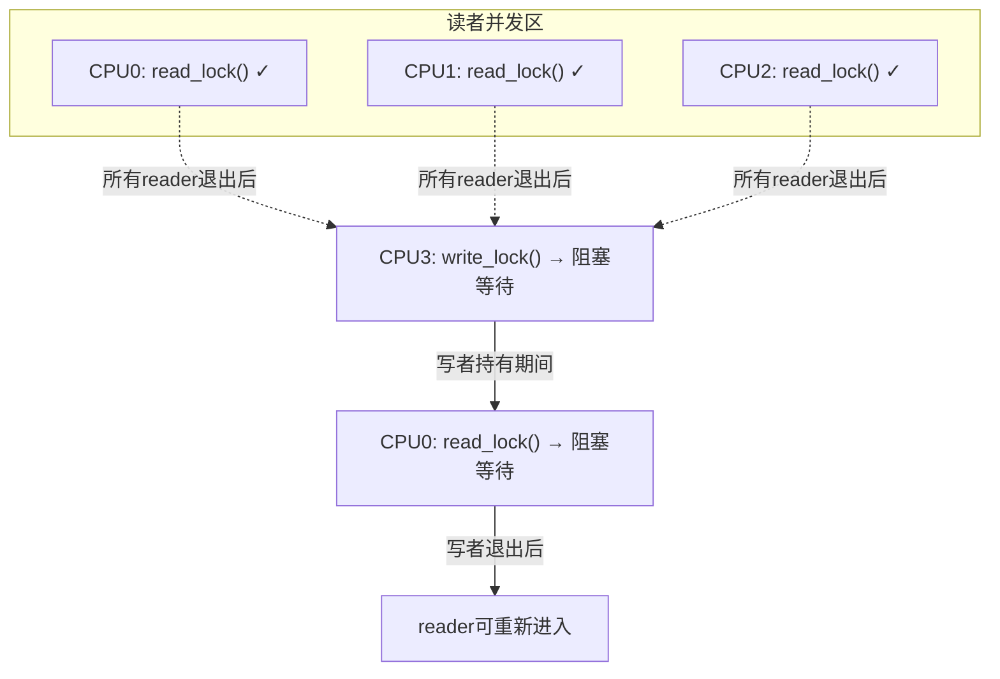

# 13.5.1 读写锁rwlock与rwsem

> 所属章节：第13章 并发与同步 > 13.5 补充原语
>
> 难度：[E→M] | 预计阅读时间：12分钟

## <span class="blue">本节导读

本节覆盖：rwlock 与 rwsem 的读者-写者模型、写者饥饿问题的成因与缓解、`downgrade_write()` 降级技巧，以及 rwlock / rwsem / RCU 三者的选型对照。

## <span class="blue">rwlock：读者共享、写者独占 [E]

rwlock是spinlock的变体。它的核心规则很简单——读者可以成群结队，写者必须独占全场。

多个CPU同时持有读锁？没问题，大家一起进。但只要有一个写者想进来，它就得等所有读者走光，而且写者进来后，后面排队的读者也得等着。

```c
#include <linux/rwlock.h>

static DEFINE_RWLOCK(my_rwlock);    /* 定义并初始化rwlock */
int shared_data;

/* 读者路径 */
void reader(void)
{
    read_lock(&my_rwlock);          /* 获取读锁，多个reader可并发 */
    printk("read: %d\n", shared_data);
    read_unlock(&my_rwlock);        /* 释放读锁 */
}

/* 写者路径 */
void writer(int val)
{
    write_lock(&my_rwlock);         /* 获取写锁，独占所有reader和writer */
    shared_data = val;
    write_unlock(&my_rwlock);       /* 释放写锁 */
}
```

rwlock的内部实现基于自旋——**它是 spinlock 家族成员，可以在中断上下文使用**（这正是它与 rwsem 的本质区别之一，rwsem 会睡眠、只能用进程上下文）。要注意的不是"中断里能不能用"，而是老规矩：**同一把锁同时被进程上下文和中断上下文使用时，进程侧必须用 `read_lock_irqsave()`/`write_lock_irqsave()`**，否则进程持锁时被同中断打断、中断里再抢同一把锁，就是自死锁（规则同 13.2.1 的 spinlock 变种）。

> ⚠️ 在中断上下文使用 rwlock 时，临界区必须短——写者获取不到锁时在**忙等**，写者自旋期间对应 CPU 的干等时间全部算在中断路径的延迟里。

这里用mermaid图展示rwlock的并发模型：



<br>

## <span class="blue">rwsem：可以睡觉的读写锁 [M]

rwlock的问题是写锁自旋，浪费CPU。rwsem（read-write semaphore）则是基于睡眠等待的读写锁——获取不到锁时进程会睡眠，而不是自旋。这让它更适合临界区较长、持有时间较久的场景。

```c
#include <linux/rwsem.h>

static DECLARE_RWSEM(my_rwsem);     /* 定义并初始化rwsem */

/* 读者路径（可睡眠） */
void rwsem_reader(void)
{
    down_read(&my_rwsem);           /* 获取读锁，多个reader可并发 */
    /* 临界区...可以睡眠 */
    up_read(&my_rwsem);             /* 释放读锁 */
}

/* 写者路径（独占） */
void rwsem_writer(int val)
{
    down_write(&my_rwsem);          /* 获取写锁，独占 */
    shared_data = val;
    up_write(&my_rwsem);            /* 释放写锁 */
}

/* 写者降级为读者 */
void rwsem_downgrade(int val)
{
    down_write(&my_rwsem);
    shared_data = val;
    downgrade_write(&my_rwsem);     /* 写锁→读锁，允许其他reader进入 */
    /* 继续持有读锁... */
    up_read(&my_rwsem);             /* 注意：降级后用up_read释放 */
}
```

`downgrade_write()`是个实用技巧。写者做完修改后，如果还需要读取验证但不再需要写权限，可以降级为读者。这样其他等待的读者就能立即进入，减少不必要的等待时间。

但rwsem有个大坑——**写者饥饿**。

<br>

### 写者饥饿：持续的读者流

rwsem的读者计数机制有个天然的缺陷：读者进入时只需要增加计数，退出时减少计数。如果读者的到来源源不断，写者可能永远等不到"没有读者"的时刻。

场景是这样的：假设有10个CPU，每个CPU频繁读同一个数据结构。CPU3想写——它等待所有读者退出。但刚走一个reader，又来一个，写者永远凑不齐"零读者"的条件。

`downgrade_write()`能缓解这个问题，但无法根除。v6.6 的 rwsem 通过等待队列排队与 handoff 机制（写者入队后阻止后续读者插队）缓解饥饿，另有乐观自旋优化（`CONFIG_RWSEM_SPIN_ON_OWNER`，与 mutex 的乐观自旋同理，见 13.2.2）减少睡眠开销——但根本上，读写比例极端时还是该换机制。

> 🔴 在读者压力极大的场景下，rwsem的写者仍可能经历明显延迟。如果你的写操作有实时性要求，不要用rwsem。

<br>

## <span class="blue">rwlock vs rwsem vs RCU 怎么选 [M]

这三兄弟都是"读者可以并发"的同步机制，但适用场景完全不同。

| 维度 | rwlock | rwsem | RCU |
|------|--------|-------|-----|
| 读者并发 | 多个reader并发 | 多个reader并发 | **读者完全无锁** |
| 写者机制 | 独占，自旋等待 | 独占，睡眠等待 | 通过副本替换 |
| 可睡眠 | **不可**（自旋） | **可以**（睡眠） | 读者不可睡眠 |
| 写者饥饿 | 可能 | **很可能**（v6.6 有缓解机制） | 不存在（写者间用锁） |
| 读者开销 | 原子操作+锁 | 计数+锁 | **零开销** |
| 写者开销 | 自旋等待 | 睡眠等待 | 分配副本+同步开销 |
| 适用场景 | 短临界区、不可睡眠 | 长临界区、可睡眠 | **读极多写极少** |
| 中断上下文 | 可用（进程侧配 irqsave） | **不可** | 读者可用 |

> 💡 读极多写极少 → 直接RCU；读多写少但能睡眠 → rwsem；读写平衡或都短 → mutex/spinlock；不可睡眠的短读写 → rwlock。

<br>

下面是rwlock和rwsem的API速查表：

| 操作 | rwlock | rwsem |
|------|--------|-------|
| 定义初始化 | `DEFINE_RWLOCK(lock)` | `DECLARE_RWSEM(sem)` |
| 动态初始化 | `rwlock_init(&lock)` | `init_rwsem(&sem)` |
| 获取读锁 | `read_lock(&lock)` | `down_read(&sem)` |
| 释放读锁 | `read_unlock(&lock)` | `up_read(&sem)` |
| 获取写锁 | `write_lock(&lock)` | `down_write(&sem)` |
| 释放写锁 | `write_unlock(&lock)` | `up_write(&sem)` |
| 尝试获取读锁 | `read_trylock(&lock)` | `down_read_trylock(&sem)` |
| 尝试获取写锁 | `write_trylock(&lock)` | `down_write_trylock(&sem)` |
| 写者降级为读者 | 不支持 | `downgrade_write(&sem)` |
| 中断安全读锁 | `read_lock_irqsave()` | 无（不可中断） |
| 中断安全写锁 | `write_lock_irqsave()` | 无（不可中断） |

<br>

### rwsem与RCU的本质区别

rwsem的读者虽然能并发，但还是要走`down_read()`这一步——至少是个原子操作加计数器检查。而RCU的读者什么都不用拿，直接读。这差距在高速路径上就是数量级的性能差异。

但RCU不是银弹。写者要做完整的副本修改替换，垃圾回收还需要等待grace period。数据结构太复杂、写操作太频繁，RCU反而更慢。

> 💡 在Linux内核中，`dentry_cache`、`路由表`、`进程链表`这些读极多写极少的场景都是RCU的经典用武之地。文件系统的目录缓存（dcache）就是RCU最成功的案例之一。

## <span class="blue">本节总结

| 概念 | 一句话概括 |
|------|-----------|
| rwlock | 读者共享、写者独占的自旋锁，不可睡眠，中断上下文可用 |
| rwsem | 读者共享、写者独占的睡眠锁，适合长临界区，仅进程上下文 |
| 写者饥饿 | 持续读者流导致写者长期拿不到锁，v6.6 有缓解但无根除 |
| downgrade_write() | 写者降级为读者，减少读者等待 |
| 选型原则 | 读极多写极少→RCU；读多写少→rwsem；读写平衡→mutex |

**核心记住一点**：rwlock和rwsem都解决"读者并发"的问题，但rwlock自旋、rwsem睡眠，rwsem有写者饥饿问题。读多写少的极致场景请用RCU。

## <span class="blue">下一步

读写锁仍是"读者也要拿锁"的思路。顺序锁 seqlock 走了另一条路：读者完全不加锁，靠版本号发现"数据变了"就重读。

> **13.5.2 顺序锁seqlock**

## <span class="blue">配套资源

| 资源 | 说明 |
|------|------|
| 本节代码清单 | `rwsem`初始化、读锁、写锁、降级完整示例（见正文代码块） |
| 并发模型图 | mermaid图：rwlock读者-写者并发关系图 |
| 速查表 | rwlock/rwsem API对照表、三种锁的选型决策表 |
| 推荐阅读 | `kernel/locking/rwsem.c` — rwsem实现源码 |
