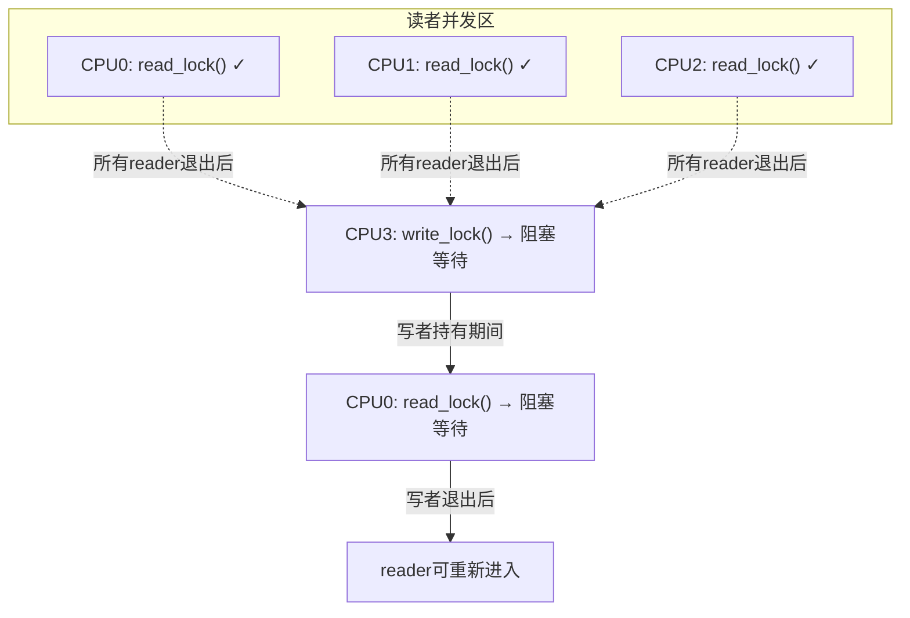

# 13.5.1 读写锁 rwlock 与 rwsem

> 所属章节：第13章 并发与同步 > 13.5 读写锁与顺序锁
>
> 难度：[E][M] | 预计阅读时间：12分钟

## <span class="blue">本节导读

spinlock和mutex有个通病——不管是读还是写，同一时刻只允许一个CPU进入临界区。可如果你的数据结构读多写少，绝大部分CPU都在"读"，凭啥让他们互相排斥？读写锁就是来解决这个问题的。本节带你搞懂rwlock和rwsem的读者-写者模型，理解写者饥饿这个坑，还有什么时候该用rwsem、什么时候该直接上RCU。<br>
学完后，你将能根据读写比例选择正确的锁，避开写者饥饿的陷阱。

## <span class="blue">rwlock：读者共享、写者独占 [E]

rwlock是spinlock的变体。它的核心规则很简单——读者可以成群结队，写者必须独占全场。

多个CPU同时持有读锁？没问题，大家一起进。但只要有一个写者想进来，它就得等所有读者走光，而且写者进来后，后面排队的读者也得等着。

```c
#include <linux/rwlock.h>

static DEFINE_RWLOCK(my_rwlock);    // 定义并初始化rwlock
int shared_data;

// 读者路径
void reader(void)
{
    read_lock(&my_rwlock);          // 获取读锁，多个reader可并发
    printk("read: %d\n", shared_data);
    read_unlock(&my_rwlock);        // 释放读锁
}

// 写者路径
void writer(int val)
{
    write_lock(&my_rwlock);         // 获取写锁，独占所有reader和writer
    shared_data = val;
    write_unlock(&my_rwlock);       // 释放写锁
}
```

rwlock的内部实现依然基于自旋——写者获取不到锁时会忙等。这意味着**rwlock不能在中断上下文使用写锁**，否则可能死锁（写者自旋时若持有该锁的读者被中断打断，中断里又尝试获取写锁...）。

> ⚠️ **陷阱**：`write_lock()`会自旋等待，绝对不能在中断上下文或持有自旋锁时调用`write_lock()`。读锁`read_lock()`虽然不会阻塞其他读者，但不同架构的实现可能涉及原子操作，在中断里用同样要小心。

这里用mermaid图展示rwlock的并发模型：



<br>

## <span class="blue">rwsem：可以睡觉的读写锁 [M]

rwlock的问题是写锁自旋，浪费CPU。rwsem（read-write semaphore）则是基于mutex的读写锁——获取不到锁时进程会睡眠，而不是自旋。这让它更适合临界区较长、持有时间较久的场景。

```c
#include <linux/rwsem.h>

static DECLARE_RWSEM(my_rwsem);     // 定义并初始化rwsem

// 读者路径（可睡眠）
void rwsem_reader(void)
{
    down_read(&my_rwsem);           // 获取读锁，多个reader可并发
    // 临界区...可以睡眠
    up_read(&my_rwsem);             // 释放读锁
}

// 写者路径（独占）
void rwsem_writer(int val)
{
    down_write(&my_rwsem);          // 获取写锁，独占
    shared_data = val;
    up_write(&my_rwsem);            // 释放写锁
}

// 写者降级为读者
void rwsem_downgrade(int val)
{
    down_write(&my_rwsem);
    shared_data = val;
    downgrade_write(&my_rwsem);     // 写锁→读锁，允许其他reader进入
    // 继续持有读锁...
    up_read(&my_rwsem);             // 注意：降级后用up_read释放
}
```

`downgrade_write()`是个实用技巧。写者做完修改后，如果还需要读取验证但不再需要写权限，可以降级为读者。这样其他等待的读者就能立即进入，减少不必要的等待时间。

但rwsem有个大坑——**写者饥饿**。

<br>

### 写者饥饿：持续的读者流

rwsem的读者计数机制有个天然的缺陷：读者进入时只需要增加计数，退出时减少计数。如果读者的到来源源不断，写者可能永远等不到"没有读者"的时刻。

场景是这样的：假设有10个CPU，每个CPU频繁读同一个数据结构。CPU3想写——它等待所有读者退出。但刚走一个reader，又来一个，写者永远凑不齐"零读者"的条件。

`downgrade_write()`能缓解这个问题，但无法根除。内核后来引入了rwsem的"优先写者"模式（CONFIG_RWSEM_SPIN_ON_OWNER等优化），但根本解法还是选对锁。

> 🔴 **危险**：在读者压力极大的场景下，rwsem的写者可能饥饿数秒甚至更久。如果你的写操作有实时性要求，不要用rwsem。

<br>

## <span class="blue">rwlock vs rwsem vs RCU 怎么选 [M]

这三兄弟都是"读者可以并发"的同步机制，但适用场景完全不同。

| 维度 | rwlock | rwsem | RCU |
|------|--------|-------|-----|
| 读者并发 | 多个reader并发 | 多个reader并发 | **读者完全无锁** |
| 写者机制 | 独占，自旋等待 | 独占，睡眠等待 | 通过副本替换 |
| 可睡眠 | **不可**（自旋） | **可以**（睡眠） | 读者不可睡眠 |
| 写者饥饿 | 可能 | **很可能** | 不存在（写者间用锁） |
| 读者开销 | 原子操作+锁 | 计数+锁 | **零开销** |
| 写者开销 | 自旋等待 | 睡眠等待 | 分配副本+同步开销 |
| 适用场景 | 短临界区、不可睡眠 | 长临界区、可睡眠 | **读极多写极少** |
| 中断上下文 | 读锁可用，写锁不可用 | **不可** | 读者可用 |

> 💡 **提示**：读极多写极少 → 直接RCU；读多写少但能睡眠 → rwsem；读写平衡或都短 → mutex/spinlock；不可睡眠的短读写 → rwlock。

<br>

下面是rwlock和rwsem的API速查表：

| 操作 | rwlock | rwsem |
|------|--------|-------|
| 定义初始化 | `DEFINE_RWLOCK(lock)` | `DECLARE_RWSEM(sem)` |
| 动态初始化 | `rwlock_init(&lock)` | `init_rwsem(&sem)` |
| 获取读锁 | `read_lock(&lock)` | `down_read(&sem)` |
| 释放读锁 | `read_unlock(&lock)` | `up_read(&sem)` |
| 获取写锁 | `write_lock(&lock)` | `down_write(&sem)` |
| 释放写锁 | `write_unlock(&lock)` | `up_write(&sem)` |
| 尝试获取读锁 | `read_trylock(&lock)` | `down_read_trylock(&sem)` |
| 尝试获取写锁 | `write_trylock(&lock)` | `down_write_trylock(&sem)` |
| 写者降级为读者 | 不支持 | `downgrade_write(&sem)` |
| 中断安全读锁 | `read_lock_irqsave()` | 无（不可中断） |
| 中断安全写锁 | `write_lock_irqsave()` | 无（不可中断） |

<br>

### rwsem与RCU的本质区别

rwsem的读者虽然能并发，但还是要走`down_read()`这一步——至少是个原子操作加计数器检查。而RCU的读者什么都不用拿，直接读。这差距在高速路径上就是数量级的性能差异。

但RCU不是银弹。写者要做完整的副本修改替换，垃圾回收还需要等待grace period。数据结构太复杂、写操作太频繁，RCU反而更慢。

> 💡 **提示**：在Linux内核中，`dentry_cache`、`路由表`、`进程链表`这些读极多写极少的场景都是RCU的经典用武之地。文件系统的目录缓存（dcache）就是RCU最成功的案例之一。

## <span class="blue">本节总结

| 概念 | 一句话概括 |
|------|-----------|
| rwlock | 读者共享、写者独占的自旋锁，不可睡眠 |
| rwsem | 读者共享、写者独占的睡眠锁，适合长临界区 |
| 写者饥饿 | 持续读者流导致写者永远获取不到锁 |
| downgrade_write() | 写者降级为读者，减少读者等待但无法根除饥饿 |
| 选型原则 | 读极多写极少→RCU；读多写少→rwsem；读写平衡→mutex |

**核心记住一点**：rwlock和rwsem都解决"读者并发"的问题，但rwlock自旋、rwsem睡眠，rwsem有写者饥饿问题。读多写少的极致场景请用RCU。

## <span class="blue">下一步

下一节（13.5.2），我们聊顺序锁seqlock——它走了另一条路：读者完全不加锁、写者用版本号通知读者"数据变了请重试"。这种"乐观读取"的模型在系统时钟（jiffies）等场景里大放异彩。

## <span class="blue">配套资源

| 资源 | 说明 |
|------|------|
| 本节代码清单 | `rwsem`初始化、读锁、写锁、降级完整示例（见正文代码块） |
| 并发模型图 | mermaid图：rwlock读者-写者并发关系图 |
| 速查表 | rwlock/rwsem API对照表、三种锁的选型决策表 |
| 推荐阅读 | `kernel/locking/rwsem.c` — rwsem实现源码 |
