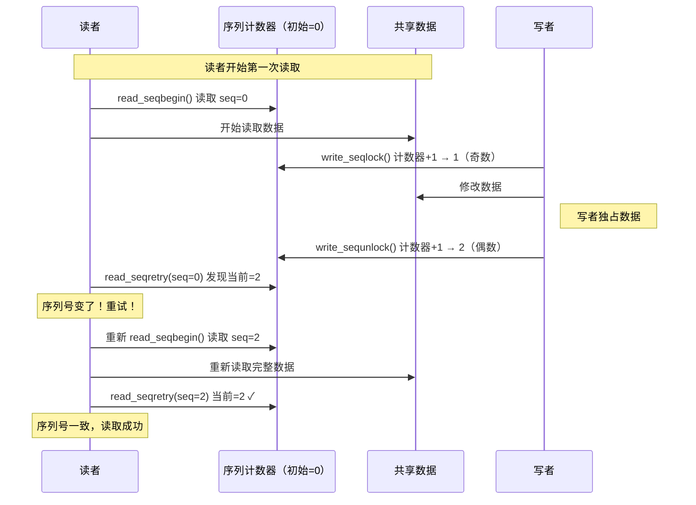

# 13.5.2 顺序锁seqlock

> 所属章节：第13章 并发与同步 > 13.5 补充原语
>
> 难度：[E] | 预计阅读时间：15分钟

## <span class="blue"> 本节导读

本节覆盖：seqlock 的序列计数器机制（奇偶性表达"是否有人在写"）、写者优先的设计哲学、读写两端的标准模板、jiffies 这个教科书级用例，以及 seqlock 与 RCU 的选型对比。

---

## <span class="blue"> seqlock：用序列号实现的写者优先锁 [E]

### 核心机制：一个计数器，两种状态

seqlock（sequential lock，顺序锁）的底层只有一个**序列计数器**（sequence counter）。这个计数器的奇偶性揭示了数据的状态：

| 计数器值 | 含义 |
|---------|------|
| 偶数 | 数据稳定，没有写者在修改 |
| 奇数 | 有写者正在修改数据，读者不要读 |

说白了就是——seqlock根本不"锁"读者，它只是给读者一个信号："数据可能脏了，你重读吧。"

### 写者操作流程

写者拿seqlock时，操作非常有节奏感：

```c
/* 写端模板 */
unsigned long flags;
write_seqlock(&my_seqlock);      /* ① 计数器 +1（变奇数） */
/* 修改被保护的数据 */           /* ② 安全地写数据 */
write_sequnlock(&my_seqlock);    /* ③ 计数器再 +1（变偶数） */
```

写者前后的两次递增，让计数器经历了**偶数→奇数→偶数**的完整过程。读者只要检查到计数器是奇数，就知道"有人正在写"；检查到前后计数器不同，就知道"我读的过程中有人写了"。

### 读者操作流程

读者这边没有加锁操作，只有"采样+校验"：

```c
/* 读端模板 */
unsigned seq;

do {
    seq = read_seqbegin(&my_seqlock);   /* ① 读取当前序列号 */
    /* 读取被保护的数据 */              /* ② 读取数据（可能被写者干扰） */
} while (read_seqretry(&my_seqlock, seq));  /* ③ 检查序列号是否变化 */
                                        /*    变了？从头再来！ */
```

`read_seqretry()` 做的事情很简单：比较当前序列号与之前读取的序列号。如果不同，说明读数据的过程中有写者捣乱了，必须重试整个读取过程。

> 💡 seqlock的读端**没有锁竞争**，没有原子操作的争用，所以在写者极少的情况下，读者性能极好。

### seqlock读写流程图



### 为什么叫"写者优先"？

看上面的流程你就明白了——读者发现数据被修改后，**自己承担重试的成本**，而不是阻塞写者。写者永远不需要等读者。

这种设计的哲学是：写者少、读者多，让偶尔出现的写者快速通过，读者多花点力气重读是可以接受的。

> ⚠️ 如果写者过于频繁，读者可能陷入**无限重试**的循环——刚读到一半，写者又来了，读完发现序列号变了，只好重来，如此往复。seqlock绝对不适合写者频繁出没的场景。

### jiffies为什么用seqlock？

jiffies是内核中记录系统节拍数的64位计数器（`jiffies_64`）。在32位系统上，读取64位值不是原子的，可能被中断打断。

用自旋锁保护？读者太多，竞争开销大。用RCU？jiffies是单个变量，RCU有点大材小用。seqlock恰到好处：

```c
/* 内核中读取 jiffies_64 的简化示意 */
do {
    seq = read_seqbegin(&jiffies_lock);
    ret = jiffies_64;           /* 读取64位值 */
} while (read_seqretry(&jiffies_lock, seq));
```

jiffies的修改只发生在定时器中断里（写者极少），而几乎每个内核子系统都要读取jiffies（读者极多）。seqlock的"写者优先、读者重试"模型完美匹配这个场景。

> 💡 seqlock只适合**数据量很小**的场景——比如单个64位计数器。为什么？因为读者需要**完整重读所有数据**。如果被保护的是一个大结构体，每次重试都要读几十个字节，开销就不划算了。

### seqlock vs RCU：怎么选？

| 维度 | seqlock | RCU |
|------|---------|-----|
| 读者开销 | 极轻（只需检查序列号） | 极轻（只需读端临界区） |
| 写者开销 | 中等（自旋锁 + 两次计数器更新） | 较高（需等待grace period） |
| 读者是否可能阻塞 | 不会阻塞，但可能重试 | 不会阻塞，也不会重试 |
| 是否保证读到最新数据 | 是（重试直到读到一致的） | 否（可能读到旧版本，但最终一致） |
| 适用数据大小 | **小**（单个变量/结构体） | **大**（链表、树等复杂结构） |
| 编程复杂度 | 简单（循环重试模板） | 较复杂（需理解宽限期、回调） |
| 读者数量 | 任意多 | 任意多 |
| 写者频率 | **必须很少** | 可中等频率 |
| 典型用例 | jiffies、时间戳、简单计数器 | 路由表、进程链表、读多写少的数据结构 |

RCU用空间换时间（保留旧版本），适合复杂数据结构；seqlock用读者重试换写者通畅，适合简单变量。两条路，走哪条取决于你的数据长什么样。

> 🔴 seqlock保护的读者临界区里，**绝对不能让出CPU**（不能调用 `schedule()`、不能睡眠）。因为读者没加锁，如果睡着了，写者可能来了又去，读者醒来后重试机制都检测不到问题——但读到的数据可能已经被释放了。

---

## <span class="blue"> 本节总结

| 要点 | 内容 |
|------|------|
| seqlock核心 | 一个序列计数器，奇数=正在写入，偶数=写入完成 |
| 写者流程 | write_seqlock()→修改数据→write_sequnlock()，计数器+2 |
| 读者流程 | read_seqbegin()→读数据→read_seqretry()，不一致则重试 |
| 设计哲学 | 写者优先，读者承担重试成本 |
| 最佳场景 | 写者极少、读者极多、数据量极小（如单个计数器） |
| 经典用例 | jiffies_64、高精度时间戳 |
| 致命陷阱 | 写者频繁时读者可能无限重试；读者不能睡眠 |
| 与RCU的区别 | seqlock适合简单变量（读者重试），RCU适合复杂结构（多版本共存） |

---

## <span class="blue"> 下一步

seqlock 用重试消灭读端竞争，per-cpu 变量更彻底——每个 CPU 一份私有副本，连"共享"本身都不存在。

> **13.5.3 per-cpu变量**

---

## <span class="blue"> 配套资源

| 资源类型 | 内容 |
|---------|------|
| 核心API | `write_seqlock()` / `write_sequnlock()` / `read_seqbegin()` / `read_seqretry()` |
| 数据结构 | `seqlock_t` / `seqcount_t` |
| 内核实例 | `kernel/time/jiffies.c`（jiffies的seqlock保护） |
| 代码清单 | 本节读端模板（do-while重试循环）、写端模板 |
| 图示 | seqlock读写交互时序图（mermaid） |
| 对比表格 | seqlock vs RCU 八维度对比 |
