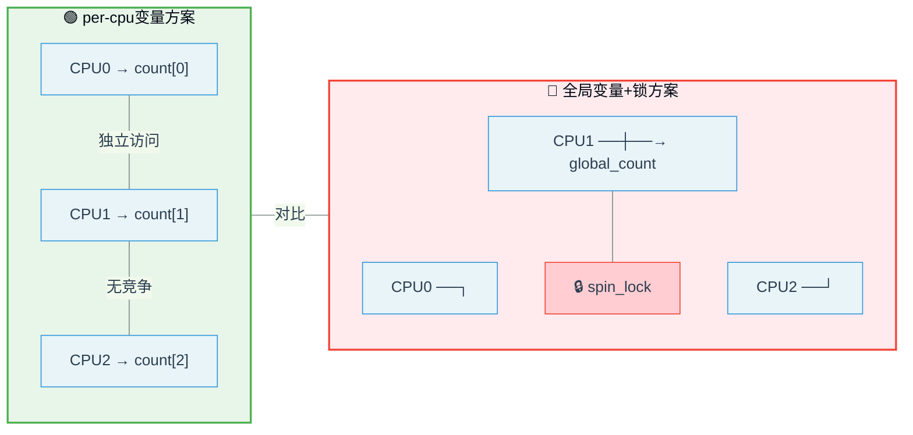

# 13.5.3 per-cpu变量：每个CPU一份，锁是什么东西？

> 所属章节：第13章 并发与同步 > 13.5 内核并发机制
>
> 难度：[E][M] | 预计阅读时间：15分钟

## <span class="blue"> 本节导读

你已经被spinlock、mutex、RCU搞得头大了吧？这节换换口味——介绍一个**不需要锁**的并发技术。per-cpu变量的核心思想简单粗暴：既然争用是因为多个CPU共享同一份数据，那我给每个CPU发一份独立的副本不就行了？<br>
学完后，你将掌握per-cpu变量的声明、访问、动态分配和遍历方法，能判断什么场景适合用它，并避开那些容易踩的坑。

---

## <span class="blue"> per-cpu机制：一人一份，互不干涉 [E]

多核系统中，多个CPU同时读写同一个变量时，你不得不加锁。但有一种场景——每个CPU只操作自己的数据，互不干涉——这时候加锁反而成了累赘。per-cpu变量就是解决这个问题的：

```
┌─────────────┐  ┌─────────────┐  ┌─────────────┐  ┌─────────────┐
│   CPU 0     │  │   CPU 1     │  │   CPU 2     │  │   CPU 3     │
│  ┌───────┐  │  │  ┌───────┐  │  │  ┌───────┐  │  │  ┌───────┐  │
│  │count_0│  │  │  │count_1│  │  │  │count_2│  │  │  │count_3│  │
│  │  =42  │  │  │  │  =17  │  │  │  │  =99  │  │  │  │  =5   │  │
│  └───────┘  │  │  └───────┘  │  │  └───────┘  │  │  └───────┘  │
└─────────────┘  └─────────────┘  └─────────────┘  └─────────────┘
     独立副本          独立副本          独立副本          独立副本
```

每个CPU有独立的副本，访问时**不需要任何锁**，也不需要原子操作。说白了，数据天然就是隔离的，哪来的竞争？

per-cpu的另一个好处是**避免缓存伪共享**（cache false sharing）。多个CPU各自操作自己的变量，这些变量存放在不同的cache line里，不会互相踩踏。相比全局变量被多个CPU抢来抢去，性能提升可不是一星半点。

### 静态声明与访问

内核提供了宏来声明per-cpu变量：

```c
// 静态声明一个per-cpu的unsigned long变量
DEFINE_PER_CPU(unsigned long, irq_count);

// 如果需要在其他文件使用，先声明
DECLARE_PER_CPU(unsigned long, irq_count);
```

访问per-cpu变量有一套专门的API，核心是两对函数：

```c
// 方法1：get_cpu_var / put_cpu_var（关抢占 + 返回变量）
unsigned long *count;
count = get_cpu_var(irq_count);   // 关抢占，获取当前CPU的副本
(*count)++;                       // 操作数据
put_cpu_var(irq_count);           // 开抢占，必须配对！

// 方法2：this_cpu_ptr（只取指针，不关抢占）
unsigned long *count = this_cpu_ptr(&irq_count);
(*count)++;                       // 操作数据，需自行保证上下文安全
```

`get_cpu_var()`内部做了两件事：**关闭内核抢占** + **返回当前CPU对应的变量指针**。为什么要关抢占？防止当前CPU在操作到一半的时候被调度到其他CPU上去，那时候操作的就是别人的副本了！

> ⚠️ **陷阱**：`get_cpu_var()`和`put_cpu_var()`**必须严格配对**。如果在`preempt_enable`之前忘了调用`put_cpu_var()`，当前CPU的抢占就永远关着，调度器无法抢占这个任务，轻则延迟抖动，重则系统僵死。这比你想象的要容易犯——特别是代码里有多个return路径的时候。

### 动态分配per-cpu变量

静态声明的per-cpu变量在编译时就确定了大小和数量。如果需要在运行时动态创建，用下面这组API：

```c
// 动态分配
unsigned long __percpu *dynamic_count;
dynamic_count = alloc_percpu(unsigned long);
if (!dynamic_count)
    return -ENOMEM;           // 分配失败处理

// 使用方式与静态变量类似
unsigned long *count = get_cpu_ptr(dynamic_count);
(*count)++;
put_cpu_ptr(dynamic_count);

// 释放（记得所有CPU都不用的时候才能free）
free_percpu(dynamic_count);
```

> 🔴 **危险**：`free_percpu()`必须确保所有CPU都不再访问这个变量。如果某个CPU还在`get_cpu_ptr`和`put_cpu_ptr`之间操作，释放后就是UAF（Use-After-Free）崩溃。

### 遍历所有CPU：汇总全局视图

既然每个CPU有自己的副本，那想看总量怎么办？遍历所有CPU求和呗：

```c
// 遍历所有可能存在的CPU，汇总统计
unsigned long total = 0;
int cpu;

for_each_possible_cpu(cpu) {
    total += per_cpu(irq_count, cpu);  // 读取指定CPU的副本值
}

printk("Total IRQ count across all CPUs: %lu\n", total);
```

> 💡 **提示**：`for_each_possible_cpu()`遍历的是系统所有"可能存在"的CPU（包括离线的），而不是当前在线的。做全局汇总时，只要各CPU的数据互不干扰，遍历全部再求和就能得到精确的全局视图。如果只需要在线CPU，改用`for_each_online_cpu()`。

---

## <span class="blue"> per-cpu API速查表与对比 [M]

### per-cpu变量完整API

| 类别 | API | 说明 |
|------|-----|------|
| **静态声明** | `DEFINE_PER_CPU(type, name)` | 定义一个per-cpu变量 |
| | `DECLARE_PER_CPU(type, name)` | 外部文件前向声明 |
| **访问（关抢占）** | `get_cpu_var(name)` | 关抢占，返回当前CPU变量的左值 |
| | `put_cpu_var(name)` | 开抢占，与get_cpu_var配对 |
| | `get_cpu_ptr(ptr)` | 关抢占，返回指针（动态变量用） |
| | `put_cpu_ptr(ptr)` | 开抢占，与get_cpu_ptr配对 |
| **访问（不关抢占）** | `this_cpu_ptr(ptr)` | 仅返回当前CPU的指针，不关抢占 |
| | `__this_cpu_read(ptr)` | 直接读，无保护，用于已知安全的上下文 |
| | `__this_cpu_write(ptr, val)` | 直接写，无保护 |
| **遍历** | `for_each_possible_cpu(cpu)` | 遍历所有可能存在的CPU |
| | `for_each_online_cpu(cpu)` | 遍历当前在线的CPU |
| | `per_cpu(var, cpu)` | 读取指定CPU的副本值 |
| **动态分配** | `alloc_percpu(type)` | 运行时分配per-cpu变量 |
| | `free_percpu(ptr)` | 释放动态per-cpu变量 |

### per-cpu vs 全局变量+锁

| 维度 | per-cpu变量 | 全局变量 + spinlock |
|------|------------|-------------------|
| **并发访问** | 无竞争（各CPU独立） | 需要加锁，存在争用 |
| **缓存行** | 各CPU数据在不同cache line，无伪共享 | 多CPU争抢同一cache line，伪共享严重 |
| **性能** | 极快（直接内存访问，无原子操作） | 慢（锁获取/释放 + cache同步） |
| **数据一致性** | 每个CPU看到各自的值，无全局一致性 | 全局强一致性 |
| **编程复杂度** | 中（需管理get/put配对，需手动汇总） | 低（加锁解锁模式固定） |
| **内存占用** | 高（N个CPU × 数据大小） | 低（单一副本） |
| **适用场景** | CPU-local统计、计数器、缓存 | 需要全局一致状态的数据 |

下面这张图直观展示了两种方案的区别：



---

## <span class="blue"> 适用场景与注意事项 [E]

### 什么时候用per-cpu？

- **CPU-local统计**：每个CPU独立计数中断次数、网络包数量、调度次数
- **避免伪共享**：高频访问的计数器，如果多个CPU各写各的，per-cpu天然隔离
- **临时缓冲区**：每个CPU需要一小片buffer，互不干扰
- **减少锁争用**：把全局计数器拆成per-cpu，汇总时再加，大幅降低锁压力

### 什么时候**不要**用per-cpu？

- 数据需要**全局实时一致**：per-cpu各副本之间没有同步，一个CPU看不到另一个CPU的最新值
- 数据量很大：N个CPU各一份，内存占用成倍增长
- 需要跨CPU协作的状态：比如一个全局的可用资源池，各CPU需要协商分配

### 完整代码示例

```c
#include <linux/percpu.h>
#include <linux/smp.h>

// ========== 1. 静态声明 ==========
DEFINE_PER_CPU(unsigned long, packet_count);   // 每个CPU的包计数器

// ========== 2. 在数据路径中使用（高频） ==========
void process_packet(struct sk_buff *skb)
{
    unsigned long *count;

    count = get_cpu_var(packet_count);   // 关抢占，取当前CPU的计数器
    (*count)++;                          // 直接++，无需原子操作，无需锁
    put_cpu_var(packet_count);           // 开抢占，必须配对！

    // ... 处理数据包 ...
}

// ========== 3. 动态分配（模块加载时） ==========
struct stats {
    unsigned long rx;
    unsigned long tx;
    unsigned long drops;
};

static struct stats __percpu *cpu_stats;

static int __init mymodule_init(void)
{
    int cpu;

    cpu_stats = alloc_percpu(struct stats);
    if (!cpu_stats)
        return -ENOMEM;

    // 初始化每个CPU的副本为0
    for_each_possible_cpu(cpu) {
        struct stats *s = per_cpu_ptr(cpu_stats, cpu);
        s->rx = s->tx = s->drops = 0;
    }
    return 0;
}

// ========== 4. 动态变量使用 ==========
void record_rx(void)
{
    struct stats *s = get_cpu_ptr(cpu_stats);
    s->rx++;
    put_cpu_ptr(cpu_stats);
}

// ========== 5. 遍历汇总（读/proc或定时任务） ==========
static void show_stats(void)
{
    unsigned long total_rx = 0, total_tx = 0;
    int cpu;

    // 遍历所有CPU，汇总统计
    for_each_online_cpu(cpu) {
        struct stats *s = per_cpu_ptr(cpu_stats, cpu);
        total_rx += s->rx;
        total_tx += s->tx;
        pr_info("CPU%d: rx=%lu tx=%lu\n", cpu, s->rx, s->tx);
    }
    pr_info("TOTAL: rx=%lu tx=%lu\n", total_rx, total_tx);
}

static void __exit mymodule_exit(void)
{
    // 确保无人使用后释放
    free_percpu(cpu_stats);
}
```

---

## <span class="blue"> 本节总结

| 要点 | 内容 |
|------|------|
| **核心思想** | 每个CPU一份独立副本，消除共享，从而消除竞争 |
| **静态声明** | `DEFINE_PER_CPU(type, name)` 编译期分配 |
| **动态分配** | `alloc_percpu(type)` / `free_percpu()` 运行期管理 |
| **安全访问** | `get_cpu_var()` / `put_cpu_var()` 关/开抢占配对使用 |
| **快速访问** | `this_cpu_ptr()` 仅取指针，不关抢占，需自行保证安全 |
| **全局汇总** | `for_each_possible_cpu(cpu)` + `per_cpu(var, cpu)` 遍历求和 |
| **最大优势** | 无锁、无原子操作、无缓存伪共享，性能极高 |
| **核心限制** | 不提供全局一致性，各CPU副本之间没有自动同步 |
| **常见陷阱** | get/put不配对导致抢占泄漏；free时还有CPU在访问 |
| **典型场景** | CPU-local计数器、统计、临时缓冲区、避免伪共享 |

---

## <span class="blue"> 下一步

per-cpu变量解决的是"各算各的"场景，但有些情况你需要等待某个异步事件完成——比如发起一个I/O请求后阻塞等待结果。下一节 **`13.5.4 completion与waitqueue`** ，我们来看看内核中等待/通知机制的实现。

---

## <span class="blue"> 配套资源

| 资源 | 说明 |
|------|------|
| 📋 **代码清单** | 本节的完整per-cpu变量示例代码（静态声明 + 动态分配 + 遍历汇总） |
| 📊 **对比图** | per-cpu vs 全局变量+锁的mermaid对比图 |
| 📋 **速查表** | per-cpu完整API表格（声明/访问/遍历/动态分配） |
| 📖 **推荐阅读** | `include/linux/percpu.h` — 内核per-cpu头文件，所有API定义 |
| 📖 **推荐阅读** | `Documentation/core-api/this_cpu_ops.rst` — 官方文档 |
