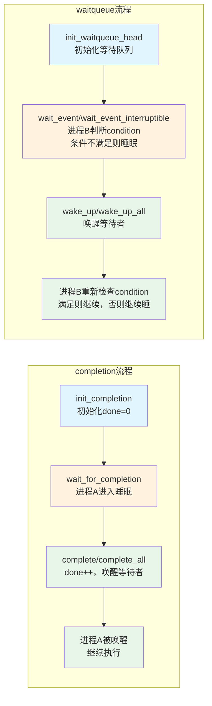

# 13.5.4 completion与waitqueue

> 所属章节：第13章 并发与同步 > 13.5 补充原语
>
> 难度：[E] | 预计阅读时间：25分钟

## <span class="blue">本节导读

本节覆盖：内核两类"等待-通知"原语——completion（一次性事件通知）与 waitqueue（条件等待）的核心 API、适用场景、手写等待循环的标准模板、独占等待与惊群问题，以及 waitqueue 底层数据结构（`wait_queue_head`/`wait_queue_entry`）。它们解决的是"等事件发生"，与 mutex 解决的"保护数据"是两类问题。

## <span class="blue">completion机制："做完了告诉我"[E]

### 核心思想

completion本质上是一个**一次性信号量**——有人发信号说"事情做完了"，等着的人被唤醒，完事。信号发完不会自动重置，所以叫"完成通知"，而不是循环使用的互斥量。

想想DMA传输：你发起一个DMA请求，硬件传完数据后触发中断，中断处理函数里调用`complete()`，`wait_for_completion()`处的等待者被唤醒，继续处理数据。这个流程里，`complete()`就是那一声"好了！"

### 核心API

```c
#include <linux/completion.h>

struct completion my_comp;

/* 1. 初始化 */
init_completion(&my_comp);

/* 2. 在某处阻塞等待（会进入睡眠，不消耗CPU） */
wait_for_completion(&my_comp);

/* 3. 在另一处（如中断处理函数中）发出完成信号 */
complete(&my_comp);       /* 唤醒一个等待者 */
complete_all(&my_comp);   /* 唤醒所有等待者 */
```

`wait_for_completion()`还有一个带超时版本：`wait_for_completion_timeout()`，超时时返回0，可以避免永远睡下去。

```c
/* 带超时版本：等5秒，超时就放弃 */
unsigned long timeout = msecs_to_jiffies(5000);
if (!wait_for_completion_timeout(&my_comp, timeout)) {
    pr_err("DMA传输超时！\n");
    return -ETIMEDOUT;
}
```

### 适用场景

completion最适合的模式是**"一件事完成后通知"**：
- 驱动probe完成通知
- DMA传输完成通知
- 模块初始化完成通知
- 工作队列任务完成通知
- 异步I/O完成通知

> 💡 completion的设计哲学是"做一次就完事"——`complete()`发出信号后不会自动清零，如果你需要重复使用同一个completion，必须在下次等待前调用`reinit_completion()`重新初始化。

### 一个完整的completion示例

```c
/* 驱动probe中等待硬件初始化完成的示例 */
struct my_device {
    struct completion hw_ready;
    struct work_struct init_work;
    int status;
};

static void hw_init_work(struct work_struct *work)
{
    struct my_device *dev = container_of(work, struct my_device, init_work);

    /* 模拟硬件初始化（可能很耗时） */
    msleep(100);
    dev->status = 0;  /* 0 = 成功 */

    /* 硬件就绪，发出完成信号 */
    complete(&dev->hw_ready);
}

static int my_probe(struct platform_device *pdev)
{
    struct my_device *dev = devm_kzalloc(&pdev->dev, sizeof(*dev), GFP_KERNEL);

    init_completion(&dev->hw_ready);
    INIT_WORK(&dev->init_work, hw_init_work);

    /* 调度异步初始化工作 */
    schedule_work(&dev->init_work);

    /* 同步等待硬件就绪（这里会睡眠，不占用CPU） */
    wait_for_completion(&dev->hw_ready);

    pr_info("硬件初始化完成，状态=%d\n", dev->status);
    return 0;
}
```

> ⚠️ `complete()`只唤醒**一个**等待者。如果你的代码里可能有多个进程同时`wait_for_completion()`在同一个completion上，却调用了`complete()`而不是`complete_all()`，那剩下的进程将永远睡下去——经典的"丢唤醒"bug。

## <span class="blue">waitqueue机制："条件满足了再叫我"[E]

### 核心思想

waitqueue（等待队列）比completion更灵活。completion是"做完了通知你"，waitqueue是"你定个条件，满足了我叫你"。所以waitqueue天然支持**条件判断**——进程被唤醒后，还要再检查一下条件是否真的满足了，因为可能是个假唤醒（spurious wakeup）。

waitqueue在内核里无处不在：`read()`系统调用等数据、`poll()`等事件、`select()`等fd就绪，底层都是waitqueue在支撑。

### 推荐写法：wait_event宏

手写的"入队 + 设状态 + schedule + 出队"太啰嗦，内核提供了一组宏来简化，这也是实际开发中的首选：

```c
/* 最常用版本：条件满足时返回，否则睡眠等待被唤醒 */
wait_event(wq_head, condition);

/* 可中断版本：可以被信号打断，返回-ERESTARTSYS */
wait_event_interruptible(wq_head, condition);

/* 带超时的可中断版本 */
wait_event_interruptible_timeout(wq_head, condition, timeout);

/* 对应的唤醒方 */
wake_up(&wq_head);       /* 唤醒后，wait_event会重新检查condition */
```

> ⚠️ `wait_event()`系列宏内部已经帮你处理了**条件检查循环**——被唤醒后会自动重新判断condition，不满足就继续睡。但如果你手写waitqueue代码（不用宏），一定要记得在被唤醒后重新检查条件，因为`wake_up`可能是个假唤醒。

### waitqueue完整示例

```c
/* 字符设备read()中等待数据就绪的示例 */
struct my_chardev {
    wait_queue_head_t read_wq;
    char buffer[256];
    int data_len;
    struct mutex lock;
};

static ssize_t my_read(struct file *filp, char __user *buf,
                       size_t count, loff_t *off)
{
    struct my_chardev *dev = filp->private_data;

    /* 等待缓冲区有数据 */
    if (wait_event_interruptible(dev->read_wq, dev->data_len > 0))
        return -ERESTARTSYS;  /* 被信号中断 */

    mutex_lock(&dev->lock);

    count = min(count, (size_t)dev->data_len);
    if (copy_to_user(buf, dev->buffer, count)) {
        mutex_unlock(&dev->lock);
        return -EFAULT;
    }
    dev->data_len -= count;

    mutex_unlock(&dev->lock);
    return count;
}

/* write()中写入数据后唤醒读者 */
static ssize_t my_write(struct file *filp, const char __user *buf,
                        size_t count, loff_t *off)
{
    struct my_chardev *dev = filp->private_data;

    mutex_lock(&dev->lock);

    count = min(count, sizeof(dev->buffer) - dev->data_len);
    if (copy_from_user(dev->buffer + dev->data_len, buf, count)) {
        mutex_unlock(&dev->lock);
        return -EFAULT;
    }
    dev->data_len += count;

    mutex_unlock(&dev->lock);

    /* 数据来了，唤醒等待的读者 */
    wake_up_interruptible(&dev->read_wq);
    return count;
}
```

## <span class="blue">completion与waitqueue的工作流程



## <span class="blue">三种通知/等待机制对比

| 特性 | completion | waitqueue | mutex |
|------|-----------|-----------|-------|
| **核心语义** | 事件通知（一次性） | 条件等待（可循环） | 互斥访问（可循环） |
| **等待方式** | 进程睡眠 | 进程睡眠 | 进程睡眠 |
| **条件判断** | 无，直接等信号 | 有，等condition为真 | 无，等锁可用 |
| **一次性/可重用** | 一次性，需`reinit_completion`重置 | 可循环使用 | 可循环使用 |
| **唤醒行为** | `complete`唤醒1个，`complete_all`唤醒全部 | `wake_up`系列，可控制唤醒数量与状态 | 按 FIFO + handoff 移交（见 13.2.2） |
| **适用场景** | DMA完成、probe完成、异步任务完成 | 等缓冲区非空、等fd就绪、等数据到来 | 保护临界区共享数据 |
| **典型代码** | `wait_for_completion()` + `complete()` | `wait_event_interruptible()` + `wake_up()` | `mutex_lock()` + `mutex_unlock()` |

> 💡 选错机制会引入隐蔽bug。规则很简单：只需要"做完了通知一声"用completion；需要"等某个条件成立"用waitqueue；需要"保护共享数据不被同时访问"用mutex。别混着用。

## <span class="blue">wake_up函数族一览

| 函数名 | 唤醒数量 | 唤醒范围 | 适用场景 |
|--------|---------|---------|---------|
| `wake_up()` | 1个 | 所有状态的等待者 | 通用唤醒 |
| `wake_up_all()` | 全部 | 所有状态的等待者 | 广播场景 |
| `wake_up_interruptible()` | 1个 | 只唤醒`TASK_INTERRUPTIBLE` | 大多数场景的首选，尊重信号中断 |
| `wake_up_interruptible_all()` | 全部 | 只唤醒`TASK_INTERRUPTIBLE` | 广播且只唤醒可中断等待者 |
| `wake_up_nr()` | 指定N个 | 所有状态的等待者 | 精确控制唤醒数量 |
| `wake_up_interruptible_nr()` | 指定N个 | 只唤醒`TASK_INTERRUPTIBLE` | 精确控制唤醒可中断等待者 |

> 🔴 `wake_up()`和`wake_up_all()`会唤醒**所有状态**的等待进程（包括`TASK_UNINTERRUPTIBLE`）。如果你不想唤醒不可中断的进程，一定要用`wake_up_interruptible`系列。唤醒不该唤醒的进程可能导致不可预期的行为。

## <span class="blue">waitqueue机制深入

waitqueue是Linux内核中最灵活的进程睡眠/唤醒机制。要真正掌握它，你需要理解底层数据结构和完整的API族。

### 核心数据结构

```c
/* 等待队列头：每个等待队列有一个 */
struct wait_queue_head {
    spinlock_t        lock;
    struct list_head  head;  /* 链表，挂所有等待者 */
};
typedef struct wait_queue_head wait_queue_head_t;

/* 等待队列项：每个等待进程有一个 */
struct wait_queue_entry {
    unsigned int      flags;      /* WQ_FLAG_EXCLUSIVE 标志独占等待 */
    void              *private;   /* 指向当前进程的 task_struct */
    wait_queue_func_t func;       /* 唤醒回调函数 */
    struct list_head  entry;      /* 链表节点 */
};
typedef struct wait_queue_entry wait_queue_entry_t;
```

`WQ_FLAG_EXCLUSIVE`（值为1）表示这是一个**独占等待**——当`wake_up`唤醒时，遇到第一个独占等待者就会停止，只唤醒它一个。多个进程争用一个资源时，用独占等待可以避免"惊群效应"。

### waitqueue核心API一览

| 函数 | 功能 | 使用场景 |
|------|------|----------|
| `init_waitqueue_head(&wq)` | 初始化等待队列头 | 模块初始化、probe中 |
| `add_wait_queue(&wq, &wait)` | 将等待项加入队列（非独占） | 广播等待场景 |
| `add_wait_queue_exclusive(&wq, &wait)` | 将等待项加入队列（独占） | 资源竞争场景，每次只唤醒一个 |
| `remove_wait_queue(&wq, &wait)` | 从队列中移除等待项 | 等待结束后清理 |
| `prepare_to_wait(&wq, &wait, state)` | 加入队列 + 设置进程状态 | 手写等待循环时使用 |
| `finish_wait(&wq, &wait)` | 设置进程为RUNNING + 从队列移除 | 等待循环结束时调用 |
| `wake_up_locked(&wq)` | 调用者已持有队列锁的版本 | 已加锁场景中避免死锁 |

### 等待状态的选用

`TASK_INTERRUPTIBLE`（可被信号唤醒）与 `TASK_UNINTERRUPTIBLE`（忽略信号）的语义区别、D 状态的系统级影响（`load average` 虚高、杀不掉的进程）、以及 `set_current_state()` 的内存序要求，**8.1.2 已从进程状态机角度深讲，此处不重复**。本节只给选用口径：**长时间等待用 `TASK_INTERRUPTIBLE`**（`kill -9` 可杀，运维友好）；**短且必须完成的硬件等待用 `TASK_UNINTERRUPTIBLE` 或 `TASK_KILLABLE`**（只响应致命信号）。

### waitqueue标准等待模板（手写版）

如果你不用`wait_event`宏，手写等待循环必须遵循这个模板：

```c
wait_queue_head_t *wq = &dev->ready_wq;
DEFINE_WAIT(wait);

/* 标准等待循环：必须用while，不能用if！ */
while (!dev->hw_ready) {           /* ← 条件判断 */
    prepare_to_wait(wq, &wait, TASK_INTERRUPTIBLE);
    if (signal_pending(current)) { /* 检查是否被信号打断 */
        finish_wait(wq, &wait);
        return -ERESTARTSYS;
    }
    schedule();                    /* 交出CPU，进入睡眠 */
}
finish_wait(wq, &wait);            /* 被唤醒后清理 */

/* 继续正常业务逻辑 */
```

`prepare_to_wait()`内部做了两件事：将当前进程加入等待队列链表，并将进程状态设为指定的`TASK_INTERRUPTIBLE`或`TASK_UNINTERRUPTIBLE`。`finish_wait()`则是对称的清理：设回`TASK_RUNNING`并从队列移除。

> ⚠️ 如果你手写等待代码时用了`if (!condition)`而不是`while (!condition)`，虚假唤醒（spurious wakeup）会直接跳出判断，导致在条件并未真正满足时继续执行。内核中`wake_up`不保证条件一定成立——可能是信号导致的伪唤醒，也可能是多个等待者竞争时别的进程抢先消费了资源。`while`循环确保每次唤醒后重新检查条件，这是防御性编程的硬性规则。

### 独占等待 vs 非独占等待

默认`add_wait_queue()`加入的等待者是**非独占**的，`wake_up`遇到非独占等待者时会全部唤醒。而`add_wait_queue_exclusive()`加入的是**独占**等待者，`wake_up`在遇到第一个独占等待者时就会停止遍历。

```c
/* 场景：多个进程竞争一个资源，每次只应唤醒一个 */
add_wait_queue_exclusive(&resource_wq, &wait);
/* wake_up(&resource_wq) 只会唤醒这一个独占等待者 */
```

典型应用：`accept()`等待连接、`read()`从管道读数据——多个进程等在同一个队列上，但一次事件只应服务一个进程。

### 驱动实战：等待硬件就绪的完整模式

```c
struct my_hw {
    wait_queue_head_t  ready_wq;
    bool               ready;
};

/* 中断处理函数：硬件就绪后调用 */
static irqreturn_t my_irq_handler(int irq, void *dev_id)
{
    struct my_hw *hw = dev_id;
    hw->ready = true;
    wake_up_interruptible(&hw->ready_wq);  /* 唤醒等待者 */
    return IRQ_HANDLED;
}

/* 驱动中等待硬件就绪 */
static int hw_wait_ready(struct my_hw *hw)
{
    /* 用wait_event宏简洁写法 */
    int ret = wait_event_interruptible(hw->ready_wq, hw->ready);
    if (ret)
        return -ERESTARTSYS;  /* 被信号打断 */
    return 0;
}
```

### waitqueue vs completion 对比

| 维度 | waitqueue | completion |
|------|-----------|------------|
| **核心语义** | 条件等待（等某条件为真） | 事件通知（等某件事完成） |
| **条件判断** | **有**，唤醒后重新检查condition | **无**，收到信号即继续 |
| **可复用性** | **可反复使用**，完成一次等待后队列继续有效 | **一次性**，完成后需`reinit_completion`重置 |
| **等待模式** | 可独占（唤醒一个）或非独占（唤醒多个） | `complete`唤醒1个，`complete_all`唤醒全部 |
| **API层级** | 底层灵活（可手写循环），也有`wait_event`高层宏 | 高层封装，API简洁但不可定制 |
| **适用场景** | 等缓冲区非空、等硬件状态变化、等数据就绪 | DMA传输完成、probe完成、异步任务完成通知 |
| **状态管理** | 需指定`TASK_INTERRUPTIBLE`/`UNINTERRUPTIBLE` | 内部自动处理 |

> 💡 waitqueue是可复用的——完成一次等待后，同一个`wait_queue_head_t`可以继续用于下一次等待事件。队列的生命周期独立于单次等待，你可以在一个驱动模块的整个生命周期内反复使用同一个等待队列头，只需确保每次等待和唤醒的逻辑配对正确。

## <span class="blue">本节总结

| 项目 | 内容 |
|------|------|
| **completion核心** | 一次性事件通知机制，`wait_for_completion()`睡眠等待，`complete()`/`complete_all()`唤醒 |
| **waitqueue核心** | 灵活的条件等待机制，支持条件判断循环，通过`wake_up`系列唤醒 |
| **关键区别** | completion无条件判断、一次性；waitqueue有条件判断、可循环使用 |
| **选completion的场景** | DMA完成通知、probe完成、异步任务完成通知 |
| **选waitqueue的场景** | 等缓冲区非空、等fd就绪、等数据到来、任何需要条件判断的等待 |
| **避坑要点** | 多等待者用`complete_all()`；手写waitqueue务必重新检查condition；信号中断要处理`-ERESTARTSYS` |

## <span class="blue">下一步

锁和等待机制都可能用错——用错了还很难察觉。内核自带一个能在开发阶段就抓出潜在死锁的检测器。

> **13.6.1 lockdep死锁检测**

## <span class="blue">配套资源

| 资源类型 | 内容 |
|---------|------|
| 代码清单 | `completion`完整使用示例（初始化→等待→完成） |
| 代码清单 | `waitqueue`字符设备read/write示例（`wait_event_interruptible` + `wake_up_interruptible`） |
| 图示 | completion与waitqueue工作流程对比mermaid图 |
| 表格 | completion vs waitqueue vs mutex 三大机制对比表 |
| 表格 | `wake_up`函数族全览（唤醒数量/范围/适用场景） |
| 参考文档 | `Documentation/scheduler/completion.rst` |
| 参考源码 | `kernel/sched/completion.c`、`include/linux/wait.h` |

---

> 💡 **思考题**：你在一个中断处理函数里调用了`complete()`，在中断返回后，`wait_for_completion()`所在的进程才会真正开始执行。这段时间里发生了什么事情？涉及软中断和进程调度（第 10 章）。
