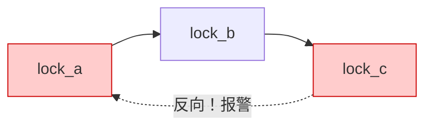

# 13.6.1 lockdep死锁检测

> 所属章节：第13章 并发与同步 > 13.6 验证工具
>
> 难度：[E→M] | 预计阅读时间：25分钟

## <span class="blue"> 本节导读

本节覆盖：lockdep 的工作原理（记录加锁顺序、构建依赖图、检测循环）、四个独立检测维度、`CONFIG_LOCKDEP` 系列配置与开销、lockdep AB-BA 报告的逐行解读、一个故意触发死锁警告的实验模块，以及用 `lock_stat` 定位热点锁的方法。

---

## <span class="blue"> Lockdep 原理：在内核里装一个"锁侦探" [E→M]

### 它是怎么工作的？

Lockdep 的核心思路很朴素：**记录每一次锁的获取顺序，构建一张有向图，然后检查图中是否存在循环**。说白了，就是在内核里养了一个专门盯锁的"侦探"。

来看一个典型的 AB-BA 死锁场景：

| 线程A | 线程B |
|-------|-------|
| 获取锁A | 获取锁B |
| 尝试获取锁B（阻塞） | 尝试获取锁A（阻塞） |
| → 死锁！ | → 死锁！ |

Lockdep 不会等死锁发生。它会在**第一次出现反向加锁顺序时就报警**。

### 锁依赖图的构建

每次代码路径获取一组锁时，lockdep 会记录锁之间的"先后依赖关系"。比如：

- 某条路径先拿 `lock_a`，再拿 `lock_b` → 记录依赖边 `lock_a → lock_b`
- 另一条路径先拿 `lock_b`，再拿 `lock_c` → 记录依赖边 `lock_b → lock_c`

这些依赖关系构成一张**有向图**。如果图中出现环路，就意味着存在潜在的死锁风险。



上图展示了一个循环依赖：正常路径是 a→b→c，但某处代码试图在持有 c 时获取 a，形成了 c→a 的反向边，lockdep 立即报警。

### 四个检测维度

Lockdep 不只是检测 AB-BA，它实际上有四个独立的检测器：

| 检测器 | 检测目标 | 说明 |
|--------|----------|------|
| **循环依赖检测** | AB-BA / AB-BC-CA 死锁 | 锁依赖图中出现环路 |
| **IRQ inversion 检测** | 中断安全违规 | irq-safe 路径错误地获取了 irq-unsafe 的锁 |
| **递归死锁检测** | 同一线程重复加锁 | spinlock 非递归，重复获取会自死锁 |
| **锁释放正确性检测** | 释放顺序错误 | 比如持有锁 A 时释放了锁 A 本身 |

**IRQ inversion 是什么情况？** 假设锁 L1 标记为"可以在中断上下文使用"（irq-safe），锁 L2 没有标记。如果某条代码路径在持有 L2 时去获取 L1，而中断处理程序恰好需要 L2——死锁。Lockdep 会标记为 `irq-safe -> irq-unsafe` 违规。

### 编译配置

要让 lockdep 工作，内核编译时需要开启以下选项：

| 配置选项 | 功能 | 运行时开销 | 依赖 |
|----------|------|-----------|------|
| `CONFIG_LOCKDEP=y` | 启用 lockdep 核心功能 | ~10-15% 性能下降 | 需要关闭部分优化 |
| `CONFIG_PROVE_LOCKING=y` | 启用锁正确性验证（含四个检测器） | 同上 | 依赖 `CONFIG_LOCKDEP` |
| `CONFIG_LOCK_STAT=y` | 启用锁统计信息 | 额外 ~5% | 依赖 `CONFIG_LOCKDEP` |
| `CONFIG_DEBUG_LOCK_ALLOC=y` | 锁分配调试追踪 | 较小 | 依赖 `CONFIG_LOCKDEP` |

> ⚠️ Lockdep 运行时开销极大（10%以上性能损失），**绝对不能用于生产环境**。它只适用于开发和测试阶段。有些嵌入式项目为了节省资源甚至不会编译进 lockdep——你需要在 debug 版本内核中单独启用。

> 💡 给锁起**有意义的名字**（如 `uart_tx_lock` 而不是 `lock1`），lockdep 报告中的依赖图会清晰很多，排查问题时会感谢你自己的。

### 读懂 lockdep 报告：逐行分析

当 lockdep 检测到问题时，会在 dmesg 中输出类似下面的报告（示例输出，版本号随内核而变）：

```
[   12.345678] ========================================================
[   12.345689] WARNING: possible circular locking dependency detected
[   12.345691] 6.6.0-lockdep #1 Tainted: G        W
[   12.345693] --------------------------------------------------------
[   12.345695] my_app/1234 is trying to acquire lock:
[   12.345697] ffff8880038c2048 (&uart_tx_lock){+.+.}-{3:3}, at: uart_write+0x45/0x120
[   12.345712]
                       but task is already holding lock:
[   12.345714] ffff8880038c20a0 (&uart_rx_lock){+.+.}-{3:3}, at: uart_irq_handler+0x23/0x90
[   12.345728]
                       which lock already depends on the new lock.
[   12.345730]
[   12.345732] the existing dependency chain (in reverse order) is:
[   12.345734]
[   12.345736] -> #1 (&uart_rx_lock){+.+.}-{3:3}:
[   12.345738]        uart_open+0x67/0xb0
[   12.345741]        chrdev_open+0xcc/0x1a0
[   12.345745]
[   12.345747] -> #0 (&uart_tx_lock){+.+.}-{3:3}:
[   12.345749]        uart_write+0x45/0x120
[   12.345752]        vfs_write+0xc8/0x1f0
[   12.345755]
[   12.345757]  other info that might help us debug this:
[   12.345759]  Possible unsafe locking scenario:
[   12.345761]
[   12.345763]        CPU0                    CPU1
[   12.345765]        ----                    ----
[   12.345767]   lock(&uart_rx_lock);
[   12.345769]                                lock(&uart_tx_lock);
[   12.345771]                                lock(&uart_rx_lock);
[   12.345773]   lock(&uart_tx_lock);
[   12.345775]
[   12.345777]  *** DEADLOCK ***
[   12.345779]
[   12.345781] 5 locks held by my_app/1234:
[   12.345783]  #0: ffff8880038c20a0 (&uart_rx_lock){+.+.}-{3:3}, at: uart_irq_handler+0x23/0x90
[   12.345798] ========================================================
```

**逐行解读**：

| 行 | 内容 | 含义 |
|----|------|------|
| 第1行 | `WARNING: possible circular locking` | 检测到循环依赖（不是100%会死锁，但风险极高） |
| 第4行 | `my_app/1234 is trying to acquire lock:` | 进程 1234 正在尝试获取的锁 |
| 第5行 | `&uart_tx_lock` | 目标锁的名字和地址，`{+.+.}-{3:3}` 是它的状态标记 |
| 第7行 | `but task is already holding lock:` | 该进程已经持有的锁 |
| 第8行 | `&uart_rx_lock` | 已持有的锁，来自中断处理程序 `uart_irq_handler` |
| 第10行 | `which lock already depends on the new lock` | 关键信息：已持有的锁**依赖于**正在请求的锁 |
| 第13-19行 | `existing dependency chain` | 历史依赖链：曾经有条路径先拿 tx_lock 再拿 rx_lock |
| 第25-32行 | `Possible unsafe locking scenario` | Lockdep 用双 CPU 视角展示死锁场景 |
| 第38行 | `5 locks held by my_app/1234` | 该进程当前持有5把锁，#0 就是 rx_lock |

核心矛盾是：**历史上曾经出现过 `tx_lock → rx_lock` 的加锁顺序，但现在有代码试图在持有 `rx_lock` 时获取 `tx_lock`**。如果两个 CPU 同时走这两条路径，就会死锁。

### 实战带练：触发 lockdep 警告

我们来写一个故意制造 AB-BA 死锁的模块，让 lockdep 报警：

```c
/* deadlock_demo.c - 故意制造死锁场景用于 lockdep 教学 */
#include <linux/module.h>
#include <linux/kernel.h>
#include <linux/kthread.h>
#include <linux/spinlock.h>
#include <linux/delay.h>

static DEFINE_SPINLOCK(lock_a);  /* 锁 A */
static DEFINE_SPINLOCK(lock_b);  /* 锁 B */

static int thread_fn1(void *data)
{
    spin_lock(&lock_a);           /* 先拿 A */
    msleep(100);                  /* 故意延迟，增加交叉概率 */
    spin_lock(&lock_b);           /* 再拿 B */
    spin_unlock(&lock_b);
    spin_unlock(&lock_a);
    return 0;
}

static int thread_fn2(void *data)
{
    spin_lock(&lock_b);           /* 先拿 B（注意：与 thread1 顺序相反！） */
    msleep(100);
    spin_lock(&lock_a);           /* 再拿 A → lockdep 会在这里报警 */
    spin_unlock(&lock_a);
    spin_unlock(&lock_b);
    return 0;
}

static int __init demo_init(void)
{
    struct task_struct *t1, *t2;

    printk("lockdep demo: starting two threads...\n");

    t1 = kthread_run(thread_fn1, NULL, "thread_a_first");
    t2 = kthread_run(thread_fn2, NULL, "thread_b_first");

    return 0;
}

static void __exit demo_exit(void)
{
    printk("lockdep demo exit\n");
}

module_init(demo_init);
module_exit(demo_exit);
MODULE_LICENSE("GPL");
```

**编译并测试步骤**：

```bash
# 1. 确认内核启用了 lockdep
zgrep LOCKDEP /proc/config.gz
# CONFIG_LOCKDEP=y
# CONFIG_PROVE_LOCKING=y

# 2. 编译模块（Makefile 略）
make -C /lib/modules/$(uname -r)/build M=$(pwd) modules

# 3. 加载模块
insmod deadlock_demo.ko

# 4. 查看 dmesg 中的 lockdep 报告
dmesg | tail -n 60

# 5. 你会发现 lockdep 在第二次反向加锁时就输出了 WARNING
# 6. 根据报告中的调用栈，找到问题代码位置并修复
```

修复方案很简单：**统一加锁顺序**。两个线程都按 `A → B` 的顺序加锁，死锁就消除了。

---

## <span class="blue"> Lock_stat：找到你的"热点锁" [E]

Lockdep 告诉你"有没有死锁风险"，而 `lock_stat` 告诉你"哪把锁竞争最激烈"。它是性能优化的利器。

### 启用 lock_stat

```bash
# 1. 内核配置中启用
grep CONFIG_LOCK_STAT /boot/config-$(uname -r)
# CONFIG_LOCK_STAT=y

# 2. 启动时或运行时开启统计
echo 1 > /proc/sys/kernel/lock_stat  # 开启统计
echo 0 > /proc/sys/kernel/lock_stat  # 关闭并清空
```

### 读取统计数据

```bash
# 查看所有锁的统计信息
cat /proc/lock_stat
```

### lock_stat 关键字段解读

| 字段名 | 含义 | 如何解读 |
|--------|------|----------|
| `class name` | 锁的名字 | 如 `&uart_tx_lock`，定位具体锁对象 |
| `acquisitions` | 成功获取次数 | 总加锁次数，反映锁的"繁忙程度" |
| `contentions` | 竞争次数 | 获取锁时发生等待的次数，**越高越差** |
| `waittime` | 总等待时间 | 所有线程等待这把锁的累积时间（us） |
| `holdtime` | 总持有时间 | 锁被持有期间的累积时间（us） |
| `waittime [max]` | 最大单次等待 | 反映最坏情况下的延迟 |
| `holdtime [max]` | 最大单次持有 | 持有时间太长会阻塞其他线程 |

### 一个典型的 lock_stat 输出片段

```
 class name                    acquisitions   contentions   waittime    holdtime
 -----------------------------------------------------------------------------
 &uart_tx_lock                         1523           312   45210 us    89120 us
 &uart_rx_lock                         3401            45    1230 us    45000 us
 &spi_bus_lock                          892           567   234560 us   12340 us
 &i2c_adapter_lock                     2100             8     340 us    67800 us
 -----------------------------------------------------------------------------
 &spi_bus_lock:                      con 567, avg wait 413 us, max wait 2340 us
```

**怎么分析？** 看 `spi_bus_lock`——虽然 acquisitions 只有 892 次，但 contentions 高达 567 次，**竞争率高达 63.5%**！这意味着几乎每次加锁都要等。再看平均等待 413 us，最大 2340 us——这把锁就是性能瓶颈。

> 💡 `waittime [max]` 特别大的时候，说明某次临界区执行时间异常长。配合 `ftrace function_graph` 追踪谁持有了这么长时间，往往能发现意外的阻塞操作（比如在持有 spinlock 时调用了 `msleep()`）。

### 用 lock_stat 优化锁竞争的实际案例

假设你发现 `&spi_bus_lock` 竞争严重，优化思路：

1. **缩短临界区**：把不需要在锁内做的操作移出去
2. **锁拆分**：把一个大锁拆成多个细粒度锁（如按 SPI 从设备拆分）
3. **改用 trylock**：非关键路径用 `spin_trylock()`，失败时走异步路径
4. **换锁类型**：如果临界区较长，考虑用 `mutex` 替代 `spinlock`

```c
/* 优化前：临界区太大 */
spin_lock(&spi_bus_lock);
for (i = 0; i < len; i++) {
    spi_transfer_one_byte(tx_buf[i]);  /* IO 操作，很慢！ */
    rx_buf[i] = spi_read_one_byte();
}
spin_unlock(&spi_bus_lock);

/* 优化后：只锁真正需要保护的部分 */
for (i = 0; i < len; i++) {
    spin_lock(&spi_bus_lock);       /* 每次只锁一个字节 */
    spi_transfer_one_byte(tx_buf[i]);
    rx_buf[i] = spi_read_one_byte();
    spin_unlock(&spi_bus_lock);
    /* 可以在这里插入调度点，降低 latency */
}
```

> ⚠️ 上面的优化有一个隐藏风险——如果在循环中频繁加解锁，开销可能反而更大。更好的做法是把 SPI 传输缓冲区分成 per-CPU buffer（见 13.5.3），避免共享锁。没有银弹，只有权衡。

---

## <span class="blue"> 本节总结

| 主题 | 关键要点 |
|------|----------|
| **Lockdep 核心机制** | 记录锁获取顺序 → 构建有向依赖图 → 检测循环和违规 |
| **四个检测器** | 循环依赖、IRQ inversion、递归死锁、释放正确性 |
| **编译配置** | `CONFIG_LOCKDEP=y` + `CONFIG_PROVE_LOCKING=y`，仅用于调试 |
| **报告解读** | 关注"已持有锁依赖新锁" → 找到反向加锁的代码路径 |
| **Lock_stat 作用** | 统计每把锁的争用率、等待时间、持有时间 |
| **热点锁识别** | `contentions/acquisitions` 比率 > 20% 时需要关注 |
| **修复思路** | 统一加锁顺序（lockdep 问题）；缩短临界区/锁拆分（lock_stat 问题） |

Lockdep 和 lock_stat 是嵌入式并发调试的左膀右臂：一个防死锁，一个治竞争。善用它们，你能把锁相关问题消灭在开发阶段。

---

## <span class="blue"> 下一步

lockdep 管"锁用得对不对"，但内存访问错误（use-after-free、越界）和 data race 它管不了——那是另外两件工具的地盘。

> **13.6.2 KASAN与KCSAN**

---

## <span class="blue"> 配套资源

| 资源 | 内容 | 位置 |
|------|------|------|
| 示例代码 | 故意触发 lockdep 的 demo 模块 | 见正文 `deadlock_demo.c` |
| 图示 | lockdep 锁依赖图（mermaid） | 本文件内 |
| 参考文档 | Lockdep 官方文档 | `Documentation/locking/lockdep-design.rst` |
| 参考文档 | Lock_stat 说明 | `Documentation/locking/lockstat.rst` |
