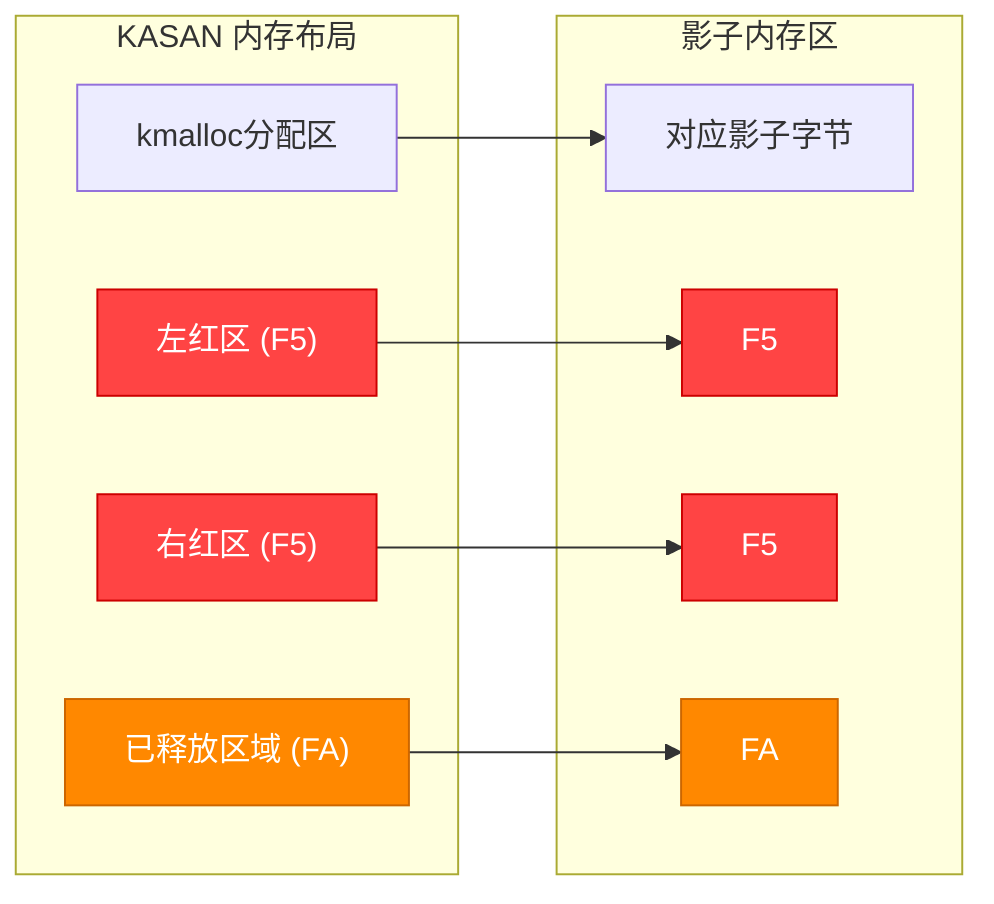

# 13.6.2 KASAN与KCSAN

> 所属章节：第13章 并发与同步 > 13.6 验证工具
>
> 难度：[E] | 预计阅读时间：20分钟

## <span class="blue"> 本节导读

本节覆盖：KASAN（Kernel Address Sanitizer）的影子内存机制与编译插桩原理、KASAN 报告的解读方法（use-after-free 三要素）、KCSAN（Kernel Concurrency Sanitizer）的延迟采样原理与 data race 报告解读，以及 KASAN / KCSAN / lockdep 三者的分工边界与启用方法。

---

## <span class="blue"> KASAN —— 内核的"体检仪" [E→M]

KASAN（Kernel Address Sanitizer）从 4.0 版本开始引入内核，设计思路简单粗暴：**在每次内存访问前插入检查代码**，一旦发现访问了不该访问的内存，立即报告。

### 影子内存：KASAN的核心机制

KASAN不直接追踪每字节内存，而是引入了一层**影子内存（shadow memory）**——用1字节的影子信息描述8字节实际内存的状态。说白了，就是给每8字节内存配一个"状态标签"：

```
实际内存：  [8 bytes]  [8 bytes]  [8 bytes]  [8 bytes]
               |          |          |          |
影子内存：  [ 1byte ]  [ 1byte ]  [ 1byte ]  [ 1byte ]
              0x00       0x01       0xF1       0xFA
             (可用)    (部分可用)   (已释放)    (红区/越界)
```

**影子字节的含义：**

| 影子值 | 含义 | 触发场景 |
|--------|------|----------|
| 0x00 | 全部8字节可用 | 正常访问 |
| 0x01~0x07 | 前N字节可用 | kmalloc(3) 只用到前3字节 |
| 0xF1 | 堆栈左红区 | 栈变量左侧越界 |
| 0xF2 | 堆栈中间红区 | 大数组内部的越界 |
| 0xF3 | 堆栈右红区 | 栈变量右侧越界 |
| 0xF5 | 堆区红区 | kmalloc分配的缓冲区越界 |
| 0xF8 | 全局变量红区 | 全局数组越界 |
| 0xFA | 已释放内存 | use-after-free |

> 💡 红区（redzone）是KASAN在合法内存周围插入的"警戒区"。访问红区=越界。

KASAN的内存布局示意：



### 编译时插桩

KASAN在**编译阶段**修改你的代码。每个内存访问指令前被插入检查代码：

```c
/* 你的原始代码 */
*p = 42;

/* KASAN插桩后的伪代码 */
if (shadow[(p >> 3)] != 0)    /* 检查影子内存 */
    kasan_report(p);           /* 有问题？立即报告！ */
*p = 42;                      /* 原来的访问 */
```

要启用KASAN：

```bash
# 内核配置
CONFIG_KASAN=y
CONFIG_KASAN_GENERIC=y        # 通用模式（默认）
# 或 CONFIG_KASAN_SW_TAGS=y   # ARM64的软标签模式

# 编译并启动，无需额外参数
```

### KASAN能检测什么

- **Use-after-free**：指针释放后再次访问
- **堆越界**：kmalloc分配的缓冲区越界读写
- **栈越界**：局部数组越界
- **全局变量越界**：全局数组越界
- **双重释放**：同一块内存kfree两次

### 解读KASAN报告：use-after-free示例

```
==================================================================
BUG: KASAN: use-after-free in buggy_driver_write+0x123/0x200
Write of size 4 at addr ffff888012345678 by task user_app/1234

CPU: 0 PID: 1234 Comm: user_app
Call Trace:
 buggy_driver_write+0x123/0x200   <-- 出错位置
 vfs_write+0x150/0x250
 ksys_write+0x5f/0xd0
 do_syscall_64+0x33/0x40

Allocated by task 1200:          <-- 谁分配的？
 kasan_save_stack+0x1b/0x40
 __kmem_cache_alloc_node+0x1a2/0x2b0
 buggy_driver_open+0x45/0x80     <-- 在open时分配

Freed by task 1201:               <-- 谁释放的？
 kasan_save_stack+0x1b/0x40
 kfree+0x120/0x250
 buggy_driver_release+0x30/0x60  <-- 在release时释放

The buggy address belongs to the object at ffff888012345600
 which belongs to the cache kmalloc-128 of size 128
==================================================================
```

读懂这份报告，你需要抓住三个关键信息：

1. **出错位置**：`buggy_driver_write+0x123` —— 在write函数里写了一个无效地址
2. **分配栈**：`buggy_driver_open` 中 `kmem_cache_alloc` 分配的内存
3. **释放栈**：`buggy_driver_release` 中已经 `kfree` 了

三者的因果关系一目了然：**open时分配，release时释放，write时继续使用 = use-after-free**。

---

## <span class="blue"> KCSAN —— Data Race的"探测器" [E→M]

KASAN检测不了data race——两个CPU同时无锁访问同一变量。为什么？因为data race访问的内存本身是"合法"的，只是时机不对。这就需要**KCSAN**（Kernel Concurrency Sanitizer），从5.8内核引入。

### 延迟采样机制

如果KCSAN像KASAN一样检查每次访问，系统会直接卡死。KCSAN的聪明之处在于**随机采样**：

```c
/* KCSAN的核心逻辑（伪代码） */
void kcsan_check_access(void *ptr, size_t size, int type) {
    if (!should_sample())       /* 随机决定是否采样（默认~1%概率） */
        return;

    /* 延迟执行：故意等一小段时间 */
    udelay(delay);

    /* 检查在此期间是否有其他CPU访问了同一地址 */
    if (detect_conflict(ptr, size, type))
        report_race(ptr, ...);  /* 报告data race! */
}
```

这个"等一等再看"的策略叫做**延迟采样（delay-based sampling）**。原理很巧妙：如果两个CPU真的在竞争访问同一个变量，那插入的延迟就很容易"撞上"冲突。

### 启用KCSAN

```bash
# 内核配置（5.8+）
CONFIG_KCSAN=y

# 启动参数（可选，调试时提高采样率）
kcsan.skip_watch_random=100
```

### 解读KCSAN报告：data race示例

```
==================================================================
BUG: KCSAN: data-race in update_counter / read_counter

write to 0xffff888012345678 of 4 bytes by task writer/100:
 update_counter+0x3a/0x80
 at: drivers/demo.c:45

read to 0xffff888012345678 of 4 bytes by task reader/200:
 read_counter+0x22/0x50
 at: drivers/demo.c:62

value changed: 0x00000000 -> 0x00000001

Reported by Kernel Concurrency Sanitizer
==================================================================
```

KCSAN报告比KASAN简洁，关键信息就两个：

1. **写访问**：`update_counter` 在第45行写入4字节
2. **读访问**：`read_counter` 在第62行读取同一地址

没有锁保护的两个操作并发执行 = **经典的data race**。

---

## <span class="blue"> KASAN vs KCSAN vs Lockdep 对比

| 维度 | KASAN | KCSAN | Lockdep |
|------|-------|-------|---------|
| **检测目标** | 内存访问错误（UAF、越界） | Data race | 锁的错误使用（死锁、 ABBA） |
| **检测原理** | 编译插桩 + 影子内存 | 延迟采样 + 访问追踪 | 锁依赖图 + 环路检测 |
| **引入版本** | 4.0+ | 5.8+ | 2.6.28+ |
| **内存开销** | ~12.5%（影子内存1:8） | ~1-2% | 极小 |
| **CPU开销** | 减速2-4倍 | 减速~10% | 极小 |
| **使用阶段** | 开发/调试阶段 | 开发/调试阶段 | 开发/调试阶段（开销较大） |
| **配置选项** | `CONFIG_KASAN=y` | `CONFIG_KCSAN=y` | `CONFIG_LOCKDEP=y` |
| **典型输出** | UAF完整报告 | Data race报告 | 死锁链/递归警告 |
| **误报率** | 极低 | 较低（可能有 benign race） | 较低 |

> ⚠️ KASAN的内存开销很大（影子内存占1/8），**绝对不能在生产环境启用**。只用于开发调试阶段。有些嵌入式板子内存本就紧张，开了KASAN可能直接OOM。生产环境若需要低开销的内存错误采样检测，可以考虑 KFENCE（见 13.6.3 的工具选择表）。

> 💡 KCSAN是data race检测的**首选工具**。如果你遇到"变量值莫名其妙不对"的bug，而KASAN又没报任何错误，试试KCSAN——八成是data race。

---

## <span class="blue"> 实战带练

### 练习1：用KASAN检测use-after-free

**步骤**：

```bash
# 1. 编译带KASAN的内核
make menuconfig
# → Kernel hacking → Memory Debugging → KASan: runtime memory debugger → (Y)
make -j$(nproc)

# 2. 写一个故意UAF的模块（buggy_uaf.c）
```

```c
/* buggy_uaf.c - 故意的use-after-free */
#include <linux/module.h>
#include <linux/slab.h>

static int *global_ptr;

static int __init buggy_init(void)
{
    global_ptr = kmalloc(sizeof(int), GFP_KERNEL);
    *global_ptr = 42;
    kfree(global_ptr);          /* 释放了 */
    *global_ptr = 99;           /* 又访问！UAF！ */
    return 0;
}
```

```bash
# 3. 加载模块，观察KASAN输出
insmod buggy_uaf.ko
# dmesg中会看到完整的KASAN报告
```

### 练习2：用KCSAN检测data race

**步骤**：

```bash
# 1. 编译带KCSAN的内核（需5.8+）
make menuconfig
# → Kernel hacking → Concurrency bug detector → Concurrency sanitizer → (Y)
make -j$(nproc)
```

```c
/* buggy_race.c - 故意的data race */
#include <linux/module.h>
#include <linux/kthread.h>
#include <linux/sched.h>

static int shared_counter;       /* 无锁保护的共享变量 */

static int writer(void *data)
{
    while (!kthread_should_stop())
        shared_counter++;        /* 写操作，无锁 */
    return 0;
}

static int reader(void *data)
{
    while (!kthread_should_stop())
        (void)shared_counter;    /* 读操作，无锁 */
    return 0;
}
```

```bash
# 2. 加载模块并持续运行一段时间（KCSAN是采样的，需要等）
insmod buggy_race.ko
sleep 30
dmesg | grep "KCSAN"   # 查看是否有data race报告

# 3. 提高采样率加速发现（调试模式）
# 在启动参数中添加：kcsan.skip_watch_random=50
```

---

## <span class="blue"> 本节总结

| 项目 | 内容 |
|------|------|
| **KASAN原理** | 编译插桩 + 影子内存（1:8），每次访问前检查 |
| **KASAN检测** | use-after-free、堆/栈/全局越界、双重释放 |
| **KASAN配置** | `CONFIG_KASAN=y`，内存开销~12.5%，CPU减速2-4倍 |
| **KCSAN原理** | 延迟采样，随机检查内存访问冲突 |
| **KCSAN检测** | Data race（两个CPU无锁访问同变量，至少一个写） |
| **KCSAN配置** | `CONFIG_KCSAN=y`（需5.8+），CPU减速~10% |
| **核心区别** | KASAN管"内存对不对"，KCSAN管"访问乱不乱" |
| **使用场景** | 两者都用于开发调试，不可用于生产（生产用 KFENCE 采样） |

---

## <span class="blue"> 下一步

工具都齐了，但真实问题往往是多种 bug 交织——需要一套固定的排查套路，而不是碰到问题再翻工具手册。

> **13.6.3 并发bug的系统性排查方法**

---

## <span class="blue"> 配套资源

| 资源 | 说明 | 参考 |
|------|------|------|
| KASAN文档 | 内核官方文档 | `Documentation/dev-tools/kasan.rst` |
| KCSAN文档 | 内核官方文档 | `Documentation/dev-tools/kcsan.rst` |
| 示例代码 | 本节的buggy模块 | 见正文 `buggy_uaf.c`、`buggy_race.c` |
| 进一步学习 | GCC/Clang ASAN对比 | Clang文档 AddressSanitizer |
