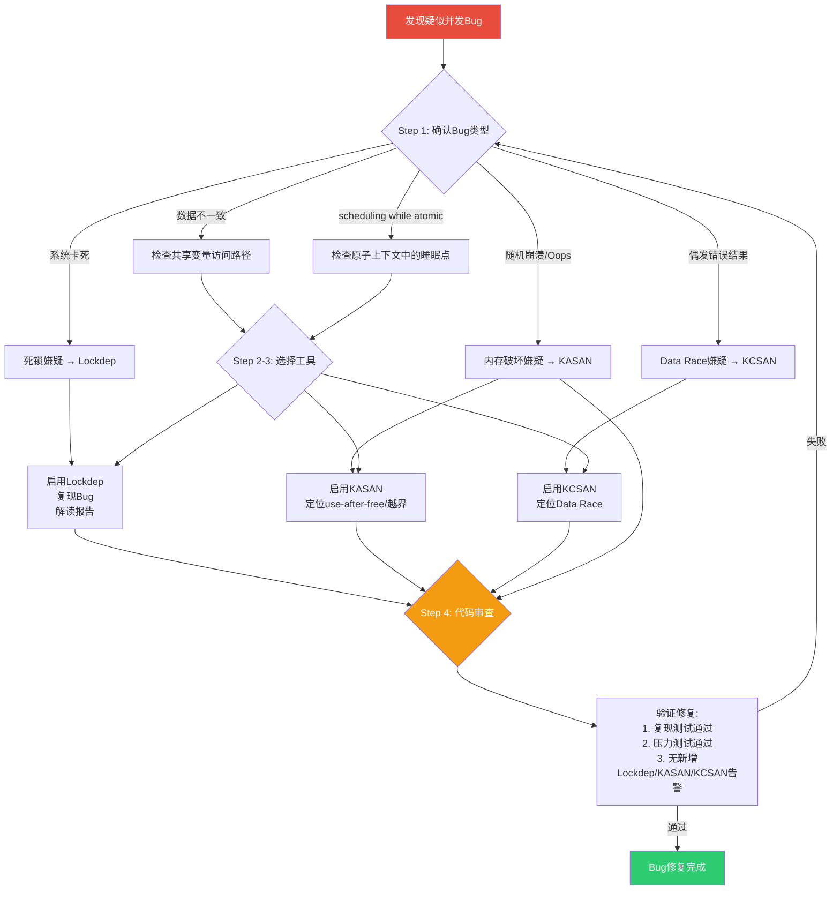

# 13.6.3 并发bug的系统性排查方法

> 所属章节：第13章 并发与同步 > 13.6 验证工具
>
> 难度：[I→M] | 预计阅读时间：25分钟

## <span class="blue"> 本节导读

本节覆盖：并发 bug 的四步排查方法论（确认类型 → lockdep → KASAN/KCSAN/ftrace → 代码审查）、症状到工具的速查映射、四种最常见的并发 bug 模式及其修复模板，以及"ftrace 先行、插桩工具殿后"的组合策略。

> 💡 先确认bug类型再选工具，不要一上来就启用所有调试选项。很多人遇到并发问题就同时开启KASAN + KCSAN + lockdep + ftrace，结果系统慢得像蜗牛，日志淹没了真正有用的信息。精准定位，逐个击破。

---

## <span class="blue"> 四步排查方法论 [I→M]

面对一个疑似并发Bug，你的第一反应是什么？加锁？加volatile？还是开始随机注释代码？

停。先做一个深呼吸，然后按照这四步走：

```
Step 1: 确认Bug类型（观察症状，缩小范围）
  |
Step 2: 使用Lockdep（开发阶段静态/动态锁分析）
  |
Step 3: 使用动态分析工具（KASAN/KCSAN/ftrace定位根因）
  |
Step 4: 代码审查（回归源码，验证修复方案）
```

### Step 1：确认Bug类型——从症状反推病因

不同的并发Bug有不同的"面孔"。你的任务是在第一步就搞清楚面对的是哪类问题。

| 症状 | 可能的Bug类型 | 初步排查方向 |
|------|-------------|------------|
| 数据不一致，计算结果随机出错 | 缺少同步保护 / Data Race | 检查共享变量的访问路径 |
| `BUG: scheduling while atomic` | 在原子上下文中睡眠 | 检查spinlock保护区域内是否调用了可能睡眠的函数 |
| 系统完全卡死，无响应 | 死锁（Deadlock） | 检查锁的获取顺序是否一致 |
| 随机崩溃、Oops、页错误 | Use-after-free / Data Race | 检查对象生命周期和并发访问 |
| 偶发的数据丢失或重复 | RCU使用不当 | 检查RCU读者/写者配合 |

比方说，你看到`scheduling while atomic`，那就别去查内存泄漏了。这个错误信息已经非常明确——有人在持有spinlock的时候尝试睡眠。直接跳到Step 3用ftrace追踪spinlock的获取路径，很快就能定位问题代码。

### Step 2：使用Lockdep——让内核帮你找锁的问题

Lockdep是Linux内核的锁依赖验证器，它能在运行时检测锁的死锁循环、不一致的加锁顺序，以及IRQ安全问题（原理与完整报告解读见 13.6.1）。

**启用方式：**
```bash
# 内核配置
CONFIG_LOCKDEP=y
CONFIG_LOCK_STAT=y
CONFIG_DEBUG_LOCK_ALLOC=y
```

**触发Bug后，解读Lockdep报告（示例输出）：**

```
=============================================
[ INFO: possible circular locking dependency detected ]
---------------------------------------------
modprobe/1503 is trying to acquire lock:
 (&sb->s_type->i_rwsem_key#7){+.+.+.}, at: [<c01b6bb5>] inode_lock+0x19/0x1b

but task is already holding lock:
 (&sbi->work_mutex){+.+...}, at: [<f8a8c01d>] ext4_sync_fs+0x2a/0x6a [ext4]
```

这段信息告诉你：
- 当前任务已经持有`work_mutex`
- 它又尝试获取`i_rwsem`
- Lockdep检测到这两个锁可能存在循环依赖

> 💡 Lockdep的报告虽然看起来吓人，但格式其实很规范。重点关注"trying to acquire lock"和"already holding lock"这两行——它们直接指出了冲突的锁对。

### Step 3：使用动态分析工具——让硬件帮你抓Bug

Lockdep只能检测锁相关的问题。对于内存破坏和数据竞争，你需要更专业的工具。

| 工具 | 检测对象 | 启用命令/配置 | 性能开销 | 典型输出 |
|------|---------|-------------|---------|---------|
| KASAN | Use-after-free, 越界访问 | `CONFIG_KASAN=y` | 约2-4x slowdown | `KASAN: use-after-free in foo_read` |
| KCSAN | Data Race | `CONFIG_KCSAN=y` | 默认采样率下约10% | `KCSAN: data-race at ip_schedule_irq+0x123` |
| ftrace function_graph | 锁的获取/释放时序 | `echo function_graph > /sys/kernel/debug/tracing/current_tracer` | 中等 | 函数调用链时间线 |

**KASAN实战示例：**

```c
/* 有问题的代码 */
static void *global_buf;

void foo_init(void)
{
    global_buf = kmalloc(100, GFP_KERNEL);
}

void foo_release(void)
{
    kfree(global_buf);  /* 释放了全局缓冲区 */
    global_buf = NULL;  /* 但其他CPU可能还在读 */
}

/* 另一个CPU的回调 */
void foo_read(char *out)
{
    /* KASAN会在这里捕获use-after-free */
    memcpy(out, global_buf, 100);  /* 可能已经释放了！ */
}
```

KASAN开启后，如果`foo_read`在`foo_release`之后执行，你会看到类似这样的报告：

```
==================================================================
BUG: KASAN: use-after-free in foo_read+0x42/0x80 [test_mod]
Read of size 100 at addr ffff888003abc000 by task reader/1234

CPU: 1 PID: 1234 Comm: reader
Hardware name: QEMU Standard PC
Call Trace:
 dump_stack_lvl+0x34/0x48
 print_report+0xcc/0x620
 kasan_report+0xa3/0x120
 foo_read+0x42/0x80 [test_mod]
==================================================================
```

KASAN精确地告诉你：**哪个地址被非法访问、访问指令的位置、以及调用栈**。这就是你需要的全部信息。

**ftrace追踪锁时序：**

```bash
# 追踪 spin_lock 和 spin_unlock 的调用
# 在生产环境中，这通常比printk更高效

echo spin_lock > /sys/kernel/debug/tracing/set_ftrace_filter
echo spin_unlock >> /sys/kernel/debug/tracing/set_ftrace_filter
echo function_graph > /sys/kernel/debug/tracing/current_tracer
echo 1 > /sys/kernel/debug/tracing/tracing_on

# 复现bug后
cat /sys/kernel/debug/tracing/trace
```

ftrace的优势在于**低开销**和**时序精确**。你可以看到每一对lock/unlock之间的精确时间间隔，如果发现某个lock之后很久才有unlock，那中间很可能睡眠了。

### Step 4：代码审查——人肉回归

工具能告诉你"哪里出错了"，但只有代码审查能告诉你"为什么会出错"以及"修复是否正确"。代码审查时要问自己三个问题：

**审查清单：**

1. **每个共享数据：是否有明确的Owner？是否有唯一的锁？**
   - 如果一个全局变量被多个模块访问，但没有任何文档说明谁负责保护它——这就是一个定时炸弹。

2. **每个锁的获取路径：是否可能以不同顺序获取多个锁？**
   - 这是死锁的经典模式。如果路径A获取 lock1→lock2，而路径B获取 lock2→lock1，死锁只是时间问题。

3. **每个中断上下文：是否访问了进程上下文的数据？**
   - 中断处理函数里读了一个链表，而进程上下文可能在修改同一个链表——即使没有spinlock，也需要RCU或其他保护机制。

> ⚠️ 不要盲目加锁！看到数据竞争就随手加一个spinlock，这是新手最常见的错误。加锁顺序如果和已有代码冲突，可能引入新的死锁。每加一把锁，都要检查：这把锁和已有锁是否存在顺序冲突？是否可能在已有锁持有的情况下被获取？

---

## <span class="blue"> 系统化排查流程图 [M]

面对一个并发Bug，完整的决策流程应该是这样的：



> 💡 注意流程图最后有一个"失败→回到Step 1"的回路。这很关键——有时候你以为找到了根因，修完之后压力测试却报出新问题。这说明你看到的只是冰山一角，真正的并发问题可能更深层。不要气馁，这是并发调试的常态。

---

## <span class="blue"> 常见并发Bug模式 [I]

经过对大量Linux内核Bug的分析，并发问题其实有一些固定的"套路"。认识这些模式，能帮你快速从症状跳到根因。

| 模式 | 典型表现 | 根因 | 修复策略 |
|------|---------|------|---------|
| **模式1：访问 per-cpu 忘记关抢占** | 计数器偶发丢数、统计对不上 | `this_cpu_ptr()` 无保护使用，任务被抢占迁移后改了别的 CPU 的副本 | 用 `get_cpu_var()`/`put_cpu_var()` 配对（见 13.5.3） |
| **模式2：中断中访问无保护全局变量** | 偶发的数据损坏、链表断裂 | 中断处理函数直接读写全局状态，无spinlock/RCU保护 | 中断上下文使用`spin_lock_irqsave()`保护共享数据 |
| **模式3：释放锁后继续用数据** | Use-after-free、野指针崩溃 | 锁保护的是指针本身，而非指针指向的对象 | 使用引用计数（kref）或RCU延长对象生命周期 |
| **模式4：RCU读者中睡眠** | `BUG: scheduling while atomic` 出现在rcu_read_lock保护区域 | 在`rcu_read_lock()`/`rcu_read_unlock()`之间调用了可能睡眠的函数 | 将睡眠操作移出RCU读临界区，或使用SRCU（见 13.4.3） |

### 模式详解

**模式1：访问 per-cpu 变量忘记关抢占**

```c
/* 错误示例：this_cpu_ptr 不关抢占，仅返回指针 */
void buggy_func(void)
{
    unsigned long *count = this_cpu_ptr(&irq_count);

    /* 危险窗口：这里若被抢占并迁移到别的 CPU，
     * count 指向的还是旧 CPU 的副本——改错对象了 */
    (*count)++;
}

/* 正确做法：get_cpu_var / put_cpu_var 配对，关抢占保护整个访问 */
void fixed_func(void)
{
    unsigned long *count = get_cpu_var(irq_count);  /* 关抢占 */
    (*count)++;
    put_cpu_var(irq_count);                          /* 开抢占 */
}
```

顺带提醒 PREEMPT_RT 下的一个相关误区：`raw_spinlock_t` 在 RT 内核中**仍然是真自旋且关抢占**的，语义不变；转为可睡眠锁的是普通 `spinlock_t`（见 10.4.3）。别把两者的语义记反了。

**模式2：中断中访问无保护全局变量**

```c
/* 全局链表 */
static LIST_HEAD(packet_list);
static int packet_count;

/* 进程上下文：读取链表 */
void process_packets(void)
{
    struct packet *p;

    /* 这里没有锁保护！ */
    list_for_each_entry(p, &packet_list, list) {
        handle_packet(p);
    }
}

/* 中断上下文：添加元素 */
irqreturn_t packet_irq(int irq, void *dev)
{
    struct packet *new = kzalloc(sizeof(*new), GFP_ATOMIC);

    /* 中断中直接修改链表，无保护！ */
    list_add_tail(&new->list, &packet_list);
    packet_count++;

    return IRQ_HANDLED;
}

/* 正确做法：使用 spin_lock_irqsave */
static DEFINE_SPINLOCK(packet_lock);

void process_packets_fixed(void)
{
    struct packet *p;
    unsigned long flags;

    spin_lock_irqsave(&packet_lock, flags);
    list_for_each_entry(p, &packet_list, list) {
        handle_packet(p);
    }
    spin_unlock_irqrestore(&packet_lock, flags);
}

irqreturn_t packet_irq_fixed(int irq, void *dev)
{
    struct packet *new = kzalloc(sizeof(*new), GFP_ATOMIC);
    unsigned long flags;

    spin_lock_irqsave(&packet_lock, flags);
    list_add_tail(&new->list, &packet_list);
    packet_count++;
    spin_unlock_irqrestore(&packet_lock, flags);

    return IRQ_HANDLED;
}
```

> 🔴 `spin_lock_irqsave`是中断上下文与进程上下文共享锁时的安全选择。如果你在中断里只用`spin_lock`，而对应进程上下文用了`spin_lock_irqsave`，看起来都加了锁，但同CPU上的中断仍可能打断持锁的进程并抢同一把锁——自死锁。进程侧必须用`_irqsave`把中断挡在临界区外（规则详解见 13.2.1）。

**模式3：释放锁后继续用数据**

```c
/* 错误示例：锁只保护了指针，没保护对象生命周期 */
void send_and_free(struct msg *msg)
{
    spin_lock(&queue_lock);
    list_add_tail(&msg->list, &send_queue);
    spin_unlock(&queue_lock);

    /* 释放锁后立刻kfree，但另一个CPU可能正在读msg！ */
    kfree(msg);
}

/* 正确做法：使用RCU或引用计数 */
void send_and_free_fixed(struct msg *msg)
{
    spin_lock(&queue_lock);
    list_add_tail(&msg->list, &send_queue);
    spin_unlock(&queue_lock);

    /* 等待所有RCU读者退出后再释放 */
    synchronize_rcu();  /* 或者使用 call_rcu() */
    kfree(msg);
}
```

**模式4：RCU读者中睡眠**

```c
/* 错误示例 */
void rcu_reader(void)
{
    rcu_read_lock();
    struct data *d = rcu_dereference(global_data);

    /* 在RCU读临界区中睡眠！这是不允许的！ */
    msleep(100);  /* 会触发 BUG: scheduling while atomic */

    use_data(d);
    rcu_read_unlock();
}

/* 正确做法：复制需要的数据，退出RCU后再睡眠 */
void rcu_reader_fixed(void)
{
    rcu_read_lock();
    struct data *d = rcu_dereference(global_data);

    /* 先复制需要的数据 */
    int value = d->value;
    rcu_read_unlock();  /* 尽快退出RCU临界区 */

    /* 现在可以安全睡眠 */
    msleep(100);
    use_value(value);
}
```

---

## <span class="blue"> 工具选择指南 [I]

面对不同的症状，该启用哪个工具？这张表是你的速查手册。

| 症状 | 推荐工具 | 使用方法 | 关键配置 |
|------|---------|---------|---------|
| 死锁、锁顺序问题 | Lockdep | `CONFIG_LOCKDEP=y`，复现Bug，查看dmesg | `CONFIG_PROVE_LOCKING=y` |
| Use-after-free | KASAN | `CONFIG_KASAN=y`，复现Bug，查看KASAN报告 | `CONFIG_KASAN_OUTLINE=y`（降低开销） |
| 越界访问 | KASAN | 同上 | 同上 |
| Data Race | KCSAN | `CONFIG_KCSAN=y`，复现Bug，查看KCSAN报告 | `CONFIG_KCSAN_REPORT_RACE_UNKNOWN_ORIGIN=y` |
| 锁持有时长异常 | ftrace function_graph | 过滤`spin_lock`/`mutex_lock`，查看时间线 | 无需重新编译 |
| 中断/抢占延迟 | ftrace irqsoff / preemptoff tracer | `echo preemptoff > /sys/kernel/debug/tracing/current_tracer` | `CONFIG_PREEMPT_TRACER=y` |
| 内存损坏但KASAN无告警 | KFENCE | `CONFIG_KFENCE=y`，采样检测 | `CONFIG_KFENCE_SAMPLE_INTERVAL=100` |

> 💡 **ftrace是不需要重新编译内核的！** 这是它最大的优势。在生产环境中，如果问题偶发且难以复现，优先考虑用ftrace收集现场信息，而不是试图重编一个带KASAN的内核。很多关键问题只出现在特定的负载条件下，换了内核可能就复现不了了。

**一个实际的组合策略：**

假设你遇到了一个随机崩溃的问题，可以按下面的优先级尝试：

```
第1轮：ftrace + Lockdep（不重新编译，现场抓 trace）
  ↓ 未定位
第2轮：编译 KASAN 内核，压力测试（定位内存问题）
  ↓ 未定位
第3轮：编译 KCSAN 内核，压力测试（定位数据竞争）
  ↓ 仍未定位
第4轮：人肉代码审查 + 增加额外的同步断言
```

每一轮都应该有明确的假设和验证目标，而不是"把能开的都开上试试"。

---

## <span class="blue"> 本节总结

| 主题 | 核心要点 |
|------|---------|
| **四步方法论** | 确认Bug类型 → Lockdep检测锁问题 → KASAN/KCSAN/ftrace动态分析 → 代码审查验证修复 |
| **Step 1 关键** | 从症状反推：数据不一致→缺同步，卡死→死锁，随机崩溃→内存破坏，atomic睡眠→上下文违规 |
| **Step 2 Lockdep** | `CONFIG_LOCKDEP=y`，关注"trying to acquire"和"already holding"信息 |
| **Step 3 动态分析** | KASAN查use-after-free/越界，KCSAN查Data Race，ftrace查锁时序 |
| **Step 4 代码审查** | 三问：共享数据有Owner吗？锁顺序一致吗？中断访问有保护吗？ |
| **四大Bug模式** | per-cpu忘关抢占、中断无保护访问、释放锁后用数据、RCU读者睡眠 |
| **工具选择原则** | 先ftrace（不编译），再KASAN/KCSAN（需编译），不要同时全开 |

> ⚠️ 并发Bug最危险的地方在于**它们往往成对出现**。你修了一个use-after-free，可能暴露出一个更深层的锁顺序问题。每次修复后都要跑完整的Lockdep + KASAN回归测试，确保没有引入新问题。

---

## <span class="blue"> 下一步

方法论落地：下一节把两个真实的并发故障从症状到修复完整走一遍。

> **13.7.1 实战原子上下文睡眠与死锁排查**

---

## <span class="blue"> 配套资源

| 资源类型 | 内容 | 获取方式 |
|---------|------|---------|
| 内核文档 | Lockdep详细说明 | `Documentation/locking/lockdep-design.rst` |
| 内核文档 | KASAN使用指南 | `Documentation/dev-tools/kasan.rst` |
| 内核文档 | KCSAN使用指南 | `Documentation/dev-tools/kcsan.rst` |
| 内核文档 | ftrace使用手册 | `Documentation/trace/ftrace.rst` |
| 代码清单 | 本节四个Bug模式的完整修复代码 | 见正文代码块 |
