```mermaid
flowchart TD
    subgraph A["带练A: scheduling while atomic"]
        A1["压力测试触发oops"] --> A2["decodecode解析调用链"]
        A2 --> A3["定位原子上下文中的睡眠函数"]
        A3 --> A4["方案选择: workqueue/缩短临界区"]
        A4 --> A5["24h压力测试验证"]
    end

    subgraph B["带练B: AB-BA死锁"]
        B1["并发操作触发softlockup"] --> B2["启用CONFIG_LOCKDEP=y"]
        B2 --> B3["解读circular dependency报告（13.6.1）"]
        B3 --> B4["统一锁顺序或trylock回退"]
        B4 --> B5["lockdep clean + 压力测试"]
    end

    A5 --> D["并发问题排查方法论"]
    B5 --> D
```

# 13.7.1 实战：原子上下文睡眠与死锁排查

> 所属章节：第13章 并发与同步 > 13.7 综合实战
>
> 难度：[E→M] | 预计阅读时间：30分钟

## <span class="blue"> 本节导读

前面十几节讲了大量同步原语的机制，本节把它们落到两个真实故障的完整排查路径上：复现、分析、定位、修复、验证，一步不缺。<br>
本节覆盖：
- "scheduling while atomic"崩溃：从 oops 抓取到 decodecode 解析，再到两种修复方案的取舍
- AB-BA 死锁：从 softlockup 症状切入，用 lockdep 确认循环依赖，两种修复范式的适用条件

> 💡 并发排查的第一原则是先测量再下结论。症状相似的两个故障，根因可能完全不同。

---

## <span class="blue"> 带练A："scheduling while atomic"崩溃排查 [E→M]

这是内核并发 bug 中最典型的一类——在不该睡眠的上下文里调用了可能睡眠的函数。

**背景**：某嵌入式设备在并发压力测试下随机触发 kernel oops，堆栈里印着 `scheduling while atomic`。这类问题藏得很深，因为单线程、低并发测试根本触发不了。

### 完整步骤

| 步骤 | 命令/操作 | 预期输出 | 分析 |
|------|-----------|----------|------|
| 1. 复现崩溃 | `stress-ng --cpu 8 --io 4 -t 60` + 业务压力 | Kernel oops，`scheduling while atomic` | 并发压力是关键，单核单线程往往无法触发 |
| 2. 抓取oops | `dmesg -w` 或串口控制台 | 完整oops回溯信息 | 确认是原子上下文调用了睡眠函数 |
| 3. 分析调用链 | `scripts/decodecode < oops.txt` | 定位到具体函数和代码行 | 查看触发点所在的上下文类型 |
| 4. 定位根源 | 检查代码中`spin_lock`/`irq`保护区域内的函数调用 | 发现`copy_to_user()`、`kmalloc(GFP_KERNEL)`或`mutex_lock()` | 这些函数在原子上下文中都会睡眠 |
| 5. 修复 | 移出睡眠操作到workqueue，或改用`GFP_ATOMIC`/`spinlock` | 编译通过 | 如果在softirq中，考虑`napi_schedule`模式 |
| 6. 验证 | 重新压力测试24小时以上 | 无oops，无crash | 必须长时间压力测试，短时测试可能漏掉 |

### oops分析示例代码

```c
// ===== 有问题的代码（简化版） =====
static ssize_t buggy_read(struct file *filp, char __user *buf,
                          size_t count, loff_t *off)
{
    struct my_data *data = filp->private_data;
    char *tmp;

    spin_lock(&data->lock);          // ← 进入原子上下文

    // 🔴 copy_to_user 可能睡眠（页故障时）
    if (copy_to_user(buf, data->buffer, count)) {
        spin_unlock(&data->lock);
        return -EFAULT;
    }

    // 🔴 GFP_KERNEL 在原子上下文中不允许
    tmp = kmalloc(1024, GFP_KERNEL);

    spin_unlock(&data->lock);
    return count;
}

// ===== 修复方案一：先拷贝到临时缓冲区，缩短临界区 =====
static ssize_t fixed_read_v1(struct file *filp, char __user *buf,
                             size_t count, loff_t *off)
{
    struct my_data *data = filp->private_data;
    char tmp_buf[256];  // 栈上临时缓冲，避免睡眠
    size_t to_copy = min(count, sizeof(tmp_buf));
    int ret;

    spin_lock(&data->lock);
    memcpy(tmp_buf, data->buffer, to_copy);  // memcpy不睡眠
    spin_unlock(&data->lock);                // ← 尽早释放锁

    // copy_to_user 移出临界区，在进程上下文执行
    ret = copy_to_user(buf, tmp_buf, to_copy);
    return ret ? -EFAULT : to_copy;
}

// ===== 修复方案二：用 workqueue 处理需要睡眠的操作 =====
static ssize_t fixed_read_v2(struct file *filp, char __user *buf,
                             size_t count, loff_t *off)
{
    struct my_data *data = filp->private_data;

    // 在进程上下文调度 workqueue，由工作线程完成可能睡眠的操作
    schedule_work(&data->read_work);
    // ... 等待 work 完成或使用异步通知
    wait_for_completion(&data->read_done);

    return data->read_result;
}
```

> ⚠️ 修复后必须验证——不要假设修复一定有效。改完代码看一眼就提交，同样的 bug 往往还藏在另一条代码路径上。至少跑 24 小时压力测试。

> 🔴 `copy_to_user()` 名字里没有任何警告意味，但只要目标页不在内存（页故障），它就会睡眠。这是原子上下文睡眠 bug 中最容易被忽视的一个。

---

## <span class="blue"> 带练B：AB-BA死锁排查 [E→M]

死锁平时一切正常，特定时序下系统直接卡死——它不是崩溃，而是"永远等下去"。

**背景**：系统在并发操作下偶发性无响应，softlockup watchdog 触发，但没有 oops 可供直接分析。这是典型的 AB-BA 死锁场景。

### 完整步骤

| 步骤 | 命令/操作 | 预期输出 | 分析 |
|------|-----------|----------|------|
| 1. 复现死锁 | 并发执行两个操作路径（路径1：先lock_A再lock_B；路径2：先lock_B再lock_A） | 系统无响应，`softlockup: hung tasks` | softlockup超时（默认22秒）说明CPU被卡在某个不可抢占的临界区 |
| 2. 启用lockdep | 编译内核时`CONFIG_LOCKDEP=y`、`CONFIG_PROVE_LOCKING=y` | 重新编译启动 | lockdep在运行时构建锁依赖图，见 13.6.1 |
| 3. 触发lockdep | 再次执行复现操作 | lockdep报告`possible circular locking dependency detected` | 报告通常在第二次反向加锁时就会输出，不必等到真死锁 |
| 4. 解读报告 | 查看dmesg中的dependency chain | 显示两条相反的获取链 Chain A→B vs Chain B→A | 报告逐字段解读方法见 13.6.1，此处不重复 |
| 5. 修复 | 统一锁顺序（总是先A后B），或在第二路径使用`mutex_trylock()`回退 | 代码逻辑改变 | trylock失败时返回-EBUSY，避免死等 |
| 6. 验证 | 再次压力测试，确认lockdep clean | `no lockdep complaints` | lockdep clean是硬指标，不能妥协 |

> 💡 第 4 步的 lockdep 报告样本与逐行解读，13.6.1 已经用同一个 AB-BA 场景完整走过一遍（"读懂 lockdep 报告：逐行分析"一节）。读报告的方法在那里，本节只讲拿到报告之后怎么修。

### 修复代码

```c
// ===== 有问题的代码 =====
// 路径1：线程A
void thread_a_work(void)
{
    mutex_lock(&lock_a);    // 先A
    // ... 一些操作
    mutex_lock(&lock_b);    // 再B ← 这里可能和线程B死锁
    // ...
    mutex_unlock(&lock_b);
    mutex_unlock(&lock_a);
}

// 路径2：线程B
void thread_b_work(void)
{
    mutex_lock(&lock_b);    // 先B ← 顺序不一致！
    // ... 一些操作
    mutex_lock(&lock_a);    // 再A
    // ...
    mutex_unlock(&lock_a);
    mutex_unlock(&lock_b);
}

// ===== 修复方案一：统一顺序（推荐） =====
void thread_b_work_fixed(void)
{
    mutex_lock(&lock_a);    // ← 也先A，统一顺序
    mutex_lock(&lock_b);    // 再B
    // ...
    mutex_unlock(&lock_b);
    mutex_unlock(&lock_a);
}

// ===== 修复方案二：trylock回退（当顺序无法统一时） =====
void thread_b_work_trylock(void)
{
    mutex_lock(&lock_b);
    // ...
    if (!mutex_trylock(&lock_a)) {  // ← 非阻塞尝试
        mutex_unlock(&lock_b);
        return -EBUSY;              // 失败则回退，避免死等
    }
    // ...
    mutex_unlock(&lock_a);
    mutex_unlock(&lock_b);
}
```

两种修复方案的取舍：统一顺序是最优解，它从结构上消除了循环等待；trylock 回退是兜底手段，用于两条路径分属不同子系统、无法约定全局顺序的场景——代价是调用方要处理 `-EBUSY` 的重试逻辑。

---

## <span class="blue"> 两个带练的排查流程图



---

## <span class="blue"> 本节总结

| 维度 | 要点 |
|------|------|
| **"scheduling while atomic"排查** | oops分析→decodecode定位→确认原子上下文中的睡眠函数→缩短临界区或移到workqueue→24h压力验证 |
| **AB-BA死锁排查** | softlockup症状→CONFIG_LOCKDEP=y→解读circular dependency链（13.6.1）→统一锁顺序或trylock回退→lockdep clean验证 |
| **修复取舍** | 缩短临界区优先于改原语；统一锁顺序优先于trylock回退 |
| **验证标准** | 24小时以上压力测试 + lockdep clean，两条都是硬指标 |

---

## <span class="blue"> 下一步

排查类问题处理完了，下一节换一种实战：读多写少场景下把 rwlock 迁移到 RCU 的完整实验，外加一份同步原语选型速查表。

> **13.7.2 实战rwlock到RCU迁移与选型速查**

---

## <span class="blue"> 配套资源

| 资源类型 | 内容 |
|----------|------|
| **代码清单** | `scheduling while atomic` oops 分析示例（decodecode 用法） |
| **代码清单** | AB-BA 死锁的两种修复范式（统一顺序 / trylock 回退） |
| **流程图** | 两个带练的完整排查流程（mermaid 图） |
| **工具** | `stress-ng`、`scripts/decodecode`、`CONFIG_LOCKDEP=y`、`CONFIG_PROVE_LOCKING=y` |
| **交叉引用** | lockdep 报告逐行解读见 13.6.1；系统性排查方法论见 13.6.3 |
