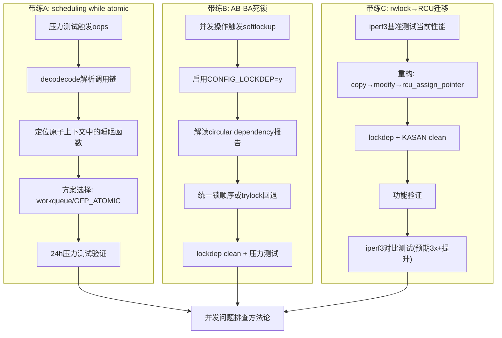

# 13.7.1 综合实战：并发崩溃排查

> 所属章节：第13章 并发与同步 > 13.7 综合实战
>
> 难度：[E][M] | 预计阅读时间：35分钟

## <span class="blue"> 本节导读

学了那么多同步原语的理论，真到了线上环境崩了，你该怎么办？<br>
本节给你三个"从崩溃到修复"的完整排查故事。不是教科书式的"应该怎么做"，而是带你走一遍工程师的真实排查路径——复现、分析、定位、修复、验证，一个都不能少。<br>
学完后，你将掌握：
- 用oops和lockdep解决真实并发故障的完整方法论
- 从rwlock迁移到RCU的实操步骤和性能验证方法
- 一份能快速查阅的同步原语选择速查表和最佳实践清单

> 💡 **提示**：养成先用工具测量再下结论的习惯。别猜，去测。

---

## <span class="blue"> 三个完整排查流程 [E][M]

### 带练A："scheduling while atomic"崩溃排查

这是最典型的内核并发bug之一——你在不该睡觉的地方睡了。

**背景**：某嵌入式设备在并发压力测试下随机触发kernel oops，堆栈里赫然印着`scheduling while atomic`。这种问题往往藏得很深，因为单线程测试根本触发不了。

#### 完整步骤

| 步骤 | 命令/操作 | 预期输出 | 分析 |
|------|-----------|----------|------|
| 1. 复现崩溃 | `stress-ng --cpu 8 --io 4 -t 60` + 业务压力 | Kernel oops，`scheduling while atomic` | 并发压力是关键，单核单线程往往无法触发 |
| 2. 抓取oops | `dmesg -w` 或串口控制台 | 完整oops回溯信息 | 确认是原子上下文调用了睡眠函数 |
| 3. 分析调用链 | `scripts/decodecode < oops.txt` | 定位到具体函数和代码行 | 查看触发点所在的上下文类型 |
| 4. 定位根源 | 检查代码中`spin_lock`/`irq`保护区域内的函数调用 | 发现`copy_to_user()`、`kmalloc(GFP_KERNEL)`或`mutex_lock()` | 这些函数在原子上下文中都会睡眠 |
| 5. 修复 | 移出睡眠操作到workqueue，或改用`GFP_ATOMIC`/`spinlock` | 编译通过 | 如果在softirq中，考虑`napi_schedule`模式 |
| 6. 验证 | 重新压力测试24小时以上 | 无oops，无crash | 必须长时间压力测试，短时测试可能漏掉 |

#### oops分析示例代码

```c
// ===== 有问题的代码（简化版） =====
static ssize_t buggy_read(struct file *filp, char __user *buf,
                          size_t count, loff_t *off)
{
    struct my_data *data = filp->private_data;
    char *tmp;

    spin_lock(&data->lock);          // ← 进入原子上下文

    // 🔴 危险！copy_to_user 可能睡眠（页故障时）
    if (copy_to_user(buf, data->buffer, count)) {
        spin_unlock(&data->lock);
        return -EFAULT;
    }

    // 🔴 危险！GFP_KERNEL 在原子上下文中不允许
    tmp = kmalloc(1024, GFP_KERNEL);

    spin_unlock(&data->lock);
    return count;
}

// ===== 修复方案一：用 GFP_ATOMIC + 先拷贝到临时缓冲区 =====
static ssize_t fixed_read_v1(struct file *filp, char __user *buf,
                             size_t count, loff_t *off)
{
    struct my_data *data = filp->private_data;
    char tmp_buf[256];  // 栈上临时缓冲，避免睡眠
    size_t to_copy = min(count, sizeof(tmp_buf));
    int ret;

    spin_lock(&data->lock);
    memcpy(tmp_buf, data->buffer, to_copy);  // memcpy不睡眠
    spin_unlock(&data->lock);                // ← 尽早释放锁

    // copy_to_user在用户可睡眠的上下文执行
    ret = copy_to_user(buf, tmp_buf, to_copy);
    return ret ? -EFAULT : to_copy;
}

// ===== 修复方案二：用 workqueue 处理需要睡眠的操作 =====
static ssize_t fixed_read_v2(struct file *filp, char __user *buf,
                             size_t count, loff_t *off)
{
    struct my_data *data = filp->private_data;
    struct work_struct *work;

    // 在进程上下文调度workqueue
    schedule_work(&data->read_work);
    // ... 等待work完成或使用异步通知
    wait_for_completion(&data->read_done);

    return data->read_result;
}
```

> ⚠️ **陷阱**：修复后必须验证——不要假设修复一定有效。很多工程师改完代码看一眼就提交，结果在另一个代码路径上同样的问题仍然存在。至少跑24小时压力测试。

> 🔴 **危险**：`copy_to_user()`看似 innocuous，但在页缺失时它会睡眠。这是最容易被忽视的原子上下文睡眠陷阱。

---

### 带练B：AB-BA死锁排查

死锁问题就像定时炸弹——平时一切正常，特定时序下系统直接卡死。

**背景**：系统在并发操作下偶发性无响应，softlockup watchdog触发，但oops信息并不直观。这是典型的AB-BA死锁场景。

#### 完整步骤

| 步骤 | 命令/操作 | 预期输出 | 分析 |
|------|-----------|----------|------|
| 1. 复现死锁 | 并发执行两个操作路径（路径1：先lock_A再lock_B；路径2：先lock_B再lock_A） | 系统无响应，`softlockup: hung tasks` | softlockup超时（默认22秒）说明CPU被卡在某个不可抢占的临界区 |
| 2. 启用lockdep | 编译内核时`CONFIG_LOCKDEP=y`，或`CONFIG_DEBUG_LOCK_ALLOC=y` | 重新编译启动 | lockdep是内核自带的死锁检测神器，一定要会用 |
| 3. 触发lockdep | 再次执行复现操作 | lockdep报告`circular locking dependency detected` | lockdep会在运行时分析锁的依赖链 |
| 4. 解读报告 | 查看dmesg中的dependency chain | 显示两个锁的获取顺序和调用栈 | 报告格式清晰：Chain A→B vs Chain B→A |
| 5. 修复 | 统一锁顺序（总是先A后B），或在第二路径使用`mutex_trylock()`回退 | 代码逻辑改变 | trylock失败时返回-EBUSY，避免死等 |
| 6. 验证 | 再次压力测试，确认lockdep clean | `no lockdep complaints` | lockdep clean是硬指标，不能妥协 |

#### lockdep报告解读示例

```
======================================================
[ INFO: possible circular locking dependency detected ]
4.19.0-xxx #1 Tainted: G           O
-------------------------------------------------------
thread_A/1234 is trying to acquire lock:
  (&bdev->bd_mutex){+.+.}, at: blkdev_get+0x123/0x340

but task is already holding lock:
  (&loop->lo_ctl_mutex){+.+.}, at: lo_ioctl+0x45/0x280

which lock already depends on the new lock.

// ===== 依赖链A：bdev_mutex -> lo_ctl_mutex =====
-> #1 (&loop->lo_ctl_mutex){+.+.}:
       lo_open+0x3a/0x100
       blkdev_get+0x1f0/0x340
       do_dentry_open+0x1a3/0x390

// ===== 依赖链B：lo_ctl_mutex -> bdev_mutex =====
-> #0 (&bdev->bd_mutex){+.+.}:
       lo_ioctl+0x45/0x280
       blkdev_ioctl+0x8f0/0xa40
       do_vfs_ioctl+0xa2/0x6c0

other info that might help us debug this:
 Possible unsafe locking scenario:

       CPU0                    CPU1
       ----                    ----
  lock(&loop->lo_ctl_mutex);
                               lock(&bdev->bd_mutex);
                               lock(&loop->lo_ctl_mutex);
  lock(&bdev->bd_mutex);

 *** DEADLOCK ***
```

看到这种报告，你应该做的第一件事是：找到两个获取顺序相反的代码路径。然后统一顺序，或者在一个路径上加trylock保护。

```c
// ===== 有问题的代码 =====
// 路径1：线程A
void thread_a_work(void)
{
    mutex_lock(&lock_a);    // 先A
    // ... 一些操作
    mutex_lock(&lock_b);    // 再B ← 这里可能和线程B死锁
    // ...
    mutex_unlock(&lock_b);
    mutex_unlock(&lock_a);
}

// 路径2：线程B
void thread_b_work(void)
{
    mutex_lock(&lock_b);    // 先B ← 顺序不一致！
    // ... 一些操作
    mutex_lock(&lock_a);    // 再A
    // ...
    mutex_unlock(&lock_a);
    mutex_unlock(&lock_b);
}

// ===== 修复方案一：统一顺序（推荐） =====
void thread_b_work_fixed(void)
{
    mutex_lock(&lock_a);    // ← 也先A，统一顺序
    mutex_lock(&lock_b);    // 再B
    // ...
    mutex_unlock(&lock_b);
    mutex_unlock(&lock_a);
}

// ===== 修复方案二：trylock回退（当顺序无法统一时） =====
void thread_b_work_trylock(void)
{
    mutex_lock(&lock_b);
    // ...
    if (!mutex_trylock(&lock_a)) {  // ← 非阻塞尝试
        mutex_unlock(&lock_b);
        return -EBUSY;              // 失败则回退，避免死等
    }
    // ...
    mutex_unlock(&lock_a);
    mutex_unlock(&lock_b);
}
```

---

### 带练C：从rwlock到RCU的迁移实验

读多写少的场景下，rwlock的读锁竞争会严重拖累性能。RCU能解决这个问题，但迁移需要小心翼翼。

**背景**：网络数据包过滤模块，读操作占99.9%以上，用`rwlock`保护的规则表在高并发读取下成为瓶颈。

#### 完整步骤

| 步骤 | 命令/操作 | 预期输出 | 分析 |
|------|-----------|----------|------|
| 1. 基准测试 | `iperf3 -c target -P 32 -t 60` | 记录当前吞吐量（例：2.1 Gbps） | 必须有基准数据，否则优化后无法证明效果 |
| 2. 代码重构 | 将`read_lock()`→`rcu_read_lock()`，`write_lock()`→`synchronize_rcu()` | 编译通过 | 关键是确保写操作使用`rcu_assign_pointer()`发布新版本 |
| 3. lockdep检查 | 运行测试，查看dmesg | `no lockdep complaints` | RCU的lockdep语义和传统锁不同，注意检查 |
| 4. KASAN检查 | `CONFIG_KASAN=y`，再次测试 | `no kasan errors` | 防止RCU指针释放后过早重用导致use-after-free |
| 5. 功能测试 | 规则增删查 + 流量验证 | 功能正常，规则生效 | 功能正确比性能更重要 |
| 6. 性能对比 | 同样`iperf3`参数再次测试 | 吞吐量提升到6.5+ Gbps | 预期3x以上提升 |

#### RCU迁移代码模板

```c
// ===== 旧代码：rwlock版本 =====
struct rule_table {
    rwlock_t lock;
    struct rule *rules[MAX_RULES];
    int count;
};

static struct rule_table g_table;

// 读路径（热点路径，99.9%）
static bool rwlock_lookup(struct packet *pkt)
{
    bool match = false;
    int i;

    read_lock(&g_table.lock);           // ← 所有读者串行在这里
    for (i = 0; i < g_table.count; i++) {
        if (rule_match(g_table.rules[i], pkt)) {
            match = true;
            break;
        }
    }
    read_unlock(&g_table.lock);
    return match;
}

// 写路径
static int rwlock_add_rule(struct rule *new_rule)
{
    write_lock(&g_table.lock);
    if (g_table.count >= MAX_RULES) {
        write_unlock(&g_table.lock);
        return -ENOSPC;
    }
    g_table.rules[g_table.count++] = new_rule;
    write_unlock(&g_table.lock);
    return 0;
}

// ===== 新代码：RCU版本 =====
struct rule_table_rcu {
    struct rule *rules[MAX_RULES];
    int count;
};

// 全局指针，RCU保护的是这个指针
static struct rule_table_rcu __rcu *g_table_rcu;
static DEFINE_MUTEX(table_mutex);  // 写者互斥

// 读路径（热点路径——无锁！）
static bool rcu_lookup(struct packet *pkt)
{
    struct rule_table_rcu *table;
    bool match = false;
    int i;

    rcu_read_lock();                    // ← 极轻量，无竞争
    table = rcu_dereference(g_table_rcu); // 安全获取指针
    if (table) {
        for (i = 0; i < table->count; i++) {
            if (rule_match(table->rules[i], pkt)) {
                match = true;
                break;
            }
        }
    }
    rcu_read_unlock();
    return match;
}

// 写路径：copy → modify → publish → wait grace period
static int rcu_add_rule(struct rule *new_rule)
{
    struct rule_table_rcu *old_table, *new_table;
    size_t size;
    int ret = 0;

    mutex_lock(&table_mutex);           // 写者串行

    old_table = rcu_dereference_protected(
        g_table_rcu, lockdep_is_held(&table_mutex));

    // 检查空间
    if (old_table && old_table->count >= MAX_RULES) {
        mutex_unlock(&table_mutex);
        return -ENOSPC;
    }

    // 1. 分配新表（copy）
    new_table = kzalloc(sizeof(*new_table), GFP_KERNEL);
    if (!new_table) {
        mutex_unlock(&table_mutex);
        return -ENOMEM;
    }

    // 2. 复制旧数据 + 追加新规则（modify）
    if (old_table) {
        size = old_table->count * sizeof(struct rule *);
        memcpy(new_table->rules, old_table->rules, size);
        new_table->count = old_table->count;
    }
    new_table->rules[new_table->count++] = new_rule;

    // 3. 原子发布新版本（publish）
    rcu_assign_pointer(g_table_rcu, new_table);

    mutex_unlock(&table_mutex);

    // 4. 等待所有读者退出（grace period）
    synchronize_rcu();

    // 5. 安全释放旧表
    kfree(old_table);

    return ret;
}
```

> ⚠️ **陷阱**：`synchronize_rcu()`在大量读者存在时可能延迟几十毫秒。如果你的写操作对延迟敏感，考虑用`call_rcu()`异步释放旧数据。

> 💡 **提示**：RCU不适合写频繁的场景。如果写操作超过1%，rwlock甚至可能更快——一定要用`iperf3`或`fio`这类工具测量，不要拍脑袋决定。

#### 三个带练的流程图



---

## <span class="blue"> 同步原语选择速查表 [E]

到这一步，你已经见识了各种并发问题的排查过程。但"怎么排查"只是后半段，前半段是"一开始选什么同步原语"。选对了，问题少一半。

### 场景 → 同步原语速查表

| 场景 | 推荐原语 | 备选 | 关键考量 |
|------|----------|------|----------|
| 多读者、极少写者（>100:1） | **RCU** | rwlock | 读者无锁，吞吐量最高 |
| 读者多、写者少（10:1~100:1） | **rwlock/rwsem** | RCU | rwlock读者可并行，写者独占 |
| 读者写者均衡（1:1~10:1） | **mutex + 条件变量** | rwsem | 公平性更重要 |
| 高频短临界区（计数器、flag） | **atomic_t / percpu** | spinlock | 避免锁开销，直接用原子操作 |
| 低频长临界区（链表遍历修改） | **mutex** | rwsem | 可睡眠，支持抢占 |
| 中断上下文 ↔ 进程上下文 | **spin_lock_irqsave** | 无 | 必须关中断防止嵌套死锁 |
| 中断上下文内部 | **spin_lock**（同核） | 无 | 同核中断已关，不需要_irqsave |
| 软中断（tasklet/timer）之间 | **spin_lock** | 无 | 软irq不可抢占，spinlock足够 |
| 不同CPU核心之间 | **spinlock / atomic** | RCU | 跨核需要真正的同步原语 |
| 资源池分配/释放 | **mutex** | spinlock | 可能涉及内存分配，会睡眠 |

### 并发编程最佳实践清单（DO / DON'T）

| ✅ DO（要做） | ❌ DON'T（不要做） |
|-------------|-------------------|
| 保持临界区尽可能短——获取锁，做必要的事，立即释放 | 在临界区内调用可能睡眠的函数（`kmalloc(GFP_KERNEL)`、`copy_to_user`等） |
| 用`lockdep`检测锁依赖关系（开发阶段必开） | 用`spinlock`保护长耗时操作（会阻塞其他CPU） |
| 统一锁的获取顺序，形成全局一致的层次 | 在不同代码路径中改变锁的获取顺序（AB-BA死锁根源） |
| 优先使用RCU替代rwlock处理读多写少场景 | 在读多写少场景盲目使用`seqlock`（写者饥饿） |
| 用`percpu`变量替代全局计数器（避免缓存行 bouncing） | 多个CPU频繁读写同一个`atomic_t`（性能杀手） |
| 用`trylock`+回退处理可能死锁的场景 | 无限等待锁——softlockup超时就炸 |
| 写完后跑24小时+压力测试验证 | 修复后不验证就提交（同样的bug可能在别的路径存在） |
| 用`READ_ONCE/WRITE_ONCE`防止编译器乱序优化 | 依赖volatile或直觉判断可见性 |

> 💡 **提示**：这份速查表不是死记硬背的东西。建议打印出来贴显示器旁边，每次写并发代码时扫一眼。用多了自然就内化了。

> ⚠️ **陷阱**：很多工程师看到"锁"就条件反射地用mutex。但在中断上下文里，mutex直接让你崩。先问自己：这段代码可能在中断里执行吗？

---

## <span class="blue"> 本节总结

| 维度 | 要点 |
|------|------|
| **"scheduling while atomic"排查** | oops分析→decodecode定位→确认原子上下文中的睡眠函数→移到workqueue或改用GFP_ATOMIC→24h压力验证 |
| **AB-BA死锁排查** | 复现→CONFIG_LOCKDEP=y→解读circular dependency链→统一锁顺序或trylock→lockdep clean验证 |
| **rwlock→RCU迁移** | iperf3基准→copy-modify-publish模式→lockdep+KASAN clean→功能验证→性能对比（预期3x+） |
| **同步原语选择** | 读多写少→RCU；高频短临界区→atomic/percpu；中断上下文→spin_lock_irqsave；长临界区→mutex |
| **核心原则** | 先测量再优化，先验证再提交，lockdep开发阶段必开 |

---

## <span class="blue"> 下一步

三个带练做完了，你的并发排查工具箱已经相当充实。下一节 **13.99 知识图谱与查漏补缺**，我们把第13章的所有知识点串成一张大图，帮你建立完整的并发与同步知识体系，同时检查是否还有遗漏的角落。

---

## <span class="blue"> 配套资源

| 资源类型 | 内容 |
|----------|------|
| **代码清单** | `scheduling while atomic` oops分析示例（decodecode用法） |
| **代码清单** | lockdep circular dependency报告完整解读模板 |
| **代码清单** | rwlock→RCU迁移完整代码模板（含copy-modify-publish模式） |
| **速查表** | 10种常见场景→同步原语推荐对照表 |
| **速查表** | 并发编程DO/DON'T最佳实践清单 |
| **流程图** | 三个带练的完整排查流程（mermaid图） |
| **工具** | `stress-ng`、`iperf3`、`scripts/decodecode`、`CONFIG_LOCKDEP=y`、`CONFIG_KASAN=y` |
| **推荐阅读** | `Documentation/RCU/` 内核源码中的RCU文档；`Documentation/locking/lockdep-design.txt` |
