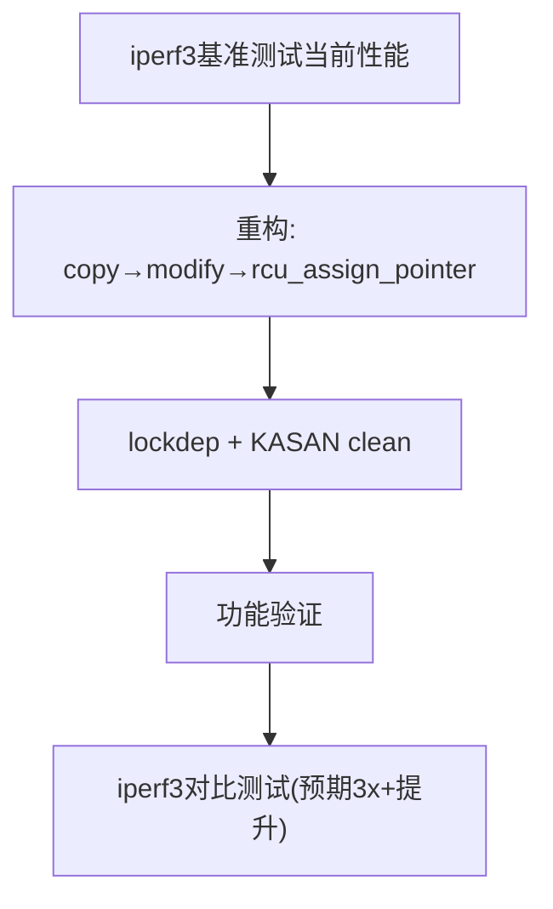

# 13.7.2 实战：rwlock到RCU迁移与选型速查

> 所属章节：第13章 并发与同步 > 13.7 综合实战
>
> 难度：[E→M] | 预计阅读时间：30分钟

## <span class="blue"> 本节导读

上一节解决的是"已经崩了怎么办"，本节解决的是"设计时怎么选对"。<br>
本节覆盖：
- 一次完整的 rwlock → RCU 迁移实验：基准测试、copy-modify-publish 重构、lockdep/KASAN 验证、性能对比
- 一张场景 → 同步原语的选型速查表，和一份并发编程 DO/DON'T 清单

> 💡 RCU 迁移的收益必须用基准数据说话：先测迁移前的吞吐量，再测迁移后的，没有前后对比的"优化"不算数。

---

## <span class="blue"> 带练C：从rwlock到RCU的迁移实验 [E→M]

读多写少的场景下，rwlock 的读锁竞争会严重拖累性能。RCU 能解决这个问题，但迁移必须按步骤来。

**背景**：网络数据包过滤模块，读操作占 99.9% 以上，用 `rwlock` 保护的规则表在高并发读取下成为瓶颈。

### 完整步骤

| 步骤 | 命令/操作 | 预期输出 | 分析 |
|------|-----------|----------|------|
| 1. 基准测试 | `iperf3 -c target -P 32 -t 60` | 记录当前吞吐量（例：2.1 Gbps） | 必须有基准数据，否则优化后无法证明效果 |
| 2. 代码重构 | 将`read_lock()`→`rcu_read_lock()`，`write_lock()`→`synchronize_rcu()` | 编译通过 | 关键是确保写操作使用`rcu_assign_pointer()`发布新版本 |
| 3. lockdep检查 | 运行测试，查看dmesg | `no lockdep complaints` | RCU的lockdep语义和传统锁不同，注意检查 |
| 4. KASAN检查 | `CONFIG_KASAN=y`，再次测试 | `no kasan errors` | 防止RCU指针释放后过早重用导致use-after-free |
| 5. 功能测试 | 规则增删查 + 流量验证 | 功能正常，规则生效 | 功能正确比性能更重要 |
| 6. 性能对比 | 同样`iperf3`参数再次测试 | 吞吐量提升到6.5+ Gbps | 预期3x以上提升 |

### RCU迁移代码模板

```c
// ===== 旧代码：rwlock版本 =====
struct rule_table {
    rwlock_t lock;
    struct rule *rules[MAX_RULES];
    int count;
};

static struct rule_table g_table;

// 读路径（热点路径，99.9%）
static bool rwlock_lookup(struct packet *pkt)
{
    bool match = false;
    int i;

    read_lock(&g_table.lock);           // ← 所有读者串行在这里
    for (i = 0; i < g_table.count; i++) {
        if (rule_match(g_table.rules[i], pkt)) {
            match = true;
            break;
        }
    }
    read_unlock(&g_table.lock);
    return match;
}

// 写路径
static int rwlock_add_rule(struct rule *new_rule)
{
    write_lock(&g_table.lock);
    if (g_table.count >= MAX_RULES) {
        write_unlock(&g_table.lock);
        return -ENOSPC;
    }
    g_table.rules[g_table.count++] = new_rule;
    write_unlock(&g_table.lock);
    return 0;
}

// ===== 新代码：RCU版本 =====
struct rule_table_rcu {
    struct rule *rules[MAX_RULES];
    int count;
};

// 全局指针，RCU保护的是这个指针
static struct rule_table_rcu __rcu *g_table_rcu;
static DEFINE_MUTEX(table_mutex);  // 写者互斥

// 读路径（热点路径——无锁）
static bool rcu_lookup(struct packet *pkt)
{
    struct rule_table_rcu *table;
    bool match = false;
    int i;

    rcu_read_lock();                      // ← 极轻量，无竞争
    table = rcu_dereference(g_table_rcu); // 安全获取指针
    if (table) {
        for (i = 0; i < table->count; i++) {
            if (rule_match(table->rules[i], pkt)) {
                match = true;
                break;
            }
        }
    }
    rcu_read_unlock();
    return match;
}

// 写路径：copy → modify → publish → wait grace period
static int rcu_add_rule(struct rule *new_rule)
{
    struct rule_table_rcu *old_table, *new_table;
    size_t size;

    mutex_lock(&table_mutex);           // 写者串行

    old_table = rcu_dereference_protected(
        g_table_rcu, lockdep_is_held(&table_mutex));

    // 检查空间
    if (old_table && old_table->count >= MAX_RULES) {
        mutex_unlock(&table_mutex);
        return -ENOSPC;
    }

    // 1. 分配新表（copy）
    new_table = kzalloc(sizeof(*new_table), GFP_KERNEL);
    if (!new_table) {
        mutex_unlock(&table_mutex);
        return -ENOMEM;
    }

    // 2. 复制旧数据 + 追加新规则（modify）
    if (old_table) {
        size = old_table->count * sizeof(struct rule *);
        memcpy(new_table->rules, old_table->rules, size);
        new_table->count = old_table->count;
    }
    new_table->rules[new_table->count++] = new_rule;

    // 3. 原子发布新版本（publish）
    rcu_assign_pointer(g_table_rcu, new_table);

    mutex_unlock(&table_mutex);

    // 4. 等待所有读者退出（grace period）
    synchronize_rcu();

    // 5. 安全释放旧表
    kfree(old_table);

    return 0;
}
```

<!--
【待补图】images/13.7.2-RCU迁移多版本共存.png（优先级：△ 可选）
图名：RCU 迁移期间新旧两版规则表共存的空间结构
生图提示词：技术示意图，深色背景，工程蓝图风格。画面中央一条水平时间轴从左到右标注三个阶段："写者复制修改"、"rcu_assign_pointer 发布"、"grace period 结束"。时间轴上方画两个矩形框：左侧"旧版规则表 v1"（虚线边框，标注"老读者仍持有指针"），右侧"新版规则表 v2"（实线边框，标注"新读者只见 v2"）。三个 CPU 小人图标沿时间轴分布：CPU0 在时间轴左侧读取 v1（箭头指向旧框），CPU1 在发布点之后读取 v2（箭头指向新框），CPU2 在 grace period 结束后（旧框下方画一个垃圾桶图标，标注"此时才能 kfree"）。用颜色区分：旧表灰蓝色、新表亮绿色、grace period 区间用淡黄色底色横条标出。箭头清晰标注数据流向，禁止卡通风格，扁平化矢量图，16:9。
-->

> ⚠️ `synchronize_rcu()` 在大量读者存在时可能延迟几十毫秒。如果写操作对延迟敏感，改用 `call_rcu()` 异步释放旧数据（见 13.4.2）。

> 💡 RCU 不适合写频繁的场景。写操作占比超过 1% 时，rwlock 甚至可能更快——用 `iperf3` 或 `fio` 实测，不要凭感觉决定。

### 迁移流程图



---

## <span class="blue"> 同步原语选择速查表 [E]

排查是后半段，前半段是"一开始选什么同步原语"。选对了，问题少一半。

### 场景 → 同步原语速查表

| 场景 | 推荐原语 | 备选 | 关键考量 |
|------|----------|------|----------|
| 多读者、极少写者（>100:1） | **RCU** | rwlock | 读者无锁，吞吐量最高 |
| 读者多、写者少（10:1~100:1） | **rwlock/rwsem** | RCU | rwlock读者可并行，写者独占 |
| 读者写者均衡（1:1~10:1） | **mutex + 条件变量** | rwsem | 公平性更重要 |
| 高频短临界区（计数器、flag） | **atomic_t / percpu** | spinlock | 避免锁开销，直接用原子操作 |
| 低频长临界区（链表遍历修改） | **mutex** | rwsem | 可睡眠，支持抢占 |
| 中断上下文 ↔ 进程上下文 | **spin_lock_irqsave** | 无 | 必须关中断防止嵌套死锁 |
| 中断上下文内部 | **spin_lock**（同核） | 无 | 同核中断已关，不需要_irqsave |
| 软中断（tasklet/timer）之间 | **spin_lock** | 无 | 软irq不可抢占，spinlock足够 |
| 不同CPU核心之间 | **spinlock / atomic** | RCU | 跨核需要真正的同步原语 |
| 资源池分配/释放 | **mutex** | spinlock | 可能涉及内存分配，会睡眠 |

### 并发编程最佳实践清单（DO / DON'T）

| ✅ DO（要做） | ❌ DON'T（不要做） |
|-------------|-------------------|
| 保持临界区尽可能短——获取锁，做必要的事，立即释放 | 在临界区内调用可能睡眠的函数（`kmalloc(GFP_KERNEL)`、`copy_to_user`等） |
| 用`lockdep`检测锁依赖关系（开发阶段必开） | 用`spinlock`保护长耗时操作（会阻塞其他CPU） |
| 统一锁的获取顺序，形成全局一致的层次 | 在不同代码路径中改变锁的获取顺序（AB-BA死锁根源） |
| 优先使用RCU替代rwlock处理读多写少场景 | 在读多写少场景盲目使用`seqlock`（写者饥饿） |
| 用`percpu`变量替代全局计数器（避免缓存行乒乓） | 多个CPU频繁读写同一个`atomic_t`（性能杀手） |
| 用`trylock`+回退处理可能死锁的场景 | 无限等待锁——softlockup超时就触发看门狗 |
| 写完后跑24小时+压力测试验证 | 修复后不验证就提交（同样的bug可能在别的路径存在） |
| 用`READ_ONCE/WRITE_ONCE`防止编译器乱序优化 | 依赖volatile或直觉判断可见性 |

> ⚠️ 很多工程师看到"锁"就条件反射地用 mutex。先问自己：这段代码可能在中断里执行吗？可能的话，mutex 直接让系统崩。

---

## <span class="blue"> 本节总结

| 维度 | 要点 |
|------|------|
| **rwlock→RCU迁移** | iperf3基准→copy-modify-publish模式→lockdep+KASAN clean→功能验证→性能对比（预期3x+） |
| **迁移关键约束** | 写者用 mutex 串行；发布用 `rcu_assign_pointer()`；旧版本必须等 grace period 结束后释放 |
| **同步原语选择** | 读多写少→RCU；高频短临界区→atomic/percpu；中断上下文→spin_lock_irqsave；长临界区→mutex |
| **核心原则** | 先测量再优化，先验证再提交，lockdep开发阶段必开 |

---

## <span class="blue"> 下一步

两个实战带练走完了，排查和选型两条线都有了着落。下一节把全章内容串成一张知识图谱，配上自测题检查掌握程度。

> **13.99 知识图谱与查漏补缺**

---

## <span class="blue"> 配套资源

| 资源类型 | 内容 |
|----------|------|
| **代码清单** | rwlock→RCU 迁移完整代码模板（含 copy-modify-publish 模式） |
| **速查表** | 10种常见场景→同步原语推荐对照表 |
| **速查表** | 并发编程DO/DON'T最佳实践清单 |
| **流程图** | RCU 迁移五步流程（mermaid 图） |
| **工具** | `iperf3`、`fio`、`CONFIG_LOCKDEP=y`、`CONFIG_KASAN=y` |
| **推荐阅读** | `Documentation/RCU/` 内核源码中的 RCU 文档；`Documentation/locking/lockdep-design.rst` |
