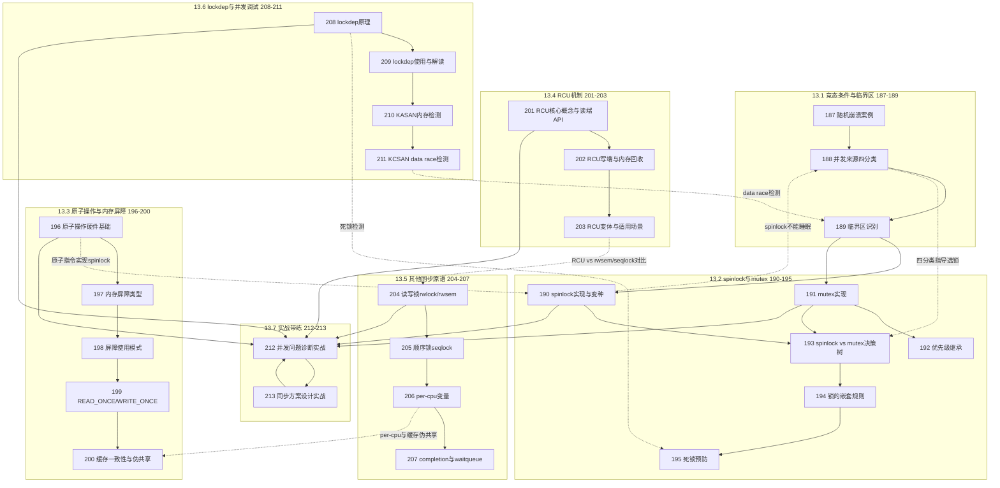

# 13.99 知识图谱与查漏补缺

> 所属章节：第13章 并发与同步 > 13.99 知识图谱
>
> 难度：[I] | 预计阅读时间：25分钟

## <span class="blue"> 本节导读

恭喜你，走到了第13章的最后一站！<br>
前面十几节内容是不是信息量爆棚？spinlock、mutex、RCU、内存屏障、lockdep……概念一个接一个，很容易学了后面忘了前面。<br>
本节是一张"导航地图"——把全章27个知识点串成一张关联图，再配上10道自测题帮你检验学习效果。学完后，你将对并发与同步的全貌有一个清晰的认知框架，也能知道自己哪里还需要回头补课。

---

## <span class="blue"> 本章知识点关联图 [I]

下面的 mermaid 图展示了第13章27个知识点（187~213）之间的依赖与关联关系。实线箭头表示学习顺序上的递进关系，虚线箭头表示跨小节的关联引用。



> 💡 **提示**：这张图建议你保存下来，作为日后查阅第13章内容的"目录地图"。遇到实际问题时，先定位到对应的知识点编号，再回看详细内容。

---

## <span class="blue"> 核心概念速查表 [I]

27个知识点，一句话一个。这张表是整章内容的"压缩包"。

| 编号 | 知识点 | 一句话总结 |
|:---:|--------|-----------|
| **13.1 竞态条件与临界区** |||
| 187 | 随机崩溃案例 | 并发bug最难缠——它不一定每次都触发，但一旦发生就可能毁数据 |
| 188 | 并发来源四分类 | 四路并发来源：多核并行、进程抢占、中断打断、内核抢占 |
| 189 | 临界区识别 | 临界区 = 访问共享资源的代码段，必须用同步原语保护 |
| **13.2 spinlock与mutex** |||
| 190 | spinlock实现与变种 | spinlock = 忙等待锁，底层靠原子交换指令实现，分raw/arch/rw等变种 |
| 191 | mutex实现 | mutex = 睡眠锁，争不到就放弃CPU，适合持有时间较长的场景 |
| 192 | 优先级继承 | 优先级反转的解法——让持有锁的低优先级线程临时"借"到高优先级 |
| 193 | spinlock vs mutex决策树 | 中断上下文/短持有 → spinlock；可睡眠/长持有 → mutex |
| 194 | 锁的嵌套规则 | 获取顺序必须全局一致，交叉获取 = 死锁温床 |
| 195 | 死锁预防 | 四条件缺一不可：互斥、持有等待、不可抢占、循环等待 |
| **13.3 原子操作与内存屏障** |||
| 196 | 原子操作硬件基础 | 原子操作靠CPU专属指令（如LDREX/STREX）保证读-改-写不可打断 |
| 197 | 内存屏障类型 | 四类屏障：mb()通用、rmb()读、wmb()写、smp_mb()多核专用 |
| 198 | 屏障使用模式 | 成对使用：写端插wmb()，读端插rmb()，缺一不可 |
| 199 | READ_ONCE/WRITE_ONCE | 防止编译器优化乱序的轻量级标记，不带CPU屏障语义 |
| 200 | 缓存一致性与伪共享 | 伪共享 = 不同CPU修改同一缓存行的不同变量，导致无效化风暴 |
| **13.4 RCU机制** |||
| 201 | RCU核心概念与读端API | RCU读端无锁、无阻塞，靠rcu_read_lock()/_unlock()标记临界区 |
| 202 | RCU写端与内存回收 | 写端复制更新，靠synchronize_rcu()等所有读者退出后再释放旧数据 |
| 203 | RCU变体与适用场景 | RCU有BH、SCHED、TASK多种 flavor，分别对应不同抢占场景 |
| **13.5 其他同步原语** |||
| 204 | 读写锁rwlock/rwsem | 读并发/写独占，rwlock是spinlock族，rwsem是mutex族 |
| 205 | 顺序锁seqlock | 写优先的锁，读者通过序列号检测是否在读的过程中被写者打断 |
| 206 | per-cpu变量 | 每个CPU一份私有副本，从根本上消除竞争，是最快的"同步" |
| 207 | completion与waitqueue | completion = 一对一事件通知；waitqueue = 多对多条件等待 |
| **13.6 lockdep与并发调试** |||
| 208 | lockdep原理 | lockdep在运行时构建锁依赖图，检测循环依赖即报告死锁风险 |
| 209 | lockdep使用与解读 | 开启CONFIG_LOCKDEP，看懂报告中的依赖链和可能的死锁路径 |
| 210 | KASAN内存检测 | KASAN = Kernel Address SANitizer，用影子内存检测越界和use-after-free |
| 211 | KCSAN data race检测 | KCSAN = Kernel Concurrency SANitizer，专门捕获无锁访问的data race |
| **13.7 实战带练** |||
| 212 | 并发问题诊断实战 | 从崩溃现场反推竞争条件，结合lockdep/KASAN/KCSAN定位根因 |
| 213 | 同步方案设计实战 | 根据访问模式（读多写少、读写均衡等）选择最合适的同步原语组合 |

---

## <span class="blue"> 自测题 [I]

### 选择题（每题5分，共25分）

**1. 下列哪种并发来源仅在开启内核抢占时才会出现？**

A. 多核并行执行<br>
B. 中断处理程序打断当前执行流<br>
C. 用户态进程被抢占<br>
D. 高优先级内核线程抢占低优先级内核线程

<details><summary>答案与解析</summary>

**答案：D**

多核并行（A）只要有SMP就存在；中断打断（B）与内核抢占无关；用户态抢占（C）属于进程调度层面。只有高优先级内核线程抢占低优先级线程（D）是CONFIG_PREEMPT开启后才有的内核抢占场景。详见知识点188。
</details>

**2. 在中断处理程序中需要保护共享数据，应该选择？**

A. mutex<br>
B. spin_lock()<br>
C. spin_lock_irqsave()<br>
D. rw_semaphore

<details><summary>答案与解析</summary>

**答案：C**

中断上下文不能睡眠，排除mutex（A）和rw_semaphore（D）。如果共享数据也会被进程上下文访问，且该进程可能在中断发生的同一CPU上持有锁，就必须用spin_lock_irqsave()（C）来关闭本地中断，防止死锁。详见知识点190和193。
</details>

**3. 关于smp_mb()内存屏障，下列说法正确的是？**

A. 它只阻止编译器优化乱序<br>
B. 它只阻止CPU执行乱序<br>
C. 它同时阻止编译器优化乱序和CPU执行乱序<br>
D. 它在单核系统上也有必要

<details><summary>答案与解析</summary>

**答案：C**

smp_mb()是完整的内存屏障，既防止编译器的指令重排优化，也防止CPU的乱序执行。READ_ONCE/WRITE_ONCE（知识点199）才是只阻止编译器优化。在单核UP系统上smp_mb()退化为编译器屏障。详见知识点197。
</details>

**4. RCU机制最适合下列哪种访问模式？**

A. 读少写多，数据更新频繁<br>

B. 读多写少，读者性能要求极高<br>
C. 读写均衡，所有操作都需要强一致性<br>
D. 只有一个读者和一个写者

<details><summary>答案与解析</summary>

**答案：B**

RCU的核心优势在于读端完全无锁、无原子操作、无缓存行乒乓，适合读多写少的场景。写端需要复制更新 + 等待grace period，开销较大，不适合写多读少。详见知识点201和203。
</details>

**5. 使用lockdep时，下列哪种情况会被报告为死锁风险？**

A. 线程A先拿L1再拿L2，线程B也先拿L1再拿L2<br>
B. 线程A先拿L1再拿L2，线程B先拿L2再拿L1<br>
C. 同一线程递归获取同一把spinlock<br>
D. 同一线程先拿mutex再拿spinlock

<details><summary>答案与解析</summary>

**答案：B**

lockdep检测的是锁依赖图中的循环依赖。A选项的获取顺序一致，是安全的；B选项的获取顺序交叉，形成A→L1→L2→L1的循环，正是经典死锁模式。详见知识点208和209。
</details>

---

### 简答题（每题15分，共75分）

**6. 解释为什么spinlock不能在中断上下文之外的某些场景中使用——具体来说，为什么持有spinlock期间不能调用可能导致睡眠的函数？**

<details><summary>答案与解析</summary>

持有spinlock期间，当前CPU处于忙等待或关抢占状态。如果此时调用sleep()、kmalloc(GFP_KERNEL)、copy_to_user()等可能睡眠的函数：

1. 当前线程放弃CPU进入睡眠，但锁仍未释放
2. 其他想获取同一把锁的线程（可能在同一CPU或其他CPU）会持续自旋
3. 如果睡眠的线程优先级较低，可能长期无法被调度，导致"优先级反转"
4. 极端情况下，如果另一个CPU上的线程也在spin等待这把锁，且该CPU的中断被关闭，可能引发系统假死

本质原因：spinlock的设计假设是"持有时间极短且不会睡眠"，一旦打破这个假设，整个系统的实时性和稳定性都会崩塌。详见知识点190和193。
</details>

**7. 描述READ_ONCE()和smp_rmb()的区别——它们分别解决什么问题，能否互相替代？**

<details><summary>答案与解析</summary>

READ_ONCE()解决的是**编译器层面**的问题：防止编译器对内存访问进行优化（如缓存到寄存器、指令重排）。它不带CPU屏障语义，零运行时开销。

smp_rmb()解决的是**CPU硬件层面**的问题：防止CPU的乱序执行引擎将读操作重排到屏障之前。它有运行时开销（通常是特殊的屏障指令）。

两者**不能互相替代**：
- 只用READ_ONCE()：编译器不会乱序，但CPU仍可能乱序执行
- 只用smp_rmb()：CPU不会乱序，但编译器仍可能优化掉内存访问
- 正确做法：两者配合使用，READ_ONCE()包裹访问，smp_rmb()控制执行顺序

详见知识点197和199。
</details>

**8. RCU的grace period是什么概念？写者为什么必须等待grace period结束后才能释放旧数据？**

<details><summary>答案与解析</summary>

Grace period（宽限期）是RCU的核心概念：从写者发布新数据开始，到**所有**曾经进入过rcu_read_lock()临界区的读者都退出为止的一段时间。

写者必须等待grace period的原因：RCU读端无锁，读者可能在任何时候、任何CPU上持有旧数据的指针。如果写者过早释放旧内存，正在使用旧指针的读者就会访问已释放内存（use-after-free）。等待grace period确保了所有可能看到旧数据的读者都已经完成了读端临界区，旧数据不再被引用，可以安全释放。

这类似于垃圾回收中的"安全删除"概念，只不过RCU是靠静态分析reader的存在来实现的。详见知识点201和202。
</details>

**9. per-cpu变量为什么能避免同步开销？它有什么局限性？**

<details><summary>答案与解析</summary>

Per-cpu变量的核心思想：**每个CPU操作自己的私有副本**，多个CPU之间不存在对同一块内存的竞争，因此根本不需要锁、原子操作或内存屏障。

避免同步开销的原理：
- 不同CPU访问不同的缓存行，无缓存行乒乓
- 无需锁获取/释放的原子操作开销
- 无锁争用导致的CPU间同步延迟

局限性：
1. **数据不共享**：如果多个CPU需要看到同一份最新数据，per-cpu不适用
2. **负载不均衡**：如果某个CPU的处理量远大于其他CPU，它的per-cpu队列会积压
3. **动态CPU热插拔**：CPU离线时需要迁移per-cpu数据，增加复杂度
4. **内存消耗**：N个CPU × 每份数据大小，比共享版本多N倍内存

详见知识点206和200。
</details>

**10. 你遇到一个随机崩溃的问题，通过dmesg发现是NULL指针解引用，且发生在网络收包的中断上下文。请列出你的排查思路，包括可能使用的调试工具。**

<details><summary>答案与解析</summary>

排查思路应该分层次展开：

**第一步：判断是否为并发问题**
- 查看崩溃地址是否有规律——如果每次NULL指针的值不同，很可能是race condition导致某个指针在被使用前被另一个CPU/中断写成了NULL
- 检查dmesg中是否有lockdep的警告——即使不是直接死锁，也可能报告锁的使用问题

**第二步：确认数据竞争的存在**
- 用KCSAN（CONFIG_KCSAN）编译内核，重现问题。KCSAN专门检测无锁访问的data race，如果它报告了该指针的并发读写，基本确认根因
- 如果KCSAN不可用，在可疑位置插入printk + smp_mb()，观察是否能稳定复现或改变崩溃行为

**第三步：定位竞争的具体来源**
- 检查该指针的所有读写位置：是否有某处缺少锁保护？
- 特别注意：中断上下文和进程上下文访问同一份数据时，是否都使用了irqsave变体？
- 用KASAN检查是否是use-after-free——指针可能在某处被kfree后又在中断中被访问

**第四步：修复方案**
- 如果是data race：加spinlock_irqsave()保护共享指针的读写
- 如果是use-after-free：考虑改用RCU（读多写少场景）或延迟释放
- 如果中断处理过重：将部分工作推迟到软中断或工作队列中处理

详见知识点208、210、211和212。
</details>

---

## <span class="blue"> 与前后章的关联 [I]

第13章不是孤立的。并发与同步渗透在操作系统每一个子系统中，理解它与其他章节的关系，能让你建立起更立体的知识网络。

| 方向 | 章节 | 关联说明 |
|:---:|------|---------|
| ← 前置 | 第8章 进程管理 | 多进程/多线程是并发的主要来源。fork()、pthread_create()创建的并发执行体，正是本章同步原语要保护的对象 |
| ← 前置 | 第9章 内存管理 | kmalloc()/kfree()内部用spinlock保护空闲链表，页分配器也有per-cpu pageset减少竞争。理解了锁，才能理解分配器的性能特性 |
| ← 前置 | 第10章 中断与异常 | 中断处理程序是内核中典型的"异步闯入者"，与进程上下文形成竞争。10.3节的中断上下界限定了spinlock的使用边界 |
| ← 前置 | 第12章 文件系统 | 页缓存（page cache）的并发访问、dentry缓存的锁保护，都需要本章的知识做支撑 |
| → 后续 | 第14章 网络子系统 | 网络收发包路径（NAPI、软中断、socket层）是内核中最热的并发路径——每个包都可能涉及多CPU竞争，是本章知识的大考 |

```
第8章(进程) ──→ 创建并发执行体 ──→ 第13章(保护它们)
第9章(内存) ──→ 分配器内部用锁 ──→ 第13章(理解性能)
第10章(中断) ──→ 中断打断进程 ──→ 第13章(irqsave选锁)
第12章(文件) ──→ 页缓存竞争 ──→ 第13章(缓存级同步)
                          ↓
              第14章(网络) ←── 最复杂的并发战场
```

> 💡 **提示**：当你学习第14章网络子系统时，建议把第13章的速查表放在手边。网络协议栈中几乎每个层都有并发问题，你会发现自己频繁地回来查"这里该用spinlock还是RCU"。

---

## <span class="blue"> 本节总结

| 维度 | 内容 |
|------|------|
| 27个知识点 | 从竞态条件识别 → 锁的选择 → 底层原子/屏障 → RCU → 其他原语 → 调试工具 → 实战，形成完整闭环 |
| 核心技能 | 能根据上下文（中断/进程、持有时间、读写比例）选择正确的同步原语 |
| 调试工具链 | lockdep防死锁 → KASAN防内存越界 → KCSAN防data race，三剑合璧 |
| 与前后章关系 | 前面的进程/中断/内存是"为什么需要同步"，后面的网络是"最复杂的并发战场" |

---

## <span class="blue"> 下一步

恭喜你完成了第13章——并发与同步！这是内核编程中最考验功力的章节之一。<br>
下一步，你将进入**第14章：网络子系统**。在那里，你会遇到内核中最复杂、最热的并发场景——从网卡硬中断到NAPI轮询，从软中断到socket系统调用，每一层都有并发问题等待你去解决。第13章学到的一切，都将在那里接受实战检验。

---

## <span class="blue"> 配套资源

| 资源类型 | 内容 | 用途 |
|---------|------|------|
| 速查表 | 本文27知识点一句话总结表 | 快速回顾和日常参考 |
| 自测题 | 10道题（选择+简答）附详解 | 检验学习效果，建议闭卷完成 |
| 关联图 | mermaid知识点依赖图 | 理解知识点之间的前置关系 |
| 前后章索引 | 与第8/9/10/12/14章的关联说明 | 建立跨章节知识网络 |
| 推荐重读 | 答错3题以上建议重读对应小节 | 查漏补缺的具体指引 |

> 💡 **提示**：建议你花15分钟做一遍自测题，**不要先看答案**。答完再对照解析，标记出薄弱的知识点，回头重读对应的小节。这样的查漏补缺比从头到尾再读一遍效率高得多。
