# 14.1.1 从UDP丢包案例引入

> 所属章节：第14章 网络子系统 > 14.1 sk_buff与网络路径
>
> 难度：[I] Intermediate | 预计阅读时间：15分钟

## 本节导读

你在调试一个工业网关，Modbus/TCP 高并发场景下 UDP 丢包率高达 5%，可 `top` 一看 CPU 才用了 30%——这显然不是算力不够的问题。那包去哪儿了？ 
本节从一个真实丢包案例切入，带你拆解 Linux 网络栈的分层结构，看清一个数据包从网卡到用户空间的完整旅程，为后续深入 SKB、NAPI、XDP 等核心机制铺好地图。 
学完后，你将掌握网络丢包的层级分析思路，能根据症状快速定位排查方向。

---

## 知识点214：工业网关丢包谜案——CPU不高，包去哪了？ [I]

### 案例现场

你的工业网关跑在 ARM Cortex-A53 四核上，同时处理 200+ 路 Modbus/TCP 连接，网关侧用 UDP 向云端上报聚合数据。压测时你发现：

- UDP 上报丢包率 ≈ 5%，业务直接报错
- `top` 显示 CPU 总占用约 30%，负载不高
- 网卡是千兆 Ethernet，`ethtool -S eth0` 没有 `rx_errors` 暴增

这就怪了——CPU 闲着，网卡也没报错，包怎么就没了？

其实 Linux 网络栈很深，丢包可能发生在**任何一个中间层级**。CPU 不高恰恰说明问题不在"算不过来"，而在"路不通"——可能是缓冲区满了、中断分布不均、或者某个 ring buffer 溢出。

### 丢包排查的四个层级

遇到这种"隐形丢包"，不要瞎猜，按层级排查：

| 层级 | 症状 | 排查工具 | 典型原因 |
|------|------|----------|----------|
| 驱动层（Ring Buffer） | `ethtool -S` 看到 `rx_missed_errors` 或 `rx_fifo_errors` 增加 | `ethtool -S eth0`, `ethtool -g eth0` | 网卡 Ring Buffer 满，新包被直接丢弃 |
| 协议栈层（SKB / NAPI） | `/proc/net/snmp` 中 `RcvbufErrors` 或 `InErrors` 增加 | `cat /proc/net/snmp`, `nstat` | SKB 分配失败、NAPI 预算不足、CPU 软中断堆积 |
| Socket 层 | `ss -nmp` 看到 `drops` 字段增加 | `ss -nmp`, `cat /proc/net/sockstat` | Socket 接收缓冲区满，内核无处存放新包 |
| 应用层 | 应用日志显示收包超时或序号不连续 | 应用日志、抓包 `tcpdump`/`wireshark` | 应用读取太慢，数据在内核缓冲区堆积后被覆盖 |

> 💡 **提示**：网络排查的第一步永远是 `ethtool -S <接口名>` 看网卡统计。这个命令能告诉你驱动层有没有丢包、是什么类型的丢包，比盲目抓包高效得多。

> ⚠️ **陷阱**：CPU 不高还丢包 ≠ 不是性能问题！很多人一看 CPU 才 30% 就排除了性能方向，结果在应用代码里查了半天。实际上，**中断只绑定在单个 CPU**、**NAPI 预算耗尽**、**socket buffer 满** 都能导致丢包，而这些情况的共同特征恰恰是 CPU "看起来不忙"。

### 网络包的完整旅程

想真正理解丢包可能发生在哪里，你必须先看清一个数据包从网卡到应用的完整路径：

```mermaid
flowchart LR
    A["网卡 NIC<br>RX Ring Buffer"] -->|"DMA + 硬中断"| B["驱动层<br>ndo_start_xmit / napi_poll"]
    B -->|"分配 SKB"| C["SKB 核心层<br>sk_buff 结构管理"]
    C -->|"拆包/路由"| D["协议栈层<br>IP → UDP/TCP"]
    D -->|"PREROUTING/<br>FORWARD/INPUT"| E["Netfilter 框架<br>iptables/nftables"]
    E -->|"匹配 socket"| F["Socket 层<br>接收缓冲区"]
    F -->|"recvfrom/recvmsg"| G["用户空间<br>应用程序"]

    style A fill:#e1f5e1
    style G fill:#fff4e1
    style D fill:#ffe1e1
    style E fill:#ffe1e1
```

这张图就是本章的"作战地图"。我们来逐个标记：

1. **网卡 RX Ring Buffer**（绿色）：网卡用 DMA 把包写入内存中的环形缓冲区，然后触发硬中断。如果 Ring Buffer 满了，后续包直接被硬件丢弃，`rx_missed_errors` 计数增加。——这是**最上游**的丢点。

2. **驱动层 + NAPI**：硬中断处理函数触发 NAPI 轮询（还记得第10章讲的"硬中断触发软中断"吗？）。NAPI 用 `napi_poll` 批量收包，减少中断开销。如果 NAPI `budget` 太小或软中断处理不及时，包会在驱动队列里堆积。

3. **SKB 核心层**：每个包在内核里都用一个 `sk_buff` 结构体表示（14.1.2 会详解）。SKB 分配涉及 slab 缓存和 kmalloc，高并发下这里也可能成为瓶颈。

4. **协议栈层**（红色）：IP 层做路由查找、校验和验证，UDP 层做端口匹配。这一层我们会重点学习 Netfilter 框架（14.2），它是 iptables/nftables 的底层支撑。

5. **Socket 层**：匹配到 socket 后，包被挂到该 socket 的接收队列。如果应用读得慢、缓冲区满，内核只能丢弃新包。

6. **用户空间**：最终 `recvfrom()` 把数据拷贝到用户态。这里涉及第13章讲过的锁机制——多个线程竞争同一个 socket 时，锁争用也会拖慢收包速度。

### 本章路线图

沿着上面这条路径，本章将带你深入以下主题：

| 节号 | 主题 | 解决什么问题 |
|------|------|--------------|
| 14.1 | SKB 与网络路径 | 理解内核如何表示和管理网络包 |
| 14.2 | Netfilter 框架 | 搞清 iptables/nftables 的底层机制 |
| 14.3 | NAPI 高性能收包 | 解决高并发收包的中断瓶颈 |
| 14.4 | XDP / eBPF 加速 | 绕过协议栈，直接在内核入口处理包 |
| 14.5 | 协议栈卸载 | 利用 TSO/GSO/硬件 checksum 减少 CPU 负担 |
| 14.6 | 网络多队列 | RSS/RPS/XPS 让多核并行处理网络流量 |

这些知识与前面章节的关联也很紧密：第10章中断子系统里讲的"顶半部 + 底半部"模型，正是 NAPI 轮询的根基；第13章并发与锁里讲的 `spinlock`、`rcu`，在协议栈收发包路径上无处不在。

---

## 本节总结

| 要点 | 内容 |
|------|------|
| 核心问题 | CPU 负载不高却丢包，说明瓶颈不在算力，而在网络栈的某个中间层级 |
| 排查层级 | 驱动层（Ring Buffer）→ 协议栈层（SKB/NAPI）→ Socket 层（接收缓冲区）→ 应用层（读取速度） |
| 关键工具 | `ethtool -S`（网卡统计）、`ss -nmp`（socket 状态）、`/proc/net/snmp`（协议栈计数） |
| 完整路径 | 网卡 RX Ring → 驱动/NAPI → SKB → 协议栈/IP/UDP → Netfilter → Socket 缓冲区 → 应用 |
| 与前面章节的关联 | 第10章（中断/NAPI 底半部模型）、第13章（socket 锁与并发竞争） |

---

## 下一步

网络包的旅程你已经有了地图，接下来我们要深入旅程中最核心的"集装箱"——**`sk_buff` 结构体**。14.1.2 将详解 SKB 的内存布局、引用计数、`skb_shared_info` 等关键字段，帮你理解内核是如何高效管理每一个网络包的。

---

## 配套资源

- 📖 **推荐阅读**：《Linux 内核网络栈源代码情景分析》第 3 章——SKB 结构详解 
- 🔧 **动手实验**：在你的设备上执行 `ethtool -S eth0 | grep -i "drop\|miss\|error"` 和 `cat /proc/net/sockstat`，观察当前系统的网络统计基线 
- 📋 **检查清单**：遇到丢包时，按"驱动层 → 协议栈层 → Socket 层 → 应用层"四级顺序排查，不要跳过层级
