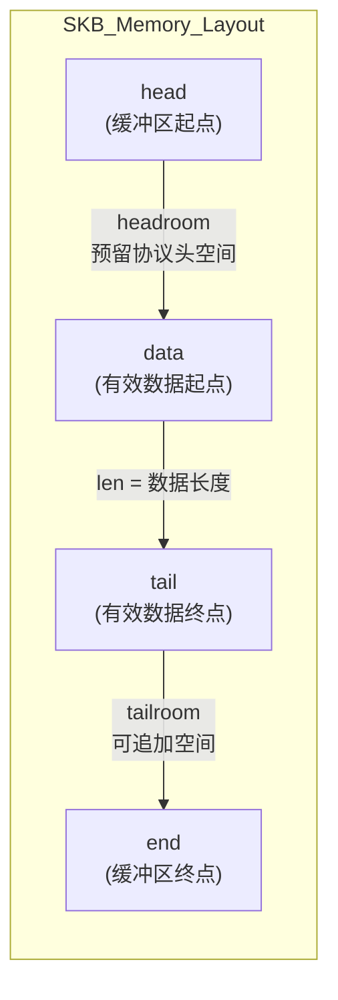

# 14.1.2 sk_buff 结构详解

> 所属章节：第14章 网络子系统 > 14.1 网络子系统核心数据结构
>
> 难度：Intermediate | 预计阅读时间：25分钟

## <span class="blue"> 本节导读

如果把网络子系统比作一个繁忙的快递分拣中心，那 `sk_buff`（Socket Buffer，简称 SKB）就是穿梭其中的每一个包裹——它是 Linux 网络栈的"血液"，承载数据从网卡一路流动到用户空间，再从用户空间回流到网卡。每一个网络数据包，无论收发，都离不开这个数据结构。

本节带你深入 SKB 的核心构造——从内存布局到关键字段，从指针操作到分层处理的精妙设计。学完后，你将理解为什么 SKB 被称为"Linux 网络栈的灵魂"，并掌握 `skb_push`、`skb_pull`、`skb_put`、`skb_reserve` 这四个贯穿网络栈始终的核心操作。

## <span class="blue"> SKB 关键字段与内存布局 [I][M]

### 初识 sk_buff

`struct sk_buff` 定义在 `<linux/skbuff.h>` 中，是 Linux 内核中处理网络数据包的核心数据结构。每一个网络数据包在流经协议栈时，都被包装在一个 SKB 中。收发路径上数以百计的函数，参数列表里几乎总少不了一个 `struct sk_buff *skb`。

以下是 SKB 最核心的字段：

```c
struct sk_buff {
    /* 数据区域指针 —— 这是SKB的灵魂 */
    unsigned char  *head;      /* 缓冲区起始地址 */
    unsigned char  *data;      /* 当前有效数据起始位置 */
    unsigned char  *tail;      /* 当前有效数据结束位置 */
    unsigned char  *end;       /* 缓冲区结束地址 */

    unsigned int   len;        /* 数据包总长度（线性+非线性） */
    unsigned int   data_len;   /* 非线性数据长度（分页部分） */

    __be16         protocol;   /* 上层协议类型，如 ETH_P_IP */
    struct net_device *dev;    /* 关联的网络设备 */
    struct sock    *sk;        /* 关联的socket */

    /* 引用计数 —— 多个协议栈层次可能共享同一个SKB */
    refcount_t     users;

    /* ... 还有更多字段，稍后介绍 skb_shared_info */
};
```

### SKB 内存布局图解

SKB 的内存区域由 `head` 和 `end` 界定，而 `data` 和 `tail` 则标记当前有效数据的范围。为了支持协议头的逐层添加，SKB 在设计时将缓冲区划分为三个区域：

```
SKB 内存布局（分配后初始状态）

   head                         end
   |                            |
   v                            v
   +------------+---------------+
   |  headroom  |    tailroom   |
   |   (预留)   |   (空闲空间)  |
   +------------+---------------+
   ^            ^
   |            |
   data      tail

   此时 len = 0，没有有效数据
```

当网络驱动通过 `skb_put()` 填充数据后，布局变成：

```
SKB 内存布局（填充数据后）

   head          data        tail      end
   |             |           |         |
   v             v           v         v
   +-------------+-----------+---------+
   |   headroom  |   data    | tailroom|
   |   (预留空间) |  (有效)   | (空闲)  |
   +-------------+-----------+---------+
                 |<-- len -->|
```

`headroom` 位于 `head` 和 `data` 之间，是留给协议头的空间——比如以太头、IP头、TCP头。`data` 和 `tail` 之间是真正承载数据的区域。`tailroom` 位于 `tail` 和 `end` 之间，用于追加新数据。

<br>

下面的 Mermaid 图更直观地展示了这四个指针的关系：



### skb_shared_info —— 支持分页与零拷贝

在 `end` 指针之后，紧跟着一个 `skb_shared_info` 结构体，它管理着"非线性"数据——即那些不在主缓冲区内的分页数据：

```c
struct skb_shared_info {
    unsigned char   nr_frags;        /* frags[] 数组中有效项数 */
    skb_frag_t      frags[MAX_SKB_FRAGS];  /* 分页片段数组 */
    struct sk_buff  *frag_list;      /* skb片段链表（用于分片/重组） */
    unsigned int    gso_size;        /* GSO分段大小 */
    unsigned int    gso_segs;        /* GSO段数 */
    /* ... */
};
```

这种设计让 SKB 支持**零拷贝**：当数据已经在内存页中时（比如从磁盘读取后），不需要再复制到 SKB 的线性缓冲区，只需在 `frags[]` 中引用这些页即可。`data_len` 字段记录的就是这些非线性数据的总长度。

### 关键字段速查表

| 字段名 | 类型 | 用途 | 注意事项 |
|:---|:---|:---|:---|
| `head` | `unsigned char *` | 缓冲区起始地址 | 分配后固定不变 |
| `data` | `unsigned char *` | 当前有效数据起始位置 | 随 push/pull 移动 |
| `tail` | `unsigned char *` | 当前有效数据结束位置 | 随 put 移动 |
| `end` | `unsigned char *` | 缓冲区结束地址 | 分配后固定不变 |
| `len` | `unsigned int` | 数据包总长度 | `len = (tail - data) + data_len` |
| `data_len` | `unsigned int` | 非线性数据长度 | 为零表示纯线性数据包 |
| `protocol` | `__be16` | 上层协议标识 | 使用 `eth_type_trans()` 自动解析 |
| `dev` | `struct net_device *` | 关联的网络设备 | 收包时由驱动设置 |
| `sk` | `struct sock *` | 关联的 socket | 用于关联到具体的套接字 |
| `users` | `refcount_t` | 引用计数 | 使用 `skb_get()`/`kfree_skb()` 管理 |

### skb_shared_info 关键字段

| 字段名 | 用途 |
|:---|:---|
| `nr_frags` | `frags[]` 数组中有效片段数量 |
| `frags[]` | 分页数据片段数组，实现零拷贝引用 |
| `frag_list` | SKB 片段链表，用于 IP 分片的链接 |
| `gso_size` | GSO（通用分段卸载）每段的目标大小 |
| `gso_segs` | 期望被分割成的段数 |

### alloc_skb 分配示例

```c
/* 分配一个SKB：数据区大小为 1500 字节，headroom 预留 128 字节 */
struct sk_buff *skb;

/* 第一个参数是数据区大小，第二个参数是内存分配标志 */
skb = alloc_skb(1500 + 128, GFP_ATOMIC);
if (!skb)
    return -ENOMEM;  /* 分配失败 */

/* 预留 headroom —— 给协议头留出空间 */
skb_reserve(skb, 128);

/* 此时：
 *   head ──────────────────────────── end
 *   data ── tail                    end
 *   |       |                        |
 *   v       v                        v
 *   +-------+------------------------+
 *   | 128B  |       1500B            |
 *   |headrm |     tailroom           |
 *   +-------+------------------------+
 *   len = 0
 */

/* 填充数据 —— 从尾部添加实际的网络数据 */
unsigned char *p = skb_put(skb, 100);  /* 添加100字节数据 */
memcpy(p, my_data, 100);

/* 现在 len = 100，data 到 tail 之间有100字节有效数据 */
```

<br>

> 💡 **提示**：`alloc_skb()` 分配的不仅仅是 `struct sk_buff` 结构体本身，还包括结构体后面的数据缓冲区。整个内存块通过一次分配完成，提高了缓存局部性。

> ⚠️ **陷阱**：`data` 指针可以上移（`skb_push`）也可以下移（`skb_pull`），但 `head` 指针在分配后就固定了。`skb_pull` 后 `data` 向下移动了，但如果此时直接 `kfree(skb)` 会出问题吗？**不会**——因为 `kfree_skb()` 释放的是整个缓冲区（从 `head` 到 `end`），它内部使用专门的引用计数机制跟踪，和 `data` 指针的位置无关。但要小心的是，如果你自己用 `kmalloc` 分配的内存，可不能用 SKB 的指针来释放。

## <span class="blue"> skb_push / Pull / Put / Reserve 详解 [I][M]

### 四个核心指针操作

SKB 的设计精髓在于**通过移动指针而非复制数据来实现协议头的添加和剥离**。这四个操作是整个网络栈的分层处理的基石：

| 函数 | 指针变化 | 用途 | 调用时机 |
|:---|:---|:---|:---|
| `skb_reserve(skb, len)` | `data += len; tail += len;` | 预留 headroom 空间 | 初始分配后、填充数据前 |
| `skb_put(skb, len)` | `tail += len;` | 在尾部添加数据 | 驱动收包填充数据 |
| `skb_push(skb, len)` | `data -= len; len += len;` | 在头部添加协议头 | 协议栈向下传递时添加头 |
| `skb_pull(skb, len)` | `data += len; len -= len;` | 从头部剥离协议头 | 协议栈向上传递时解析头 |

<br>

下面的 Mermaid 图展示了这四个操作对指针的影响：

```mermaid
graph TD
    subgraph "初始状态"
        A1["head"] --> B1["data\ntail"]
        B1 --> C1["end"]
    end

    subgraph "skb_reserve(n) 后"
        A2["head"] -->|"预留 n 字节"| B2["data\ntail"]
        B2 --> C2["end"]
    end

    subgraph "skb_put(m) 后"
        A3["head"] -->|"headroom"| D3["data"]
        D3 -->|"m 字节数据"| E3["tail"]
        E3 -->|"tailroom"| C3["end"]
    end

    subgraph "skb_push(k) 后"
        A4["head"] -->|"headroom-k"| F4["data"]
        F4 -->|"k 字节协议头 + m 字节数据"| E4["tail"]
        E4 -->|"tailroom"| C4["end"]
    end

    subgraph "skb_pull(k) 后（回到put后状态）"
        A5["head"] -->|"headroom"| D5["data"]
        D5 -->|"m 字节数据"| E5["tail"]
        E5 -->|"tailroom"| C5["end"]
    end

    style A1 fill:#e1f5ff
    style C1 fill:#ffe1e1
    style A2 fill:#e1f5ff
    style C2 fill:#ffe1e1
    style A3 fill:#e1f5ff
    style C3 fill:#ffe1e1
    style A4 fill:#e1f5ff
    style C4 fill:#ffe1e1
    style A5 fill:#e1f5ff
    style C5 fill:#ffe1e1
```



<br>

用 ASCII 图来更清楚地展示各操作前后的变化：

```
【skb_reserve(n) —— 预留头部空间】

操作前：  head  data/tail                    end
          |     |                            |
          v     v                            v
          +-----+----------------------------+
          |     |       全部空闲              |
          +-----+----------------------------+

操作后：  head           data/tail           end
          |              |                   |
          v              v                   v
          +--------------+-------------------+
          |   n字节预留   |     空闲           |
          +--------------+-------------------+


【skb_put(m) —— 在尾部添加 m 字节数据】

操作前：  head           data/tail           end
          |              |                   |
          v              v                   v
          +--------------+-------------------+
          |   headroom   |     tailroom      |
          +--------------+-------------------+

操作后：  head           data      tail     end
          |              |         |        |
          v              v         v        v
          +--------------+---------+--------+
          |   headroom   | m字节数据| tailrm |
          +--------------+---------+--------+


【skb_push(k) —— 在头部添加 k 字节协议头】

操作前：  head           data      tail     end
          |              |         |        |
          v              v         v        v
          +--------------+---------+--------+
          |   headroom   | 数据   | tailrm |
          +--------------+---------+--------+

操作后：  head     data            tail     end
          |        |               |        |
          v        v               v        v
          +--------+---------------+--------+
          |head-k  | k字节头+数据  | tailrm |
          +--------+---------------+--------+


【skb_pull(k) —— 从头部剥离 k 字节协议头】

操作前：  head     data            tail     end
          |        |               |        |
          v        v               v        v
          +--------+---------------+--------+
          |        | k字节头+数据  |        |
          +--------+---------------+--------+

操作后：  head           data      tail     end
          |              |         |        |
          v              v         v        v
          +--------------+---------+--------+
          |   (已剥离)   |  数据   |        |
          +--------------+---------+--------+
```

### 网络栈分层处理实战

来看一个数据包从网卡驱动一路走上 TCP 协议栈的完整流程——注意**数据本身从未被复制**，只有指针在跳舞：

```c
/* ========== 1. 网卡驱动收包 ========== */

/* 驱动分配SKB，预留足够的headroom给各层协议头 */
skb = netdev_alloc_skb(dev, 1536);  /* 自动预留 NET_SKB_PAD */

/* 驱动通过DMA将网卡数据写入SKB，
 * 实际上是 skb_put(skb, packet_len) 后 DMA 写到 tail 前面的区域
 */
skb_put(skb, rx_len);   /* tail 下移，len = rx_len */

/* 此时：data 指向以太帧头部，tail 指向帧尾 */


/* ========== 2. 以太网层处理 ========== */

/* 设置协议类型，交给上层 */
skb->protocol = eth_type_trans(skb, dev);

/* 以太头已经由驱动设置好了，直接往上送 */
netif_receive_skb(skb);


/* ========== 3. IP 层处理 ========== */

/* IP层看到的是一个完整的以太帧，data指向以太头 */
/* 需要剥离以太头，让 data 指向 IP 头 */
struct ethhdr *eth = eth_hdr(skb);  /* 读取以太头 */
skb_pull(skb, ETH_HLEN);            /* data 下移14字节，len 减去14 */

/* 现在 data 指向 IP 头，可以解析 IP 包了 */
struct iphdr *ip = ip_hdr(skb);


/* ========== 4. TCP 层处理 ========== */

/* 剥离 IP 头，让 data 指向 TCP 头 */
skb_pull(skb, ip_hdrlen(skb));      /* data 下移 IP 头长度 */

/* 现在 data 指向 TCP 头 */
struct tcphdr *tcp = tcp_hdr(skb);

/* 再剥离 TCP 头，data 指向真正的应用层数据 */
skb_pull(skb, tcp_hdrlen(skb));

/* 最终：data 指向应用层数据，len 是有效载荷长度 */
```

<br>

> 💡 **提示**：理解这四个指针操作是理解网络栈分层处理的关键。整个协议栈的分层过程本质上是 `skb->data` 指针的一场"舞蹈"——下移剥离头部，上移添加头部。数据本身从未被复制，这也是 Linux 网络栈高效的原因之一。

> ⚠️ **陷阱**：`skb_pull()` 后，`data` 指针向下移动了，但 `head` 指针始终不变。这意味着**被 pull 掉的协议头数据仍然在内存中**，只是不在"有效数据"区域了。释放 SKB 时仍然使用 `kfree_skb(skb)`，它会正确释放从 `head` 到 `end` 的整个缓冲区。不要试图手动释放 `data` 指针——那不是独立分配的内存。

<br>

> 🔴 **危险**：调用 `skb_push()` 前，务必确认 `skb_headroom(skb)` 返回的可用头部空间足够大。如果 headroom 不够，你需要重新分配更大的 SKB 并复制数据。内核提供了 `skb_cow()` 来帮你处理这种情况——它在需要时自动扩展 headroom。

### 各操作的实现（简化版）

这些操作本质上就是指针运算，来看看它们的真实实现有多简洁：

```c
/* skb_reserve —— 初始预留headroom */
static inline void skb_reserve(struct sk_buff *skb, int len)
{
    skb->data += len;
    skb->tail += len;
}

/* skb_put —— 在尾部添加数据 */
static inline unsigned char *skb_put(struct sk_buff *skb, unsigned int len)
{
    unsigned char *tmp = skb->tail;
    skb->tail += len;
    skb->len  += len;
    return tmp;  /* 返回添加数据的起始位置 */
}

/* skb_push —— 在头部添加数据 */
static inline unsigned char *skb_push(struct sk_buff *skb, unsigned int len)
{
    skb->data -= len;
    skb->len  += len;
    return skb->data;  /* 返回新的data位置 */
}

/* skb_pull —— 从头部移除数据 */
static inline unsigned char *skb_pull(struct sk_buff *skb, unsigned int len)
{
    skb->data += len;
    skb->len  -= len;
    return skb->data;  /* 返回新的data位置 */
}
```

看到没有？每个操作都只有三四行代码，却支撑起了整个网络协议栈的高效运转。这就是好的数据结构设计的力量。

## <span class="blue"> 本节总结

| 主题 | 核心要点 |
|:---|:---|
| SKB 的本质 | 网络数据包的容器，通过指针操作实现零拷贝分层处理 |
| 四大指针 | `head`/`data`/`tail`/`end` 界定缓冲区和有效数据范围 |
| 三大区域 | `headroom`（预留头部）→ `data`（有效数据）→ `tailroom`（预留尾部） |
| 四个操作 | `reserve` 预留、`put` 尾部添加、`push` 头部添加、`pull` 头部剥离 |
| 分页支持 | `skb_shared_info` 中的 `frags[]` 和 `frag_list` 支持零拷贝和分片 |
| 引用计数 | `users` 字段支持 SKB 被多个层次安全共享 |
| 设计哲学 | 移动指针而非复制数据，是网络栈高性能的核心秘诀 |

## <span class="blue"> 下一步

你已经掌握了 SKB 的基本构造和指针操作。但在实际网络栈中，一个 SKB 经常需要在多个处理路径间共享——比如分发给多个网络过滤器，或者进行广播复制。这时候就需要理解 SKB 的**克隆（clone）**和**拷贝（copy）**机制。

**14.1.3 SKB的克隆与拷贝** 将带你探索：
- `skb_clone()` —— 共享数据区，快速创建 SKB 副本
- `skb_copy()` —— 完整复制，独立的数据缓冲区
- `pskb_copy()` —— 只复制线性部分，共享分页数据
- 什么时候该用克隆，什么时候必须用拷贝

## <span class="blue"> 配套资源

- **实验**：编写一个简单的内核模块，分配 SKB 并执行 push/pull/put/reserve 操作，打印指针变化
- **源码阅读**：`include/linux/skbuff.h` 中 `struct sk_buff` 和相关操作的内联函数实现
- **推荐书籍**：《Understanding Linux Network Internals》第 2 章 —— Socket Buffers 详解
