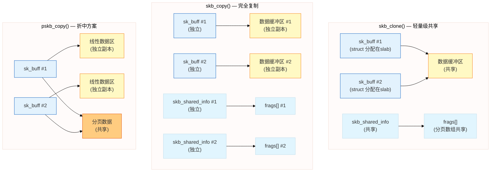

# 14.1.3 SKB的克隆与拷贝

> 所属章节：第14章 网络子系统 > 14.1 网络数据包的核心载体
>
> 难度：[I] Intermediate | 预计阅读时间：15分钟

## <span class="blue"> 本节导读

上一节你理解了 `sk_buff` 结构体是Linux网络栈的核心载体，但很快会遇到一个实际问题：**一个数据包需要被多个模块处理时，该怎么复制它？** 比如一个报文既要发给协议栈，又要被tcpdump抓包——完全复制太浪费内存，直接共享又担心互相影响。Linux内核提供了三种不同粒度的复制机制，让你在性能和安全性之间找到最佳平衡。<br>
学完后，你将掌握 `skb_clone()`、`skb_copy()`、`pskb_copy()` 的区别和适用场景，理解引用计数管理，并能画出clone与copy的内存布局差异。

---

## <span class="blue"> skb_clone()：轻量级共享 [I]

当你需要把同一个skb指针传给多个接收者，但不需要修改数据时，`skb_clone()` 是第一选择。它的核心思想很简单：**只复制"信封"（sk_buff结构体），不复制"信件"（数据缓冲区）**。

```c
struct sk_buff *skb_clone(struct sk_buff *skb, gfp_t priority);
```

clone的过程是这样的：

1. 从slab分配器申请一个新的 `sk_buff` 结构体
2. 用 `memcpy` 把原skb的所有字段复制过去
3. 两个skb的 `data` 指针指向**同一块**数据缓冲区
4. 通过 `atomic_inc(&skb->users)` 增加引用计数

来看一段典型的clone使用代码：

```c
// skb_clone 使用示例
struct sk_buff *original = skb;           // 原始skb
struct sk_buff *cloned = skb_clone(skb, GFP_ATOMIC);

if (!cloned) {
    // clone失败，内存不足
    kfree_skb(skb);
    return -ENOMEM;
}

// 现在 original 和 cloned 共享同一块数据
// original->data 和 cloned->data 指向同一地址
// skb->users 引用计数 == 2

// 可以分别修改各自的头部指针（互不干扰）
cloned->dev = another_netdev;             // 只修改cloned的路由设备
skb_push(cloned, sizeof(struct iphdr));   // 只修改cloned的data指针

// 但修改数据内容会影响双方！
// cloned->data[0] = 0xFF;  // ❌ 也会修改 original 的数据！
```

clone之后，你可以独立修改两个skb的**元数据**（如 `dev`、`protocol`、头部指针等），因为每个skb有自己独立的结构体。但**不要修改数据区内容**，因为双方共享同一块内存。

> ⚠️ **陷阱**：`skb_clone()` 后修改数据会互相影响。如果你需要写数据，必须用 `skb_copy()` 或实现COW（写时复制）机制。很多网络驱动和协议栈的bug都源于这个疏忽。

---

## <span class="blue"> skb_copy() 与 pskb_copy()：安全复制的两种选择 [I][M]

### skb_copy()：完全复制

当你需要**独立修改数据内容**时，`skb_copy()` 是最安全的选择：

```c
struct sk_buff *skb_copy(struct sk_buff *skb, gfp_t priority);
```

它不仅复制 `sk_buff` 结构体，还会**完整复制整个数据缓冲区**（包括线性区和所有分页数据）。代价是内存复制开销，但换来的是完全独立的副本。

```c
// skb_copy 使用示例
struct sk_buff *copied = skb_copy(skb, GFP_ATOMIC);

if (!copied) {
    kfree_skb(skb);
    return -ENOMEM;
}

// 现在完全独立，可以随意修改数据
copied->data[0] = 0xAB;    // ✅ 不会影响原skb的数据
skb_put(copied, 10);        // ✅ 安全
```

### pskb_copy()：折中方案

`pskb_copy()` 介于clone和copy之间——**复制线性数据区，但共享分页数据（frags）**：

```c
struct sk_buff *pskb_copy(struct sk_buff *skb, gfp_t priority);
```

适用场景很明确：你需要修改skb的头部（线性区），但不会动分页区的payload数据。比如NAT设备修改IP头、TCP/IP协议栈处理头部选项等。

```c
// pskb_copy 使用示例：修改IP头部，不动payload
struct sk_buff *pskb = pskb_copy(skb, GFP_ATOMIC);
struct iphdr *iph = ip_hdr(pskb);

// 可以安全修改线性区的IP头
iph->saddr = new_source_ip;    // ✅ 线性区已复制
iph->check = ip_fast_csum(...);

// 但分页区的数据仍然是共享的
// skb_shinfo(pskb)->frags[0].page 和原skb相同
```

---

## <span class="blue"> 三种复制方式对比

| 特性 | `skb_clone()` | `pskb_copy()` | `skb_copy()` |
|:---:|:---:|:---:|:---:|
| **复制内容** | 仅sk_buff结构体 | sk_buff + 线性数据区 | sk_buff + 全部数据 |
| **数据缓冲区** | 共享 | 线性区独立，分页共享 | 完全独立 |
| **速度** | 最快（仅分配结构体） | 中等（复制线性区） | 最慢（全量复制） |
| **内存开销** | 最小 | 中等 | 最大 |
| **可否修改头部** | ✅ 可以（独立结构体） | ✅ 可以（线性区已复制） | ✅ 可以 |
| **可否修改数据** | ❌ 会互相影响 | ❌ 分页数据仍共享 | ✅ 完全独立 |
| **适用场景** | 多接收者只读、抓包 | 修改头部不动payload | 需独立修改所有数据 |
| **典型用途** | tcpdump、桥接转发 | NAT、头部封装/解封装 | 隧道封装、数据修改 |

> 💡 **提示**：大部分场景用 `skb_clone()` 就够了——只在需要修改数据时才用 `skb_copy()`。在内核网络栈中，clone的使用频率远高于copy，因为协议分层处理通常只调整头部指针，不动payload数据。

---

## <span class="blue"> 引用计数管理

既然clone共享数据缓冲区，内核怎么知道什么时候才能释放这块内存？答案是**引用计数**。

```c
// sk_buff 中的引用计数字段
struct sk_buff {
    ...
    atomic_t users;    // 引用计数：当前有多少个skb指向同一块数据
    ...
};
```

| 函数 | 功能 | 使用场景 | 注意事项 |
|:---:|:---:|:---:|:---:|
| `skb_get(skb)` | 引用计数 +1 | 持有skb指针前增加计数 | 每次get必须有对应的put |
| `skb_clone(skb)` | 引用计数 +1（内部调用） | 创建轻量副本 | 新skb返回后users==2 |
| `kfree_skb(skb)` | 引用计数 -1，为0时释放 | 正常使用完毕释放 | 不能在中断上下文睡眠时调用 |
| `dev_kfree_skb(skb)` | 等价于kfree_skb | 设备驱动释放skb | 历史遗留接口，建议用kfree_skb |

引用计数的释放流程是这样的：

```c
// kfree_skb() 内部逻辑（简化）
void kfree_skb(struct sk_buff *skb)
{
    if (unlikely(!skb))
        return;
    
    // 原子减1，返回减之前的值
    if (likely(atomic_dec_and_test(&skb->users))) {
        // 引用计数减到0了，真正释放
        // 1. 释放skb_shared_info中的分片页
        // 2. 释放数据缓冲区（如果是单独分配的）
        // 3. 释放sk_buff结构体本身
        __kfree_skb(skb);
    }
    // 否则还有其他引用，只是减计数，不释放
}
```

来看一个典型的生命周期管理：

```c
void handle_packet(struct sk_buff *skb)
{
    struct sk_buff *clone;
    
    // 抓包程序也需要这个数据
    clone = skb_clone(skb, GFP_ATOMIC);
    
    // 给tcpdump抓包（网络子系统会负责释放clone）
    packet_capture(clone);
    
    // 给协议栈处理（结束后kfree_skb(skb)）
    netif_receive_skb(skb);
    
    // 注意：这里不需要手动释放skb！
    // netif_receive_skb() 内部会调用 kfree_skb(skb)
    // 当引用计数降到0时，数据缓冲区才真正释放
}
```

> 🔴 **危险**：`kfree_skb()` 和 `dev_kfree_skb_irq()` 的区别很重要。在硬中断上下文中，必须使用 `dev_kfree_skb_irq()`，因为它会把释放操作推迟到软中断中执行，避免在中断里做复杂的内存回收操作。

---

## <span class="blue"> COW（写时复制）机制

Linux内核在一些场景下实现了COW优化：先clone共享数据，只有当**真正要写入数据时才复制一份**。这样可以避免不必要的内存拷贝。

```c
// COW 典型场景：准备修改clone的数据时
struct sk_buff *skb = receive_packet();
struct sk_buff *clone = skb_clone(skb, GFP_ATOMIC);

// 现在共享数据...

// 突然需要修改clone的数据 → 先copy再写
if (skb_shared(clone)) {              // 检查是否共享
    struct sk_buff *new = skb_copy(clone, GFP_ATOMIC);
    kfree_skb(clone);                  // 释放clone，减引用计数
    clone = new;                       // 切换到独立副本
}

// 现在可以安全修改了
clone->data[0] = 0x55;                // ✅ 不会影响原skb
```

内核提供了 `skb_shared()` 辅助函数来检查引用计数是否大于1：

```c
static inline int skb_shared(const struct sk_buff *skb)
{
    return atomic_read(&skb->users) != 1;
}
```

在一些路径（如 `skb_orphan()` 和某些协议处理函数）中，内核会自动帮你做COW判断。但作为驱动或协议开发者，理解这个机制至关重要。

---

## <span class="blue"> 内存布局对比图

下面用内存布局图直观展示clone和copy的区别：



从图中可以直观看到：
- **clone**：两个skb结构体（蓝色）共享同一块黄色数据缓冲区
- **copy**：所有组件都是独立的，各有一份完整副本
- **pskb_copy**：线性数据区独立（黄色各一份），但分页数据（橙色）仍然共享

---

## <span class="blue"> 本节总结

| 问题 | 答案 |
|:---:|:---|
| **什么时候用clone？** | 只读场景、多接收者共享、不需要修改数据内容 |
| **什么时候用copy？** | 需要修改payload数据、要求完全独立的场景 |
| **什么时候用pskb_copy？** | 只需修改头部（线性区）、不动分页payload的场景 |
| **clone的数据会被谁释放？** | 最后一个kfree_skb()调用者，当users==0时真正释放 |
| **如何检查是否共享？** | 用 `skb_shared()` 检查users计数是否大于1 |
| **COW的核心思想？** | 延迟复制：先共享，真正要写时才拷贝 |

本节的核心就一句话：**按需复制，能共享就不拷贝**。`skb_clone()` 是网络栈中最高效的复制方式，大部分协议分层处理都只需要调整头部指针，clone足矣。只有真正需要动数据内容时，才值得付出 `skb_copy()` 的内存代价。

---

## <span class="blue"> 下一步

掌握了SKB的克隆与拷贝机制后，下一节我们将追踪一个真实的数据包从网卡驱动到用户态的完整旅程——**14.1.4 网络栈分层处理路径**，让你理解SKB在各个网络层之间是如何传递和变换的。

---

## <span class="blue"> 配套资源

- **推荐阅读**：
  - `include/linux/skbuff.h` — `skb_clone()`、`skb_copy()`、`pskb_copy()` 的完整实现
  - `net/core/skbuff.c` — sk_buff分配和释放的核心代码
- **实验建议**：写一个简单的内核模块，分别调用clone和copy，用 `printk` 输出各skb的 `data` 指针地址和 `users` 计数，观察引用计数变化
- **经典案例**：搜索 "skb_clone data corruption bug"，看看真实世界中因为clone后修改数据导致的内核崩溃案例
